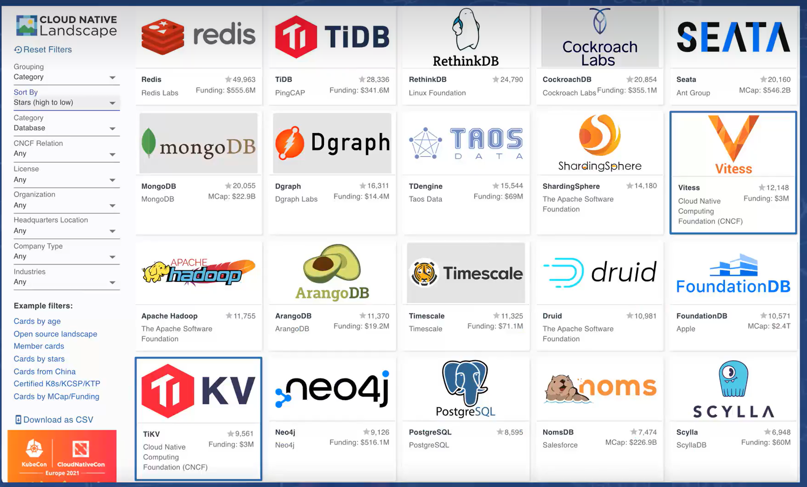

大数据相关技术

# 主要产品类目

## kv

redis [redis cluster](https://redis.io/docs/manual/scaling/) 、 [codis](https://github.com/CodisLabs/codis)  pegasus、 hbase

公共技术

## 嵌入式db

### boltdb

- boltdb：go语言实现，etcd使用的
  - github https://github.com/boltdb/bolt
  - Boltdb学习笔记 https://www.zhihu.com/column/c_1357043309848866816
  - BoltDB学习笔记 https://blog.csdn.net/qq_41822345/article/details/124897274

### sqlite

- litestream
  - 备份你的SQLite 数据库：SQLite 的独立流复制工具Litestream https://www.q578.com/s-5-2747021-0/
  - github：https://github.com/benbjohnson/litestream
  - 官网：https://litestream.io/

https://landscape.cncf.io/

- HashTable性能测试(CK/phmap/ska)： https://dirtysalt.github.io/html/hashtable-perf-comparison.html#orge8d1c46

- TDengine如何高效计算千万级数据的百分位数？ https://www.bilibili.com/video/BV16h411n7Mg

- 一文带你了解什么是CNCF&云原生 https://blog.csdn.net/qq_35745940/article/details/121187610

- 时区知识：如何在TDengine上设置timezone https://www.bilibili.com/video/BV1p64y187yk

- 一文了解啥是Gossip协议？ https://www.jianshu.com/p/37231c0455a9