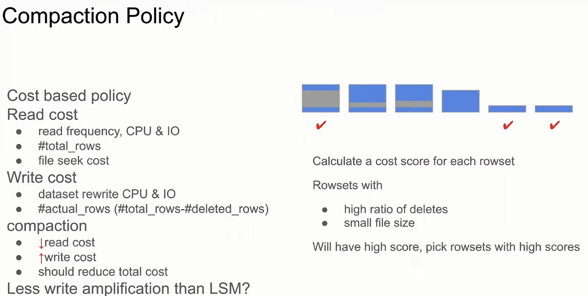
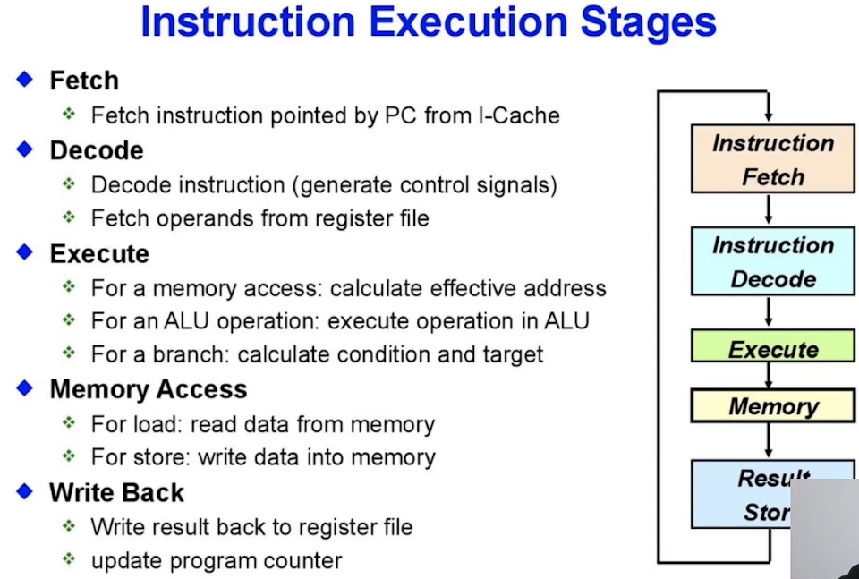
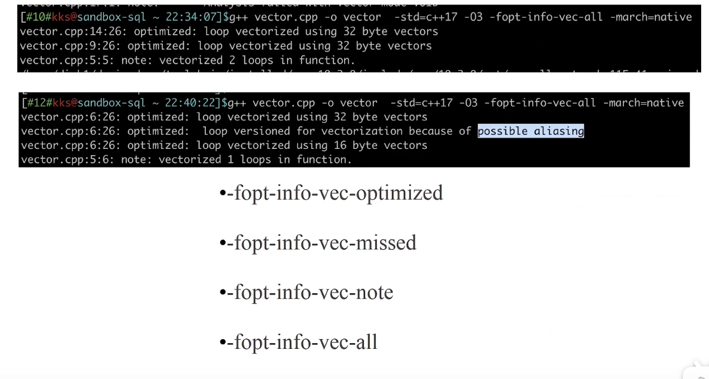
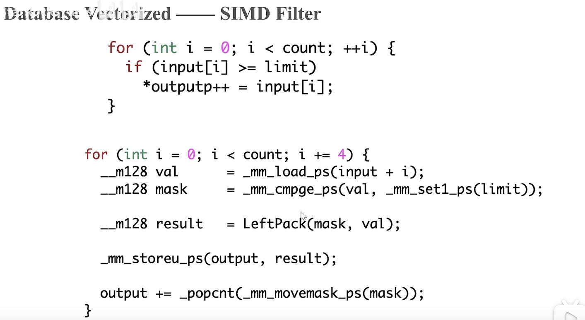
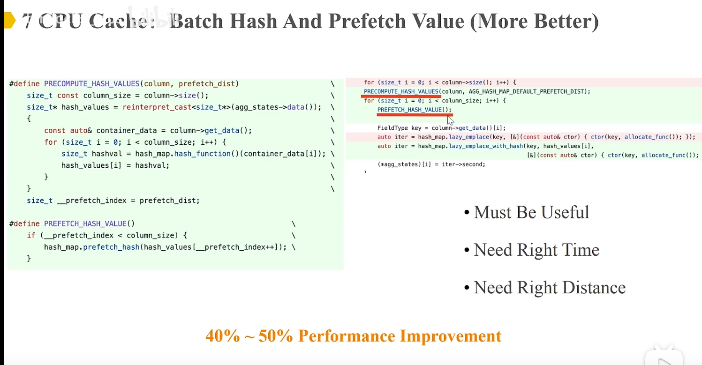

Doris/Starrocks学习笔记

## 查询

### JOIN

#### 背景


## 数据写入/更新/读取

### 学习资料

- 列式存储中实时更新和查询性能如何兼得 | StarRocks Hacker Meetup 第二期：https://www.bilibili.com/video/BV1NU4y1f7HJ

### 背景

#### OLAP系统现状


#### 4种更新方案


deltastore：每个数据集存储了对应的变化的数据


deltete/inset：

- 标记每个数据集的删除状态/新数据统一在后面存放
- 好处：文件数会少一些，前面那个方案文件数会double/避免小文件更新早正的io性能问题
- 不好：delete状态的存储


### 基本写入逻辑

#### 基本流程

- 启动一个事务以tablet为单位写多个副本
- 写成功以后fe发起commit版本的操作，


#### tablet的存储结构

- 以primarykey模型为例，其他模型没有delvector和 内存区域的primary key
- primarykey对应的信息记录位置信息保存在内存里面
- delete信息存在rocksdb里面，应该也有内存存放，具体看实现细节
- meta元数据信息：内存缓存、存放版本（版本号，包含的rowset列表，版本变化信息，）列表/下一个rowsetid/
- rocksdb和tablet对应关系未明，感觉是一对多的关系
- rocksdb存放位置未明


#### 元数据信息


#### compaction版本

- 针对一组rowset进行合并
- 结束会生成新的rowset
- 增加minor版本
- 清除delta
- 去掉旧的已合并的rowset列表


#### 垃圾回收

- 半个小时以上未被引用的版本/rowset会被回收


#### 写入流水线

- 以primary key模型为例

- 来源：brokerload/streamload/insert into

- 操作类型：upset/delete

- 请求发送到be的buffer：MemTable

- MemTable满/一批结束以后：排序/合并，flush到磁盘文件，upset和delete（delete无需存放数据）分开存放

- fe发起commit操作到be

- be收到commit请求，做以下三件事，后两件在一个事务里

  - 更新primary key index：查找旧的行位置/标记已删除状态/更新新的行位置
  - 生成delvec
  - 更新元数据

  

- 数据的可见性和一致性：后两步更新应该比较快，

- delvec要采用meta那样按照版本保持delvec，才能做到mvcc， RoaringBitmap 保存的，

#### 例子


#### 并发控制

- 第一步任意执行：这一步比较耗时
- 第二部fe提交commit按照版本号来，这一步快


### Primary Index模型

#### 基本情况


#### 使用场景


- 按天分区的数据：最近的数据是热数据，冷数据的主键索引不会被加载


- 大宽表场景：基于用户的key， 用户数没有明显编号

#### compaction

- 合并原因：小文件，删除后的空洞
- 复杂度：合并后所有的primarykey的位置信息发生变化，需要重新生成


- 记录每个记录对应的rowsetid，compaction版本合并时检查是否已经发生变化，发生变化就不合并进来，逻辑有点重



### 多副本容错

- 多数成功则成功
- 失败的需要从别的成功的be里面clone
- 增量克隆：版本差距比较小，直接copy差的rowset，然后执行一遍commit
- 全量克隆：版本差距比较大，恢复最新的版本的rowset列表


### 数据读取

#### 读取的流水线

 


### 规划

#### 部分字段更新

- https://github.com/StarRocks/StarRocks/pulls?q=%22partial+update%22
- 需要读取原来的数据，变相的copy on write


- 多业务流的简化：各个业务之间解耦，不需要前置flink等就可以加工出大宽表


- 条件更新：避免旧数据覆盖新数据


- 数组字段加元素

#### 更复杂的场景

- 通用的读写事务


## 向量化计算

### 学习资料

- 向量化编程的精髓 | StarRocks Hacker Meetup 第一期 https://www.bilibili.com/video/BV1ea41187KK?spm_id_from=333.999.0.0
-  数据库学习资料 https://blog.bcmeng.com/post/database-learning.html
- 如何打造一款极速分析型数据库：https://blog.bcmeng.com/post/fastest_database.html

### 基础知识

#### CPU执行结构



- 数据流和指令流，都有cache，数据层存在多级性能递减的cache
- 优化核心减少cache-miss的次数


#### CPU Time

```b
 CPU TIME = Instruction Number（指令个数） * CPI（每个指令的时钟周期个数） * Clock Cycle Time(时钟周期)
 
```

#### Intel CPU 性能分析方法

CPU Performance Analysis Top-Down Hierarchy


#### CPU优化方向


- 向量化执行：一条cpu指令处理多条数据，目前主要的优化方向   ：减少指令数
- 减少代码的分支预测错误：if/else类判断，需要重新load指令： 减少CPI
- 提高指令cache和数据cache的命中率，减少cache-miss发生的概率：  减少CPI

#### SIMD


SIMD：单指令多数据的计算

- 一条指令加载多个数据
- 一条指令计算多个数据
- 一条指令将计算结果写回内存

#### SIMD寄存器

- xmm（128 bit）
- ymm（256 bit）
- zmm（512bit）


#### 向量化六种优化方法

分为两大类：自动触发编译器优化，手动写


#### 向量化代码翻译网站

-  https://godbolt.org/

### 编译器自动优化

- gcc版本有要求，越高版本优化会更好

- 循环次数是固定不变的

- 函数是可以被内联的，或者简单的数学函数

- 没有数据依赖的

- 循环里面没有复杂条件

  

### hint提示向量化

- 要求：两个数组的内存不能重叠
- 方法：加_restrict关键字


####   查看是否向量化

通过增加编译选项

- 例子第一条：正常向量化
- 例子第二条：possible aliasing：编译器不知道是否内存相交，可以酌情加上_restrict关键字进行向量化



### 手动编写向量化代码

#### 向量化指令

- 官网：https://www.intel.com/content/www/us/en/docs/intrinsics-guide/index.html


- 命令规则


#### 例子


###  向量化挑战

#### 挑战点

- 数据要基于列存，全生命周期：磁盘、内存、网络
- 所有的算子要进行向量化：聚合、scan、limit，join、sort、union
- 所有的函数需要向量化：数学函数、字符串函数、case/when
- 尽可能多的出发simd指令
- 重新设计内存管理
- 重新设计数据结构
- 5x性能提升意味着所有的算子和表达式都需要提升5X，没有短板，而不是单一


###   数据存储

#### 磁盘存储

- 层次：从segment file -> data region -> data page(indexed)
- index： short key/ zoom map/ ordinal index（bitmap？） / bloom filter/  inverted index


#### 内存存储


#### 数据结构

- chunk：M clonums * N rows，n == 4096（default）
- chunksize受多因素影响，将来变成自动调整大小


### 算子和表达式

#### 基本思路


算子

按照chunk进行计算


####   表达式计算


#### 去分支

核心：算两遍，根据掩码取结果


#### 过滤器Filter

- 加载数据
- 比较获取掩码的数据
- 左移数据去掉不合格数据，存到result
- 存储结果数据（result）到output
- output指针偏移：加当前mask出来的数据个数




#### shuffle by column

- 按列hash，在o(n)排序


#### Hash聚合

查找hash值为某个具体值的列表

- match数组里面的所有值设置为hash（96）：_mm_set1_epi8
- match 与 ctrl 两个数组求交：_mm_cmpeq_epi8
- 把掩码的FF，变成int值：_mm_movemask_epi8


#### Hash Join

- 论文：balancing vectorized query execution with bandwidth-optimized storage https://dare.uva.nl/search?identifier=5ccbb60a-38b8-4eeb-858a-e7735dd37487


### 优化的方法论和例子

#### 方法论

- 0： profile系统的瓶颈
- 1：引入第三方高性能库
- 2：数据结构i和算法
- 3：自适应策略：CBO
- 4：SIMD指令集优化
- 5：c++底层优化
- 6：内存管理
- 7：cpu缓存管理


#### 例子：并行的hashmap


#### 例子：数据结构和算法：数据编码

- #### 字符串转转字典

- #### where条件优化


- 全局字典。starrocks2.0支持
- 支持scan、filter、agg、sort、join、 string function
- 难度：如何维护全局字典，后面讲
- ck两倍以上优势


#### 例子：动态策略：join运行态过滤计算

- cbo：根据过滤效果决定是否需要使用该过滤器
- 过滤效果50%才使用；5%直接使用当前filter，否则最多只使用3个效果最好的filter


#### 例子：SIMD指令优化：字符串函数

- 判断是不是一个合法的ascii编码 （<128）,判断最高位是否为1（位与0x80）


#### 例子：c++代码层优化


- 减少两次内存copy


例子：HLL内存管理

- 内存一次申请大量内存：按照chunk申请，减少内存频繁申请释放压力


#### 例子：cpu cache


- 瓶颈点在变化


- 空间和时间在局部代码的优化
- 对其代码和数据
- 降低内存访问的范围
- 按照block进行计算
- prefetch（预读）




### 深层思考

#### 底层原理都是类似的

  - ：cpu/starrocks，前端/后端，查询计划/执行层

  

#### 高性能数据库需要什么？

  - 杰出的架构和持续的底层优化

  

 #### 向量化 & 查询编译

  

#### 其他硬件

GPU & FPGA


