# doris源代码解析

# 0 参考

- b站系列官方教程：https://space.bilibili.com/362350065/video
- 官方github源代码：[doris-1.0.0-rc03](https://github.com/apache/incubator-doris/archive/refs/tags/1.0.0-rc03.tar.gz)
- 

# 1 基本信息

## 目录结构


```bash
tree -d -L 2
├── be
│   ├── build_Release
│   ├── output
│   ├── src
│   └── test
├── bin
├── build-support
├── conf
├── contrib
│   └── udf
├── docker
├── docs
│   ├── build
│   ├── contents
│   ├── en
│   └── zh-CN
├── extension
│   ├── DataX
│   └── logstash
├── fe
│   ├── conf
│   ├── fe-common
│   ├── fe-core
│   ├── hive-udf
│   └── spark-dpp
├── fe_plugins
│   ├── auditdemo
│   └── auditloader
├── fs_brokers
│   └── apache_hdfs_broker
├── gensrc
│   ├── build
│   ├── proto
│   ├── script
│   └── thrift
├── output
│   ├── apache_hdfs_broker
│   ├── be
│   ├── fe
│   └── udf
├── regression-test
│   ├── conf
│   ├── data
│   ├── framework
│   └── suites
├── samples
│   ├── connect
│   ├── doris-demo
│   ├── insert
│   ├── mini_load
│   └── stream_load
├── thirdparty
│   └── patches
├── tools
│   ├── row_to_column
│   ├── show_segment_status
│   ├── ssb-tools
│   └── systemd
├── ui   					# 这个目录包含的子目录太多了，就不要tree三层了
│   ├── config
│   ├── dist
│   ├── node_modules
│   ├── public
│   └── src
└── webroot
    ├── be
    └── static
    
tree be/src -d -L 2
be/src
├── agent					# 接收任务，对应fe的task模块
├── common
├── env
├── exec					# 各种算子、节点
│   ├── es
│   └── schema_scanner
├── exprs					# 各种内部函数、表达式实现的地方
│   └── table_function
├── gen_cpp
├── geo
├── glibc-compatibility
│   └── musl
├── gutil
│   ├── hash
│   ├── strings
│   ├── threading
│   └── utf
├── http					# http服务、统计、stream load
│   └── action				# http的cgi服务目录
├── olap
│   ├── fs
│   ├── memory
│   ├── rowset
│   └── task
├── runtime
│   ├── bufferpool
│   ├── cache
│   ├── memory
│   ├── routine_load
│   └── stream_load			# streamload的核心代码
├── service
├── testutil
├── tools
├── udf
├── util
│   ├── arrow
│   ├── debug
│   ├── mustache
│   └── simd
└── vec
    ├── aggregate_functions
    ├── columns
    ├── common
    ├── core
    ├── data_types
    ├── exec
    ├── exprs
    ├── functions
    ├── io
    ├── olap
    ├── runtime
    ├── sink
    └── utils
    

be
├── build_Release
│   ├── CMakeFiles
│   ├── src
│   └── test
├── output
│   ├── bin
│   ├── conf
│   ├── lib
│   └── udf
├── src
│   ├── agent					# 接收任务，对应fe的task模块
│   ├── common
│   ├── env
│   ├── exec
│   ├── exprs
│   ├── gen_cpp
│   ├── geo
│   ├── glibc-compatibility
│   ├── gutil
│   ├── http
│   ├── olap
│   ├── runtime
│   	├── stream_load 
│   ├── service
│   ├── testutil
│   ├── tools
│   ├── udf
│   ├── util
│   └── vec
└── test
    ├── agent
    ├── common
    ├── env
    ├── exec
    ├── exprs
    ├── geo
    ├── gutil
    ├── http				# http服务、统计、stream load，服务在action目录下
    ├── olap
    ├── plugin
    ├── runtime
    ├── test_util
    ├── tools
    ├── udf
    ├── util
    └── vec
    
tree fe -d -L 2
fe
├── conf
├── fe-common
│   ├── src
│   └── target
├── fe-core
│   ├── src
│   └── target
├── hive-udf
│   └── src
└── spark-dpp
    ├── src
    └── target
    
tree fe/fe-core/src -d -L 6

fe/fe-core/src
├── main
│   ├── cup
│   ├── java
│   │   └── org
│   │       └── apache
│   │           └── doris				#核心fe代码目录
│   │               ├── alter
│   │               ├── analysis		# SQL解析相关的逻辑
│   │               ├── backup
│   │               ├── blockrule
│   │               ├── catalog			# 元数据管理
│   │               ├── clone
│   │               ├── cluster
│   │               ├── common
│   │               ├── consistency
│   │               ├── deploy
│   │               ├── external
│   │               ├── ha
│   │               ├── http			# 默认没用，starrocks用的这个
│   │               ├── httpv2			# web服务，查询元数据信息/统计、streamload等，springboot实现
│   │               ├── journal
│   │               ├── ldap
│   │               ├── load			# 各种load任务相关的代码：broker load /stream load
│   │               ├── master			# master节点特有的逻辑
│   │               ├── metric
│   │               ├── monitor
│   │               ├── mysql			# mysql服务（nio模式的server）、协议解析、权限管控
│   │               ├── persist			# 数据持久化，editlog, 数据文件格式（segment V2）、database
│   │               ├── planner			# 查询规划器
│   │               ├── plugin
│   │               ├── qe				# QeService, mysql服务支持，
│   │               ├── resource
│   │               ├── rewrite			# sql语句 重写
│   │               ├── rpc				# rpc服务
│   │               ├── service			# thrift server 封装
│   │               ├── statistics
│   │               ├── system
│   │               ├── task			# 多线程任务执行系统
│   │               └── transaction
│   ├── jflex
│   └── resources
│       └── static
└── test
    ├── java
    │   ├── org
    │   │   └── apache
    │   │       └── doris
    │   │           ├── alter
    │   │           ├── analysis
    │   │           ├── backup
    │   │           ├── bdb
    │   │           ├── blockrule
    │   │           ├── catalog			
    │   │           ├── clone
    │   │           ├── cluster
    │   │           ├── common
    │   │           ├── deploy
    │   │           ├── external
    │   │           ├── http
    │   │           ├── ldap
    │   │           ├── load
    │   │           ├── metric
    │   │           ├── mysql			
    │   │           ├── persist
    │   │           ├── planner
    │   │           ├── plugin
    │   │           ├── qe
    │   │           ├── resource
    │   │           ├── rewrite
    │   │           ├── service
    │   │           ├── system
    │   │           ├── task
    │   │           ├── transaction
    │   │           └── utframe
    │   └── plugin
    └── resources
        ├── data
        │   ├── es
        │   ├── help
        │   │   └── Admin
        │   │       ├── Select
        │   │       └── Show
        │   ├── qe
        │   └── show_help
        │       └── functions
        │           ├── binary function
        │           └── bit function
        └── plugin_test
            ├── source
            └── test_local_plugin
    
```

### 文件统计

```bash
# be\src 目录下
. : 1720
./exprs : 114
./runtime : 195
./gen_cpp : 1
./http : 68
./vec : 346
./gutil : 93
./agent : 18
./exec : 180
./service : 13
./testutil : 5
./env : 9
./glibc-compatibility : 90
./tools : 2
./util : 227
./common : 19
./udf : 6
./geo : 13
./olap : 321

# fe下
. : 10888
./spark-dpp : 308
./build : 0
./fe-common : 4423
./target : 4
./conf : 1
./fe-core : 6139
./hive-udf : 8

# fe/fe-core/src/main/java/org/apache/doris
. : 1381
./cluster : 3
./http : 65
./httpv2 : 68
./task : 38
./backup : 19
./system : 10
./service : 4
./transaction : 23
./qe : 57
./ldap : 3
./mysql : 46
./analysis : 356
./ha : 5
./blockrule : 2
./rpc : 4
./deploy : 4
./persist : 54
./clone : 19
./master : 5
./load : 105
./external : 26
./journal : 12
./common : 198
./metric : 15
./statistics : 18
./catalog : 87
./plugin : 15
./rewrite : 28
./planner : 64
./alter : 13
./monitor : 8
./consistency : 2
./resource : 4

```

## 数据模型


## 存储

### 基本概念


- 公式
  - Tablet个数 =  Partition个数 * Bucket个数
  - 副本（Replica）总个数 =  Tablet个数 * 副本数
  - 单副本文件数 = 版本1（rowset 1） 的segment个数 +  ... + 版本n（rowset n） 的segment个数 
  - 单个物化视图文件总数 = 副本数 * 单副本文件数
  - 总文件个数 =  单个物化视图文件总数 * 物化视图个数
  - 另外文件个数还要考虑compaction阶段、schema change有可能会文件数double
  - 实现上，基表就是一个MaterializedIndex = 0 的表

- 多个分区的同一个buckert hash数据是放在同一个机器上的（starrocks是这样的），应该是不在同一磁盘上？

### 存储目录结构


- shardid：自动生成，随机的
- schema_hash：不同的schema对应不同的数据目录，这样在做schema change的时候不影响数据访问
- 

### segment文件结构

#### 基本信息


#### protobuf文件

olap_file.proto

```protobuf
// Licensed to the Apache Software Foundation (ASF) under one
// or more contributor license agreements.  See the NOTICE file
// distributed with this work for additional information
// regarding copyright ownership.  The ASF licenses this file
// to you under the Apache License, Version 2.0 (the
// "License"); you may not use this file except in compliance
// with the License.  You may obtain a copy of the License at
//
//   http://www.apache.org/licenses/LICENSE-2.0
//
// Unless required by applicable law or agreed to in writing,
// software distributed under the License is distributed on an
// "AS IS" BASIS, WITHOUT WARRANTIES OR CONDITIONS OF ANY
// KIND, either express or implied.  See the License for the
// specific language governing permissions and limitations
// under the License.
// Define file format struct, like data header, index header.

syntax="proto2";

package doris;
option java_package = "org.apache.doris.proto";

import "olap_common.proto";
import "types.proto";

message ZoneMap {
    required bytes min = 1;
    required bytes max = 2;
    optional bool null_flag = 3;
}

enum RowsetTypePB {
    ALPHA_ROWSET = 0; // doris原有的列存格式
    BETA_ROWSET  = 1; // 新列存
}

enum RowsetStatePB {
    PREPARED = 0; // 表示正在写入Rowset
    COMMITTED = 1; // 表示rowset 写入完成，但是用户还不可见；这个状态下的rowset，BE不能自行判断是否删除，必须由FE的指令
    VISIBLE = 2; // 表示rowset 已经对用户可见
}

// indicate whether date between segments of a rowset is overlappinng
enum SegmentsOverlapPB {
    OVERLAP_UNKNOWN = 0;    // this enum is added since Doris v0.11, so previous rowset's segment is unknown
    OVERLAPPING = 1;
    NONOVERLAPPING = 2;
}

message RowsetMetaPB {
    required int64 rowset_id = 1;
    optional int64 partition_id = 2;
    optional int64 tablet_id = 3;
    // only for pending rowset
    optional int64 txn_id = 4;
    // tablet id and schema hash could find tablet
    optional int32 tablet_schema_hash = 5;
    optional RowsetTypePB rowset_type = 6;
    optional RowsetStatePB rowset_state = 7;
    // only for visible rowset. For alpha rowset, it's the same as PDelta.start_version
    optional int64 start_version = 8;
    // only for visible rowset. For alpha rowset, it's the same as PDelta.end_version
    optional int64 end_version = 9;
    // only for visible rowset. For alpha rowset, it's the same as PDelta.version_hash
    optional int64 version_hash = 10;
    // total number of rows. For alpha rowset, it's calculated from segment group
    optional int64 num_rows = 11;
    // calculated by index + data
    optional int64 total_disk_size = 12;
    // calculated sum(segmentgroup.data_size)
    optional int64 data_disk_size = 13;
    // calculated sum(segmentgroup.index_size)
    optional int64 index_disk_size = 14;
    // rowset level column min/max/null statistics, not not used currently
    repeated ZoneMap zone_maps = 15;
    optional DeletePredicatePB delete_predicate = 16;
    // calculated from segment group
    optional bool empty = 17;
    // only for pending rowset
    optional PUniqueId load_id = 18;
    // not set, get from olap index header msg?
    optional bool delete_flag = 19;
    // For alpha rowset, it's the same as PDelta.creation_time
    optional int64 creation_time = 20;
    optional PUniqueId tablet_uid = 21;
    // total number of segments
    optional int64 num_segments = 22;
    // rowset id definition, it will replace required rowset id 
    optional string rowset_id_v2 = 23;
    // spare field id for future use
    optional AlphaRowsetExtraMetaPB alpha_rowset_extra_meta_pb = 50;
    // to indicate whether the data between the segments overlap
    optional SegmentsOverlapPB segments_overlap_pb = 51 [default = OVERLAP_UNKNOWN];
}

message AlphaRowsetExtraMetaPB {
    repeated SegmentGroupPB segment_groups = 1;
}

message SegmentGroupPB {
    required int32 segment_group_id = 1;
    required int32 num_segments = 2;
    required int64 index_size = 3;
    required int64 data_size = 4;
    required int64 num_rows = 5;
    repeated ZoneMap zone_maps = 6;
    optional bool empty = 7;
    optional PUniqueId load_id = 8;
}

enum DataFileType {
    OLAP_DATA_FILE = 0; //Deprecated. Only columnar-wise format is supported.
    COLUMN_ORIENTED_FILE = 1;
}

enum KeysType {
    DUP_KEYS = 0;
    UNIQUE_KEYS = 1;
    AGG_KEYS = 2;
}

message DeletePredicatePB {
    required int32 version = 1;
    repeated string sub_predicates = 2;
    repeated InPredicatePB in_predicates = 3;
}

message InPredicatePB {
   optional string column_name = 1;
   optional bool is_not_in = 2;
   repeated string values = 3;
}

enum AlterTabletState {
    ALTER_PREPARED = 0;
    ALTER_RUNNING = 1;
    ALTER_FINISHED = 2;
    ALTER_FAILED = 3;
}

enum AlterTabletType {
    SCHEMA_CHANGE = 1;
    ROLLUP = 2;
}

message AlterTabletPB {
    optional AlterTabletState alter_state = 1;
    required int64 related_tablet_id = 2;
    optional int32 related_schema_hash = 3;
    optional AlterTabletType alter_type = 4;
}

message ColumnPB {
    required int32 unique_id = 1; // ColumnMessage.unique_id
    optional string name = 2; // ColumnMessage.name
    required string type = 3; // ColumnMessage.type
    optional bool is_key = 4; // ColumnMessage.is_key
    optional string aggregation = 5; // ColumnMessage.aggregation
    optional bool is_nullable = 6; // ColumnMessage.is_allow_null
    optional bytes default_value = 7; // ColumnMessage.default_value ?
    optional int32 precision = 8; // ColumnMessage.precision
    optional int32 frac = 9; // ColumnMessage.frac
    optional int32 length = 10; // ColumnMessage.length
    optional int32 index_length = 11; // ColumnMessage.index_length
    optional bool is_bf_column = 12; // ColumnMessage.is_bf_column
    optional int32 referenced_column_id = 13; //   
    optional string referenced_column = 14; // ColumnMessage.referenced_column?
    optional bool has_bitmap_index = 15 [default=false]; // ColumnMessage.has_bitmap_index
    optional bool visible = 16 [default=true];
    repeated ColumnPB children_columns = 17;
    repeated string children_column_names = 18;
}

enum SortType {
    LEXICAL = 0;
    ZORDER  = 1;
}

message TabletSchemaPB {
    optional KeysType keys_type = 1;    // OLAPHeaderMessage.keys_type
    repeated ColumnPB column = 2;   // OLAPHeaderMessage.column
    optional int32 num_short_key_columns = 3;   // OLAPHeaderMessage.num_short_key_fields
    optional int32 num_rows_per_row_block = 4;  // OLAPHeaderMessage.num_rows_per_data_block
    optional CompressKind compress_kind = 5; // OLAPHeaderMessage.compress_kind
    optional double bf_fpp = 6; // OLAPHeaderMessage.bf_fpp
    optional uint32 next_column_unique_id = 7; // OLAPHeaderMessage.next_column_unique_id
    optional bool is_in_memory = 8 [default=false];
    optional int32 delete_sign_idx = 9 [default = -1];
    optional int32 sequence_col_idx = 10 [default= -1];
    optional SortType sort_type = 11;
    optional int32 sort_col_num = 12;
}

enum TabletStatePB {
    PB_NOTREADY  = 0; // under alter table, rollup, clone
    PB_RUNNING = 1;
    PB_TOMBSTONED = 2;
    PB_STOPPED = 3;
    PB_SHUTDOWN = 4;
}

enum TabletTypePB {
    TABLET_TYPE_DISK = 0;
    TABLET_TYPE_MEMORY = 1;
}

enum StorageMediumPB {
    HDD = 0;
    SSD = 1;
    S3 = 2;
}

message TabletMetaPB {
    optional int64 table_id = 1;    // ?
    optional int64 partition_id = 2;    // ?
    optional int64 tablet_id = 3;   // OlapHeaderMessage.tablet_id
    optional int32 schema_hash = 4; // OlapHeaderMessage.schema_hash
    optional int32 shard_id = 5;    // OlapHeaderMessage.shard
    optional int64 creation_time = 6;   // OlapHeaderMessage.creation_time
    optional int64 cumulative_layer_point = 7;  // OlapHeaderMessage.cumulative_layer_point

    optional TabletStatePB tablet_state = 8;
    optional TabletSchemaPB schema = 9;
    repeated RowsetMetaPB rs_metas = 10;
    // @Deprecated
    repeated RowsetMetaPB inc_rs_metas = 11;
    optional AlterTabletPB alter_task = 12;
    // if true, this tablet will not do compaction,
    // and does not create init version
    optional bool in_restore_mode = 13 [default = false];   // OlapHeaderMessage.in_restore_mode
    // a uniqued id to identified tablet with same tablet_id and schema hash
    optional PUniqueId tablet_uid = 14;
    optional int64 end_rowset_id = 15;
    optional RowsetTypePB preferred_rowset_type = 16;
    optional TabletTypePB tablet_type = 17;
    repeated RowsetMetaPB stale_rs_metas = 18;
    optional StorageMediumPB storage_medium = 19 [default = HDD];
}

message OLAPIndexHeaderMessage {
    required int32 start_version = 1;
    required int32 end_version = 2;
    required int64 cumulative_version_hash = 3;

    required uint32 segment = 4;
    required uint32 num_rows_per_block = 5;
    optional bool null_supported = 6;
    optional bool delete_flag = 7;
}

message OLAPDataHeaderMessage {
    required uint32 segment = 2;
}

message OLAPRawDeltaHeaderMessage {
    required int32 schema_hash = 2;
}

```


整个segment结构由一个protobuf文件定义，放在gensrc\proto\segment_v2.proto

```protobuf
// Licensed to the Apache Software Foundation (ASF) under one
// or more contributor license agreements.  See the NOTICE file
// distributed with this work for additional information
// regarding copyright ownership.  The ASF licenses this file
// to you under the Apache License, Version 2.0 (the
// "License"); you may not use this file except in compliance
// with the License.  You may obtain a copy of the License at
//
//   http://www.apache.org/licenses/LICENSE-2.0
//
// Unless required by applicable law or agreed to in writing,
// software distributed under the License is distributed on an
// "AS IS" BASIS, WITHOUT WARRANTIES OR CONDITIONS OF ANY
// KIND, either express or implied.  See the License for the
// specific language governing permissions and limitations
// under the License.
// Define file format struct, like data header, index header.

syntax="proto2";

package doris.segment_v2;

// page position info
message PagePointerPB {
    required uint64 offset = 1; // offset in segment file
    required uint32 size = 2; // size of page in byte
}

message MetadataPairPB {
  optional string key = 1;
  optional bytes value = 2;
}

enum EncodingTypePB {
    UNKNOWN_ENCODING = 0;
    DEFAULT_ENCODING = 1;
    PLAIN_ENCODING = 2;
    PREFIX_ENCODING = 3;
    RLE = 4;
    DICT_ENCODING = 5;
    BIT_SHUFFLE = 6;
    FOR_ENCODING = 7; // Frame-Of-Reference
}

enum CompressionTypePB {
    UNKNOWN_COMPRESSION = 0;
    DEFAULT_COMPRESSION = 1;
    NO_COMPRESSION = 2;
    SNAPPY = 3;
    LZ4 = 4;
    LZ4F = 5;
    ZLIB = 6;
    ZSTD = 7;
}

enum PageTypePB {
    UNKNOWN_PAGE_TYPE = 0;
    DATA_PAGE = 1;
    INDEX_PAGE = 2;
    DICTIONARY_PAGE = 3;
    SHORT_KEY_PAGE = 4;
}

message DataPageFooterPB {
    // required: ordinal of the first value
    optional uint64 first_ordinal = 1;
    // required: number of values, including NULLs
    optional uint64 num_values = 2;
    // required: size of nullmap, 0 if the page doesn't contain NULL
    optional uint32 nullmap_size = 3;
    // only for array column
    // Save the first array's first item's ordinal.
    optional uint64 first_array_item_ordinal = 4;
}

message IndexPageFooterPB {
  // required: number of index entries in this page
  optional uint32 num_entries = 1;

  enum Type {
    UNKNOWN_INDEX_PAGE_TYPE = 0;
    LEAF = 1;
    INTERNAL = 2;
  };
  // required: type of the index page
  optional Type type = 2;
}

message DictPageFooterPB {
    // required: encoding for dictionary
    optional EncodingTypePB encoding = 1;
}

message ShortKeyFooterPB {
    // How many index item in this index.
    optional uint32 num_items = 1;
    // The total bytes occupied by the index key
    optional uint32 key_bytes = 2;
    // The total bytes occupied by the key offsets
    optional uint32 offset_bytes = 3;
    // Segment id which this index is belong to 
    optional uint32 segment_id = 4;
    // number rows in each block
    optional uint32 num_rows_per_block = 5;
    // How many rows in this segment
    optional uint32 num_segment_rows = 6;
}

message PageFooterPB {
    // required: indicates which of the *_footer fields is set
    optional PageTypePB type = 1;
    // required: page body size before compression (exclude footer and crc).
    // page body is uncompressed when it's equal to page body size
    optional uint32 uncompressed_size = 2;
    // present only when type == DATA_PAGE
    optional DataPageFooterPB data_page_footer = 7;
    // present only when type == INDEX_PAGE
    optional IndexPageFooterPB index_page_footer = 8;
    // present only when type == DICTIONARY_PAGE
    optional DictPageFooterPB dict_page_footer = 9;
    // present only when type == SHORT_KEY_PAGE
    optional ShortKeyFooterPB short_key_page_footer = 10;
}

message ZoneMapPB {
    // minimum not-null value, invalid when all values are null(has_not_null==false)
    optional bytes min = 1;
    // maximum not-null value, invalid when all values are null (has_not_null==false)
    optional bytes max = 2;
    // whether the zone has null value
    optional bool has_null = 3;
    // whether the zone has not-null value
    optional bool has_not_null = 4;
    // whether this zone is including all values;
    optional bool pass_all = 5 [default = false];
}

message ColumnMetaPB {
    // column id in table schema
    optional uint32 column_id = 1;
    // unique column id
    optional uint32 unique_id = 2;
    // this field is FieldType's value
    optional int32 type = 3;
    // var length for string type
    optional int32 length = 4;
    optional EncodingTypePB encoding = 5;
    // compress type for column
    optional CompressionTypePB compression = 6;
    // if this column can be nullable
    optional bool is_nullable = 7;
    // metadata about all the column indexes
    repeated ColumnIndexMetaPB indexes = 8;
    // pointer to dictionary page when using DICT_ENCODING
    optional PagePointerPB dict_page = 9;

    repeated ColumnMetaPB children_columns = 10;

    // required by array/struct/map reader to create child reader.
    optional uint64 num_rows = 11;
    repeated string children_column_names = 12;

}

message SegmentFooterPB {
    optional uint32 version = 1 [default = 1]; // file version
    repeated ColumnMetaPB columns = 2; // tablet schema
    optional uint32 num_rows = 3; // number of values
    optional uint64 index_footprint = 4; // total idnex footprint of all columns
    optional uint64 data_footprint = 5; // total data footprint of all columns
    optional uint64 raw_data_footprint = 6; // raw data footprint

    optional CompressionTypePB compress_type = 7 [default = LZ4F]; // default compression type for file columns
    repeated MetadataPairPB file_meta_datas = 8; // meta data of file

    // Short key index's page
    optional PagePointerPB short_key_index_page = 9;
}

message BTreeMetaPB {
  // required: pointer to either root index page or sole data page based on is_root_data_page
  optional PagePointerPB root_page = 1;
  // required: true if we only have one data page, in which case root points to that page directly
  optional bool is_root_data_page = 2;
}

message IndexedColumnMetaPB {
    // required: FieldType value
    optional int32 data_type = 1;
    // required: encoding for this column
    optional EncodingTypePB encoding = 2;
    // required: total number of values in this column
    optional int64 num_values = 3;
    // present iff this column has ordinal index
    optional BTreeMetaPB ordinal_index_meta = 4;
    // present iff this column contains sorted values and has value index
    optional BTreeMetaPB value_index_meta = 5;
    // compression type for data and index page
    optional CompressionTypePB compression = 6 [default=NO_COMPRESSION];
    // index size
    optional uint64 size = 7;
}

// -------------------------------------------------------------
// Column Index Metadata
// -------------------------------------------------------------

enum ColumnIndexTypePB {
    UNKNOWN_INDEX_TYPE = 0;
    ORDINAL_INDEX = 1;
    ZONE_MAP_INDEX = 2;
    BITMAP_INDEX = 3;
    BLOOM_FILTER_INDEX = 4;
}

message ColumnIndexMetaPB {
    optional ColumnIndexTypePB type = 1;
    optional OrdinalIndexPB ordinal_index = 7;
    optional ZoneMapIndexPB zone_map_index = 8;
    optional BitmapIndexPB bitmap_index = 9;
    optional BloomFilterIndexPB bloom_filter_index = 10;
}

message OrdinalIndexPB {
    // required: the root page can be data page if there is only one data page,
    // or the only index page if there is more than one data pages.
    optional BTreeMetaPB root_page = 1;
}

message ZoneMapIndexPB {
    // required: segment-level zone map
    optional ZoneMapPB segment_zone_map = 1;
    // required: zone map for each data page is stored in an IndexedColumn with ordinal index
    optional IndexedColumnMetaPB page_zone_maps = 2;
}

message BitmapIndexPB {
    enum BitmapType {
        UNKNOWN_BITMAP_TYPE = 0;
        ROARING_BITMAP = 1;
    }
    optional BitmapType bitmap_type = 1 [default=ROARING_BITMAP];
    // required: whether the index contains null key.
    // if true, the last bitmap (ordinal:dict_column.num_values) in bitmap_column is
    // the bitmap for null key. we don't store null key in dict_column.
    optional bool has_null = 2;
    // required: meta for ordered dictionary part
    optional IndexedColumnMetaPB dict_column = 3;
    // required: meta for bitmaps part
    optional IndexedColumnMetaPB bitmap_column = 4;
}

enum HashStrategyPB {
    HASH_MURMUR3_X64_64 = 0;
}

enum BloomFilterAlgorithmPB {
    BLOCK_BLOOM_FILTER = 0;
    CLASSIC_BLOOM_FILTER = 1;
}

message BloomFilterIndexPB {
    // required
    optional HashStrategyPB hash_strategy = 1;
    optional BloomFilterAlgorithmPB algorithm = 2;
    // required: meta for bloom filters
    optional IndexedColumnMetaPB bloom_filter = 3;
}

```


#### 数据区


- Null BitMap：对于支持null值的字段，会对null值做一个bitmap，然后进行roaingbitmap编码


#### 索引区


##### OrinalIndex（基于行号）


ordinal：行号

每个OrdinalIndex是对一个page的索引信息，包含：
- offset ：物理位置偏移量
- size：数据行条数
- ordinal：起始行号

##### ShortKeyIndex（前缀索引）


- 前缀索引
- 前36个字节做为key，每1024行建立一个索引
- 遇到varchar、string类型会截断

##### ZoneMap索引（min/max）


- doris默认为key列开启了zoom map索引，segment的min/max
- 当表的类型duplicate、unique时，其他字段的zoom map索引也会被开启，
- unique表的zoommap索引只在第0个rowset读取时有效
- 数据写入时，会不断更新segment和page各自的zoom map信息

##### 布隆过滤器


- 参考知识：https://zhuanlan.zhihu.com/p/140545941
- HashStrategy：Blocksbit
- Algorithm：MurmurHash3 算法 https://blog.csdn.net/freda1997/article/details/105199265
- 误判率：fvp：0.05
- 不支持的类型：tinyint、HLL、float、double

##### Bitmap索引


- BitMapType：
- DictColumn：字典信息
- BitMapColumn：基于列的bitmap信息
- 通过create index语句创建
- 全局索引，不是基于page的，基于当前column不同的value值，根据该值对应的行号建立bitmap，通过roaringbitmap进行压缩
- 生成的数据首先写到字典数据中，

##### 索引查询流程


对于segment，首先根据索引情况构建row_bitmap，然后根据ordinalIndex找到相关的行号位置，然后读取实际数据

- 构建row_bitmap：标识那些数据需要读取，哪些不需要读取，如果没有任何索引，所有数据均需要读取
- ShotKey Index过滤：如果查询条件的前缀索引条件用到了key时
- Bitmap Index过滤：根据bitmap字段筛选行号，与上面结果求交，然后i去掉查询条件
- BloomFilter Index过滤：如果条件存在这个，并且是等值运算（= ，in， is），继续与上面的范围求交
- ZoneMap Index过滤：为啥不是这个先来，因为这个最快了，而且过滤性感觉比较好。。。感觉这个的数据都可以拉到内存，
- OrdinalIndex Seek Page
- 读取数据：对于有null值的字段，首先恢复bitmap，设置null值的字段

#### Footer


# 2 FE与BE的交互

## 任务

### 基本任务流程


### FE任务发送


- 目录：task
- 基于java.util.concurrent.ExecutorService和java.util.concurrent.ThreadPoolExecutor实现的一个任务多线程执行模型
- 参考：https://www.jianshu.com/p/85323b892f8d
- 任务从


- 基于这个等待同步等待返回 java.util.concurrent.CountDownLatch;


### BE任务接收


### FE处理任务汇报


### 错误处理

- be会每10秒汇报当前收到的任务的集合


## RPC（thrit）

### 协议 

- \gensrc ： 按照proto(protobuf协议)、script（python，代码生成脚本）、thrit（thift idl协议）存放协议的源文件

### FE

- thrit实现的服务：service\FeServer.cpp： FeServer类
- thrit的rpc入口的类：service\FrontendServiceImpl.java: FrontendServiceImpl类，重载协议生成的FrontendService.Iface里面的方法
- thrit协议生成的代码的目录：fe\fe-common\target\generated-sources\thrift\org\apache\doris\thrift


### BE

- 协议文件：应该是直接引用了gensrc\build目录
- 服务：backend_service.h/cpp::doris::BackendService::create_service
- 入口类：backend_service.h/cpp::BackendService : public BackendServiceIf


# 3 FE

## 基本信息

- 脚本：发布包顶层的bin目录下：start_fe.sh/stop_fe.sh

## 主流程


### 启动停止脚本

#### 常规

- --daemon ：后台方式启动，加了nohup
- --helper host:port ：第二个节点开始， 新FE节点**首次**启动时，需要指定现有集群中的一个节点作为helper节点, 从该节点获得集群的所有FE节点的配置信息 

#### 调试相关
- bdbje相关的重点看这个：fe/fe-core/src/main/java/com/starrocks/journal/bdbje/BDBTool.java
- 参照这个查看版本的脚本改，原有通过start脚本启动有问题

```bash
#!/usr/bin/env bash

curdir=`dirname "$0"`
curdir=`cd "$curdir"; pwd`

export STARROCKS_HOME=`cd "$curdir/.."; pwd`
export PID_DIR=`cd "$curdir"; pwd`

# java
if [ "$JAVA_HOME" = "" ]; then
  echo "Error: JAVA_HOME is not set."
  exit 1
fi
JAVA=$JAVA_HOME/bin/java

# add libs to CLASSPATH
for f in $STARROCKS_HOME/lib/*.jar; do
  CLASSPATH=$f:${CLASSPATH};
done
export CLASSPATH=${CLASSPATH}:${STARROCKS_HOME}/lib

if [ -f $PID_DIR/fe.pid ]; then 
    mv $PID_DIR/fe.pid $PID_DIR/fe.pid.bak
fi

$JAVA com.starrocks.StarRocksFE -v 2>/dev/null | tail -5

if [ -f $PID_DIR/fe.pid.bak ]; then 
    mv $PID_DIR/fe.pid.bak $PID_DIR/fe.pid 
fi
```


```bash
     * -v --version
     *      Print the version of StarRocks Frontend
     * -h --helper
     *      Specify the helper node when joining a bdb je replication group
     * -b --bdb
     *      Run bdbje debug tools
     *
     *      -l --listdb
     *          List all database names in bdbje
     *      -d --db
     *          Specify a database in bdbje
     *
     *          -s --stat
     *              Print statistic of a database, including count, first key, last key
     *          -f --from
     *              Specify the start scan key
     *          -t --to
     *              Specify the end scan key
     *          -m --metaversion
     *              Specify the meta version to decode log value, separated by ',', first
     *              is community meta version, second is StarRocks meta version
```


### Main函数

- PaloFe.java：跟目录

#### 基本流程

- 根据环境变量获取相关目录的位置（start_fe.sh里面设置的），支持多用户启动多个实例
- 加载4类配置（基础、用户、ldap、log4j）
- 检查是否进入命令行调试模式(checkCommandLineOptions)
- 检查所有的网络配置和端口占用情况
- 如果设置了enable_bdbje_debug_mode，启动bdbje的调试模式
- 元数据初始化（Catalog.getCurrentCatalog().initialize(args)）
- 启动三个服务：rpc服务（thrift server，内部通信用）、http服务（状态信息，stream load）、mysql服务（sql执行）
- 统计数据初始化

```java
ThreadPoolManager.registerAllThreadPoolMetric();
```


#### DORIS_HOME/PID_DIR

来自于启动脚本start_fe.sh，DORIS_HOME默认为脚本目录（bin）的上一级目录（起始目录）, PID_DIR默认为当前目录

这样设计也挺好的，可以多个用户用一份代码一个机器启动多个实例，每个实例的环境变量隔离，感觉可以在k8s里面通过configmap配置


#### 启动参数

- 使用到了
  - 官网：https://commons.apache.org/proper/commons-cli/
  - 例子：https://www.jianshu.com/p/848bde98f7a6


#### 四种配置

配置都在conf目录下

- 基础配置：fe.conf
- 用户自定义配置：fe_custom.conf
- ladp配置：ldap.conf
- log4j配置：log4j2-spring.xml，应该是这个文件吧


配置解析

- ConfigBase::setFields将读取的配置绑定到当前类的同名变量

#### 元数据管理

```java
            // init catalog and wait it be ready
            Catalog.getCurrentCatalog().initialize(args);
            Catalog.getCurrentCatalog().waitForReady();
```

#### 三个基础服务


## 元数据管理

### 基本知识

#### 元数据层级

- catalog目录下
- 基表也有 Materialized index
- 没有分区的表，分区数为固定1


#### 7+表类型

- olap：默认的
- odbc
- mysql
- broker
- es
- hive
- iceberg

### 元数据持久化


### 元数据回放

- 根据元数据信息重新构件table对象


### olap类型创建流程

- 代码：catalog/catalog.java: Catalog::createOlapTable , line 3667

- 步骤

  - 根据分区规则生成分区信息：PartitionInfo partitionInfo

  - 根据数据分布规则（分桶）创建分布信息：DistributionInfo defaultDistributionInfo

  - 生成tableid：tableId

  - 创建表对象：OlapTable olapTable

  - 生成索引ID：baseIndexId

  - 检查properties字段的设置是否符合segment v2（默认存储格式）的要求，并进行相应的设置

  - 生成排序信息：DataSortInfo dataSortInfo

  - 设置布隆过滤器字段： olapTable.setBloomFilterInfo(bfColumns, bfFpp);

  - 设置副本分布信息：ReplicaAllocation replicaAlloc

  - 设置是否需要放内存：olapTable.setIsInMemory(isInMemory);

  - 处理未分区的表

  - 处理colocation的表：olapTable.setColocateGroup(colocateGroup);

  - 检查存储类型设置是否合理：StorageType

  - 设置各种元数据信息：olapTable.setIndexMeta

  - rollup表的元数据设置

  - 支持unique_keys表的SequenceType检查和设置

  - properties字段的版本检查

  - 创建任务，去be创建分区/分桶，有些场景需要处理一下

    - 不分区
    - range或者list类型的

  - 调用database的创建表的方法进行数据持久化  Database::createTableWithLock -> EditLog::logCreateTable


#### database创建表

- 内存中创建表： idToTable.put(table.getId(), table);
- 表信息持久化：Catalog.getCurrentCatalog().getEditLog().logCreateTable(info);
- isReplay：元数据回放时不进行持久化


​    

​    


### 创建分区

- Catalog::createOlapTable  -> Catalog::createPartitionWithIndices


## HTTP服务

### HttpServer的版本
enable_http_server_v2：默认值为true，starrocks已经取消这个配置了，
- - 最初版本
  目前默认没用，starrocks还在使用
- V2版本
 SpringBoot实现的版本，目前默认用这个

### 功能

官方文档：https://doris.apache.org/zh-CN/admin-manual/http-actions/fe/manager/cluster-action.html#request

## 权限管控

### http接口

- 基本都在 httpv2\rest\BaseController.java、有一部分封装在httpv2\rest\RestBaseController.java
- 检查用户名/密码是否正确：：RestBaseController::executeCheckPassword ->：BaseController::checkPassword
- 检查库/表权限： httpv2\rest\BaseController.java：BaseController::checkTblAuth checkDbAuth等

### mysql接口


# 4 BE

## 基本信息

- 脚本
  - 

## 主流程


### Main函数

- 入口：service\doris_main.cpp

#### 基本流程

#### 服务启动

服务的启动类均在service目录下


## HTTP服务

### 基本信息

- 目录：http目录
  - http服务框架在根目录下
    - 基于libevent的实现：
      - https://www.bookstack.cn/read/libevent/450ef2232c710e15.md
      - https://www.bookstack.cn/read/libevent/0696851dcbb5e81c.md
  - cgi在action目录下
    - 继承自HttpHandler类，重载on_header和handle方法


# 5 数据导入

## 参考

- Apache Doris 源码阅读与解析系列直播——第2讲 Stream Load 导入任务的执行流程  https://www.bilibili.com/video/BV1bU4y1w76e
- Apache Doris 源码阅读与解析系列直播——第三讲 数据的导入流程：https://www.bilibili.com/video/BV1Mu411f7wY
- 【Doris全面解析】Doris Stream Load原理解析 https://mp.weixin.qq.com/s/NUSHwAUsFskSXG5R0mw8kq
- 【Doris全面解析】存储层设计介绍2——写入流程、删除流程分析 https://mp.weixin.qq.com/s/xl4ePcsSVPPNQDGBw-KoKA
- 【Doris全面解析】存储层设计介绍1——存储结构设计解析:  https://mp.weixin.qq.com/s/aJ3FwDI6KprYYUwXzhl_-A 
- 【Doris全面解析】存储层设计介绍3——读取流程、Compaction流程分析：https://mp.weixin.qq.com/s/U9w3VxCKhTk_3Sglo9J-aA


## 基础知识


### 两阶段提交


#### 阶段1

- Prepare Txn：
  - 创建事务
  - 规划导入执行计划
  - 分发子任务给BE
- Execute Txn：
  - 接受查询计划
  - 初始化LoadScanNode
  - 初始化TableSink和tablet writer
  - Extract & Transform & Load
  - 汇报导入结果
  - 

#### 阶段2

- Publish

  - 收集导入任务汇报结果
  - 发送Publish消息
  - 事务状态改为COMMITED
  - 等待BE返回
- Publish 2

  - BE修改BE元数据，数据版本+1 ，返回成功结果给FE
  - BE成功返回后，FE修改FE元数据，数据版本+1（这个地方是多数派？）
  - 事务状态改为VISIBLE

- RollBack
  - BE返回没有成功，事务状态改为abort
  - BE等待回收任务删除已写入数据


## StreamLoad流程

- 主要涉及的代码文件


- 可以连fe也可以连be导数，如果是连接fe，会被http301到be节点


### Restful接口

- java程序：httpv2/rest/LoadAction.java


- LoadAction::executeWithoutPassword


- SystemInfoService::seqChooseBackendIds：研究了一下这个代码，同一机器上的多个实例选择是随机取一个，不同机器应该不随机

### BE相关流程


- onhead阶段开启了一个事务（为啥不在fe里面开启一个事务？应该是与http请求跳转、无法获取事务相关的完整信息有关）
- begin_txn会调用fe里面的一个方法开启一个事务（事务的信息都在fe的元数据里面维护，另外也需要操作其他的元数据）
- 所有rpc的调用类是由协议文件生成，放在/gensrc，按照proto(protobuf协议)、script（python）、thrit（thift idl协议）存放协议的源文件，生成的目标文件放gencpp目录

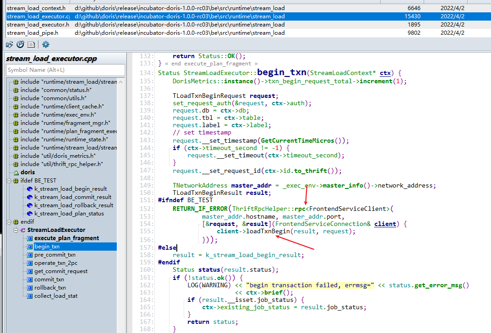

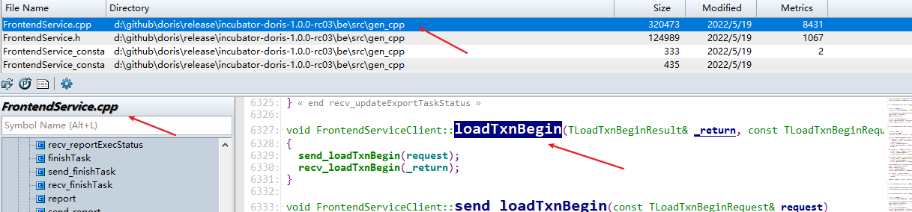


### FE相关接口


最终调用的是transaction下的GlobalTransactionMgr下的接口

### 执行计划

#### FE RPC处理：streamLoadPut

-  来自 FrontendServiceImpl

- 调用方：BE http\action\stream_load.cpp::StreamLoadAction::_process_put -> FrontendServiceConnection::streamLoadPut

stream_load.cpp_exec:549 client->streamLoadPut(ctx->put_result, request);


#### FE 创建Planner

- 创建tuple descriptor：目标表的结构和数据类型

- 创建两个节点：scan node 和 OlapTableSink node

  

- scan node节点
    - 作用：负责读取元数据、转换成查询框架需要的内存结构、谓词过滤、数据转换，然后发给OlapTableSink节点
    - 只需要一个，因为是从http请求的
    - scanRange：streamnode实现简单，只有一个节点，scanrange就是全部；对于brokerload，存在多个scan node如何瓜分文件列表/或者很大一个文件的问题
    - 初始化列映射
    - 初始化行列分割符


- OlapTableSink节点
    - 负责接受scan node数据，根据schema信息（分区、分桶策略）发送给不同的be
    - 跟scan node同一个节点，不需要exchange node接受多个scan node的数据


### 执行

#### scan node


#### OlapTableSink节点


- _node_channels：每个be对应一个NodeChannel，这个保存Beid到NodeChannel的映射
- _channes_by_tablet：每个Tablet id到多个NodeChannel（BE 节点）的映射，因为一个tabet包含多个副本


## DeltaWriter

olap/delta_writer.cpp

### 整体流程


--- OlapTableSink ---

- IndexChannel：每个物化视图或者rowup表，基表也由一个indexid，这里不知道怎么遍历的，感觉没有必要在前期区分indexchannel，物化表默认可以跟
- NodeChannel：每个NodeChannel对应一个be节点，缓存一批数据，然后发送给DeltaWriter，一个NodeChannel是Sink节点的一个RPC Client，用于给be节点发数据

--- Tablet 副本所在be ---

- LoadChannel（每个Load 任务一个）
- TableChannel
- DeltaWriter：类似LSMTree方式写 MemTable，如果数据导入完成提交transaction结束，fe会publish
- Memtable/Immutale Memtable：MemTable写满会异步生成Rowset，并flush到Segment文件
- MemtableFlushExcutor(ThreadPool)


- 开启一个BE的事务：本次tablet导入成功，相较于此，fe的事务是保证整个导入流程的完整性


- 1、Memtable写满：这个默认是100M
- 2、生成一个RowSet（RowSetWriter，逻辑上是开始时，实际上是最后：BetaRowsetWriter::build）
- 3、生成各个Segment文件（SegmentWriter）和前缀索引（ShortKeyIndexBuilder）
- 4、生成各个字段信息（ColumnWriter），分page、各种索引信息（Ordinal、 ZoneMap、BitMap、BloomFilter）
- 5、落盘（RowSetWriter::flush -> SegmentWriter::flush  -> ColumnWriter::write）
- 6、写Footer信息，并上报结果，完成事务

### MemTable


#### insert


#### flush


### BetaRowsetWriter


调用栈：TabletsChannel::close -> DeltaWriter::close_wait -> BetaRowsetWriter::build -> BetaRowsetWriter::init

### SegmentWriter


- 调用栈：BetaRowsetWriter::flush ->BetaRowsetWriter::_flush_segment_writer ->  SegmentWriter::finalize


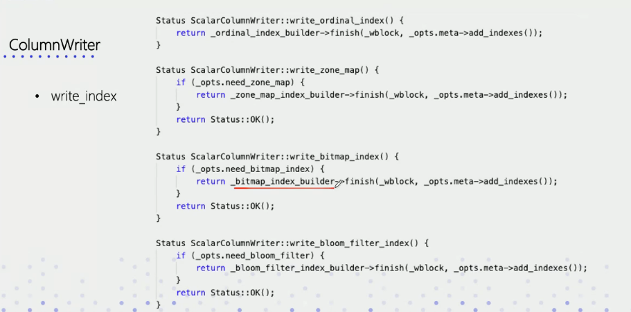


# 6 SQL查询

## 

## 查询计划


### 逻辑执行计划


### 物理执行计划

（分布式执行计划）


### 整体流程


### 查看


## 执行

### 分配/分发

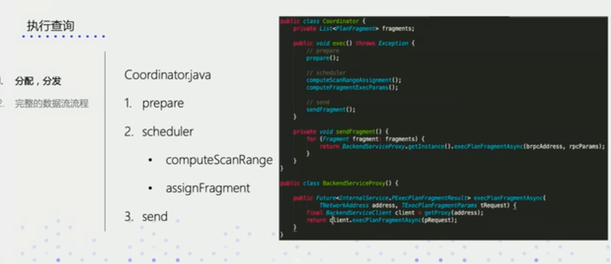

### 数据流图


### 执行查询


这个代码要倒着看


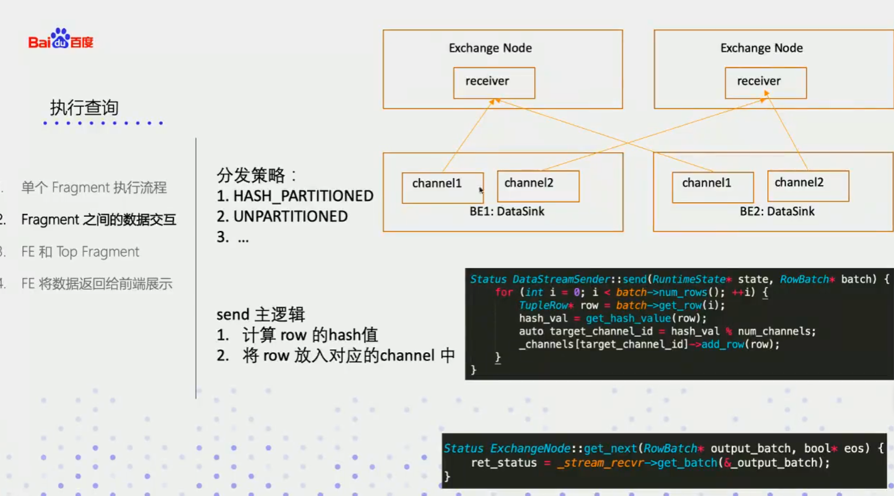

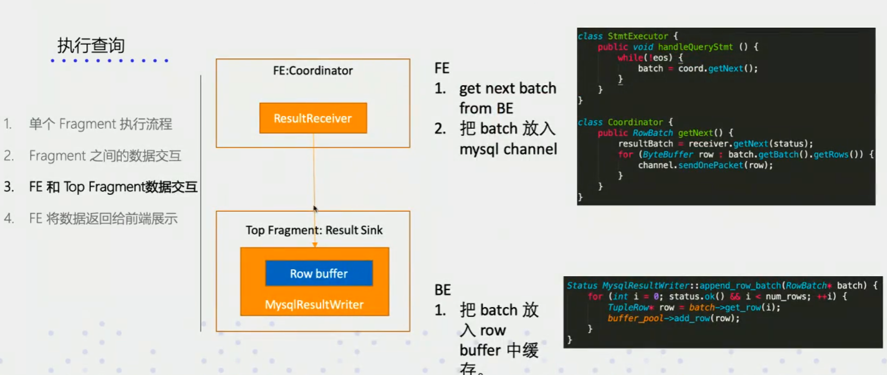


## QueryEngine

### QeService

- qe 目录下，QeService.java
- 默认端口：9030
- mysql协议支持：引用mysql目录下
  - 这里有一个协议的Java版本：https://github.com/sea-boat/mysql-protocol
  - 官网协议文档：https://dev.mysql.com/doc/internals/en/client-server-protocol.html
  - privilege：有相关权限管控的代码
- mysql目录和qe目录的文件是交叉引用，不太好


### NMysqlServer/MysqlServer

- 目录结构
  - nio：网络层
  - privilege：权限管理
  - 根目录：mysql协议层实现

- mysql目录下，NMysqlServer是nio实现的版本
- 源代码：NMysqlServer.java 和 MysqlServer.java
- nio
  - 引用模块：org.xnio.Xnio
    - github：https://github.com/xnio/xnio
    - 这个貌似是官网：https://xnio.jboss.org/docs
  - 主要代码模块
    - NMysqlServer.java：服务启动
    - AcceptListener.java：新连接建立过程
    - ReadListener.java：数据交互流程

### 整体流程

#### 服务启动


#### 接收新请求


#### 处理请求


调用关系有点乱，来回在qe和mysql模块之间折腾


- 读取连接里面的字符流，字符流转换
- 进行词法和语法解析：analyze，切分独立的sql
- 每个sql单独执行


#### 执行单一sql

- 每个sql执行生成一个唯一的queryId，uuid类型
  - 对于一些需要master执行的queryid，会转发到master
- 生成一个long类型的stmtId
- 支持在sql里面设置环境变量：analyzeVariablesInStmt
- 根据sql类型执行各种类型的sql的执行类：parsedStmt instanceof xxx
- 语义解析：analyze
- isForwardToMaster：这个决定是否是需要master执行的命令


```java
   // query with a random sql
    public void execute() throws Exception {
        UUID uuid = UUID.randomUUID();
        TUniqueId queryId = new TUniqueId(uuid.getMostSignificantBits(), uuid.getLeastSignificantBits());
        execute(queryId);
    }

    // Execute one statement with queryId
    // The queryId will be set in ConnectContext
    // This queryId will also be sent to master FE for exec master only query.
    // query id in ConnectContext will be changed when retry exec a query or master FE return a different one.
    // Exception:
    // IOException: talk with client failed.
    public void execute(TUniqueId queryId) throws Exception {
        context.setStartTime();

        plannerProfile.setQueryBeginTime();
        context.setStmtId(STMT_ID_GENERATOR.incrementAndGet());

        context.setQueryId(queryId);

        try {
            if (context.isTxnModel() && !(parsedStmt instanceof InsertStmt)
                    && !(parsedStmt instanceof TransactionStmt)) {
                throw new TException("This is in a transaction, only insert, commit, rollback is acceptable.");
            }
            // support select hint e.g. select /*+ SET_VAR(query_timeout=1) */ sleep(3);
            analyzeVariablesInStmt();

            if (!context.isTxnModel()) {
                // analyze this query
                analyze(context.getSessionVariable().toThrift());
                if (isForwardToMaster()) {
                    if (isProxy) {
                        // This is already a stmt forwarded from other FE.
                        // If goes here, which means we can't find a valid Master FE(some error happens).
                        // To avoid endless forward, throw exception here.
                        throw new UserException("The statement has been forwarded to master FE("
                                + Catalog.getCurrentCatalog().getSelfNode().first + ") and failed to execute" +
                                " because Master FE is not ready. You may need to check FE's status");
                    }
                    forwardToMaster();
                    if (masterOpExecutor != null && masterOpExecutor.getQueryId() != null) {
                        context.setQueryId(masterOpExecutor.getQueryId());
                    }
                    return;
                } else {
                    LOG.debug("no need to transfer to Master. stmt: {}", context.getStmtId());
                }
            } else {
                analyzer = new Analyzer(context.getCatalog(), context);
                parsedStmt.analyze(analyzer);
            }

            if (parsedStmt instanceof QueryStmt) {
                context.getState().setIsQuery(true);
                if (!((QueryStmt) parsedStmt).isExplain()) {
                    // sql/sqlHash block
                    try {
                        Catalog.getCurrentCatalog().getSqlBlockRuleMgr().matchSql(originStmt.originStmt, context.getSqlHash(), context.getQualifiedUser());
                    } catch (AnalysisException e) {
                        LOG.warn(e.getMessage());
                        context.getState().setError(e.getMysqlErrorCode(), e.getMessage());
                        return;
                    }
                    // limitations: partition_num, tablet_num, cardinality
                    List<ScanNode> scanNodeList = planner.getScanNodes();
                    for (ScanNode scanNode : scanNodeList) {
                        if (scanNode instanceof OlapScanNode) {
                            OlapScanNode olapScanNode = (OlapScanNode) scanNode;
                            Catalog.getCurrentCatalog().getSqlBlockRuleMgr().checkLimitaions(olapScanNode.getSelectedPartitionNum().longValue(),
                                    olapScanNode.getSelectedTabletsNum(), olapScanNode.getCardinality(), analyzer.getQualifiedUser());
                        }
                    }
                }

                MetricRepo.COUNTER_QUERY_BEGIN.increase(1L);
                int retryTime = Config.max_query_retry_time;
                for (int i = 0; i < retryTime; i++) {
                    try {
                        //reset query id for each retry
                        if (i > 0) {
                            UUID uuid = UUID.randomUUID();
                            TUniqueId newQueryId = new TUniqueId(uuid.getMostSignificantBits(), uuid.getLeastSignificantBits());
                            AuditLog.getQueryAudit().log("Query {} {} times with new query id: {}", DebugUtil.printId(queryId), i, DebugUtil.printId(newQueryId));
                            context.setQueryId(newQueryId);
                        }
                        handleQueryStmt();
                        // explain query stmt do not have profile
                        if (!((QueryStmt) parsedStmt).isExplain()) {
                            writeProfile(true);
                        }
                        break;
                    } catch (RpcException e) {
                        if (i == retryTime - 1) {
                            throw e;
                        }
                        if (!context.getMysqlChannel().isSend()) {
                            LOG.warn("retry {} times. stmt: {}", (i + 1), parsedStmt.getOrigStmt().originStmt);
                        } else {
                            throw e;
                        }
                    } finally {
                        QeProcessorImpl.INSTANCE.unregisterQuery(context.queryId());
                    }
                }
            } else if (parsedStmt instanceof SetStmt) {
                handleSetStmt();
            } else if (parsedStmt instanceof EnterStmt) {
                handleEnterStmt();
            } else if (parsedStmt instanceof UseStmt) {
                handleUseStmt();
            } else if (parsedStmt instanceof TransactionStmt) {
                handleTransactionStmt();
            } else if (parsedStmt instanceof InsertStmt) { // Must ahead of DdlStmt because InserStmt is its subclass
                try {
                    handleInsertStmt();
                    if (!((InsertStmt) parsedStmt).getQueryStmt().isExplain()) {
                        queryType = "Insert";
                        writeProfile(true);
                    }
                } catch (Throwable t) {
                    LOG.warn("handle insert stmt fail", t);
                    // the transaction of this insert may already begun, we will abort it at outer finally block.
                    throw t;
                } finally {
                    QeProcessorImpl.INSTANCE.unregisterQuery(context.queryId());
                }
            } else if (parsedStmt instanceof DdlStmt) {
                handleDdlStmt();
            } else if (parsedStmt instanceof ShowStmt) {
                handleShow();
            } else if (parsedStmt instanceof KillStmt) {
                handleKill();
            } else if (parsedStmt instanceof ExportStmt) {
                handleExportStmt();
            } else if (parsedStmt instanceof UnlockTablesStmt) {
                handleUnlockTablesStmt();
            } else if (parsedStmt instanceof LockTablesStmt) {
                handleLockTablesStmt();
            } else if (parsedStmt instanceof UnsupportedStmt) {
                handleUnsupportedStmt();
            } else {
                context.getState().setError(ErrorCode.ERR_NOT_SUPPORTED_YET, "Do not support this query.");
            }
        } catch (IOException e) {
            LOG.warn("execute IOException. {}", context.getQueryIdentifier(), e);
            // the exception happens when interact with client
            // this exception shows the connection is gone
            context.getState().setError(ErrorCode.ERR_UNKNOWN_ERROR, e.getMessage());
            throw e;
        } catch (UserException e) {
            // analysis exception only print message, not print the stack
            LOG.warn("execute Exception. {}, {}", context.getQueryIdentifier(), e.getMessage());
            context.getState().setError(e.getMysqlErrorCode(), e.getMessage());
            context.getState().setErrType(QueryState.ErrType.ANALYSIS_ERR);
        } catch (Exception e) {
            LOG.warn("execute Exception. {}", context.getQueryIdentifier(), e);
            context.getState().setError(ErrorCode.ERR_UNKNOWN_ERROR,
                    e.getClass().getSimpleName() + ", msg: " + e.getMessage());
            if (parsedStmt instanceof KillStmt) {
                // ignore kill stmt execute err(not monitor it)
                context.getState().setErrType(QueryState.ErrType.ANALYSIS_ERR);
            }
        } finally {
            // revert Session Value
            try {
                SessionVariable sessionVariable = context.getSessionVariable();
                VariableMgr.revertSessionValue(sessionVariable);
                // origin value init
                sessionVariable.setIsSingleSetVar(false);
                sessionVariable.clearSessionOriginValue();
            } catch (DdlException e) {
                LOG.warn("failed to revert Session value. {}", context.getQueryIdentifier(), e);
                context.getState().setError(e.getMysqlErrorCode(), e.getMessage());
            }
            if (!context.isTxnModel() && parsedStmt instanceof InsertStmt) {
                InsertStmt insertStmt = (InsertStmt) parsedStmt;
                // The transaction of an insert operation begin at analyze phase.
                // So we should abort the transaction at this finally block if it encounters exception.
                if (insertStmt.isTransactionBegin() && context.getState().getStateType() == MysqlStateType.ERR) {
                    try {
                        String errMsg = Strings.emptyToNull(context.getState().getErrorMessage());
                        Catalog.getCurrentGlobalTransactionMgr().abortTransaction(
                                insertStmt.getDbObj().getId(), insertStmt.getTransactionId(),
                                (errMsg == null ? "unknown reason" : errMsg));
                    } catch (Exception abortTxnException) {
                        LOG.warn("errors when abort txn. {}", context.getQueryIdentifier(), abortTxnException);
                    }
                }
            }
        }
    }
```

#### 上下文

ConnectContext

- stmtId/forwardedStmtId：log
- queryId：uuid
- executor：StmtExecutor
- catalog：元数据

### SQL解析

#### 语法/词法解析

- 词法语法解析：ConnectProcessor::handleQuery -> ConnectProcessor::analyze
- 语法：jcup


#### 生成新的sql


- 语法文件：SqlScanner.java
- 词法文件：SqlParser.java SqlParserSymbols.java


#### 语义解析

- 语义解析：StmtExecutor::execute ->  StmtExecutor::analyze -> 具体smt类的analyze方法，如


### 转发处理

- 补充一点：心跳信息等只有master节点才有          
- FORWARD_NO_SYNC：不需要返回，无元数据修改的语句，只有master有的数据
- FORWARD_WITH_SYNC：需要等待返回、元数据修改的语句
- NO_FORWARD：不需要转发master，查询语句

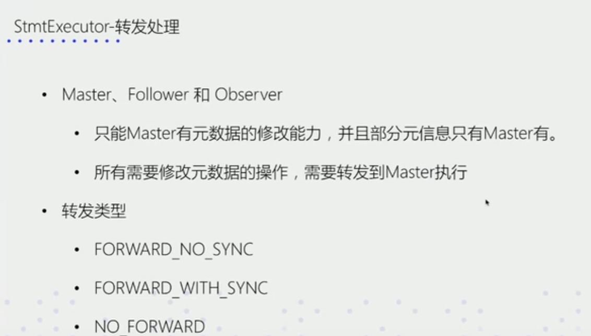

### DDL执行

- ddl的执行基本上就是对catalog类接口的二次封装


#### CreateTableStmt

- 检查库/表是否已存在
- 检查是否是需要资源配额是否足够
- 根据不同的表类型进行相关的建表操作


## 优化器

### 基本知识


### query改写

- rewrite目录下


### 单机执行规划

- planner目录下的 SingleNodePlanner.java


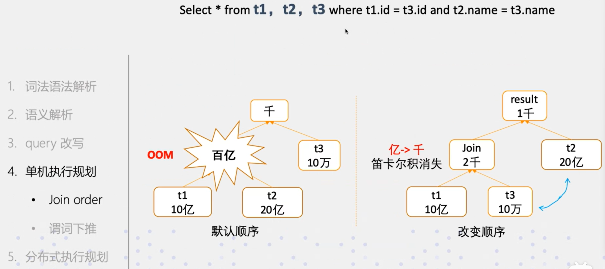


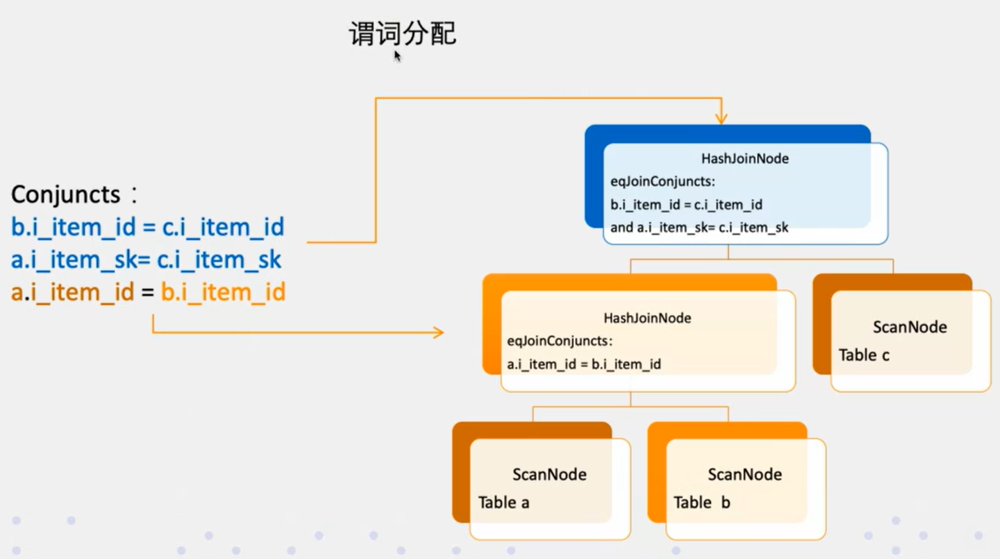


- 谓词列表（conjuncts）放在scan node里，scan node自行检查是否可以使用当前的谓词列表中的某些谓词

### 分布式执行计划

#### Join


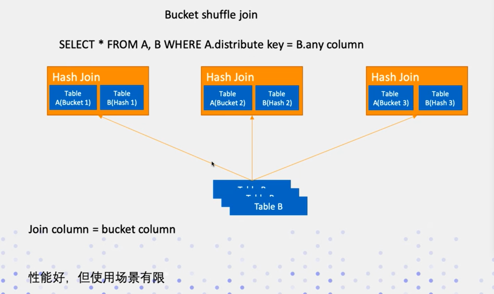


#### agg


### 总结


# 7 数据读取

## 整体流程


### TupleReader


### CollectIterator

- 提供多rowset的有序结果集
- 基于堆排序实现了一个归并排序


### RowsetReader

- next_block：返回堆排序的有序的行
- version：用于多rowset排序，右边代码即相关排序的代码


### RowwiseIterator


#### MergeIterator && UnionIterator

- MergeIterator ：多个segment之间的数据归并排序，为啥不是根据segment id直接输出呢。。。也就是为啥存的是否是无序的？这是为了简化存储？这里有优化的空间，CollectIterator是因为多rowset没有compaction确实无法保证去重


### SegmentIterator


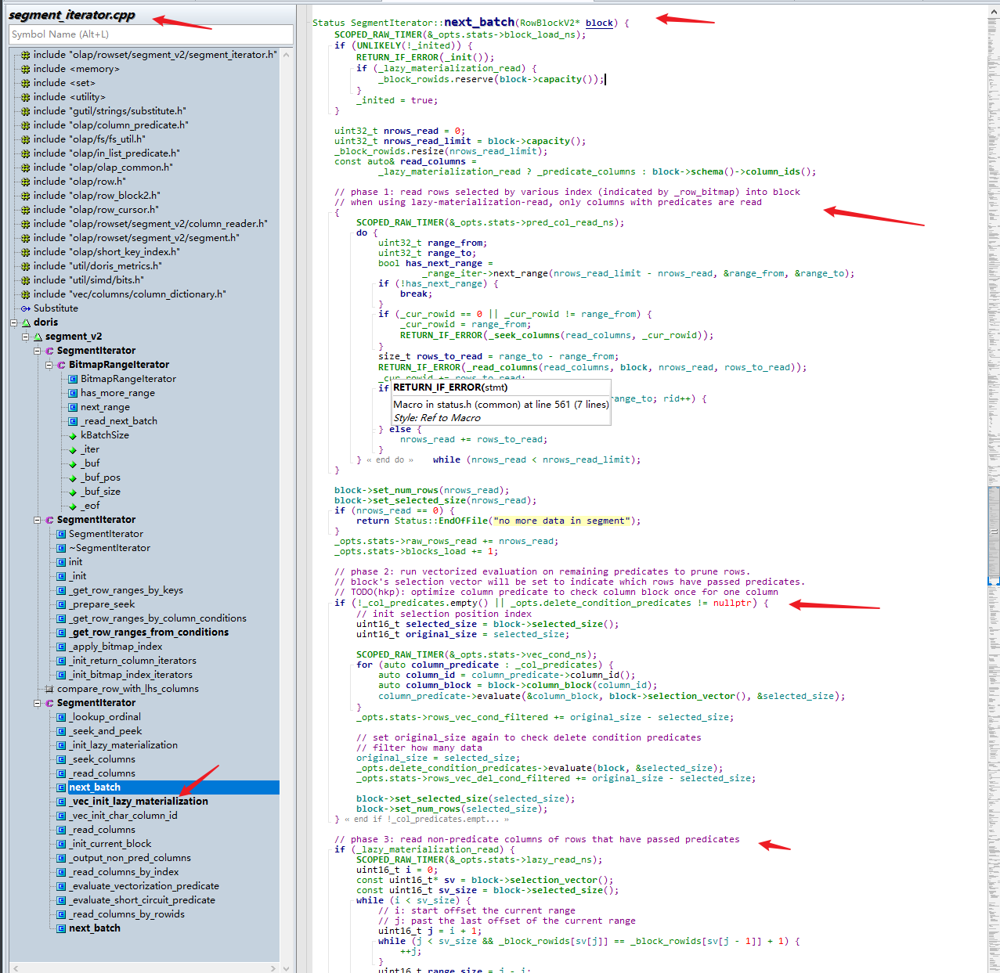


- 延迟物化：就是根据筛选条件进一步缩小需要扫描的行数；目前limit的下推在这里没有做到。。。


## Page的读取和PageCache

### 基础知识


## agg表


- CollectIterator：多个rowset的一个抽象，应该对应的就是一个具体的bucket，保证数据读取的有序性，可以进行前后数据的聚合、顺序替换

## unique表


- unique表读取多个rowset是逆序(_reverse开关是打开的)的，先读最新的rowset，这样碰到key冲突的行直接丢弃即可，代码见下


- 新版本这些逻辑在这个函数里面都去掉了，不知道跑哪里去了

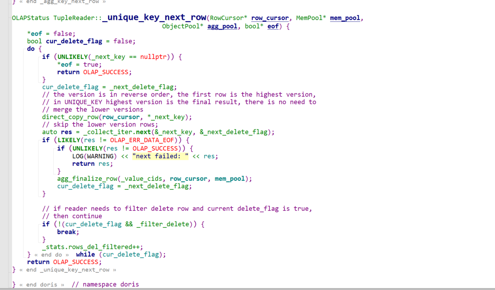

# 8 运维

## 基本概念


## 节点管理


###   FE


####   启动/新增

  

  

  


#### 删除

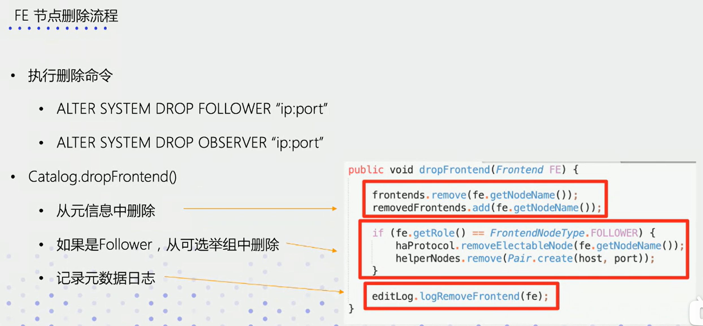


### BE

#### 新增


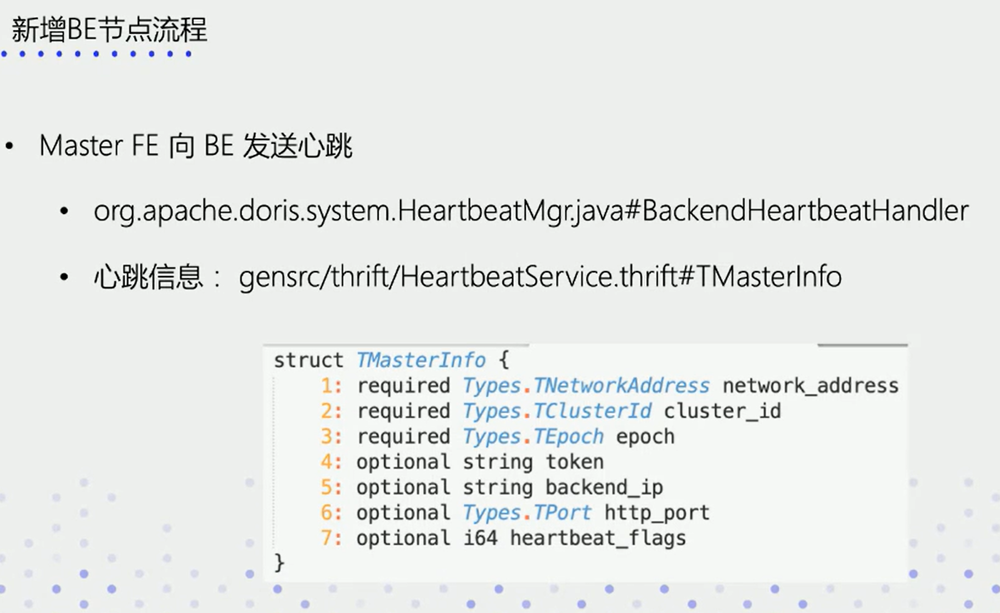


- epoch：本地存储的master的信息epoch_id，要小于fe发送的epoch，避免fe切主期间的异常


#### 删除


### 常见问题


- priority_network：选择网络，避免选到了错误的ip
- invalid cluster id：去掉be节点元数据目录下的cluster_id文件
- 被drop的be是否能够恢复：重新加入，be有汇报数据的能力，如果没有变化，且正好副本个数缺失就可以恢复

## 元数据管理


- 通过http接口全部推送成功


### 高可用


## DeployManager


- 多FE同时启动：基于IP排序，默认第一个为master


# 9 add-on

## 函数

### 介绍


### 标量函数


### 聚合函数


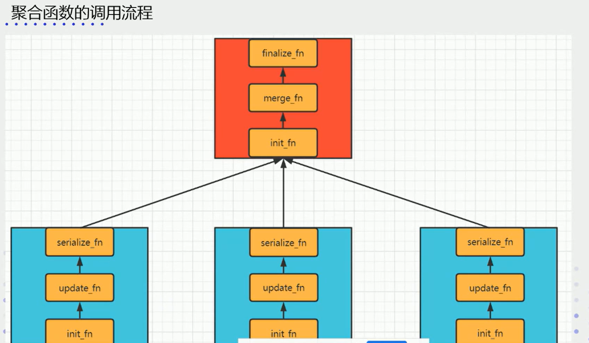


### 实现框架


### 注册


- 参数列表改了，向量化的另外分了文件
- 使用了函数和类名而不是编译以后的名字
- fe编译时会调用python将其转换为java代码


### FE端流程


### 总结


来源：BE http\action\stream_load.cpp::StreamLoadAction::_process_put -> StreamLoadExecutor::execute_plan_fragment

stream_load.cpp_exec:568 _env->stream_load_executor()->execute_plan_fragment(ctx)

