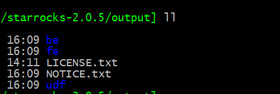
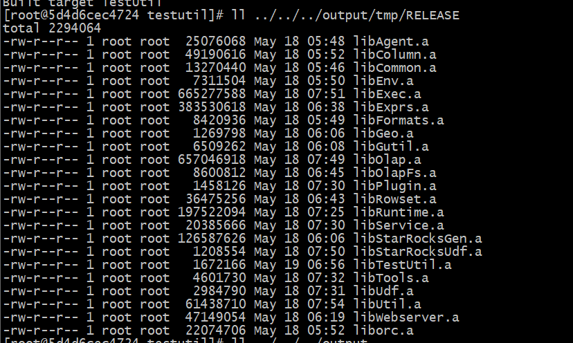
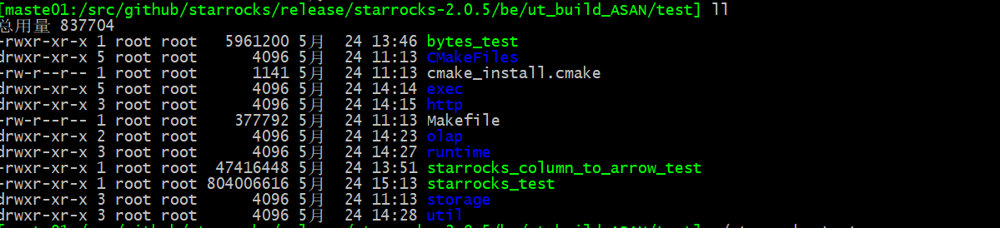

# StarRocks整理

# 基础

## 编译环境

- 官方文档：https://docs.starrocks.com/zh-cn/main/administration/Build_in_docker
- 基于官方开发docker镜像进行编译
- 官方fe开发环境搭建的一个帖子：https://forum.starrocks.com/t/topic/514
- 我自己撸的


```bash
docker pull starrocks/dev-env:main
docker run -it \
-v /root/.m2:/root/.m2 \
-v /data/docs/src/github/starrocks:/root/starrocks \
--name starrocks-dev \
-d starrocks/dev-env:main
docker exec -it starrocks-dev /root/starrocks/build.sh
# 也可以bash进入以后自行执行编译命令
docker exec -it starrocks-dev /bin/bash
```
- 构建完成以后的构建产物在output目录下





## 编译测试用例

### 方法1

- FE：run-fe-ut.sh
- BE：run-ut.sh

构建产物在be/ut_build_ASAN/test



### 方法2

- 打开测试用例编译选项

```bash
 cd build_Release
 cmake .. -DMAKE_TEST=ON
 # 查看设置结果
 cmake .. -LH
 # 只编译测试用例
  cd build_Release\test
  make
```


默认情况下，测试用例是不打开编译的，因为编译不过，：）（2.0.5源码）

- 主要原因是镜像里面缺少libjvm.so的库（这个在编译的最终目录有）

```bash
 cp ../../../output/be/lib/jvm/amd64/server/libjvm.so /usr/lib64/
```

## 工具

### 调试工具

- 文件：[SRDebugUtil.tar.gz](/bigdata/doris/SRDebugUtil.tar.gz ":ignore")
- 用法

```bash
./bin/pstack {be_pid}
```


## 配置

### BE

#### 日志

sys_log_verbose_modules=txn_manager,delta_writer,internal_service
如果要重启的话，在be.INFO加下这个配置，打印一下日志