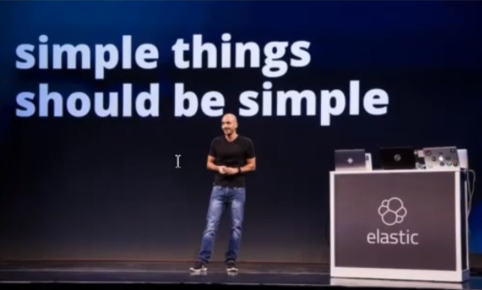
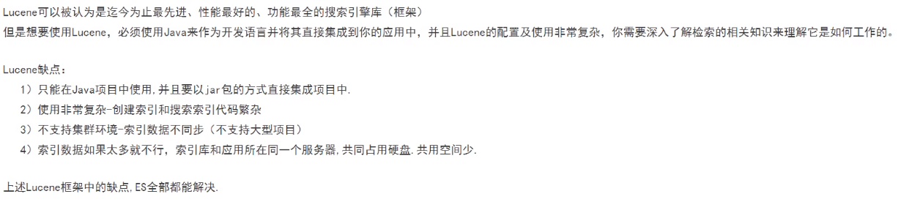
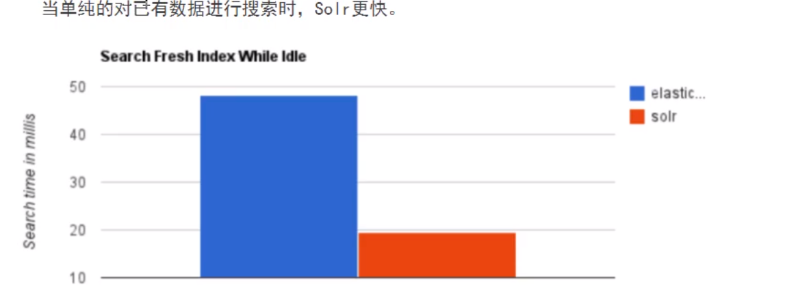
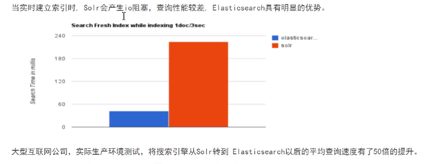
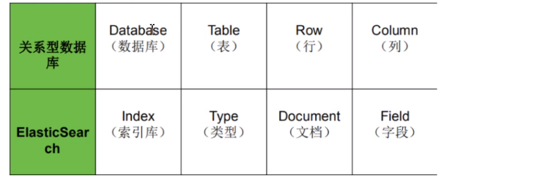
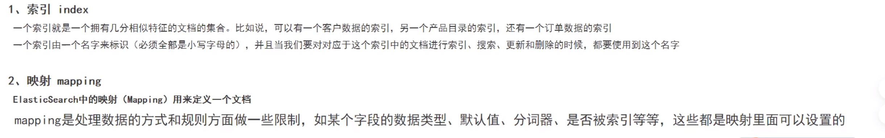
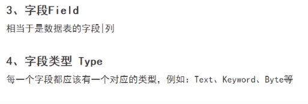
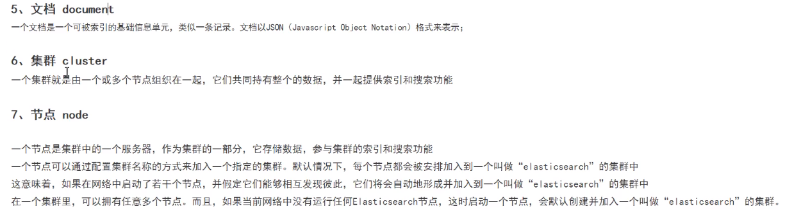
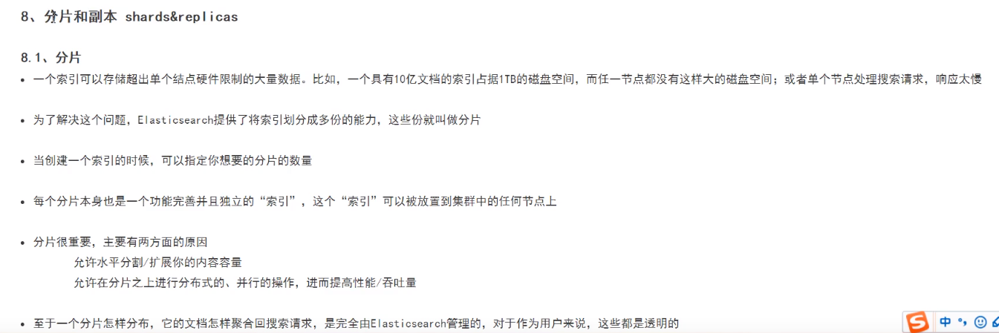
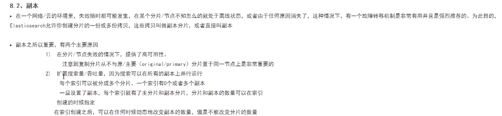

# ES学习笔记

## 1 基本概念

### 1.1 基本信息

- 创始人：Shay Baron

- 官网：https://www.elastic.co/
- 中文社区：https://elasticsearch.cn/
- 

### 1.2 ES与Lucene的关系

### 1.3 ES vs Solr

### 1.4 ES vs 关系型数据库

### 1.5 ES核心概念

