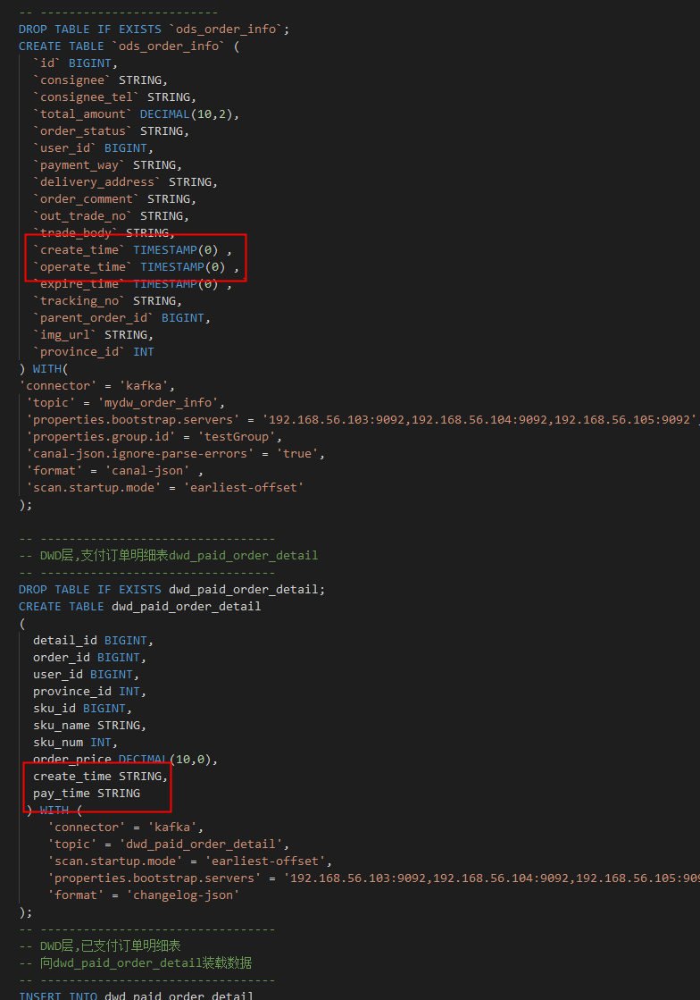

# 基于FlinkSQL的实时数仓实践

## 综述

基于[实时数仓|基于Flink1.11的SQL构建实时数仓探索实践](https://mp.weixin.qq.com/s/dJUHsP1VrO0AxzQfezwFVw)例子在Flink1.13上弄起来了，一些内容总结一下。

数据流：

- 维表数据：mysql(database: mydw) ----canal----> kafka ----flinksql(sink)--> mysql(database: dim)
- 明细数据：mysql(database: mydw) ----canal----> kafka ----flinksql(sink)--> kafka(dwd) ----flinksql(sink)--> mysql (database: ads)

  怎么用canal将mysql binlog倒腾到kafka参考这篇文章：[通过Canal实现mysql的binlog到kafka的同步](bigdata/flink/canal-mysql2kafka)

## 素材

- 原文的原始数据： [realtime-dw-demo.sql](/testcase/flink/1/realtime-dw-demo.sql ":ignore"), 先要创建数据库mydw
- 另外需要提前建好的库表，避免不必要的麻烦： [create_table_without_data.sql](/testcase/flink/1/create_table_without_data.sql ":ignore")
- FlinkSQL-维表： [task_region_dim.sql](/testcase/flink/1/task_region_dim.sql ":ignore")  [task_goods_dim.sql](/testcase/flink/1/task_goods_dim.sql ":ignore")
- FlinkSQL-dwd： [task_dwd.sql](/testcase/flink/1/task_dwd.sql ":ignore")
- FlinkSQL-ads： [task_ads.sql](/testcase/flink/1/task_ads.sql ":ignore")

## 踩坑记

- 坑1：启动/停止问题
  未正常停止，需要多次执行stop-cluster.sh

  
- 坑2：jar包依赖问题

  所有jar包必须在TaskManager/JobManager的lib目录下，增加新的jar包需要重启服务
- 坑3：canal 不支持 erase方法，代码也看过了,需要在with子句里面加一下这个配置项：canal-json.ignore-parse-errors

```sql
CREATE TABLE `ods_base_province` (
  `id` INT,
  `name` STRING,
  `region_id` INT ,
  `area_code`STRING
) WITH(
'connector' = 'kafka',
 'topic' = 'mydw_base_province',
 'canal-json.ignore-parse-errors' = 'true',
 'properties.bootstrap.servers' = '192.168.56.103:9092,192.168.56.104:9092,192.168.56.105:9092',
 'properties.group.id' = 'testGroup',
 'format' = 'canal-json' ,
 'scan.startup.mode' = 'earliest-offset' 
) ; 
```

- 坑4：官方不支持changelog-json，需要去github自己下载一个:https://github.com/ververica/flink-cdc-connectors/wiki/Changelog-JSON-Format#maven-dependency
  整个阿里巴巴的版本仓库在这里，可以去下面找对应的版本，https://repo1.maven.org/maven2/com/alibaba/ververica/
  下载一个最新的版本，1.1.0已经验证过不能在flink1.13版本上使用

```bash
wget https://repo1.maven.org/maven2/com/alibaba/ververica/flink-format-changelog-json/1.4.0/flink-format-changelog-json-1.4.0.jar
```

- 坑5：kafka分组不要删除，flink重启以后以前的任务不在了，需要重新下发

```sql
  'properties.group.id' = 'testGroup'
```

- 坑6：sku_info导入部分成功
  除了sku_info(10个导入成功5条)外，其他都正常，应该是长度问题

```sql
insert  into `sku_info`(`id`,`spu_id`,`price`,`sku_name`,`sku_desc`,`weight`,`tm_id`,`category3_id`,`sku_default_img`,`create_time`) values 
(11,1,555,'name1','desc1',0.33,2,61,'http://AOvKmfRQEBRJJllwCwCuptVAOtBBcIjWeJRsmhbJ','2019-02-14 21:25:54'),
(12,1,444,'name2','desc2',0.44,3,23,'http://AOvKmfRQEBRJJllwCwCuptVAOtBBcIjWeJRsmhbJ','2019-02-14 21:25:54');
```

- 坑7 重复提交

  
- 坑8 字段类型不匹配

  

  

```sql
  cast(oi.create_time as varchar),
  cast(oi.operate_time as varchar)
```

## Flink / Flink SQL 使用体验

- sql-client确实基本是个玩具，错误信息未能正常返回，查看问题路径：

  - sql-client.sh执行结果显示：基本没用
  - TaskManager日志：web/机器上，主要定位任务是否正确提交到taskmanager及其是否在依赖的jar包上有问题
  - JobManager日志：web/机器上，主要定位job任务执行情况，依赖的jar包是否有问题，任务是否正常启动
  - JOBS详情：web/机器上，任务已经创建成功时，
- catalog的引入不符合预期，各种减少sql模块化、数据源配置化上需要进行更多的工作
- 可以通过引入用户传入的JOBID避免重复提交
