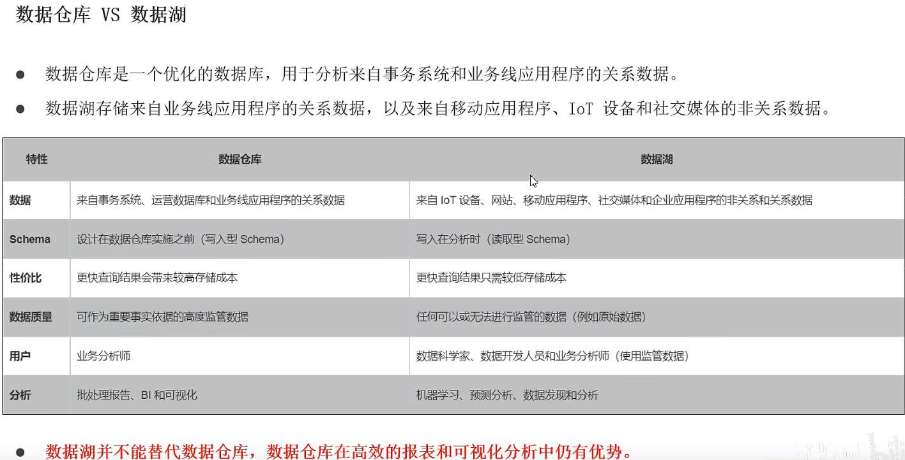
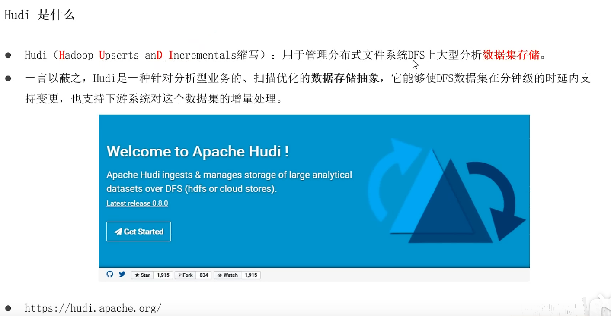
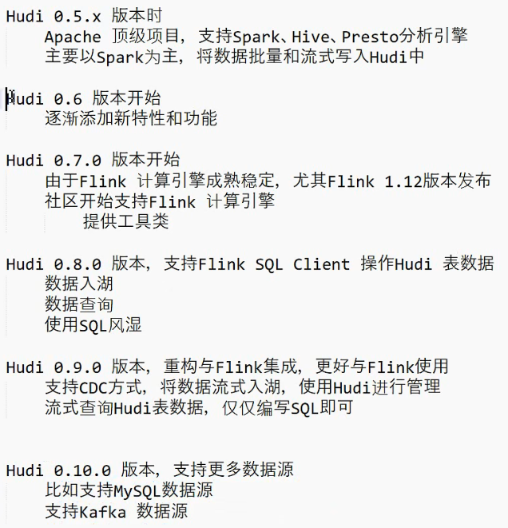
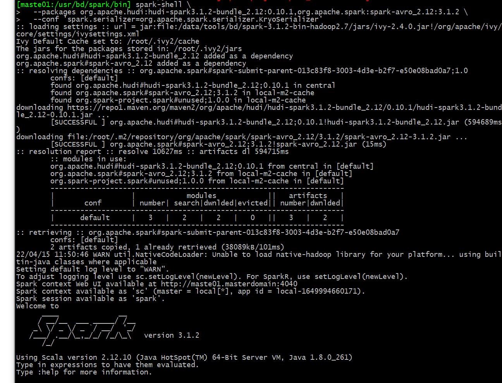
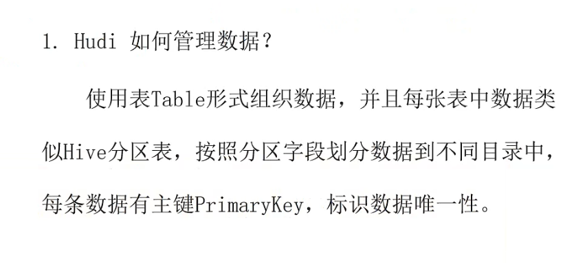
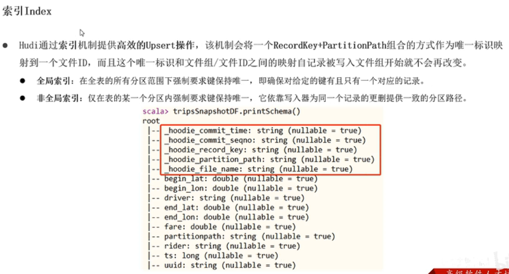
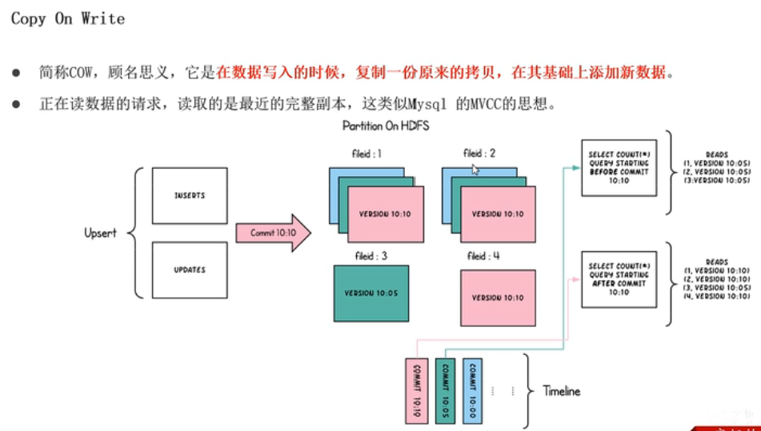

# HUDI学习笔记

# 资料

- 从Apache Hudi基础到项目实战 https://www.bilibili.com/video/BV1sb4y1n7hK
- 阿里云基于Hudi构建Lakehouse实践：https://www.bilibili.com/video/BV19M4y1V7S6

# 湖仓一体基础篇

### 数据湖 VS 数据仓库




### 数据胡框架


#### DeltaLake


#### Iceberg


# Hudi基础篇

## 基本信息 








## 架构


## 快速体验使用

- 

### hudi编译


- 下载地址 https://hudi.apache.org/releases/download
- build源码方式太麻烦，而且基本上都是基于spark的文档，还是直接使用相关的包吧：https://mvnrepository.com/artifact/org.apache.hudi/hudi-flink-bundle


```xml
<!-- https://mvnrepository.com/artifact/org.apache.hudi/hudi-flink-bundle -->
<dependency>
    <groupId>org.apache.hudi</groupId>
    <artifactId>hudi-flink-bundle_2.12</artifactId>
    <version>0.10.1</version>
</dependency>
```


没有用aliyun的仓库，用了官方仓库

```xml
     <mirror>
      <id>maven2</id>
      <mirrorOf>central</mirrorOf>
      <name>maven2 Repository</name>
      <url>https://repo1.maven.org/maven2/</url>
    </mirror>
```


### 安装scala

- 官网下载页面，选择需要安装的版本：https://www.scala-lang.org/download/all.html 
- 下载安装：spark只支持2.12以上版本的scala，

```bash
wget https://downloads.lightbend.com/scala/2.12.15/scala-2.12.15.rpm
rpm -ivh scala-2.12.15.rpm 
```


### 启动spark-cli

- 进入spark的bin目录，执行下面的命令

```bash
// spark-shell for spark 3.1
spark-shell \
  --packages org.apache.hudi:hudi-spark3.1.2-bundle_2.12:0.10.1,org.apache.spark:spark-avro_2.12:3.1.2 \
  --conf 'spark.serializer=org.apache.spark.serializer.KryoSerializer'
```

注意官方推荐的hudi版本和spark版本的对应关系，本机装的是spark3.1.2，需要hudi 0.10以上的版本

- 官方文档：https://hudi.apache.org/cn/docs/quick-start-guide/




### 官方例子

- https://hudi.apache.org/cn/docs/quick-start-guide/
- 下载：quick_start.scala，路径：/data/test/bd/hudi/quick_start.scala
- spark-shell加载scala文件：https://wenku.baidu.com/view/75a85a9efe0a79563c1ec5da50e2524de518d0c0.html

#### 生成数据

```sc
// spark-shell
import org.apache.hudi.QuickstartUtils._
import scala.collection.JavaConversions._
import org.apache.spark.sql.SaveMode._
import org.apache.hudi.DataSourceReadOptions._
import org.apache.hudi.DataSourceWriteOptions._
import org.apache.hudi.config.HoodieWriteConfig._

val tableName = "hudi_trips_cow"
val basePath =  "hdfs://192.168.56.101:8020/data/hudi-warehouse/hudi_trips_cow"
val dataGen = new DataGenerator
// 生成十条数据
val inserts = convertToStringList(dataGen.generateInserts(10))
// 将list类型的json数据转换成dataframe
val df = spark.read.json(spark.sparkContext.parallelize(inserts, 2))
//查看转换后的DataFrame数据集的Schema信息
df.printSchema()
```


```sc
// 查询dataframe里面的数据
df.select("rider","begin_lat","begin_lon","driver","fare", "uuid", "ts").show(10, truncate=false)
```


- ：preCombinedField ：https://blog.csdn.net/dkl12/article/details/122309954
  - Spark DF建表写数据时（含更新）：
    1、UPSERT，当数据重复时（这里指同一主键对应多条记录），程序在写数据前会根据预合并字段ts进行去重，去重保留ts值最大的那条记录，且无论新记录的ts值是否大于历史记录的ts值，都会覆盖写，直接更新。
    2、INSERT时，没有预合并，程序依次写入，实际更新为最后一条记录，且无论新记录的ts值是否大于历史记录的ts值，都会覆盖写，直接更新。
  - Spark SQL建表，写数据时（含更新）：
    有ts时，预合并时如果数据重复取预合并字段值最大的那条记录，最大值相同的取第一个。写数据时，ts值大于等于历史ts值，才会更新，小于历史值则不更新。
    没有ts时，则默认将主键字段的第一个值作为预合并字段，如果数据重复，去重时会取第一个值，写数据时，直接覆盖历史数据（因为  这里的预合并字段为主键字段，等于历史值，其实原理跟上面有ts时一样）
  
- 消化一下：

  - mysql：
    - insert， 重复key出错，
    - replace：有直接替换，没有insert
    
    hudi
为了处理乱序的语义，其实没必要搞这么复杂
  
- spark dataframe
  
    - upsert：根据时间戳合并数据，然后replace
    - insert：replace
  - spark sql
    - 有时间戳：去重时取时间戳最大的第一个，大于历史数据时间戳才更新
    - 没有时间戳：replace

#### 插入数据


```scala
df.write.
  mode(Overwrite).
  format("hudi").
  options(getQuickstartWriteConfigs).
  option(PRECOMBINE_FIELD_OPT_KEY, "ts").
  option(RECORDKEY_FIELD_OPT_KEY, "uuid").
  option(PARTITIONPATH_FIELD_OPT_KEY, "partitionpath").
  option(TABLE_NAME, tableName).
  mode(Overwrite).
  save(basePath)
```


#### 读取数据

```sca

// spark-shell
val tripsSnapshotDF = spark.
  read.
  format("hudi").
  load(basePath)
tripsSnapshotDF.printSchema  
//load(basePath) use "/partitionKey=partitionValue" folder structure for Spark auto partition discovery
tripsSnapshotDF.createOrReplaceTempView("hudi_trips_snapshot")

spark.sql("select fare, begin_lon, begin_lat, ts from  hudi_trips_snapshot where fare > 20.0").show()
spark.sql("select _hoodie_commit_time, _hoodie_record_key, _hoodie_partition_path, rider, driver, fare from  hudi_trips_snapshot").show()

```

- 与原数据相比，hudi会增加一些内部用的字段


## 总结



- 按照表来管理数据
- 按照字段分区+ parquet格式存放数据
- 唯一主键
- 解决数据乱序的问题

# 数据管理

## 表数据结构


## 元数据


IDEA编程开发

# 核心概念剖析







 


# 应用

## 阿里云

