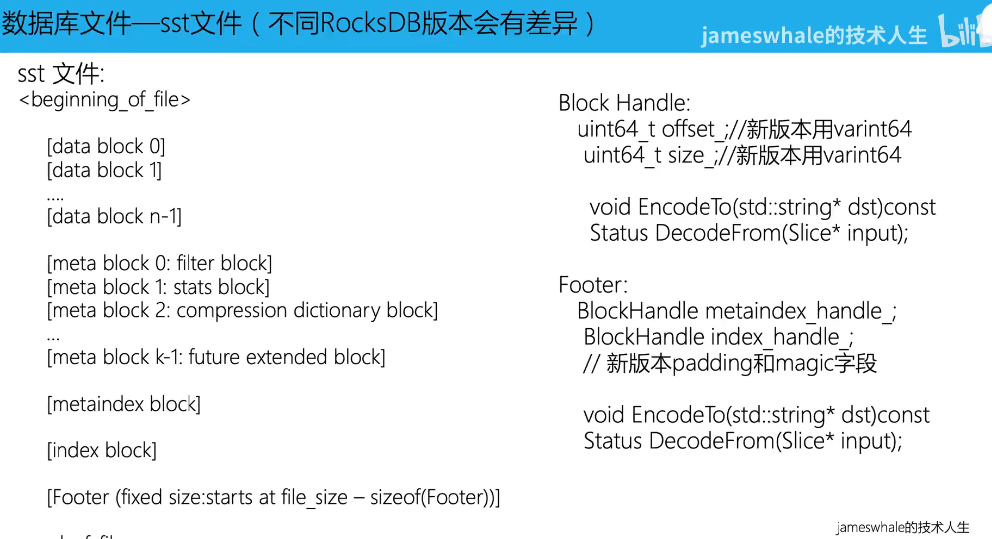
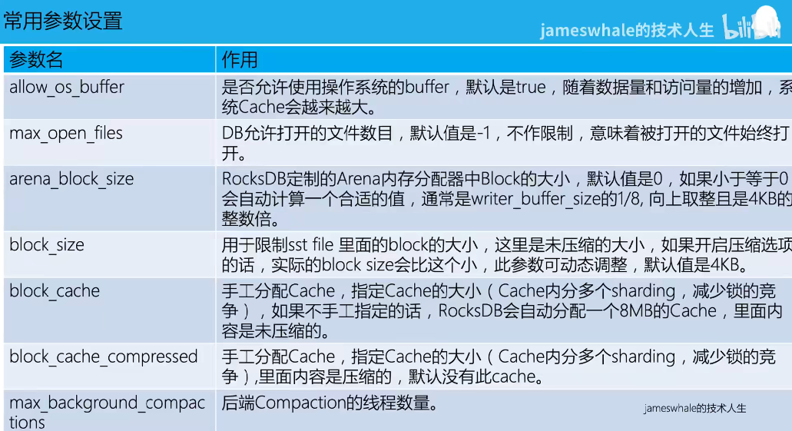
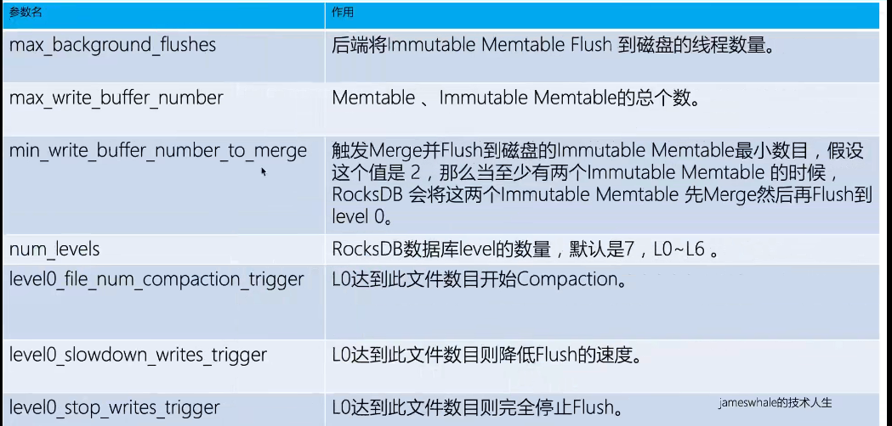

# rocksdb学习笔记

## 参考

- b站：https://www.bilibili.com/video/BV1pE411E7Nk
- 教程：https://www.jianshu.com/p/d6ce3593a69e
- RocksDB 官方安装指南中文翻译版： https://blog.csdn.net/FishGoddess/article/details/110153255
- RocksDB 官方安装指南 https://github.com/facebook/rocksdb/blob/master/INSTALL.md
- rocksdb调优：https://blog.csdn.net/qq_42828391/article/details/118365072
- github：https://github.com/facebook/rocksdb

## 基本原理

### 基本信息

- paxosstore：https://github.com/Tencent/paxosstore

### 数据库文件

- 这个filter是个布隆过滤器，基于一组key值，计算出一个布隆过滤器的值，存到filter n中
- 这个讲的是全局非block的布隆过滤器生成规则，这样可以快速判断key在磁盘中的某个位置是否有，感觉key是有序的，所以可以结合有序加布隆过滤器可以更有效判断

### 读流程

两种不同的接口的查询参数要求不一样，感觉第一种没必要，需要倒推key长度而已，内部实现上也是转成了第二种

- Memtable Key: 内存中存储的key
- Internal Key：文件中存储的key

## 常用配置

## 性能压测

