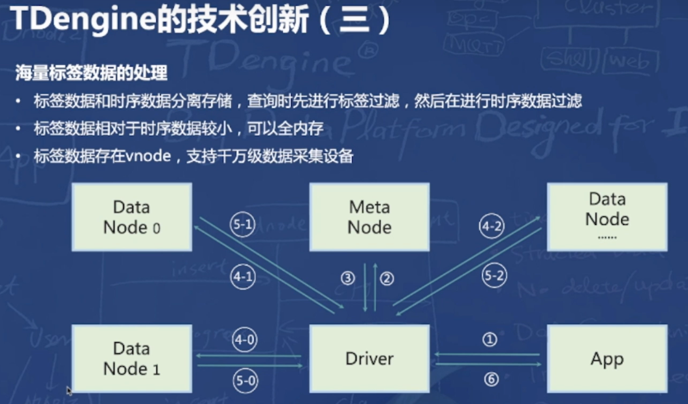
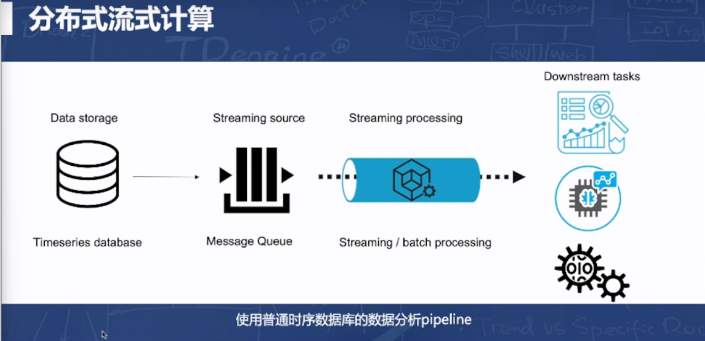
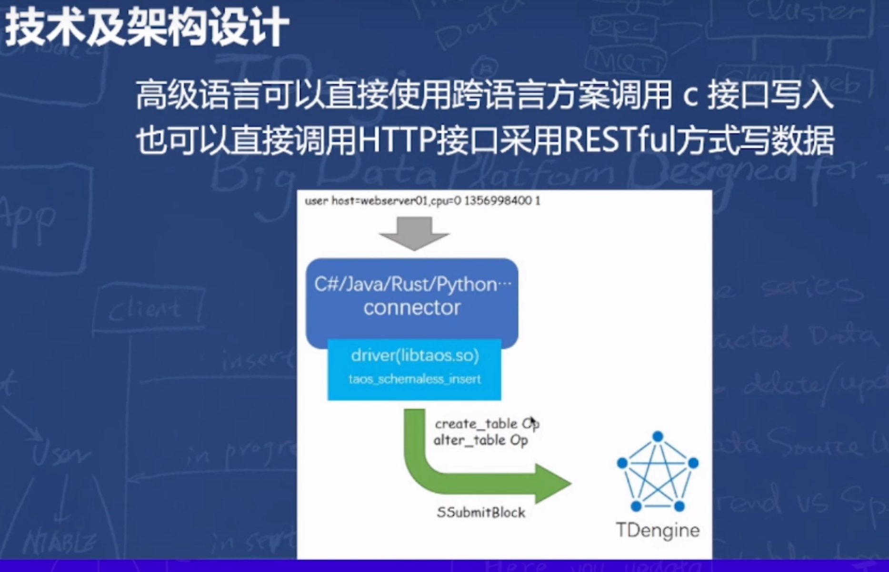
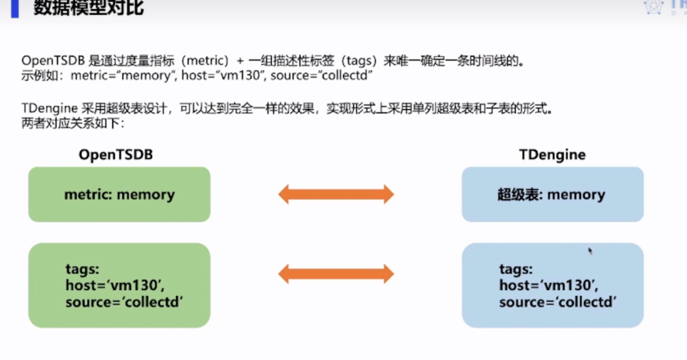
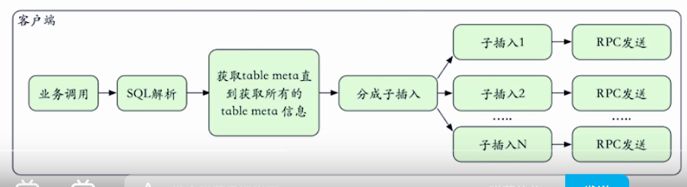

# TDEngine笔记

# 官方内容

## 参考

- TDengine 3.0 的技术演进规划 https://www.bilibili.com/video/BV1SY411s7Vx
- TDengine 技术内幕分享——兼容 OpenTSDB https://www.bilibili.com/video/BV1Qg411A7kP
- 全面超越OpenTSDB——TDengine的迁移方案和更多时序查询支持能力介绍  https://www.bilibili.com/video/BV1r44y1h7gc

## 历史

## 特点

### 技术创新

- 这个方式不太好，逻辑关系有点问题，跟mysql分库/分表策略有点类似，不过还是以动态分区（按照region 和，日期），按照采集点分桶/分文件比较好，或者只分桶，桶内按照采集点分块可能效果会更好，不然文件数有可能太多，后面的超级表应该是类似的思路；也比较容易理解，而且对于一个采集点的查询可以利用多块磁盘的并行读取
- 时序数据库库内是连续存储，
- 数据块内是列是存储，经过二次压缩（列，整体）

- 这里要重点看看超级表的实现细节

- 这里的分片是基于数据采集点进行，比较容易产生数据倾斜，如何提供灵活的基于数据点的类似于分组/hash算法、以及如何处理数据倾斜造成的vnode节点问题（文件太碎、文件太大）；还有就是前面的超级表怎么弄的细节
- 大概了解了：
  - 每个vode （如V2）节点应该是按照采集点hash的连续存多个分区的数据（T0-T1， T1-T2， T2-T3，。。。）
  - 一个vode节点中的一个分区的数据，按照采集点（所谓表）存成不同的blob

### 3.0功能演进

## 实际场景应用

### 

# 技术内幕

## 参考

- TDengine如何高效计算千万级数据的百分位数？ https://www.bilibili.com/video/BV16h411n7Mg

## 技术架构

- 超级表

  - 对应于数据的metric字段，有整个表的元数据信息描述

- 子表

  - 超级表（metric字段）+ tags（字段）MD5出来的字符串（前缀t_）
  - 基于tags的检索快，只需要根据元数据检索出表名，然后再查询\
    - 子表不需要存tags字段	值，这样节省存储空间
  - 一个子表按照时间序的连续数据是放一个vnode中的，子表和vnode的关系是多对1
  - 问题：通过tags提高检索效率/降低存储空间（越多key越好）和文件个数膨胀/数据碎片化（越少key越好）这个是矛盾的，另外需要预防数据污染照成的系统质量不可控
  - 子表下又分了文件组（按照时间段区分），每个文件组分三个文件：
    - .head：索引文件，BRIN（BlockRange Index）
    - .data：数据文件，数据块的形式存在，而且是追加方式
    - .last：数据文件，数据块的形式存在，而且是追加方式
    - 数据块
      - 按时间顺序递增排列
      - 列式存储，根据不同的列类型采用不同的压缩算法

- vode

  - 存储多个表的全部数据
  - 备份策略好弄
  - 可以提供多核技术能力在多个vnode上计算
  - 应该是利用到了类似于redis单核无锁机制
  - 感觉这里可以根据磁盘个数情况划分vnode，一个磁盘一个vnode（写节点），读节点可以根据cpu核心情况划分/或者vnode自行按照核心个数规划算力（回头调研一下这个实践情况）

## 兼容 OpenTSDB

### 优势

### 兼容度

- 插值策略

- 这个太简单了，感觉就是事先按照blob预先计算好了各个聚合函数的值

### 切换收益

### 迁移方案

## 缓存技术

## 

## 百分位数

- 相同数据质点容纳的数据个数没有上限

## 数据压缩

- 列存

- 两级压缩
  - 按照字段类型
  - 整体压缩

## 乱序数据

- 乱序数据从尾部向前查找，因为基本时有序的
- 

- 追加数据时，如果有相交，则会成为原来block的sub-block，写 到索引里面

## 数据更新

## 

## 条件过滤

## 数据写入

- 重客户端

  - 语法解析

  

  - table meta：客户端缓存， schema和dnode信息
  - 客户端对每个table的数据排序并去重
  - 按照表所属的vnode节点分组发送
  - rpc发送：小于14k的包用udp， 大于14k用tcp
  - 异常处理：通过udp发包有重试机制

