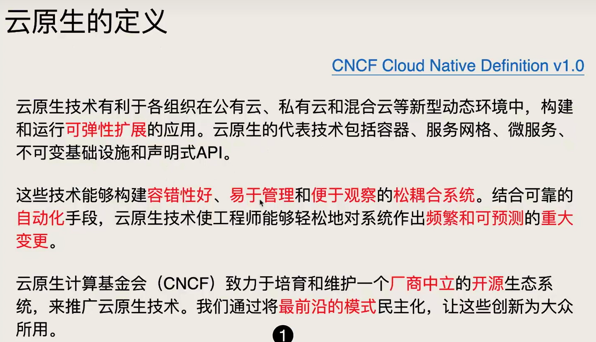
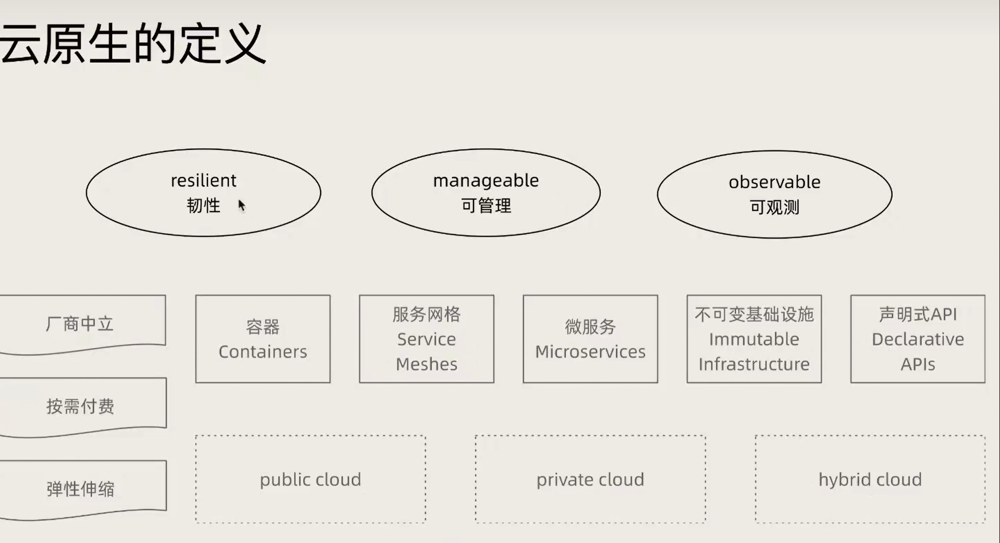
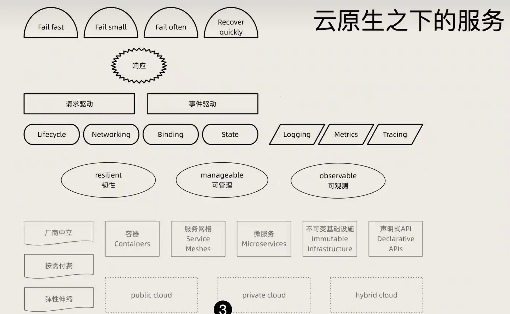
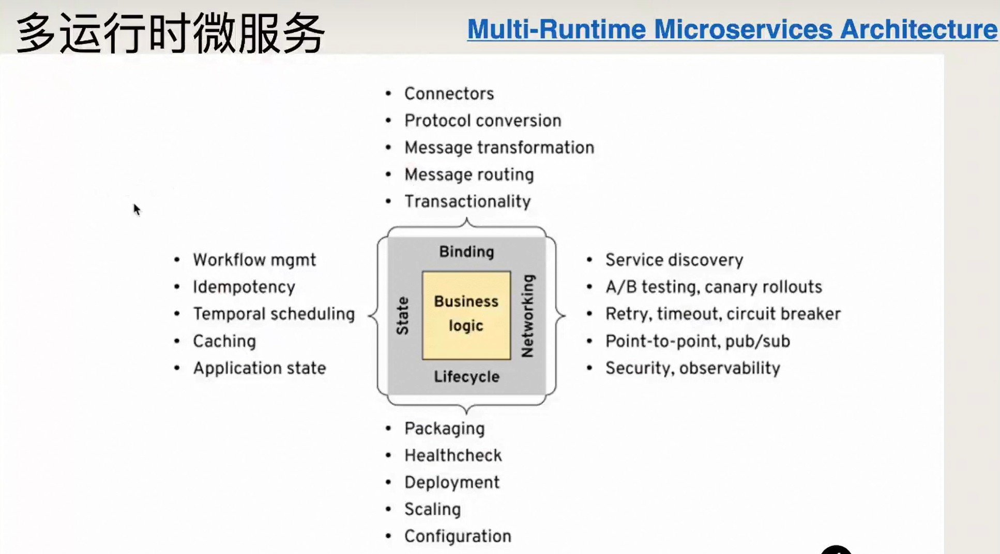
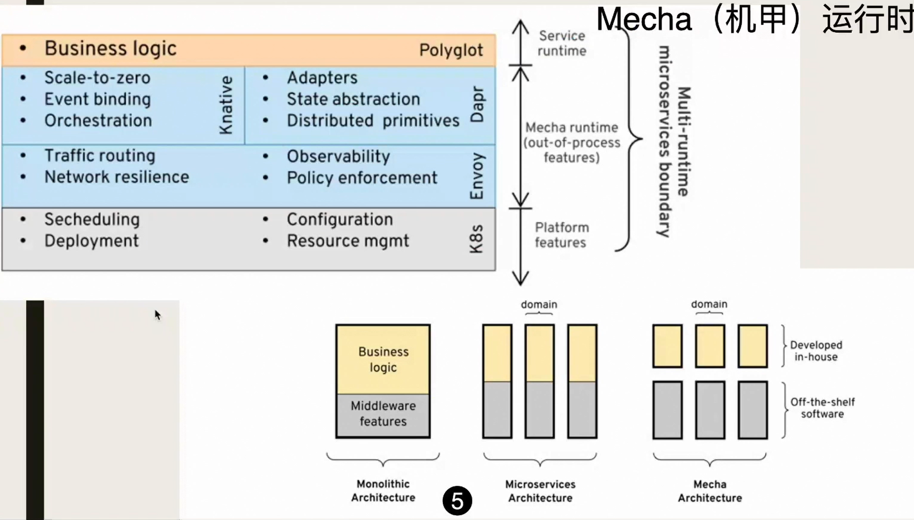
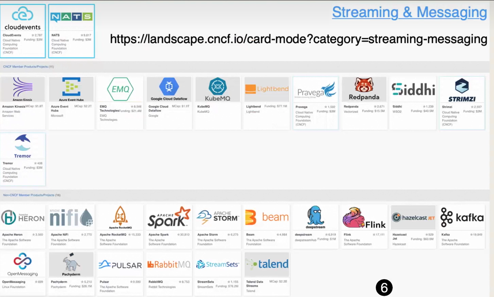
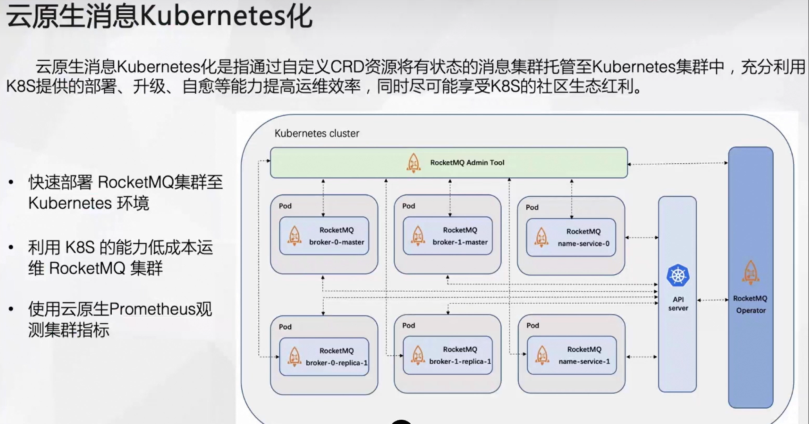
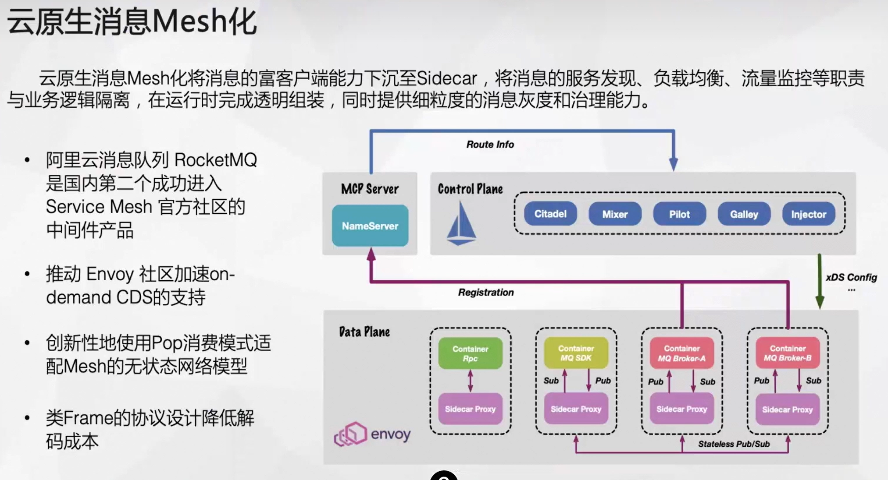
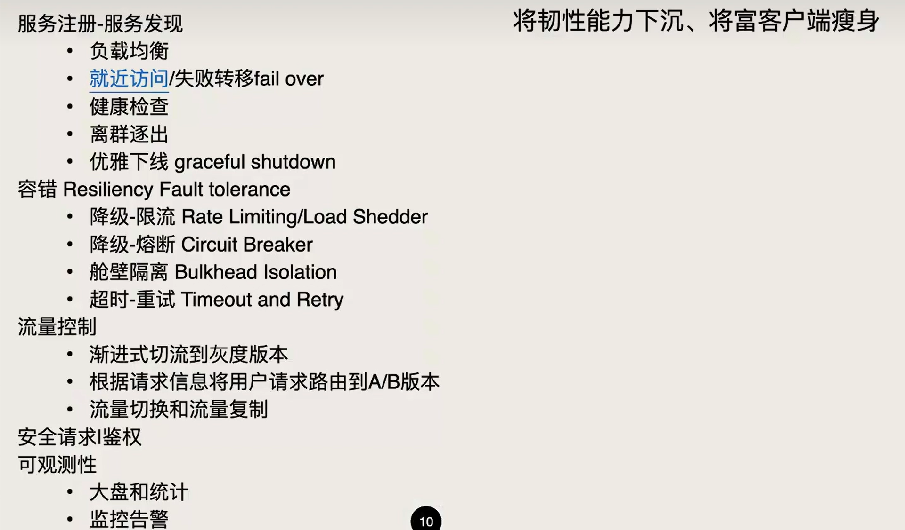

# 云原生

# 参考

- 云原生之下，RocketMQ之上： https://www.bilibili.com/video/BV1Rb4y1y7Mc
- dapr：https://zhuanlan.zhihu.com/p/442709959
  - 微软的东西，不靠谱，微软这些年干了多少类似的事情都没有成功过
- OpenTracing 详解： https://blog.csdn.net/eight_eyes/article/details/117330608
- 代理层
  - 在Kubernetes上对Envoy代理，HAProxy和NGINX性能进行基准测试 ：https://www.sohu.com/a/377973545_120106620
- Multi-Runtime Microservices Architecture
  - 多运行时微服务架构：作者Bilgin Ibryam，Red Hat首席架构师
  - 英文：http://www.ofbizian.com/2020/05/multi-runtime-microservices-architecture.html
  - 中文：https://www.jianshu.com/p/7f6634b3695d

# 基础概念

# 消息中间件

## cncf

## k8s化

