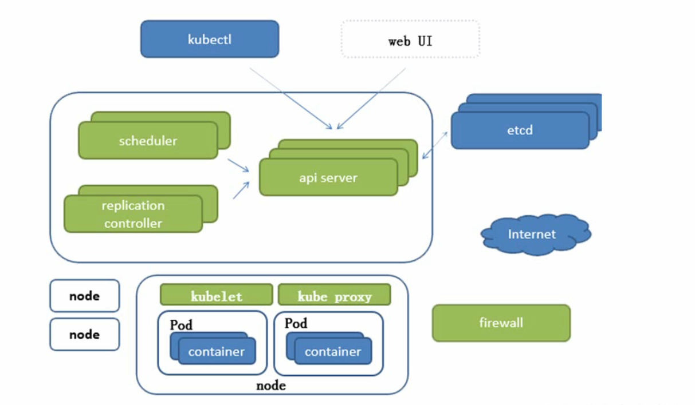
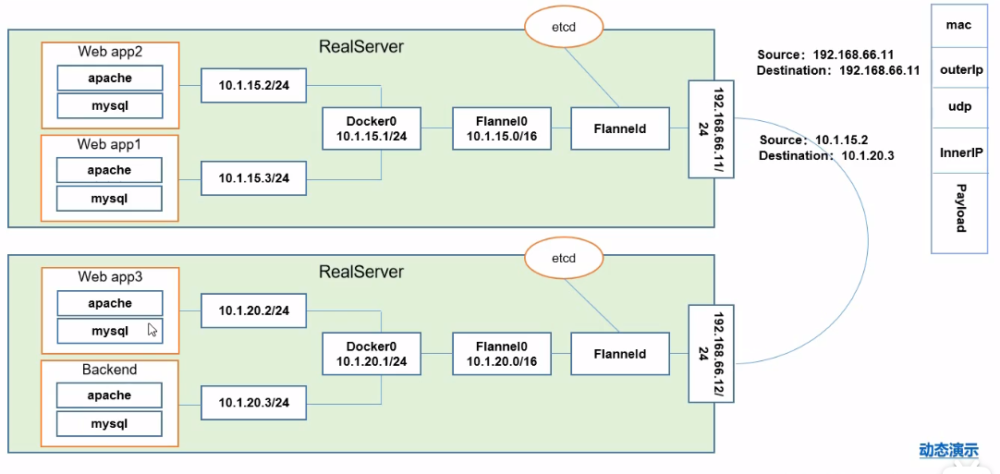
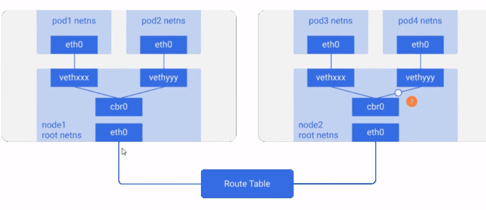
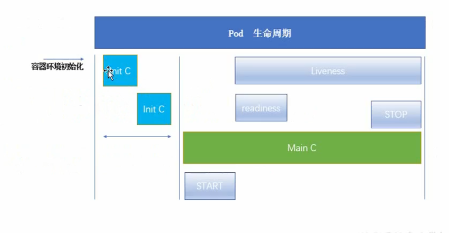
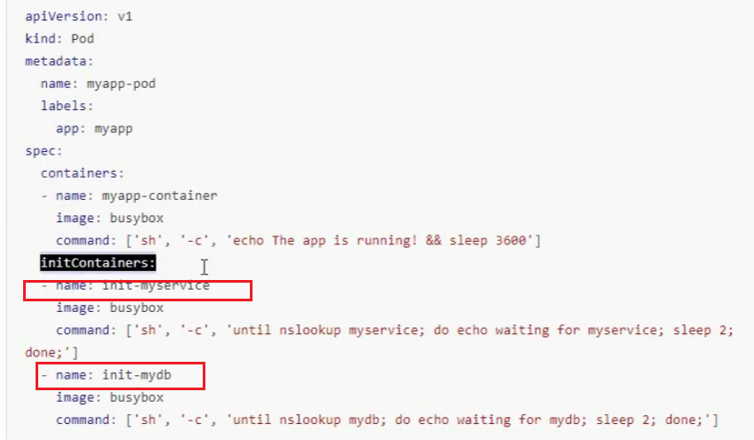

# K8S学习笔记

### 基本原理



#### 三种接口访问方式提供方式

- web ui
- kubectrl命令行
- 配置文件（yaml）

#### ETCD

- v3版本支持持久化，k8s v1.11版本开始支持
- wal + snapshot

#### 基础容器pause

- 基本原理：给目标容器提供名字空间：共享给目标容器？https://www.cnblogs.com/guigujun/p/10556508.html

### POD

#### 分类：大类

- 自主式pod：

- 控制器管理的pod

  


#### Deployment / ReplicaSet/ ReplicationCtronller(已弃用)

ReplicationCtronller + Label Selector = ReplicaSet + RollUpate = Deployment 

滚动更新：新建一个ReplicaSet ，新增一个新版本的pod、去掉老的ReplicaSet里面的老版本的pod，支持错误回滚，操作相反

#### StatefulSet

- 稳定的持久化存储：pv/pvc
- 稳定的网络标志：Service：PodName/HostName不变，基于Hostlesss Service（非cluster IP形式）的service实现
- 有序部署/有序收缩

#### DaemonSet

- 基于node：一个node（或者部分，通过标记污点）一个实例，agent类的部署
- 典型场景：存储能力管理、日志收集、配置中心、监控数据收集exporter

#### Cron Job

- 基于时间的运行的JOB（指定时间、周期执行）
- 一个或多个pod执行、失败可以重试
- 场景：备份数据

### Service

#### 基本概念

- 通过标签选择pod实例
- 通过IP、port对外暴露服务
- 通过round robin对外提供服务（这个应该是默认的，看看其他选择方式的支持情况？）
- 通过NodePort方式暴露的服务，所有的node都i可以访问对应端口

### 网络

#### 基本概念

- 三级网络：service网络（虚）、pod网络（虚）、node网络（实）
- 同一个pod里面的容器之间：lo，localhost，一个网络设备访问
- 各个pod之间：overlay network
- Pod与Service之间的通信：各节点的iptables规则（kubeproxy负责实施），LVS（新版本）

#### 常见网络方案

- 通过CNI接口实现、扁平化网络
- Flannel方案：

#### Flannel方案





- 同一主机POD通信：通过本机的虚拟网桥（docker0）
- 不同主机POD之间通信：Flannel0基于etcd获取路由信息，通过FlannelD这个进程UPD转发到目标机器的FlannelD，解消息头，通过flannel0转发到Docker0到目标容器
- POD访问外网：常规的NAT
- 外网访问POD：服务暴露，Service，如NodePode
- ETCD：存储管理可分配的IP地址段资源；监控etcd中每个pod的实际地址，并在内存中建立维护pod节点路由表

### 安装

#### 基本概念

- 基础组建：harbor（本地仓库）、master节点、node节点、router

- 大多数采用kubeadm进行自动化安装：google

- router：koolshell，科学上网：https://github.com/koolshare/koolshare.github.io

- 运行环境：centos 7以上，内核3.1以上，建议4.4内核以上

- vmware网络：HostOnly（仅主机，用于虚拟机之间访问）、NAT（上外网，可以用过router代理上网）

- 本地方式安装镜像包

  ```bash
  #!/bin/bash
  ls /root/kubeadm-basic.images -> /tem/img-list.txt
  cd /root/kubdadm-basic.images
  for i in $(cat /tmp/image-list.txt)
  do 
  	docker load -i $i
  done
  
  rm -rf /tmp/image-list.txt
  ```

  - 配置

    - kubelet配置： /var/lib/kubelet/config.yaml 
    - 主要目录： /etc/kubernetes/
    - docker配置：/etc/docker/daemon.json 

    

  

  

### 资源清单

#### 大的分类

- 名称空间级别
  - 工作负载型资源： pod、ReplicaSet、Deployment、StatefulSet、Job、CronJob
  - 服务发现、负载均衡资源：Service、Ingress。。。
  - 配置与存储型资源：Volume、CSI
  - 特殊类型的存储卷：ConfigMap、Secret、DownwardAPI
- 集群级别：role、namespace、node、ClusterRole、RoleBinding、ClusterRoleBinding
- 元数据级别：HPA、PodTemplate\LimitRange

#### yaml语法

##### 基本语法

- 不允许tab，只允许空格
- 缩进个数不重要，只要相同层级的左侧对齐即可
- #标识注释，后面的全部忽略掉
- 冒号后面要空格

##### 数据结构

- 对象：键值对，映射（mapping）、 哈希(hashes)、字典（dictionary），冒号表示

```yaml
name: Steve
age: 18
hashi: {name: steve, age: 18}
```

- 数组：列表(list)

```yam
animal
- cat
- dog

animal: [cat, Dog]
```


- 标量（scalars）：单个不可分割的值

```yaml
# 字符串、布尔值、整数、 浮点数 null（~表示）、时间（IS8601格式）
number: 12.30
isSet: true
parent: ~
iso8601: 2001-12-14t21:59:43.10-05:00
date: 1976-07-31
#强制类型转换(两个感叹号)
e: !!str 123
f: !!str true

```

- 字符串

```yaml
str: 字符串
str1: '内容： 包含特殊字符要用单引号'
str2: '包含单引号的''，用两个单引号'
#单引号会对特殊字符（如\n）转译，双引号不会
# 字符串可以携程多行，从第二行开始，必须有一个单空格缩进，换行符被转为空格
str3: 这是
 一段
 多行文字
#多行字符串可以通过|或者>表示换行
this: |
 Foo
 bar
that: >
 Foo
 bar
 # +号删除末尾的换行(默认值)，-号删除末尾的换行
 S1: |
  Foo
 S2: |+
  Foo
 S3: |-
  Foo
```

#### 字段解释

- apiVersion：字符串，API版本，目前基本是V1，可以用Kubectl api-versions命令查看

- kind：字符串，资源类型，如：Pod

- metadata：对象： 元数据对象，固定值就写metadata

  - name:字符串，如Pod的名字
  - namespace：命名空间，默认为default
  - labels：标签，对象

- spec：对象，固定值写spec

  - restartPolicy： 

    - Always：默认值，一旦运行，如果停止就会尝试重启它，有尝试上限
    - OnFailure：错误（退出码非零）重启，正常不重启
    - Never：不会重启，kubelet之上报错误给Master

  - nodeSelector：如何根据标签选择node，对象，键值对

  - imagePullSecret：对象，kv，拉取镜像时的secret名称

  - hostNetwork：布尔类型，默认为false，是否使用主机网络，tue将不能在同一主机部署两个实例

  - containers[]：list类型（数组），容器列表

    - name：字符串，容器的名字，不写会随机创建
    - image：字符串，镜像的名字
    - imagePullPolicy：字符串，三个策略，默认Always
      - Always： 每次拉新镜像
      - Never： 使用本地镜像
      - IfNotPresent：优先本地，没有拉远程

    - command[]：列表，容器启动命令
    - args[]：列表，容器启动参数，可以指定多个
    - workingDir：字符串 ，容器的工作目录
    - volumeMounts[]：容器内部的存储间配置
      - name：字符串，卷名称
      - mountPath：字符串，被挂在的卷的磁盘路径
      - readOnly：布尔型， 默认为false，读写模式
    - ports[]：容器需要用到的端口列表
      - name：端口名称
      - containerPort：需要监听的端口号
      - hostPort：映射到主机上需要绑定的端口，默认与ContainerPort一样，多副本在单机上有问题
      - protocol：TCP（默认）/UDP
    - env[]： 环境变量列表
      - name：变量名
      - value：值
    - resources： 资源限制信息
      - limits： 容器运行时的资源上限
        - cpu：单位为core
        - memory： 内存大小，定单位为MIG、GIB
      - requests：容器运行时的资源设置
        - cpu：单位为core，容器启动时出事化可用数量
        - memory：内存数量
    
         
### 容器生命周期
#### 基本创建过程

- kubectl 向apiserver发送指令、申请资源（etcd）调度到对应的kubelet、
- kubelet 操作cri，完成容器环境初始化（可能多个容器环境）：先创建pause容器（网络、存储空间共享），多个initC容器初始化（顺序执行），启动主容器（MainC）内的命令（start），
- readless（检测成功，容器状态为running）、liveness（与容器状态不一致，或重启、重新创建容器）
- 退出前执行stop命令

​    

####     Init容器

- 运行直到成功，多个init容器顺序执行，执行成功后会退出
- 如果POD的restartPolicy == Always（默认值），init容器运行失败会不断重启pod；为Never则不会                                                                                                                                                                                                                                                                                                                                                                                                                                                                                                                                                                                                                                                                                                                                                                                                                                                                                                                                                                                                               
- init容器的镜像是单独的，有如下优势：
  - 运行安全级别更高的实用工具，不建议在应用镜像里面执行的工具
  - 为应用程序镜像减负，保证其稳定性（大小，运行质量）
  - 逻辑分层：一层创建（环境）、一层执行（主逻辑）
  - 权限更高：使用的是主机的名字空间，具有访问Secret权限
  - 充当协调器：检查并行执行的先决条件（pod内、外的其他容器是否ready、）是否完成再启动MainC

​    
  - spec修改被限制在image字段，其他字段修改无效，修改image字段会重启pod
  - init容器和应用容器除了readinessProbe字段外，其他基本都可以
  - 容器的名字空间：与应用容器的空间在一起，不能冲突
  - 多个initc可以共用端口，以为他们是顺序执行并退出的

#### 探针

- kubelet对容器进行的定期诊断，有三种类型
  - ExecAction：进入容器内执行指定命令，返回码为0则成功
  - TCPSocketAction： 检测端口是否存在，打开连接为成功，telnet
  - HTTPGetAction：制定端口和路径上容器的IP地址执行HTTP Get，判断是否成功（返回码>=200, <400)
- 返回状态
  - 成功：通过
  - 失败：未通过
  - 未知：失败，不会执行任何操作
- 探测场景
  - livenessProbe：容器是否存活，失败则杀死容器，容器会受重启策略额影响。如果不提供这个探针，默认为成功
  - readiness：是否准备提供服务。如果失败，端点控制器将从pod匹配的所有service的短点钟删除该pod的ip地址。如果不提供，默认为成功


​    

​    

​    

​    

​    

​    

