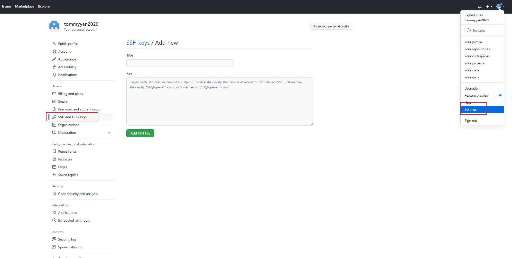
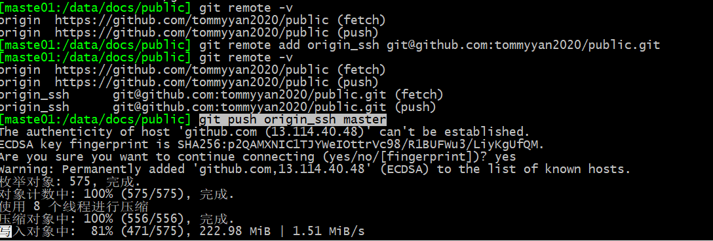
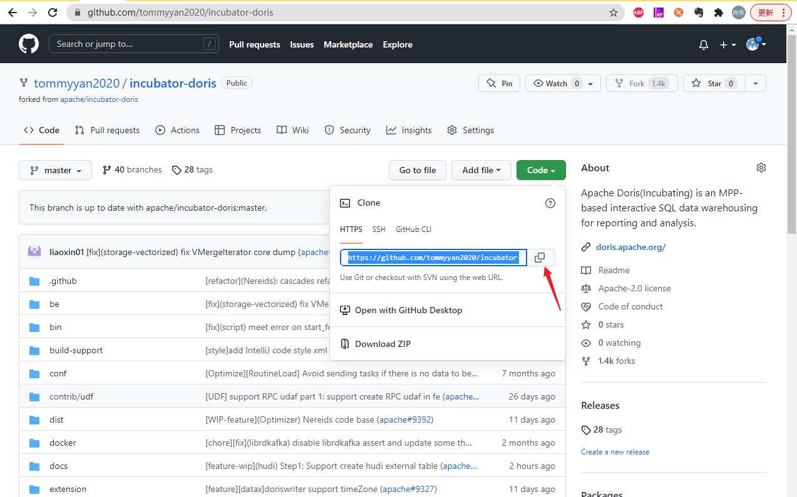
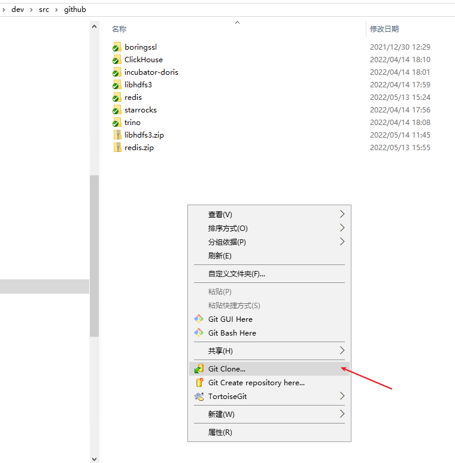
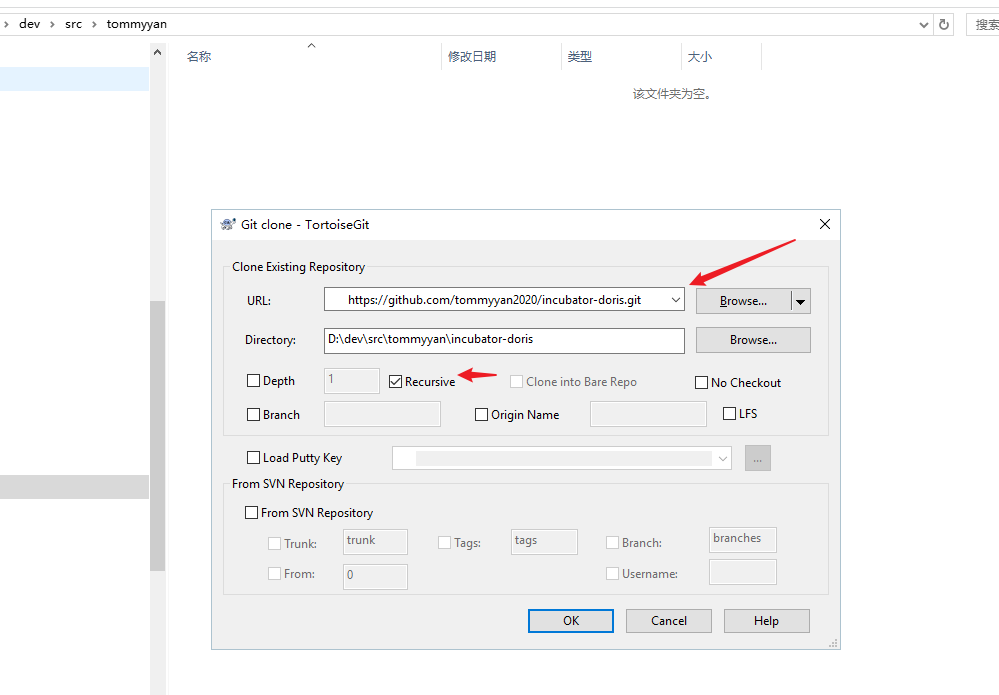
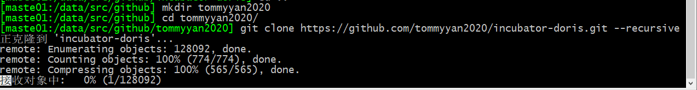

# git相关


## 常用命令

### 添加文件

```bash
# 添加目录下所有文件
git add .

```


## github

### 参考

- github--pr 详细步骤 https://blog.csdn.net/qianfengkui/article/details/110820779
- github提交pr https://blog.csdn.net/gentleman_hua/article/details/123816150
- Github 使用经典问题：如何同步 fork 项目原仓库的更新 https://zhuanlan.zhihu.com/p/291845721

### 免密登录

- 教程：https://www.bilibili.com/video/BV1a34y1s7qV

- 注意这个key 是公钥,pub结尾那个




```bash
 git remote add origin_ssh git@github.com:tommyyan2020/public.git
 git push origin_ssh master
```



### 参与开源项目开发

#### 1 Fork项目到自己github账号下




#### 2、clone到本地

- windows





​	一般要记得把Recursive选上，不然依赖的项目不会拉下来，编译可能不能通过

- linux

```bash
git clone https://github.com/tommyyan2020/incubator-doris.git --recursive
```


