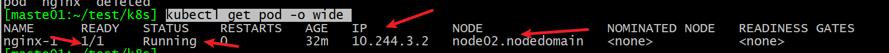
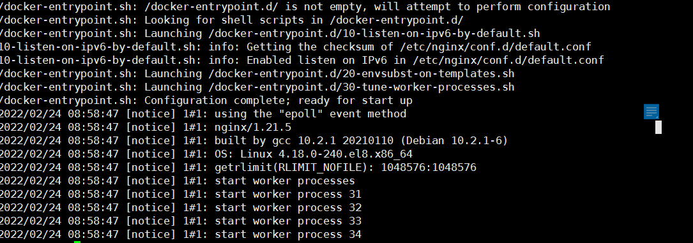
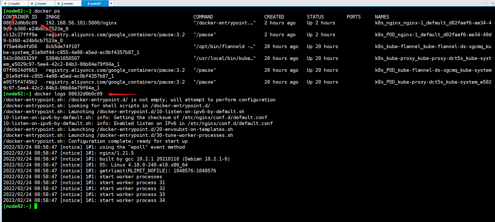

# Nginx K8S容器化部署实战

## 1 镜像准备

### 1.1 搭建本地镜像仓库

#### 1.1.1 安装/启动registry服务

事先用registry搭建一个本地镜像仓库：本地已经弄好-> http:192.168.56.101:5000

详细教程在这里：https://www.cnblogs.com/gcgc/p/10489385.html

```bash
# master节点上搭建一个镜像仓库
docker pull registry
docker run -d -v /opt/registry:/var/lib/registry -p 5000:5000 --restart=always --name registry registry:latest
```

#### 1.1.2 配置访问本地仓库

- 操作范围：所有node节点
- 配置/etc/docker/daemon.json，增加："insecure-registries":["192.168.56.101:5000"]
- 重启docker服务

```bash
# 路径 ： /etc/docker/daemon.json
{
"registry-mirrors": ["https://fl791z1h.mirror.aliyuncs.com"],
#这一行是新增的
"insecure-registries":["192.168.56.101:5000"]
}

systctl restart docker
```


### 1.2 准备nginx镜像

```ba
# 从docker官网下载
docker pull nginx
# 重新tag到本地仓库,目标需要加上本地仓库地址
docker tag nginx:latest 192.168.56.101:5000/nginx:lastest
# 推送到本地仓库，便于所有node可以访问、下载
docker push 192.168.56.101:5000/nginx:lastest
```

## 2 启动nginx实例

### 2.1 启动实例

```bash
kubectl apply -f nginx-1.yaml
```

nginx-1.yaml如下:

```yaml
apiVersion: v1
kind: Pod
metadata:
  name: nginx-1
  labels:
    run: nginx
    group: !!str1
spec:
  containers:
    - name: nginx
      image: 192.168.56.101:5000/nginx:latest
```

碰到一个小问题，labels字段必须为字符串，如果是数字用!!str转换为字符串

### 2.2 查看状态

#### 2.2.1 基本信息

```bash
kubectl get pod -o wide 
```



- READY：所有容器实例都是OK的

- STATUS：running

- IP：对应的pod的IP，本例为10.244.3.2

- NODE： pod所在的node节点


#### 2.2.2 查看日志

- kubectl 方式

```bash
kubectl logs  nginx-1
# --tail n : 最后几行
# -n namespace : 指定实例的名字空间
# -c 指定pod里面的容器名，多个容器时有用

```



- docker方式

  需要找到镜像所在的node节点，上去找到对应的containner id

  ```bash
  docker logs 08632d0b0c09
  ```

  


