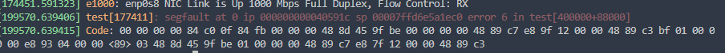
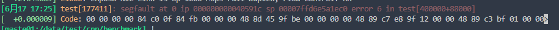
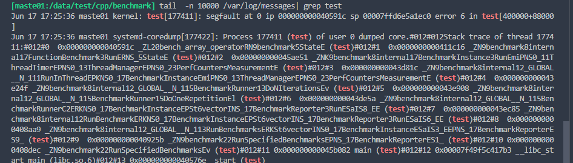
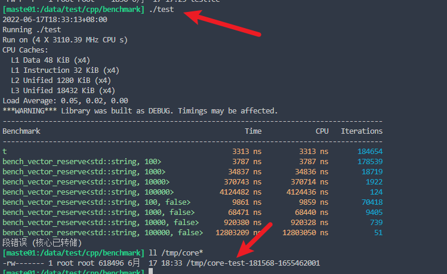
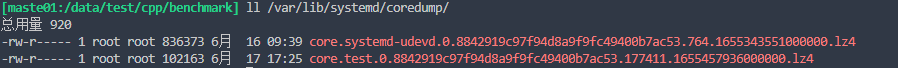

# 调试

## 参考

- gdb调试详解 https://blog.csdn.net/daaikuaichuan/article/details/89791255?spm=1001.2014.3001.5502

## core文件

### 参考

- core文件去哪里了：https://zhuanlan.zhihu.com/p/424222735

### 是不是真的core了

- dmesg

```bash
dmesg
dmesg -H
```





- 通过message日志

```bash
tail  -n 10000 /var/log/messages| grep test
```



### 排查是否core文件大小限制

```bash
# 查看，如果已经是unlimited则不用管
ulimit -c
# 设置，用户的profile（~/.profile）或者系统的profile(/etc/profile)
ulimit -c unlimited
```

### 保存位置排查

```bash
# 查看core_pattern 配置:(如果配置了路径，需要检查保存路径是否有写权限)
cat /proc/sys/kernel/core_pattern
# 默认可能是这样的
|/usr/lib/systemd/systemd-coredump %P %u %g %s %t %c %h %e
# 修改core文件到当前路径
echo  "core-%e-%p-%t" > /proc/sys/kernel/core_pattern
# 修改core文件到推荐路径，推荐，可以方便清理
echo "/tmp/core-%e-%p-%t" >/proc/sys/kernel/core_pattern
# 永久生效
vim /etc/sysctl.conf
添加一行：kernel.core_pattern=/tmp/core-%e-%p-%t
# 让配置立刻生效
sysctl -p
```




默认情况下，core文件被 /usr/lib/systemd/systemd-coredump 处理， 以LZ4压缩的格式 放在 /var/lib/systemd/coredump/ 目录下



默认情况下没有装lz4，要自行安装

```bash
yum install -y lz4 lz4-devel
#压缩 (默认解压之后的名称filename.lz4)
lz4 filename       

#解压缩
lz4 -d filename.lz4
```

- 参考：http://t.zoukankan.com/kevingrace-p-10271581.html

### 调试core

- 参考 https://emmymiao87.github.io/jekyll/update/2021/09/01/MemTracker%E5%86%85%E5%AD%98%E9%87%8A%E6%94%BE%E9%97%AE%E9%A2%98.html

```bash
打开 core 栈：gdb lib/palo_be core.xxx
打开调用栈: bt
进入其中一层：frame 1
打印值：p *((类型*)地址)
调试相关：b 断点，r 从头运行，c continue，n 单步，s step in
```


# 系统

## 文件

### 文件个数统计

-  当前目录下每个子目录的文件数量 

```bash
find . -maxdepth 1 -type d | while read dir; do count=$(find "$dir" -type f | wc -l); echo "$dir : $count"; done
```


- 文件个数

  - 包括子文件夹里的 

  ```bash
  ls -lR|grep "^-"|wc -l
  ```

  - 不包含子文件夹

  ```bash
  ls -l |grep "^-"|wc -l
  ```

  - 某个特定文件的

  ```bash
  find . -name filename | wc -l
  find -name "*.js" | wc -l
  ```

  

-  目录个数

  - 包括子文件夹里的 

  ```bash
  ls -lR|grep "^d"|wc -l
  ```

  

  - 包括子文件夹里的 

  ```bash
  ls -l |grep "^d"|wc -l
  ```

  

## 目录

#### 


### tree

```bash
# 只显示目录，最多显示三层子目录
tree -d -L 3
```


## 日期时间

- timestamp转日期时间

```bash
date -d@1647918518
```


查看目录下文件大小

```bash
du -sh .[!.]*
```

## 服务

### 所有已经启动的服务

```bash
systemctl list-unit-files | grep enabled
```


# 文本

# 系统控制


## 未分类

### 文件打开个数

```bash
# 查看最大文件个数
ulimit -n

#修改最大打开文件个数
echo ulimit -HSn 65536 >> /etc/rc.local
echo ulimit -HSn 65536 >>/root/.bash_profile
ulimit -HSn 65536

```


# 网络

查看TCP链接情况

```bash
netstat -n | awk '/^tcp/ {++S[$NF]} END {for(a in S) print a, S[a]}'
```


