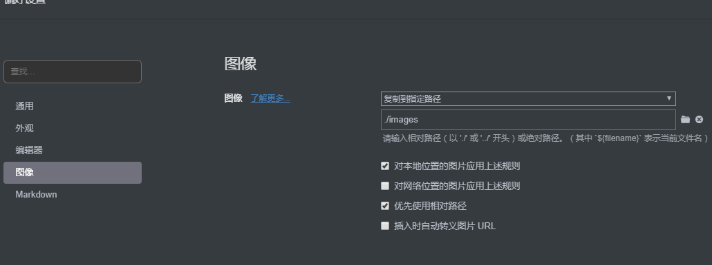
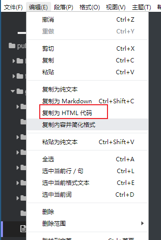

# Markdown的一些心得总结


## 1 书写工具

### 1.1 Typora


### 1.2 vscode


## 2 格式转换

### 2.0 教程

-  一键将 Word 转换为 Markdown：   https://www.jianshu.com/p/df6a136d06d8
-  借助Writage，将 Word 转换为 Markdown发表csdn博客 https://blog.csdn.net/weixin_43671497/article/details/85176155
-  最完善的markdown转html/pdf方法、带目录生成 https://blog.csdn.net/weixin_38601833/article/details/94585595

### 2.1 to doc ：writage

#### 2.1.1 链接资源

- 官方网站： [http://www.writage.com/](https://links.jianshu.com/go?to=http%3A%2F%2Fwww.writage.com%2F) 

#### 2.1.2 要点

- 直接用word打开markdown文件，然后可以另存为docx格式
- 如果是从typora来，注意图像的保持路径设置，便于分发



### 2.2 from doc ： Pandoc

目前暂时没有用到，就没去研究了

#### 2.2.1 链接资源

- 官网：https://pandoc.org/installing.html

### 2.3 to HTML

#### 2.3.1 typora



这里要注意大部分都不支持的flow类型，这里有解决方案

- 为markdown添加语法着色  https://www.cnblogs.com/yangliguo/p/7801116.html
- [本站的例子](/general/flow.html ":ignore")


## 3 例子

### 3.1 flow流程图


```flow
st=>start: Start
e=>end
op=>operation: My Operation
cond=>condition: Yes or No?

st->op->cond
cond(yes)->e
cond(no)->op
```

