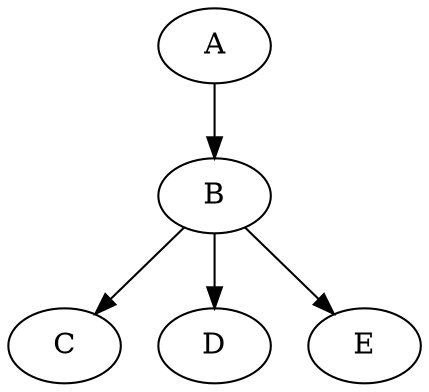
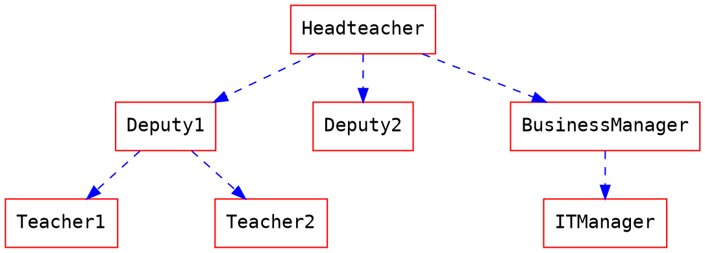
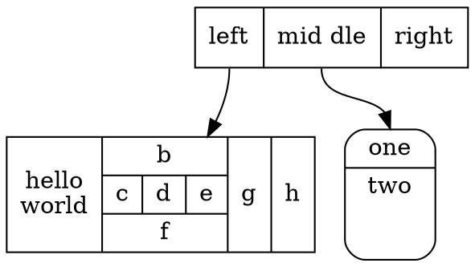
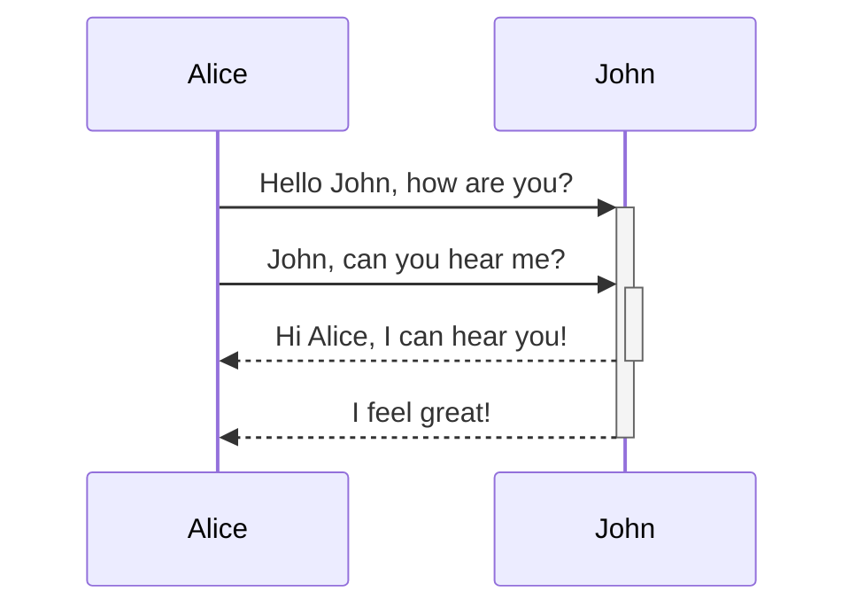

# CentOS搭建基于docsify的文档系统

## 参考网站

- 官方网站：https://docsify.js.org/#/zh-cn/language-highlight
- GitHub：https://github.com/docsifyjs/docsify/
- 代码高亮：https://cdn.jsdelivr.net/npm/prismjs@1/components/
- docsify定制化插件：https://blog.csdn.net/Lonelyooacz/article/details/103490545
- 使用docsify并定制以使它更强大 https://blog.csdn.net/weixin_30399055/article/details/97598957
-

## 安装docsify的环境

### 第一步 确认inotify的文件打开个数

```bash
// 查看
cat /proc/sys/fs/inotify/max_user_watches
//修改 /etc/sysctl.conf 增加一行
fs.inotify.max_user_watches=524288
//生效
sudo sysctl -p
```

### 第二步 安装node环境

docsify依赖于node环境，安装包通过npm管理，centos下可以直接通过yum安装相关环境。

```bash
yum -y install nodejs
```

### 第三步 安装docsify

官方文档讲的很详细了：https://docsify.js.org/#/zh-cn/quickstart

```bash
#官方给定命令
npm i docsify-cli -g

docsify init ./docs
nohup docsify serve docs &
#开机启动，将上面那个命令加到 /etc/rc.d/rc.local
```

## 第四步 配置docsify

官方文档比较详细，要注意index.html里面的引用库的路径的写法，不然很多功能（代码高亮）无法生效，可以参考帮助文档的源代码写。

```javascript
    <script src="//cdn.jsdelivr.net/npm/docsify@4/lib/docsify.min.js"></script>
    <script src="//cdn.jsdelivr.net/npm/docsify@4/lib/plugins/search.min.js"></script>
    <script src="//cdn.jsdelivr.net/npm/prismjs@1/components/prism-bash.min.js"></script>
    <script src="//cdn.jsdelivr.net/npm/prismjs@1/components/prism-javascript.min.js"></script>
```

## 更多

```bash
#不过这个命令得到的docsify版本未4.4.3，4.6之后才支持嵌入所有文件，先指定版本安装
# npm 查看模块全部版本
npm view docsify-cli versions
# npm 升级指定版本
npm install docsify-cli@4.xx.xx
```

## 测试
### LaTex数学公式
- LaTeX 中插入数学公式 https://blog.csdn.net/weixin_42373330/article/details/89785443

```tex
       E=mc^2
        
        f(x) = x^ 2

        f(x,y) = \frac{x^2}{y^3}

        f(x,y) = \sqrt[n]{{x^2}{y^3}} 
         
         A=\left[ \begin{matrix}
   a & b  \\
   c & d  \\
\end{matrix} \right] 
```

### 支持DOT语言作图
- DOT语言画图工具 https://blog.csdn.net/xyz_dream/article/details/88953146
- 使用DOT语言和Graphviz绘图(翻译) https://www.cnblogs.com/itzxy/p/7860165.html



### 支持mermaid语言作图
- 官方文档：https://mermaid-js.github.io/mermaid/#/n00b-gettingStarted
- 在线练手网站：https://mermaid-js.github.io/mermaid-live-editor
- Mermaid，就像用 Markdown 码字一样，高效制作简易流图：https://sspai.com/post/63055?ref=weibo




### flow支持
- github上的这个例子不好用 https://github.com/gengzi/Code-animal/blob/master/index.html

```flow
st=>start: Start|past:>http://www.google.com[blank]
e=>end: End:>http://www.google.com
op1=>operation: get_hotel_ids|past
op2=>operation: get_proxy|current
sub1=>subroutine: get_proxy|current
op3=>operation: save_comment|current
op4=>operation: set_sentiment|current
op5=>operation: set_record|current

cond1=>condition: ids_remain空
cond2=>condition: proxy_list空
cond3=>condition: ids_got空
cond4=>condition: 爬取成功
cond5=>condition: ids_remain空
io1=>inputoutput: ids-remain
io2=>inputoutput: proxy_list
io3=>inputoutput: ids-got
```
!>alert
