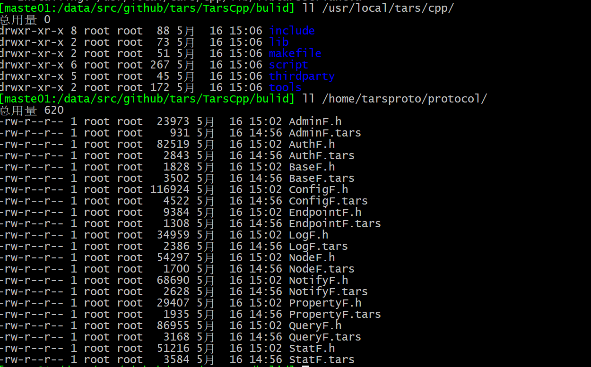

- 官方文档：https://doc.tarsyun.com/#/base/tars-intro.md

# c++ 编译环境

教程：https://www.bilibili.com/video/BV1ZK4y1m7UE

```bash
git clone https://github.com/TarsCloud/TarsCpp.git --recursive
cd TarsCpp/
mkdir -p bulid
cd build
cmake ..
make -j4
make install
# 主要安装目录
# /usr/local/tars/cpp
# /home/tarsproto/protocol

#创建一个项目模板并
 /usr/local/tars/cpp/script/cmake_tars_server.sh  TestApp HelloServer Hello
```



