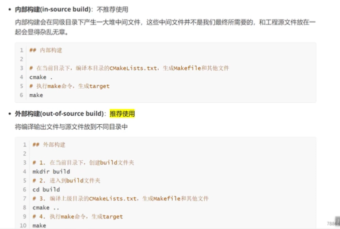

# 使用cmake

## 参考

- 官网：https://cmake.org/
- 官方文档：https://cmake.org/cmake/help/latest/
- 视频：https://www.bilibili.com/video/BV1fy4y1b7TC?p=16
- 教程：https://blog.csdn.net/fddnihao/article/details/117328165
- 教程：https://blog.csdn.net/fddnihao/article/details/117370344
- 教程：https://www.csslayer.info/wordpress/cmake/cmake-find-package/ https://github.com/fcitx/fcitx5/blob/master/cmake/FindLibIntl.cmake

## 基本语法

- 参数使用花括号括起来
- 参数之间使用空格或分号分隔
- 指令（函数）大小写无关
- 参数/变量大小写有关
- 变量使用$()取值，但是if控制语句中不用，直接写变量名

## 项目相关命令

### cmake_minimum_required 

- 指定CMake的修小版本要求

```cmake
cmake_minimum_required(VERSION 3.5)
```

### project

- 指定项目信息

```cmake
project(gtest_sample)
```

### set

- 显示的定义变量

```cmake
set(INSTALL_DIR ${CMAKE_SOURCE_DIR}/install)
set(SRC sayhello.cpp hello.cpp)
```

###  include_directories 

- 头文件的搜索路径

```cmake
include_directories(${CMAKE_SOURCE_DIR}/mul ./include)
```

### link_directories

- 向工程添加多个特定的库文件搜索路径--->相当于指定g++编译器的-L参数
- 语法:link directories(dir1 dir2…)

```cmake
link_directories(/usr/1ib/my1ibfo1der1ib)
```

###  add_library

- 编译成一个库
- 可以是静态库也可以是动态库

```cmake
# 编译生成一个动态库
add_library(div SHARED ${DIV_SRCS})
# 编译生成一个静态库
add_library(mul STATIC ${MUL_SRCS})
```

### add_compile_options

- 增加编译选项

```cmake
if (MSVC)
    # warning level 4 and all warnings as errors
    add_compile_options(/W4 /WX)
else()
    # lots of warnings and all warnings as errors
    add_compile_options(-Wall -Wextra -pedantic -Werror)
endif()
```

### add_executable

- 增加编译生成的可执行程序
- 用法：add_executable(<name> [WIN32] [MACOSX_BUNDLE]
                 [EXCLUDE_FROM_ALL]
                 [source1] [source2 ...])

```cmake
add_executable(sample1  samples/sample1.cc samples/sample1_unittest.cc)
```

### target_link_libraries

- 将依赖库和目标程序链接成最终的可执行程序、动态库等
- 用法：target_link_libraries(<target> ... <item>... ...)

```cmake
target_link_libraries(sample1 gtest_main gtest pthread) 
```

### add_subdirectory

- 将一个子项目加入进来，这个子项目里面包含CMakeLists.txt
- 语法：add_subdirectory(source_dir [binary_dir] [EXCLUDE_FROM_ALL])

```cmake
if(BUILD_GMOCK)
  add_subdirectory( googlemock )
else()
  add_subdirectory( googletest )
endif()

```

### add_dependencies

- 指定项目之间的依赖关系，避免依赖的项目后编译

###  aux_source_directory 

- 查找目录下的所有文件，到一个变量

- 语法：aux_source_directory(<dir> <variable>)

```cmake
  #查找当前目录下的所有源文件
  #并将名称保存到ALL_SRCS变量
  aux_source_directory(. ALL_SRCS)
```

### target_link_directories 

- 指定库的路径：相当于编译器的-L命令

- 语法

  ```cmake
target_link_directories(<target> [BEFORE]
    <INTERFACE|PUBLIC|PRIVATE> [items1...]
    [<INTERFACE|PUBLIC|PRIVATE> [items2...] ...])
  ```
  
### install

- 指定安装规则（make install）

- 官方：https://cmake.org/cmake/help/latest/command/install.html

- 语法：

  ```
  install(TARGETS <target>... [...])
  install(IMPORTED_RUNTIME_ARTIFACTS <target>... [...])
  install({FILES | PROGRAMS} <file>... [...])
  install(DIRECTORY <dir>... [...])
  install(SCRIPT <file> [...])
  install(CODE <code> [...])
  install(EXPORT <export-name> [...])
  install(RUNTIME_DEPENDENCY_SET <set-name> [...])
  ```

  ```cm
  #安装到指定目录
  install(TARGETS sample1 DESTINATION ${INSTALL_DIR}/)
  ```

install(TARGETS target
        CONFIGURATIONS Debug
        RUNTIME DESTINATION Debug/bin)
install(TARGETS target
        CONFIGURATIONS Release
        RUNTIME DESTINATION Release/bin)        
  ```

## 脚本命令

### include

- 包含另外一个cmake指令文件
- 官方：https://cmake.org/cmake/help/latest/command/include.html

​```cmake
# Defines pre_project_set_up_hermetic_build() and set_up_hermetic_build().
include(cmake/hermetic_build.cmake OPTIONAL)

# Define helper functions and macros used by Google Test.
include(cmake/internal_utils.cmake)
  ```

### option

- 编译时的用户自定义选项/开关
- 语法：option(<variable> "<help_text>" [value])

```cm
option(gtest_build_tests "Build all of gtest's own tests." OFF)
option(gtest_build_samples "Build gtest's sample programs." ON)
option(gtest_disable_pthreads "Disable uses of pthreads in gtest." OFF)
```

message

- 打印一条消息

```cmake
message(STATUS "PROJECT_BINARY_DIR: ${PROJECT_BINARY_DIR}")
```

### include

 Load and run CMake code from a file or module. 

## 环境变量

- 官网：https://cmake.org/cmake/help/latest/manual/cmake-env-variables.7.html

### CMAKE_C_FLAGS 

- gcc编译选项

### CMAKE_CXX_FLAGS

- g++编译选项：

```cmake
# 在CMAKE_CXX_FLAGS编译选项后追加 -std=c++11
set (CMAKE_CXX_FLAGS, "$(CMAKE_CXX_FLAGS) -std=c++11")
```

### CMAKE_BUILD_TYPE

- 编译类型（Debug，Release）

  ```cmake
  1 #设定编译类型为debug，调试时需要选择debug 
  2 set(CMAKE_BUILD_TYPE Debug)
  3 #设定编译类型为re1ease，发布时需要选择release
  4 set(CMAKE_BUILD_TYPE Release)
  ```

### CMAKE_BINARY_DIR

### PROIECT_BINARY_DIR

- build目录：放cmake执行后生成的文件的目录

###  PROJECT_SOURCE_DIR:

- 本项目的顶层的放CMakeLists.txt的目录（如果只有一个项目，则等同于CMAKE_SOURCE_DIR）

### CMAKE_SOURCE_DIR

- 顶层的放CMakeLists.txt的目录

### CMAKE_C_COMPLILER

- 指定c编译器

### CMAKE_CXX_COMPLILER

- 指定c++编译器

### EXECUTABLE_OUTPUT_PATH

- 可执行程序的存放路径

### LIBRARY_OUTPUT_PATH

- 库文件输出的存放路径


## 编译工程

### 两种构建方式

- 推荐创建一个build目录，保存cmake产生的新文件，避免影响原有文件夹




### 编译选项

```bash
 # 查看编译选项
 cmake .. -LH
 # 打开某个编译选项
 cmake .. -DONLY_LIB=ON
 
 # 查看make 的选项
 make help
```


## 项目例子


### 最小工程


```cmake
# set the minimum version of CMake tha can be used
cmake_minimum_required(VERSION 3.0)

# set the project name
project(Hello)

# add an executable
add_executable(hello_cmake main.cpp)


```

### 多目录工程


```cmake
# set the minimum version of CMake tha can be used
cmake_minimum_required(VERSION 3.0)

# set the project name
project(Swap)

# head file path
include_directories(include)

# source directory files to variable
aux_source_directory(src DIR_SRCS)

# add an executable
add_executable(Swap $(DIR_SRCS))

```


###   教程1例子

#### 最简单

```cmake
#指定使用该CMakeList.txt文件需要的cmake最低版本
cmake_minimum_required(VERSION 3.5)
#指定项目信息
project(calculator)

#设置安装目录
set(INSTALL_DIR ${CMAKE_SOURCE_DIR}/install)

#指定生成目标
add_executable(calculator main.cpp)

#安装到安装目录
INSTALL(TARGETS calculator DESTINATION ${INSTALL_DIR}/usr/bin)
```

#### 多个源文件

```ba
├── add.cpp
├── add.h
├── CMakeLists.txt
└── main.cpp
```

```cmake
#指定生成目标，在这里增加文件
add_executable(calculator main.cpp add.cpp)
```

```bash
├── add.cpp
├── add.h
├── CMakeLists.txt
├── main.cpp
├── sub.cpp
└── sub.h
```

```cmake
#指定使用该CMakeList.txt文件需要的cmake最低版本
cmake_minimum_required(VERSION 3.5)
#指定项目信息
project(calculator)

#设置安装目录
set(INSTALL_DIR ${CMAKE_SOURCE_DIR}/install)

#查找当前目录下的所有源文件
#并将名称保存到ALL_SRCS变量
aux_source_directory(. ALL_SRCS)

#指定生成目标
#add_executable(calculator main.cpp add.cpp sub.cpp)
add_executable(calculator ${ALL_SRCS})

#安装到安装目录
INSTALL(TARGETS calculator DESTINATION ${INSTALL_DIR}/usr/bin)
```

#### 动态库&静态库

```ba
├── add.cpp
├── add.h
├── CMakeLists.txt
├── div
│   ├── CMakeLists.txt
│   ├── div.cpp
│   └── div.h
├── main.cpp
├── mul
│   ├── CMakeLists.txt
│   ├── mul.cpp
│   └── mul.h
├── sub.cpp
└── sub.h
```

- mul:静态库

```cmake
#查找当前目录下的所有源文件
#并将名称保存到MUL_SRCS变量
aux_source_directory(. MUL_SRCS)

#生成静态链接库
add_library(mul STATIC ${MUL_SRCS})

#安装到安装目录
INSTALL(TARGETS mul DESTINATION ${INSTALL_DIR}/usr/lib)
```

- div：动态库

```cmak
#查找当前目录下的所有源文件
#并将名称保存到DIV_SRCS变量
aux_source_directory(. DIV_SRCS)

#生成动态链接库
add_library(div SHARED ${DIV_SRCS})

#安装到安装目录
INSTALL(TARGETS div DESTINATION ${INSTALL_DIR}/usr/lib)
```

- 整个项目

```cmake
#指定使用该CMakeList.txt文件需要的cmake最低版本
cmake_minimum_required(VERSION 3.5)
#指定项目信息
project(calculator)

#设置安装目录
set(INSTALL_DIR ${CMAKE_SOURCE_DIR}/install)

#添加子目录
add_subdirectory(mul)
add_subdirectory(div)

#包含头文件目录
include_directories(${CMAKE_SOURCE_DIR}/mul)
include_directories(${CMAKE_SOURCE_DIR}/div)

#查找当前目录下的所有源文件
#并将名称保存到ALL_SRCS变量
aux_source_directory(. ALL_SRCS)

#指定生成目标
add_executable(calculator ${ALL_SRCS})

#添加链接库
target_link_libraries(calculator mul)
target_link_libraries(calculator div)

#安装到安装目录
INSTALL(TARGETS calculator DESTINATION ${INSTALL_DIR}/usr/bin)
```

### googletest

#### 顶层

```cmake
# Note: CMake support is community-based. The maintainers do not use CMake
# internally.

cmake_minimum_required(VERSION 2.8.12)

if (POLICY CMP0048)
  cmake_policy(SET CMP0048 NEW)
endif (POLICY CMP0048)

project(googletest-distribution)
set(GOOGLETEST_VERSION 1.11.0)

if (CMAKE_VERSION VERSION_GREATER "3.0.2")
  if(NOT CYGWIN AND NOT MSYS AND NOT ${CMAKE_SYSTEM_NAME} STREQUAL QNX)
    set(CMAKE_CXX_EXTENSIONS OFF)
  endif()
endif()

enable_testing()

include(CMakeDependentOption)
include(GNUInstallDirs)

#Note that googlemock target already builds googletest
option(BUILD_GMOCK "Builds the googlemock subproject" ON)
option(INSTALL_GTEST "Enable installation of googletest. (Projects embedding googletest may want to turn this OFF.)" ON)

if(BUILD_GMOCK)
  add_subdirectory( googlemock )
else()
  add_subdirectory( googletest )
endif()

```


#### googlletest目录

- cmake/internal_utils.cmake

```cmake
# Defines functions and macros useful for building Google Test and
# Google Mock.
#
# Note:
#
# - This file will be run twice when building Google Mock (once via
#   Google Test's CMakeLists.txt, and once via Google Mock's).
#   Therefore it shouldn't have any side effects other than defining
#   the functions and macros.
#
# - The functions/macros defined in this file may depend on Google
#   Test and Google Mock's option() definitions, and thus must be
#   called *after* the options have been defined.

if (POLICY CMP0054)
  cmake_policy(SET CMP0054 NEW)
endif (POLICY CMP0054)

# Tweaks CMake's default compiler/linker settings to suit Google Test's needs.
#
# This must be a macro(), as inside a function string() can only
# update variables in the function scope.
macro(fix_default_compiler_settings_)
  if (MSVC)
    # For MSVC, CMake sets certain flags to defaults we want to override.
    # This replacement code is taken from sample in the CMake Wiki at
    # https://gitlab.kitware.com/cmake/community/wikis/FAQ#dynamic-replace.
    foreach (flag_var
             CMAKE_C_FLAGS CMAKE_C_FLAGS_DEBUG CMAKE_C_FLAGS_RELEASE
             CMAKE_C_FLAGS_MINSIZEREL CMAKE_C_FLAGS_RELWITHDEBINFO
             CMAKE_CXX_FLAGS CMAKE_CXX_FLAGS_DEBUG CMAKE_CXX_FLAGS_RELEASE
             CMAKE_CXX_FLAGS_MINSIZEREL CMAKE_CXX_FLAGS_RELWITHDEBINFO)
      if (NOT BUILD_SHARED_LIBS AND NOT gtest_force_shared_crt)
        # When Google Test is built as a shared library, it should also use
        # shared runtime libraries.  Otherwise, it may end up with multiple
        # copies of runtime library data in different modules, resulting in
        # hard-to-find crashes. When it is built as a static library, it is
        # preferable to use CRT as static libraries, as we don't have to rely
        # on CRT DLLs being available. CMake always defaults to using shared
        # CRT libraries, so we override that default here.
        string(REPLACE "/MD" "-MT" ${flag_var} "${${flag_var}}")
      endif()

      # We prefer more strict warning checking for building Google Test.
      # Replaces /W3 with /W4 in defaults.
      string(REPLACE "/W3" "/W4" ${flag_var} "${${flag_var}}")

      # Prevent D9025 warning for targets that have exception handling
      # turned off (/EHs-c- flag). Where required, exceptions are explicitly
      # re-enabled using the cxx_exception_flags variable.
      string(REPLACE "/EHsc" "" ${flag_var} "${${flag_var}}")
    endforeach()
  endif()
endmacro()

# Defines the compiler/linker flags used to build Google Test and
# Google Mock.  You can tweak these definitions to suit your need.  A
# variable's value is empty before it's explicitly assigned to.
macro(config_compiler_and_linker)
  # Note: pthreads on MinGW is not supported, even if available
  # instead, we use windows threading primitives
  unset(GTEST_HAS_PTHREAD)
  if (NOT gtest_disable_pthreads AND NOT MINGW)
    # Defines CMAKE_USE_PTHREADS_INIT and CMAKE_THREAD_LIBS_INIT.
    find_package(Threads)
    if (CMAKE_USE_PTHREADS_INIT)
      set(GTEST_HAS_PTHREAD ON)
    endif()
  endif()

  fix_default_compiler_settings_()
  if (MSVC)
    # Newlines inside flags variables break CMake's NMake generator.
    # TODO(vladl@google.com): Add -RTCs and -RTCu to debug builds.
    set(cxx_base_flags "-GS -W4 -WX -wd4251 -wd4275 -nologo -J")
    set(cxx_base_flags "${cxx_base_flags} -D_UNICODE -DUNICODE -DWIN32 -D_WIN32")
    set(cxx_base_flags "${cxx_base_flags} -DSTRICT -DWIN32_LEAN_AND_MEAN")
    set(cxx_exception_flags "-EHsc -D_HAS_EXCEPTIONS=1")
    set(cxx_no_exception_flags "-EHs-c- -D_HAS_EXCEPTIONS=0")
    set(cxx_no_rtti_flags "-GR-")
    # Suppress "unreachable code" warning
    # http://stackoverflow.com/questions/3232669 explains the issue.
    set(cxx_base_flags "${cxx_base_flags} -wd4702")
    # Ensure MSVC treats source files as UTF-8 encoded.
    set(cxx_base_flags "${cxx_base_flags} -utf-8")
  elseif (CMAKE_CXX_COMPILER_ID STREQUAL "Clang")
    set(cxx_base_flags "-Wall -Wshadow -Werror -Wconversion")
    set(cxx_exception_flags "-fexceptions")
    set(cxx_no_exception_flags "-fno-exceptions")
    set(cxx_strict_flags "-W -Wpointer-arith -Wreturn-type -Wcast-qual -Wwrite-strings -Wswitch -Wunused-parameter -Wcast-align -Wchar-subscripts -Winline -Wredundant-decls")
    set(cxx_no_rtti_flags "-fno-rtti")
  elseif (CMAKE_COMPILER_IS_GNUCXX)
    set(cxx_base_flags "-Wall -Wshadow -Werror")
    if(NOT CMAKE_CXX_COMPILER_VERSION VERSION_LESS 7.0.0)
      set(cxx_base_flags "${cxx_base_flags} -Wno-error=dangling-else")
    endif()
    set(cxx_exception_flags "-fexceptions")
    set(cxx_no_exception_flags "-fno-exceptions")
    # Until version 4.3.2, GCC doesn't define a macro to indicate
    # whether RTTI is enabled.  Therefore we define GTEST_HAS_RTTI
    # explicitly.
    set(cxx_no_rtti_flags "-fno-rtti -DGTEST_HAS_RTTI=0")
    set(cxx_strict_flags
      "-Wextra -Wno-unused-parameter -Wno-missing-field-initializers")
  elseif (CMAKE_CXX_COMPILER_ID STREQUAL "SunPro")
    set(cxx_exception_flags "-features=except")
    # Sun Pro doesn't provide macros to indicate whether exceptions and
    # RTTI are enabled, so we define GTEST_HAS_* explicitly.
    set(cxx_no_exception_flags "-features=no%except -DGTEST_HAS_EXCEPTIONS=0")
    set(cxx_no_rtti_flags "-features=no%rtti -DGTEST_HAS_RTTI=0")
  elseif (CMAKE_CXX_COMPILER_ID STREQUAL "VisualAge" OR
      CMAKE_CXX_COMPILER_ID STREQUAL "XL")
    # CMake 2.8 changes Visual Age's compiler ID to "XL".
    set(cxx_exception_flags "-qeh")
    set(cxx_no_exception_flags "-qnoeh")
    # Until version 9.0, Visual Age doesn't define a macro to indicate
    # whether RTTI is enabled.  Therefore we define GTEST_HAS_RTTI
    # explicitly.
    set(cxx_no_rtti_flags "-qnortti -DGTEST_HAS_RTTI=0")
  elseif (CMAKE_CXX_COMPILER_ID STREQUAL "HP")
    set(cxx_base_flags "-AA -mt")
    set(cxx_exception_flags "-DGTEST_HAS_EXCEPTIONS=1")
    set(cxx_no_exception_flags "+noeh -DGTEST_HAS_EXCEPTIONS=0")
    # RTTI can not be disabled in HP aCC compiler.
    set(cxx_no_rtti_flags "")
  endif()

  # The pthreads library is available and allowed?
  if (DEFINED GTEST_HAS_PTHREAD)
    set(GTEST_HAS_PTHREAD_MACRO "-DGTEST_HAS_PTHREAD=1")
  else()
    set(GTEST_HAS_PTHREAD_MACRO "-DGTEST_HAS_PTHREAD=0")
  endif()
  set(cxx_base_flags "${cxx_base_flags} ${GTEST_HAS_PTHREAD_MACRO}")

  # For building gtest's own tests and samples.
  set(cxx_exception "${cxx_base_flags} ${cxx_exception_flags}")
  set(cxx_no_exception
    "${CMAKE_CXX_FLAGS} ${cxx_base_flags} ${cxx_no_exception_flags}")
  set(cxx_default "${cxx_exception}")
  set(cxx_no_rtti "${cxx_default} ${cxx_no_rtti_flags}")

  # For building the gtest libraries.
  set(cxx_strict "${cxx_default} ${cxx_strict_flags}")
endmacro()

# Defines the gtest & gtest_main libraries.  User tests should link
# with one of them.
function(cxx_library_with_type name type cxx_flags)
  # type can be either STATIC or SHARED to denote a static or shared library.
  # ARGN refers to additional arguments after 'cxx_flags'.
  add_library(${name} ${type} ${ARGN})
  add_library(${cmake_package_name}::${name} ALIAS ${name})
  set_target_properties(${name}
    PROPERTIES
    COMPILE_FLAGS "${cxx_flags}")
  # Generate debug library name with a postfix.
  set_target_properties(${name}
    PROPERTIES
    DEBUG_POSTFIX "d")
  # Set the output directory for build artifacts
  set_target_properties(${name}
    PROPERTIES
    RUNTIME_OUTPUT_DIRECTORY "${CMAKE_BINARY_DIR}/bin"
    LIBRARY_OUTPUT_DIRECTORY "${CMAKE_BINARY_DIR}/lib"
    ARCHIVE_OUTPUT_DIRECTORY "${CMAKE_BINARY_DIR}/lib"
    PDB_OUTPUT_DIRECTORY "${CMAKE_BINARY_DIR}/bin")
  # make PDBs match library name
  get_target_property(pdb_debug_postfix ${name} DEBUG_POSTFIX)
  set_target_properties(${name}
    PROPERTIES
    PDB_NAME "${name}"
    PDB_NAME_DEBUG "${name}${pdb_debug_postfix}"
    COMPILE_PDB_NAME "${name}"
    COMPILE_PDB_NAME_DEBUG "${name}${pdb_debug_postfix}")

  if (BUILD_SHARED_LIBS OR type STREQUAL "SHARED")
    set_target_properties(${name}
      PROPERTIES
      COMPILE_DEFINITIONS "GTEST_CREATE_SHARED_LIBRARY=1")
    if (NOT "${CMAKE_VERSION}" VERSION_LESS "2.8.11")
      target_compile_definitions(${name} INTERFACE
        $<INSTALL_INTERFACE:GTEST_LINKED_AS_SHARED_LIBRARY=1>)
    endif()
  endif()
  if (DEFINED GTEST_HAS_PTHREAD)
    if ("${CMAKE_VERSION}" VERSION_LESS "3.1.0")
      set(threads_spec ${CMAKE_THREAD_LIBS_INIT})
    else()
      set(threads_spec Threads::Threads)
    endif()
    target_link_libraries(${name} PUBLIC ${threads_spec})
  endif()

  if (NOT "${CMAKE_VERSION}" VERSION_LESS "3.8")
    target_compile_features(${name} PUBLIC cxx_std_11)
  endif()
endfunction()

########################################################################
#
# Helper functions for creating build targets.

function(cxx_shared_library name cxx_flags)
  cxx_library_with_type(${name} SHARED "${cxx_flags}" ${ARGN})
endfunction()

function(cxx_library name cxx_flags)
  cxx_library_with_type(${name} "" "${cxx_flags}" ${ARGN})
endfunction()

# cxx_executable_with_flags(name cxx_flags libs srcs...)
#
# creates a named C++ executable that depends on the given libraries and
# is built from the given source files with the given compiler flags.
function(cxx_executable_with_flags name cxx_flags libs)
  add_executable(${name} ${ARGN})
  if (MSVC)
    # BigObj required for tests.
    set(cxx_flags "${cxx_flags} -bigobj")
  endif()
  if (cxx_flags)
    set_target_properties(${name}
      PROPERTIES
      COMPILE_FLAGS "${cxx_flags}")
  endif()
  if (BUILD_SHARED_LIBS)
    set_target_properties(${name}
      PROPERTIES
      COMPILE_DEFINITIONS "GTEST_LINKED_AS_SHARED_LIBRARY=1")
  endif()
  # To support mixing linking in static and dynamic libraries, link each
  # library in with an extra call to target_link_libraries.
  foreach (lib "${libs}")
    target_link_libraries(${name} ${lib})
  endforeach()
endfunction()

# cxx_executable(name dir lib srcs...)
#
# creates a named target that depends on the given libs and is built
# from the given source files.  dir/name.cc is implicitly included in
# the source file list.
function(cxx_executable name dir libs)
  cxx_executable_with_flags(
    ${name} "${cxx_default}" "${libs}" "${dir}/${name}.cc" ${ARGN})
endfunction()

# Sets PYTHONINTERP_FOUND and PYTHON_EXECUTABLE.
if ("${CMAKE_VERSION}" VERSION_LESS "3.12.0")
  find_package(PythonInterp)
else()
  find_package(Python COMPONENTS Interpreter)
  set(PYTHONINTERP_FOUND ${Python_Interpreter_FOUND})
  set(PYTHON_EXECUTABLE ${Python_EXECUTABLE})
endif()

# cxx_test_with_flags(name cxx_flags libs srcs...)
#
# creates a named C++ test that depends on the given libs and is built
# from the given source files with the given compiler flags.
function(cxx_test_with_flags name cxx_flags libs)
  cxx_executable_with_flags(${name} "${cxx_flags}" "${libs}" ${ARGN})
    add_test(NAME ${name} COMMAND "$<TARGET_FILE:${name}>")
endfunction()

# cxx_test(name libs srcs...)
#
# creates a named test target that depends on the given libs and is
# built from the given source files.  Unlike cxx_test_with_flags,
# test/name.cc is already implicitly included in the source file list.
function(cxx_test name libs)
  cxx_test_with_flags("${name}" "${cxx_default}" "${libs}"
    "test/${name}.cc" ${ARGN})
endfunction()

# py_test(name)
#
# creates a Python test with the given name whose main module is in
# test/name.py.  It does nothing if Python is not installed.
function(py_test name)
  if (PYTHONINTERP_FOUND)
    if ("${CMAKE_MAJOR_VERSION}.${CMAKE_MINOR_VERSION}" VERSION_GREATER 3.1)
      if (CMAKE_CONFIGURATION_TYPES)
        # Multi-configuration build generators as for Visual Studio save
        # output in a subdirectory of CMAKE_CURRENT_BINARY_DIR (Debug,
        # Release etc.), so we have to provide it here.
        add_test(NAME ${name}
          COMMAND ${PYTHON_EXECUTABLE} ${CMAKE_CURRENT_SOURCE_DIR}/test/${name}.py
              --build_dir=${CMAKE_CURRENT_BINARY_DIR}/$<CONFIG> ${ARGN})
      else (CMAKE_CONFIGURATION_TYPES)
        # Single-configuration build generators like Makefile generators
        # don't have subdirs below CMAKE_CURRENT_BINARY_DIR.
        add_test(NAME ${name}
          COMMAND ${PYTHON_EXECUTABLE} ${CMAKE_CURRENT_SOURCE_DIR}/test/${name}.py
            --build_dir=${CMAKE_CURRENT_BINARY_DIR} ${ARGN})
      endif (CMAKE_CONFIGURATION_TYPES)
    else()
      # ${CMAKE_CURRENT_BINARY_DIR} is known at configuration time, so we can
      # directly bind it from cmake. ${CTEST_CONFIGURATION_TYPE} is known
      # only at ctest runtime (by calling ctest -c <Configuration>), so
      # we have to escape $ to delay variable substitution here.
      add_test(NAME ${name}
        COMMAND ${PYTHON_EXECUTABLE} ${CMAKE_CURRENT_SOURCE_DIR}/test/${name}.py
          --build_dir=${CMAKE_CURRENT_BINARY_DIR}/\${CTEST_CONFIGURATION_TYPE} ${ARGN})
    endif()
  endif(PYTHONINTERP_FOUND)
endfunction()

# install_project(targets...)
#
# Installs the specified targets and configures the associated pkgconfig files.
function(install_project)
  if(INSTALL_GTEST)
    install(DIRECTORY "${PROJECT_SOURCE_DIR}/include/"
      DESTINATION "${CMAKE_INSTALL_INCLUDEDIR}")
    # Install the project targets.
    install(TARGETS ${ARGN}
      EXPORT ${targets_export_name}
      RUNTIME DESTINATION "${CMAKE_INSTALL_BINDIR}"
      ARCHIVE DESTINATION "${CMAKE_INSTALL_LIBDIR}"
      LIBRARY DESTINATION "${CMAKE_INSTALL_LIBDIR}")
    if(CMAKE_CXX_COMPILER_ID MATCHES "MSVC")
      # Install PDBs
      foreach(t ${ARGN})
        get_target_property(t_pdb_name ${t} COMPILE_PDB_NAME)
        get_target_property(t_pdb_name_debug ${t} COMPILE_PDB_NAME_DEBUG)
        get_target_property(t_pdb_output_directory ${t} PDB_OUTPUT_DIRECTORY)
        install(FILES
          "${t_pdb_output_directory}/\${CMAKE_INSTALL_CONFIG_NAME}/$<$<CONFIG:Debug>:${t_pdb_name_debug}>$<$<NOT:$<CONFIG:Debug>>:${t_pdb_name}>.pdb"
          DESTINATION ${CMAKE_INSTALL_LIBDIR}
          OPTIONAL)
      endforeach()
    endif()
    # Configure and install pkgconfig files.
    foreach(t ${ARGN})
      set(configured_pc "${generated_dir}/${t}.pc")
      configure_file("${PROJECT_SOURCE_DIR}/cmake/${t}.pc.in"
        "${configured_pc}" @ONLY)
      install(FILES "${configured_pc}"
        DESTINATION "${CMAKE_INSTALL_LIBDIR}/pkgconfig")
    endforeach()
  endif()
endfunction()

```


- 主文件

```cmake
########################################################################
# Note: CMake support is community-based. The maintainers do not use CMake
# internally.
#
# CMake build script for Google Test.
#
# To run the tests for Google Test itself on Linux, use 'make test' or
# ctest.  You can select which tests to run using 'ctest -R regex'.
# For more options, run 'ctest --help'.

# When other libraries are using a shared version of runtime libraries,
# Google Test also has to use one.
option(
  gtest_force_shared_crt
  "Use shared (DLL) run-time lib even when Google Test is built as static lib."
  OFF)

option(gtest_build_tests "Build all of gtest's own tests." OFF)

option(gtest_build_samples "Build gtest's sample programs." ON)

option(gtest_disable_pthreads "Disable uses of pthreads in gtest." OFF)

option(
  gtest_hide_internal_symbols
  "Build gtest with internal symbols hidden in shared libraries."
  OFF)

# Defines pre_project_set_up_hermetic_build() and set_up_hermetic_build().
include(cmake/hermetic_build.cmake OPTIONAL)

if (COMMAND pre_project_set_up_hermetic_build)
  pre_project_set_up_hermetic_build()
endif()

########################################################################
#
# Project-wide settings

# Name of the project.
#
# CMake files in this project can refer to the root source directory
# as ${gtest_SOURCE_DIR} and to the root binary directory as
# ${gtest_BINARY_DIR}.
# Language "C" is required for find_package(Threads).

# Project version:

if (CMAKE_VERSION VERSION_LESS 3.0)
  project(gtest CXX C)
  set(PROJECT_VERSION ${GOOGLETEST_VERSION})
else()
  cmake_policy(SET CMP0048 NEW)
  project(gtest VERSION ${GOOGLETEST_VERSION} LANGUAGES CXX C)
endif()
cmake_minimum_required(VERSION 2.8.12)

if (POLICY CMP0063) # Visibility
  cmake_policy(SET CMP0063 NEW)
endif (POLICY CMP0063)

if (COMMAND set_up_hermetic_build)
  set_up_hermetic_build()
endif()

# These commands only run if this is the main project
if(CMAKE_PROJECT_NAME STREQUAL "gtest" OR CMAKE_PROJECT_NAME STREQUAL "googletest-distribution")

  # BUILD_SHARED_LIBS is a standard CMake variable, but we declare it here to
  # make it prominent in the GUI.
  option(BUILD_SHARED_LIBS "Build shared libraries (DLLs)." OFF)

else()

  mark_as_advanced(
    gtest_force_shared_crt
    gtest_build_tests
    gtest_build_samples
    gtest_disable_pthreads
    gtest_hide_internal_symbols)

endif()


if (gtest_hide_internal_symbols)
  set(CMAKE_CXX_VISIBILITY_PRESET hidden)
  set(CMAKE_VISIBILITY_INLINES_HIDDEN 1)
endif()

# Define helper functions and macros used by Google Test.
include(cmake/internal_utils.cmake)

config_compiler_and_linker()  # Defined in internal_utils.cmake.

# Needed to set the namespace for both the export targets and the
# alias libraries
set(cmake_package_name GTest CACHE INTERNAL "")

# Create the CMake package file descriptors.
if (INSTALL_GTEST)
  include(CMakePackageConfigHelpers)
  set(targets_export_name ${cmake_package_name}Targets CACHE INTERNAL "")
  set(generated_dir "${CMAKE_CURRENT_BINARY_DIR}/generated" CACHE INTERNAL "")
  set(cmake_files_install_dir "${CMAKE_INSTALL_LIBDIR}/cmake/${cmake_package_name}")
  set(version_file "${generated_dir}/${cmake_package_name}ConfigVersion.cmake")
  write_basic_package_version_file(${version_file} VERSION ${GOOGLETEST_VERSION} COMPATIBILITY AnyNewerVersion)
  install(EXPORT ${targets_export_name}
    NAMESPACE ${cmake_package_name}::
    DESTINATION ${cmake_files_install_dir})
  set(config_file "${generated_dir}/${cmake_package_name}Config.cmake")
  configure_package_config_file("${gtest_SOURCE_DIR}/cmake/Config.cmake.in"
    "${config_file}" INSTALL_DESTINATION ${cmake_files_install_dir})
  install(FILES ${version_file} ${config_file}
    DESTINATION ${cmake_files_install_dir})
endif()

# Where Google Test's .h files can be found.
set(gtest_build_include_dirs
  "${gtest_SOURCE_DIR}/include"
  "${gtest_SOURCE_DIR}")
include_directories(${gtest_build_include_dirs})

########################################################################
#
# Defines the gtest & gtest_main libraries.  User tests should link
# with one of them.

# Google Test libraries.  We build them using more strict warnings than what
# are used for other targets, to ensure that gtest can be compiled by a user
# aggressive about warnings.
cxx_library(gtest "${cxx_strict}" src/gtest-all.cc)
set_target_properties(gtest PROPERTIES VERSION ${GOOGLETEST_VERSION})
cxx_library(gtest_main "${cxx_strict}" src/gtest_main.cc)
set_target_properties(gtest_main PROPERTIES VERSION ${GOOGLETEST_VERSION})
# If the CMake version supports it, attach header directory information
# to the targets for when we are part of a parent build (ie being pulled
# in via add_subdirectory() rather than being a standalone build).
if (DEFINED CMAKE_VERSION AND NOT "${CMAKE_VERSION}" VERSION_LESS "2.8.11")
  target_include_directories(gtest SYSTEM INTERFACE
    "$<BUILD_INTERFACE:${gtest_build_include_dirs}>"
    "$<INSTALL_INTERFACE:$<INSTALL_PREFIX>/${CMAKE_INSTALL_INCLUDEDIR}>")
  target_include_directories(gtest_main SYSTEM INTERFACE
    "$<BUILD_INTERFACE:${gtest_build_include_dirs}>"
    "$<INSTALL_INTERFACE:$<INSTALL_PREFIX>/${CMAKE_INSTALL_INCLUDEDIR}>")
endif()
target_link_libraries(gtest_main PUBLIC gtest)

########################################################################
#
# Install rules
install_project(gtest gtest_main)

########################################################################
#
# Samples on how to link user tests with gtest or gtest_main.
#
# They are not built by default.  To build them, set the
# gtest_build_samples option to ON.  You can do it by running ccmake
# or specifying the -Dgtest_build_samples=ON flag when running cmake.

if (gtest_build_samples)
  cxx_executable(sample1_unittest samples gtest_main samples/sample1.cc)
  cxx_executable(sample2_unittest samples gtest_main samples/sample2.cc)
  cxx_executable(sample3_unittest samples gtest_main)
  cxx_executable(sample4_unittest samples gtest_main samples/sample4.cc)
  cxx_executable(sample5_unittest samples gtest_main samples/sample1.cc)
  cxx_executable(sample6_unittest samples gtest_main)
  cxx_executable(sample7_unittest samples gtest_main)
  cxx_executable(sample8_unittest samples gtest_main)
  cxx_executable(sample9_unittest samples gtest)
  cxx_executable(sample10_unittest samples gtest)
endif()

########################################################################
#
# Google Test's own tests.
#
# You can skip this section if you aren't interested in testing
# Google Test itself.
#
# The tests are not built by default.  To build them, set the
# gtest_build_tests option to ON.  You can do it by running ccmake
# or specifying the -Dgtest_build_tests=ON flag when running cmake.

if (gtest_build_tests)
  # This must be set in the root directory for the tests to be run by
  # 'make test' or ctest.
  enable_testing()

  ############################################################
  # C++ tests built with standard compiler flags.

  cxx_test(googletest-death-test-test gtest_main)
  cxx_test(gtest_environment_test gtest)
  cxx_test(googletest-filepath-test gtest_main)
  cxx_test(googletest-listener-test gtest_main)
  cxx_test(gtest_main_unittest gtest_main)
  cxx_test(googletest-message-test gtest_main)
  cxx_test(gtest_no_test_unittest gtest)
  cxx_test(googletest-options-test gtest_main)
  cxx_test(googletest-param-test-test gtest
    test/googletest-param-test2-test.cc)
  cxx_test(googletest-port-test gtest_main)
  cxx_test(gtest_pred_impl_unittest gtest_main)
  cxx_test(gtest_premature_exit_test gtest
    test/gtest_premature_exit_test.cc)
  cxx_test(googletest-printers-test gtest_main)
  cxx_test(gtest_prod_test gtest_main
    test/production.cc)
  cxx_test(gtest_repeat_test gtest)
  cxx_test(gtest_sole_header_test gtest_main)
  cxx_test(gtest_stress_test gtest)
  cxx_test(googletest-test-part-test gtest_main)
  cxx_test(gtest_throw_on_failure_ex_test gtest)
  cxx_test(gtest-typed-test_test gtest_main
    test/gtest-typed-test2_test.cc)
  cxx_test(gtest_unittest gtest_main)
  cxx_test(gtest-unittest-api_test gtest)
  cxx_test(gtest_skip_in_environment_setup_test gtest_main)
  cxx_test(gtest_skip_test gtest_main)

  ############################################################
  # C++ tests built with non-standard compiler flags.

  # MSVC 7.1 does not support STL with exceptions disabled.
  if (NOT MSVC OR MSVC_VERSION GREATER 1310)
    cxx_library(gtest_no_exception "${cxx_no_exception}"
      src/gtest-all.cc)
    cxx_library(gtest_main_no_exception "${cxx_no_exception}"
      src/gtest-all.cc src/gtest_main.cc)
  endif()
  cxx_library(gtest_main_no_rtti "${cxx_no_rtti}"
    src/gtest-all.cc src/gtest_main.cc)

  cxx_test_with_flags(gtest-death-test_ex_nocatch_test
    "${cxx_exception} -DGTEST_ENABLE_CATCH_EXCEPTIONS_=0"
    gtest test/googletest-death-test_ex_test.cc)
  cxx_test_with_flags(gtest-death-test_ex_catch_test
    "${cxx_exception} -DGTEST_ENABLE_CATCH_EXCEPTIONS_=1"
    gtest test/googletest-death-test_ex_test.cc)

  cxx_test_with_flags(gtest_no_rtti_unittest "${cxx_no_rtti}"
    gtest_main_no_rtti test/gtest_unittest.cc)

  cxx_shared_library(gtest_dll "${cxx_default}"
    src/gtest-all.cc src/gtest_main.cc)

  cxx_executable_with_flags(gtest_dll_test_ "${cxx_default}"
    gtest_dll test/gtest_all_test.cc)
  set_target_properties(gtest_dll_test_
                        PROPERTIES
                        COMPILE_DEFINITIONS "GTEST_LINKED_AS_SHARED_LIBRARY=1")

  ############################################################
  # Python tests.

  cxx_executable(googletest-break-on-failure-unittest_ test gtest)
  py_test(googletest-break-on-failure-unittest)

  py_test(gtest_skip_check_output_test)
  py_test(gtest_skip_environment_check_output_test)

  # Visual Studio .NET 2003 does not support STL with exceptions disabled.
  if (NOT MSVC OR MSVC_VERSION GREATER 1310)  # 1310 is Visual Studio .NET 2003
    cxx_executable_with_flags(
      googletest-catch-exceptions-no-ex-test_
      "${cxx_no_exception}"
      gtest_main_no_exception
      test/googletest-catch-exceptions-test_.cc)
  endif()

  cxx_executable_with_flags(
    googletest-catch-exceptions-ex-test_
    "${cxx_exception}"
    gtest_main
    test/googletest-catch-exceptions-test_.cc)
  py_test(googletest-catch-exceptions-test)

  cxx_executable(googletest-color-test_ test gtest)
  py_test(googletest-color-test)

  cxx_executable(googletest-env-var-test_ test gtest)
  py_test(googletest-env-var-test)

  cxx_executable(googletest-filter-unittest_ test gtest)
  py_test(googletest-filter-unittest)

  cxx_executable(gtest_help_test_ test gtest_main)
  py_test(gtest_help_test)

  cxx_executable(googletest-list-tests-unittest_ test gtest)
  py_test(googletest-list-tests-unittest)

  cxx_executable(googletest-output-test_ test gtest)
  py_test(googletest-output-test --no_stacktrace_support)

  cxx_executable(googletest-shuffle-test_ test gtest)
  py_test(googletest-shuffle-test)

  # MSVC 7.1 does not support STL with exceptions disabled.
  if (NOT MSVC OR MSVC_VERSION GREATER 1310)
    cxx_executable(googletest-throw-on-failure-test_ test gtest_no_exception)
    set_target_properties(googletest-throw-on-failure-test_
      PROPERTIES
      COMPILE_FLAGS "${cxx_no_exception}")
    py_test(googletest-throw-on-failure-test)
  endif()

  cxx_executable(googletest-uninitialized-test_ test gtest)
  py_test(googletest-uninitialized-test)

  cxx_executable(gtest_list_output_unittest_ test gtest)
  py_test(gtest_list_output_unittest)

  cxx_executable(gtest_xml_outfile1_test_ test gtest_main)
  cxx_executable(gtest_xml_outfile2_test_ test gtest_main)
  py_test(gtest_xml_outfiles_test)
  py_test(googletest-json-outfiles-test)

  cxx_executable(gtest_xml_output_unittest_ test gtest)
  py_test(gtest_xml_output_unittest --no_stacktrace_support)
  py_test(googletest-json-output-unittest --no_stacktrace_support)
endif()

```

#### googlemock目录

```cmake
########################################################################
# Note: CMake support is community-based. The maintainers do not use CMake
# internally.
#
# CMake build script for Google Mock.
#
# To run the tests for Google Mock itself on Linux, use 'make test' or
# ctest.  You can select which tests to run using 'ctest -R regex'.
# For more options, run 'ctest --help'.

option(gmock_build_tests "Build all of Google Mock's own tests." OFF)

# A directory to find Google Test sources.
if (EXISTS "${CMAKE_CURRENT_SOURCE_DIR}/gtest/CMakeLists.txt")
  set(gtest_dir gtest)
else()
  set(gtest_dir ../googletest)
endif()

# Defines pre_project_set_up_hermetic_build() and set_up_hermetic_build().
include("${gtest_dir}/cmake/hermetic_build.cmake" OPTIONAL)

if (COMMAND pre_project_set_up_hermetic_build)
  # Google Test also calls hermetic setup functions from add_subdirectory,
  # although its changes will not affect things at the current scope.
  pre_project_set_up_hermetic_build()
endif()

########################################################################
#
# Project-wide settings

# Name of the project.
#
# CMake files in this project can refer to the root source directory
# as ${gmock_SOURCE_DIR} and to the root binary directory as
# ${gmock_BINARY_DIR}.
# Language "C" is required for find_package(Threads).
if (CMAKE_VERSION VERSION_LESS 3.0)
  project(gmock CXX C)
else()
  cmake_policy(SET CMP0048 NEW)
  project(gmock VERSION ${GOOGLETEST_VERSION} LANGUAGES CXX C)
endif()
cmake_minimum_required(VERSION 2.8.12)

if (COMMAND set_up_hermetic_build)
  set_up_hermetic_build()
endif()

# Instructs CMake to process Google Test's CMakeLists.txt and add its
# targets to the current scope.  We are placing Google Test's binary
# directory in a subdirectory of our own as VC compilation may break
# if they are the same (the default).
add_subdirectory("${gtest_dir}" "${gmock_BINARY_DIR}/${gtest_dir}")


# These commands only run if this is the main project
if(CMAKE_PROJECT_NAME STREQUAL "gmock" OR CMAKE_PROJECT_NAME STREQUAL "googletest-distribution")
  # BUILD_SHARED_LIBS is a standard CMake variable, but we declare it here to
  # make it prominent in the GUI.
  option(BUILD_SHARED_LIBS "Build shared libraries (DLLs)." OFF)
else()
  mark_as_advanced(gmock_build_tests)
endif()

# Although Google Test's CMakeLists.txt calls this function, the
# changes there don't affect the current scope.  Therefore we have to
# call it again here.
config_compiler_and_linker()  # from ${gtest_dir}/cmake/internal_utils.cmake

# Adds Google Mock's and Google Test's header directories to the search path.
set(gmock_build_include_dirs
  "${gmock_SOURCE_DIR}/include"
  "${gmock_SOURCE_DIR}"
  "${gtest_SOURCE_DIR}/include"
  # This directory is needed to build directly from Google Test sources.
  "${gtest_SOURCE_DIR}")
include_directories(${gmock_build_include_dirs})

########################################################################
#
# Defines the gmock & gmock_main libraries.  User tests should link
# with one of them.

# Google Mock libraries.  We build them using more strict warnings than what
# are used for other targets, to ensure that Google Mock can be compiled by
# a user aggressive about warnings.
if (MSVC)
  cxx_library(gmock
              "${cxx_strict}"
              "${gtest_dir}/src/gtest-all.cc"
              src/gmock-all.cc)

  cxx_library(gmock_main
              "${cxx_strict}"
              "${gtest_dir}/src/gtest-all.cc"
              src/gmock-all.cc
              src/gmock_main.cc)
else()
  cxx_library(gmock "${cxx_strict}" src/gmock-all.cc)
  target_link_libraries(gmock PUBLIC gtest)
  set_target_properties(gmock PROPERTIES VERSION ${GOOGLETEST_VERSION})
  cxx_library(gmock_main "${cxx_strict}" src/gmock_main.cc)
  target_link_libraries(gmock_main PUBLIC gmock)
  set_target_properties(gmock_main PROPERTIES VERSION ${GOOGLETEST_VERSION})
endif()
# If the CMake version supports it, attach header directory information
# to the targets for when we are part of a parent build (ie being pulled
# in via add_subdirectory() rather than being a standalone build).
if (DEFINED CMAKE_VERSION AND NOT "${CMAKE_VERSION}" VERSION_LESS "2.8.11")
  target_include_directories(gmock SYSTEM INTERFACE
    "$<BUILD_INTERFACE:${gmock_build_include_dirs}>"
    "$<INSTALL_INTERFACE:$<INSTALL_PREFIX>/${CMAKE_INSTALL_INCLUDEDIR}>")
  target_include_directories(gmock_main SYSTEM INTERFACE
    "$<BUILD_INTERFACE:${gmock_build_include_dirs}>"
    "$<INSTALL_INTERFACE:$<INSTALL_PREFIX>/${CMAKE_INSTALL_INCLUDEDIR}>")
endif()

########################################################################
#
# Install rules
install_project(gmock gmock_main)

########################################################################
#
# Google Mock's own tests.
#
# You can skip this section if you aren't interested in testing
# Google Mock itself.
#
# The tests are not built by default.  To build them, set the
# gmock_build_tests option to ON.  You can do it by running ccmake
# or specifying the -Dgmock_build_tests=ON flag when running cmake.

if (gmock_build_tests)
  # This must be set in the root directory for the tests to be run by
  # 'make test' or ctest.
  enable_testing()

  if (MINGW OR CYGWIN)
    if (CMAKE_VERSION VERSION_LESS "2.8.12")
      add_compile_options("-Wa,-mbig-obj")
    else()
      add_definitions("-Wa,-mbig-obj")
    endif()
  endif()

  ############################################################
  # C++ tests built with standard compiler flags.

  cxx_test(gmock-actions_test gmock_main)
  cxx_test(gmock-cardinalities_test gmock_main)
  cxx_test(gmock_ex_test gmock_main)
  cxx_test(gmock-function-mocker_test gmock_main)
  cxx_test(gmock-internal-utils_test gmock_main)
  cxx_test(gmock-matchers_test gmock_main)
  cxx_test(gmock-more-actions_test gmock_main)
  cxx_test(gmock-nice-strict_test gmock_main)
  cxx_test(gmock-port_test gmock_main)
  cxx_test(gmock-spec-builders_test gmock_main)
  cxx_test(gmock_link_test gmock_main test/gmock_link2_test.cc)
  cxx_test(gmock_test gmock_main)

  if (DEFINED GTEST_HAS_PTHREAD)
    cxx_test(gmock_stress_test gmock)
  endif()

  # gmock_all_test is commented to save time building and running tests.
  # Uncomment if necessary.
  # cxx_test(gmock_all_test gmock_main)

  ############################################################
  # C++ tests built with non-standard compiler flags.

  if (MSVC)
    cxx_library(gmock_main_no_exception "${cxx_no_exception}"
      "${gtest_dir}/src/gtest-all.cc" src/gmock-all.cc src/gmock_main.cc)

    cxx_library(gmock_main_no_rtti "${cxx_no_rtti}"
      "${gtest_dir}/src/gtest-all.cc" src/gmock-all.cc src/gmock_main.cc)

  else()
    cxx_library(gmock_main_no_exception "${cxx_no_exception}" src/gmock_main.cc)
    target_link_libraries(gmock_main_no_exception PUBLIC gmock)

    cxx_library(gmock_main_no_rtti "${cxx_no_rtti}" src/gmock_main.cc)
    target_link_libraries(gmock_main_no_rtti PUBLIC gmock)
  endif()
  cxx_test_with_flags(gmock-more-actions_no_exception_test "${cxx_no_exception}"
    gmock_main_no_exception test/gmock-more-actions_test.cc)

  cxx_test_with_flags(gmock_no_rtti_test "${cxx_no_rtti}"
    gmock_main_no_rtti test/gmock-spec-builders_test.cc)

  cxx_shared_library(shared_gmock_main "${cxx_default}"
    "${gtest_dir}/src/gtest-all.cc" src/gmock-all.cc src/gmock_main.cc)

  # Tests that a binary can be built with Google Mock as a shared library.  On
  # some system configurations, it may not possible to run the binary without
  # knowing more details about the system configurations. We do not try to run
  # this binary. To get a more robust shared library coverage, configure with
  # -DBUILD_SHARED_LIBS=ON.
  cxx_executable_with_flags(shared_gmock_test_ "${cxx_default}"
    shared_gmock_main test/gmock-spec-builders_test.cc)
  set_target_properties(shared_gmock_test_
    PROPERTIES
    COMPILE_DEFINITIONS "GTEST_LINKED_AS_SHARED_LIBRARY=1")

  ############################################################
  # Python tests.

  cxx_executable(gmock_leak_test_ test gmock_main)
  py_test(gmock_leak_test)

  cxx_executable(gmock_output_test_ test gmock)
  py_test(gmock_output_test)
endif()
```


  

  

  

  

