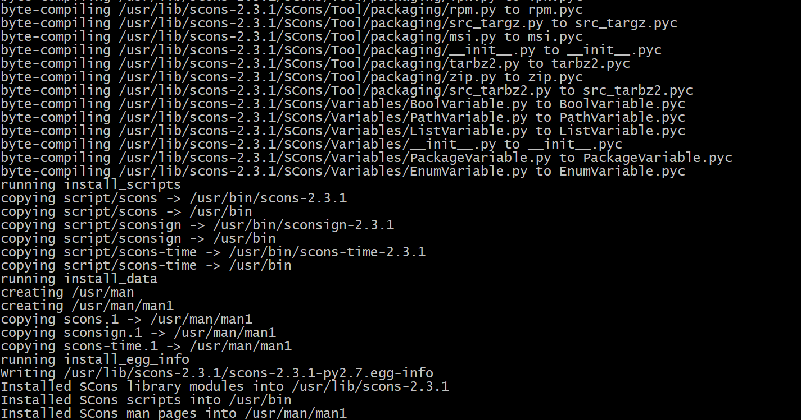
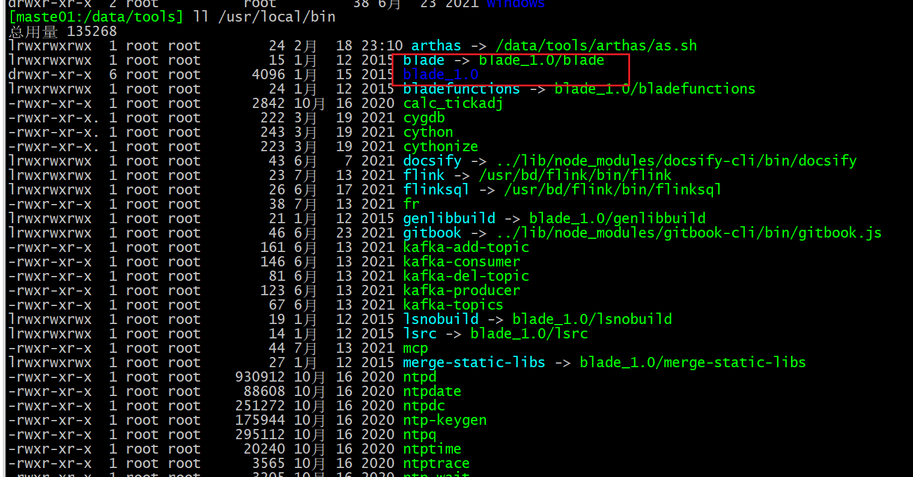

# C++编译环境安装

## 参考

- cmake与autoconf+automake的对比：https://blog.csdn.net/cnsword/article/details/7542696
- cmake快速入门：https://blog.csdn.net/kai_zone/article/details/82656964
- SCons & ninja 笔记 https://blog.csdn.net/aimaiti/article/details/84067864

## 1 blade

### 开源版本

- 目前最新为2.0版本，依赖于ninja
- github：https://github.com/chen3feng/blade-build/
- 最新版本下载：https://github.com/chen3feng/blade-build/releases/download/v2.0/blade.zip
- 教程：https://www.jianshu.com/p/5cc612cbe50c

### 旧版本

- 基于1.0版本修改的

- 依赖于scons和ccache

- 做了一些改进，支持

  - 源文件列表支持正则表达式，如：

    ```pyt
    srcs = [ ‘*.cpp’,]
    ```

  - 支持预处理脚本

    自动检测target目录下，是否存在proto_gen.sh,如果有，则会在编译前运行

  - 支持预清理脚本
    自动检测target目录下，是否存在clean.sh, 如果有，则清理前运行

习惯了用这个版本，先用着吧，后面再调研一下别的

### 安装

#### 安装ccache

```ba
yum install -y ccache
rpm -qa|grep ccache
# ccache-3.7.7-1.el8.x86_64
which ccache
#/usr/bin/ccache
```


#### 安装scons

- scons一个很古老的项目了，目前资料较少，只在sourceforge上维护，
- 下载地址：https://sourceforge.net/projects/scons/files/scons/
- 教程：https://blog.csdn.net/qq_40732350/article/details/106242933
- 目前scons有2.x、3.x，4.x版本，原来用的2.3.1的版本，先用这个吧，不折腾了
- 注意项
  - scons3.0.3只支持Python2.7.x
  - scons3.0.3以上的版本只支持Python2.7.x和Python3.5.x及以上

```ba
tar -zxvf scons-2.3.1.tar.gz 
cd scons-2.3.1
python ./setup.py install
which scons
# /usr/bin/scons
```



#### 安装blade

- 解压缩

```bas
# 将当前包解压缩到 /ur/local/bin
tar -zxvf blade_modify.tgz -C /usr/local/bin
```



- 在~/.bashrc中加入一条，便于以后使用

```bash
# 下面这一句是去掉svn更新，没啥用
export BLADE_AUTO_UPGRADE=no
alias bb='blade build'
```

### 旧项目测试

- 测试未通过，目前发现的原因

  - 对于带有中文名的文件， 有bug，可能特殊字符也是，应该是正则功能引入的

  - protobuf的库有问题，去掉了依赖好一点

  - buff互相sprint，存在的可能的buff被truncated， -Werror=format-truncation=

    - 解决方法：BLADE_ROOT里面对应的'-Werror=format',这一行注释掉

  - '::writev' has not been declared：#include <sys/uio.h>

  - /data/test/light/src/devplat/gunnersvr，编译过了，链接出问题了：/usr/bin/ld: cannot find -lstdc++，下面的方法都i试过还是不行

    估计跟链接的路径有关

    - https://blog.csdn.net/Think88666/article/details/119579205
    -  yum install libstdc++
    - 确实是因为链接了静态库：

    ```py
            # cc_targets.py:789,去掉这三行这个便宜错误消失了
            if platform.get_gcc_version() > '4.5':
                link_flag_list = ['-static-libgcc', '-static-libstdc++']
                self._write_rule('%s.Append(LINKFLAGS=%s)' % (env_name, link_flag_list))
    ```

    

```bash
cd /data/test
unzip light1.zip

```


### 测试

```bash
cd /data/test/cpp
touch BLADE_ROOT

```

## 2 cmake

- 官网：

```b
yum install -y make cmake libarchive  

```

## 3 ninja

- 官网：https://ninja-build.org/
- github
  - 项目：https://github.com/ninja-build/ninja
  - 版本下载：https://github.com/ninja-build/ninja/releases

## 4 scons

- 官网：https://scons.org/
- github：
  - 项目：https://github.com/SCons/scons
  - 版本下载：https://github.com/SCons/scons/releases