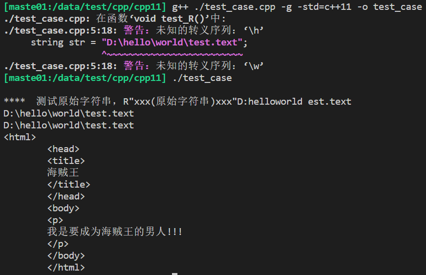
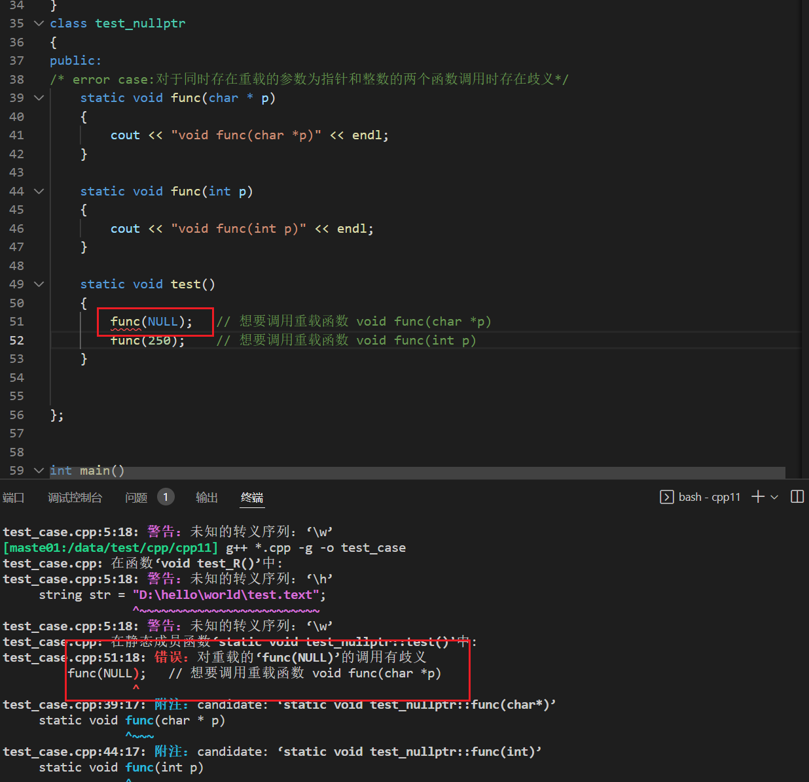
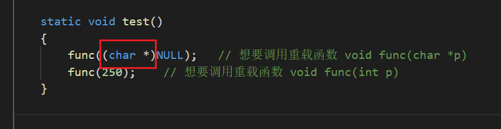
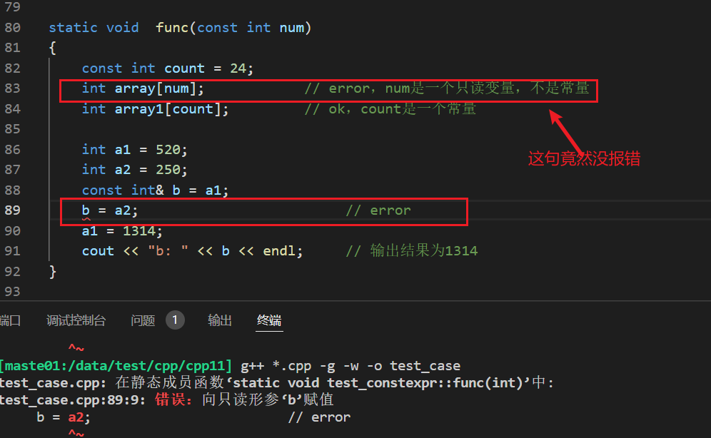
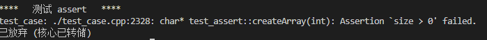
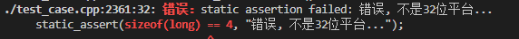
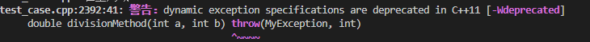
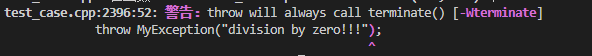
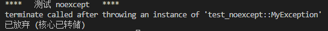

# C++11新特性学习

## 参考资料

- 爱编程的大丙：苏丙榅
  - b站视频： https://www.bilibili.com/video/BV1bX4y1G7ks 
  - 网站：https://subingwen.cn/cplusplus/
- 本地测试代码路径：/data/test/cpp/cpp11

## 中英文对照表

  

  

## 原始字符串字面值(raw string literal)

- 如果不定义自定义分隔符，无法识别何时结束，这个有点类似http post里面的padding字段

- 编译时未加-w会提示waring信息

  

```cpp
#include "../header/common.h"

void test_R()
{
    string str = "D:\hello\world\test.text";
    cout << str << endl;
    string str1 = "D:\\hello\\world\\test.text";
    cout << str1 << endl;
    string str2 = R"(D:\hello\world\test.text)";
    cout << str2 << endl;

    string str3 = R"(<html>
        <head>
        <title>
        海贼王
        </title>
        </head>
        <body>
        <p>
        我是要成为海贼王的男人!!!
        </p>
        </body>
        </html>)";
    cout << str3 << endl;

    string str4 = R"luffy(D:\hello\world\test.text)luffy";
    cout << str4 << endl;

    std::cout << R"(")" << std::endl; // 输出一个双引号："
    
    // 如果不使用自定义分割字符串，这里：R"()")"编译器无法识别raw string在何处结束。自定义分割字符串的用途
    std::cout << R"delimiter()")delimiter" << std::endl; // 输出：)"

}

int main()
{
    printf("\n****  测试原始字符串，R\"xxx(原始字符串)xxx\"");
    test_R();
}
```

## 空指针 - nullptr

- 视频：https://www.bilibili.com/video/BV1bX4y1G7ks?p=2
- 使用空指针nullptr以后进行函数调用是，不需要进行强制类型转换
- 网站：https://subingwen.cn/cpp/nullptr/
-  C++ 程序 NULL 就是 0，对于同时存在重载的参数为指针和整数的两个函数调用时存在歧义，如果要能运行，需要强制类型转换

```cpp
#ifndef NULL
    #ifdef __cplusplus
        #define NULL 0
    #else
        #define NULL ((void *)0)
    #endif
#endif
```






```cpp
class test_nullptr
{
public:
/* error case:对于同时存在重载的参数为指针和整数的两个函数调用时存在歧义*/
    static void func(char * p)
    {
        cout << "void func(char *p)" << endl;
    }


    static void func(int p)
    {
        cout << "void func(int p)" << endl;
    }

    static void test()
    {
        int*    ptr1 = nullptr;
        char*   ptr2 = nullptr;
        double* ptr3 = nullptr;
        func(ptr1);
        func(ptr2);
        func(ptr3);

        func((char *)NULL);   // 想要调用重载函数 void func(char *p)
        func(250);    // 想要调用重载函数 void func(int p)
    }
 
    static void func(int * p)
    {
        cout << "void func(int *p)" << endl;
    }

    static void func(double * p)
    {
        cout << "void func(double *p)" << endl;
    }


};
```

## 常量表达式修饰符 - constexpr

- 教程：https://subingwen.cn/cpp/constexpr/
- 视频：https://www.bilibili.com/video/BV1bX4y1G7ks?p=3
- constexpr：编译期计算好，避免运行期计算，提高效率
- 建议：【只读】场景用const，【常量】场景用constexpr



```cpp
class test_constexpr
{
public:
struct Test
{
    int id;
    int num;
};

static void  func(const int num)
{
    const int count = 24;
    int array[num];            // error，num是一个只读变量，不是常量
    int array1[count];         // ok，count是一个常量

    int a1 = 520;
    int a2 = 250;
    const int& b = a1;
    // b = a2;                         // error
    a1 = 1314;
    cout << "b: " << b << endl;     // 输出结果为1314
}


// 修饰函数
// 1、函数必须要有返回值，并且 return 返回的表达式必须是常量表达式。
// error，不是常量表达式函数
/* 这个没有返回值
constexpr void func1()
{
    int a = 100;
    cout << "a: " << a << endl;
}
*/
// error，返回值不是常量表达式
// 这个竟然没报错 , 应该是这个修饰无效了
// 叫上这个编译选项-std=c++11就错了，c++14不报错了
// https://www.qedev.com/dev/120195.html
static constexpr int func1()
{
    int a = 100;
    return a;
}

// 2、 整个函数的函数体中，不能出现非常量表达式之外的语句（using 指令、typedef 语句以及 static_assert 断言、return 语句除外）。
// error 
static constexpr int func4()
{
    constexpr int a = 100;
    constexpr int b = 10;
    /* error
    for (int i = 0; i < b; ++i)
    {
        cout << "i: " << i << endl;
    }
    */

    return a + b;
}

//3、先定义后使用
/*
constexpr int func1();
int main()
{
    constexpr int num = func1();	// error
    return 0;
}

constexpr int func1()
{
    constexpr int a = 100;
    return a;
}

*/

// 修饰模板函数
template<typename T>
static constexpr T display(T t)
{
    return t;
}

struct Person {
    // 修饰构造函数，要求构造函数的函数体必须为空，并且必须采用初始化列表的方式为各个成员赋值
    constexpr Person(const char* p, int age) :name(p), age(age)
    {
    }

    const char* name;
    int age;
};


static void test()
{
    // 在定义常量时，const 和 constexpr 是等价的，都可以在程序的编译阶段计算出结果
    // const int m = f();  // 不是常量表达式，m的值只有在运行时才会获取。
    // const int i=520;    // 是一个常量表达式
    // const int j=i+1;    // 是一个常量表达式

    // constexpr int i=520;    // 是一个常量表达式
    // constexpr int j=i+1;    // 是一个常量表达式

    //修饰不可变的类或者结构体，
    constexpr Test t{ 1, 2 };
    constexpr int id = t.id;
    constexpr int num = t.num;
    // error，不能修改常量
    // t.num += 100;
    cout << "id: " << id << ", num: " << num << endl;

    //普通函数
    // struct Person ret = dispaly(p); 由于参数 p 是变量，所以实例化后的函数不是常量表达式函数，此时 constexpr 是无效的
    struct Person p { "luffy", 19 };
    struct Person ret = display(p);
    cout << "ret luffy's name: " << ret.name << ", age: " << ret.age << endl;
    
    //常量表达式函数
    // constexpr int ret1 = dispaly(250); 参数是常量，符合常量表达式函数的要求，此时 constexpr 是有效的
    constexpr int ret1 = display(250);
    cout << "ret1:" << ret1 << endl;

    // constexpr struct Person p2 = dispaly(p1); 参数是常量，符合常量表达式函数的要求，此时 constexpr 是有效的
    constexpr struct Person p1 { "luffy", 19 };
    constexpr struct Person p2 = display(p1);
    cout << "p2 luffy's name: " << p2.name << ", age: " << p2.age << endl;

    constexpr struct Person p3("luffy", 19);
    cout << "p3 luffy's name: " << p3.name << ", age: " << p3.age << endl;


}


};
```

## 自动变量类型推导-auto

- 教程：https://subingwen.cn/cpp/autotype/
- 视频：https://www.bilibili.com/video/BV1bX4y1G7ks?p=5
- 推导规则
  - 当变量不是指针或者引用类型时，推导的结果中不会保留 const、volatile 关键字
  - 当变量是指针或者引用类型时，推导的结果中会保留 const、volatile 关键字

```cpp
class test_auto
{
public:
    template <typename T>
    struct Test{
        T t;
    };

    class T1
    {
    public:
        static int get()
        {
            return 10;
        }
    };

    class T2
    {
    public:
        static string get()
        {
            return "hello, world";
        }
    };

    template <class A>
    static void func(void)
    {
        auto val = A::get();
        cout << "val: " << val << endl;
    }

    template <class A, typename B>        // 添加了模板参数 B
    static void func(void)
    {
        B val = A::get();
        cout << "val: " << val << endl;
    }


    

    static void test()
    {
        auto x = 3.14;      // x 是浮点型 double
        auto y = 520;       // y 是整形 int
        auto z = 'a';       // z 是字符型 char
        // auto nb;            // error，变量必须要初始化
        //auto double nbl;    // 语法错误, 不能修改数据类型   
        
        //指针
        int temp = 110;
        auto *a = &temp;	
        auto b = &temp;		
        auto &c = temp;		
        auto d = temp;	

        //const 限定
        int tmp = 250;
        const auto a1 = tmp;
        auto a2 = a1;
        const auto &a3 = tmp;
        auto &a4 = a3;
     
        // 模板 1
        Test<double> t;
        t.t = 1.2;
        auto t1 = t;
        
        // 模板 2: 自动统一模板类实例化以后的同一函数调用的不同返回值类型，避免手动指定
        // auto例子
        func<T1>();
        func<T2>();
        // 常规非auto例子
        func<T1, int>();
        func<T2, string>();  

        
        // STL遍历  代码简化
        map<int, string> person;
        
        for (auto it = person.begin(); it != person.end(); ++it)
        {
            // do something
        }


    }

// 限制
// 1、 不能作为函数参数：因为只有在函数调用的时候才会给函数参数传递实参，auto 要求必须要给修饰的变量赋值，因此二者矛盾。
/*
    int func(auto a, auto b)	// error
    {	
        cout << "a: " << a <<", b: " << b << endl;
    }
*/
// 2、不能用于类的非静态成员变量的初始化
/*
    class Test
    {
        auto v1 = 0;                    // error
        static auto v2 = 0;             // error,类的静态非常量成员不允许在类内部直接初始化
        static const auto v3 = 10;      // ok
    }
*/
// 3、不能定义数组
/*
    int func()
    {
        int array[] = {1,2,3,4,5};  // 定义数组
        auto t1 = array;            // ok, t1被推导为 int* 类型
        auto t2[] = array;          // error, auto无法定义数组
        auto t3[] = {1,2,3,4,5};;   // error, auto无法定义数组
    }
*/
//4、无法使用 auto 推导出模板参数
/*
template <typename T>
struct Test{}

int func()
{
    Test<double> t;
    Test<auto> t1 = t;           // error, 无法推导出模板类型
    return 0;
}
*/


};
```

## 自动变量类型推导 - decltype

- 视频：https://www.bilibili.com/video/BV1bX4y1G7ks?p=8
- 教程：https://subingwen.cn/cpp/autotype/#2-decltype
- 基本信息：根据一个表达式推导另外一个变量的类型，编译期完成
- 特别适合模板类里面根据迭代器的返回值推导成员变量的类型

```cpp
class test_decltype
{
public: 
    class Test
    {
    public:
        string text;
        int num;
        static const int value = 110;
    };

    template <class T>
    class Container
    {
    public:
        void func(T& c)
        {
            for (m_it = c.begin(); m_it != c.end(); ++m_it)
            {
                cout << *m_it << " ";
            }
            cout << endl;
        }
    private:
        decltype(T().begin()) m_it;  // 这里不能确定迭代器类型
    };


    static void test()
    {
        int a = 10;
        decltype(a) b = 99;                 // b -> int
        decltype(a+3.14) c = 52.13;         // c -> double
        decltype(a+b*c) d = 520.1314;       // d -> double

        // 表达式为普通变量或者普通表达式或者类表达式，在这种情况下，使用 decltype 推导出的类型和表达式的类型是一致的
        int x = 99;
        const int &y = x;
        decltype(x) e = x;                  // e -> int
        decltype(y) f = x;                  // f -> const int &
        decltype(Test::value) g = 0;        // g -> const int

        Test t;
        decltype(t.text) h = "hello, world";// h -> string

        const list<int> lst{ 1,2,3,4,5,6,7,8,9 };
        Container<const list<int>> obj;
        obj.func(lst);

        // 表达式是函数调用，使用 decltype 推导出的类型和函数返回值一致
/*
        int func_int();                 // 返回值为 int
        int& func_int_r();              // 返回值为 int&
        int&& func_int_rr();            // 返回值为 int&&

        const int func_cint();          // 返回值为 const int
        const int& func_cint_r();       // 返回值为 const int&
        const int&& func_cint_rr();     // 返回值为 const int&&

        const Test func_ctest();        // 返回值为 const Test

        //decltype类型推导
        int n = 100;
        decltype(func_int()) a = 0;		    // a -> int
        decltype(func_int_r()) b = n;	    // b -> int &
        decltype(func_int_rr()) c = 0;	    // c -> int &&
        
        //1、对于纯右值而言，只有类类型可以携带const、volatile限定符，除此之外需要忽略掉这两个限定符
        decltype(func_cint())  d = 0;	    // d -> int 
        decltype(func_cint_r())  e = n;	    // e -> const int &
        decltype(func_cint_rr()) f = 0;	    // f -> const int &&
        decltype(func_ctest()) g = Test();	// g -> const Test ? 这个为啥会是const？

        //2、 表达式是一个左值，或者被括号 ( ) 包围，使用 decltype 推导出的是表达式类型的引用（如果有 const、volatile 限定符不能忽略）。
        const Test obj;             
        //带有括号的表达式
        decltype(obj.num) a = 0;    // a -> int
        decltype((obj.num)) b = a;  // b -> const int &  , 带括号了（取&, obj是const ，取const）
        //加法表达式
        int n = 0, m = 0;
        decltype(n + m) c = 0;      // c -> int ，右值，
        decltype(n = n + m) d = n;  // d -> int& ，左值，取&


*/


    }
};

```


## 返回类型后置

- 视频：https://www.bilibili.com/video/BV1bX4y1G7ks?p=12
- 教程：https://subingwen.cn/cpp/autotype/#3-%E8%BF%94%E5%9B%9E%E7%B1%BB%E5%9E%8B%E5%90%8E%E7%BD%AE
- 返回值类型放在后面，用->隔开，便于在泛型编程时根据decltype推导出返回值，不需要在前面手动指定返回值

```cpp
class test_returntype
{
public:
    // 旧的写法
    // R->返回值类型, T->参数1类型, U->参数2类型
    template <typename R, typename T, typename U>
    static R add(T t, U u)
    {
        return t + u;
    }

    template <typename T, typename U>
    // 返回类型后置语法
    static auto add1(T t, U u) -> decltype(t+u) 
    {
        return t + u;
    }

 
    static int& test(int &i)
    {
        return i;
    }

    static double test(double &d)
    {
        d = d + 100;
        return d;
    }

    template <typename T>
    // 返回类型后置语法
    static auto myFunc(T& t) -> decltype(test(t))
    {
        return test(t);
    }


    static void test()
    {
        // 旧的例子
        int x = 520;
        double y = 13.14;
        // auto z = add<decltype(x + y), int, double>(x, y);
        auto z = add<decltype(x + y)>(x, y);	// 简化之后的写法
        cout << "z: " << z << endl;

        // auto z = add<int, double>(x, y);
        auto t = add1(x, y);		// 简化之后的写法
        cout << "t: " << t << endl;

        //基于函数返回值推导的函数返回值后置的例子，有点绕
        // auto z2 = myFunc<int>(x);
        auto z2 = myFunc(x);             // 简化之后的写法
        cout << "z2: " << z2 << endl;

        // auto z3 = myFunc<double>(y);
        auto z3 = myFunc(y);            // 简化之后的写法
        cout << "z3: " << z3 << endl;
    }

};
```

## final and override

- 视频：https://www.bilibili.com/video/BV1bX4y1G7ks?p=13
- 教程：https://subingwen.cn/cpp/final/
- final：从java来的，使用范围更小，主要是在继承关系中，断绝向后的函数重载或者类继承
  - 如果修饰函数，只能是虚函数，该虚函数的重载到当前类为止，避免子类误重载了这个函数
  - 如果修饰类：此类不能被继承
- override：纯粹是个检查工具，检查当前函数在继承关系里面所有的基类中是否有对应的同名/同样定义的virtual函数

```cpp
class test_final_and_override
{
public:
    class Base
    {
    public:
        virtual void test()
        {
            cout << "Base class...";
        }
    };

    class Child : public Base
    {
    public:
        void test() final
        {
            cout << "Child class...";
        }
    };

/*
    class GrandChild : public Child
    {
    public:
        // 语法错误, 不允许重写
        void test()
        {
            cout << "GrandChild class...";
        }
    };
*/


    class Child1 final: public Base
    {
    public:
        void test()
        {
            cout << "Child class...";
        }
    };
/*
    // error, 语法错误
    class GrandChild1 : public Child1
    {
    public:
    };
*/


    class Child2 : public Base
    {
    public:
        void test() override
        {
            cout << "Child class...";
        }
    };

    class GrandChild2 : public Child2
    {
    public:
        void test() override
        {
            cout << "Child class...";
        }
    };
};
```

## 模板优化

- 教程：https://subingwen.cn/cpp/template/
- 视频：https://www.bilibili.com/video/BV1bX4y1G7ks?p=15

```cpp
class test_template
{
public:
    template <typename T>
    class Base
    {
    public:
        void traversal(T& t)
        {
            auto it = t.begin();
            for (; it != t.end(); ++it)
            {
                cout << *it << " ";
            }
            cout << endl;
        }
    };

    template <typename T=int, T t=520>
    class Test
    {
    public:
        void print()
        {
            cout << "current value: " << t << endl;
        }
    };

    template <typename T=int, T t1=520>	// C++98/03不支持这种写法, C++11中支持这种写法
    static void func(T t = t1)
    {
        cout << "current value: " << t << endl;
    }


    template <typename R = int, typename N>
    static R func1(N arg)
    {
        return arg;
    }


    template <typename T, typename U = char>
    static void func2(T arg1 = 100, U arg2 = 100)
    {
        cout << "arg1: " << arg1 << ", arg2: " << arg2 << endl;
    }


    static void test()
    {
        vector<int> v{ 1,2,3,4,5,6,7,8,9 };
        // 这个两个>>的场景真的编译不过，不过感觉这个不算是一个特别好的东西，就这样吧，习惯了中间加个空格隔开
        Base<vector<int>> b;
        b.traversal(v);      

        // 测试类模板的默认模板类型和参数
        // 但对于类模板而言，哪怕所有参数都有默认参数，在使用时也必须在模板名后跟随 <> 来实例化。
        Test<> t;
        t.print();
        Test<int, 1024> t1;
        t1.print();

        //测试函数模板的默认模板类型和参数
        // 函数模板有默认值类型时，可以不写<>
        func(100);
        func();

        // 函数返回值类型使用了默认的模板参数，函数的参数类型是自动推导出来的为 int 类型
        // return value-1: 520
        auto ret1 = func1(520);
        cout << "return value-1: " << ret1 << endl;

        // 函数的返回值指定为 double 类型，函数参数是通过实参推导出来的，为 double 类型
        // return value-2: 52.134
        auto ret2 = func1<double>(52.134);
        cout << "return value-2: " << ret2 << endl;

        // 函数的返回值指定为 int 类型，函数参数是通过实参推导出来的，为 double 类型
        // return value-3: 52
        auto ret3 = func1<int>(52.134);
        cout << "return value-3: " << ret3 << endl;

        // 函数的参数为指定为 int 类型，函数返回值指定为 char 类型，不需要推导
        // return value-4: d
        auto ret4 = func1<char, int>(100);
        cout << "return value-4: " << ret4 << endl;

        // 参数 T 被自动推导为 char 类型，U 使用的默认模板参数为 char 类型
        // arg1: a, arg2: d
        func2('a');

        // 参数 T 被自动推导为 int 类型，U 使用推导出的类型为 char
        // arg1: 97, arg2: a
        func2(97, 'a');

        // 参数 T 没有指定默认模板类型，并且无法自动推导，编译器会直接报错
        // func2();    //编译报错


    }

};

```

## using的使用

- 教程：https://subingwen.cn/cpp/using/
- 视频：https://www.bilibili.com/video/BV1bX4y1G7ks?p=17
- 新特性类似于typedef ，不过就是类是于赋值表达式的声明
- using 定义函数指针可读性强一丢丢
- using定义模板简单一点，直接写，typedef外面要套娃一层类或者结构

```cpp
class test_using
{
public:
    //1、新类型定义
    typedef unsigned int uint_t;
    using uint_t1 = int;

    //2、函数指针
    typedef int(*func_ptr)(int, double);
    using func_ptr1 = int(*)(int, double);


    //3、模板
    // 使用typedef 定义 模板；需要套一层，不能直接写
/*  错误写法
    template <typename T>
    typedef map<int, T> type;	// error, 语法错误
*/   
    // 正确写法
    template <typename T>
    // 定义外敷类
    struct MyMap
    {
        typedef map<int, T> type;
    };    

    template <typename T>
    using mymap = map<int, T>;


    static void test()
    {
        // 测试typdef写法
        MyMap<string>::type m;
        m.insert(make_pair(1, "luffy"));
        m.insert(make_pair(2, "ace"));

        MyMap<int>::type m1;
        m1.insert(make_pair(1, 100));
        m1.insert(make_pair(2, 200));

         mymap<···string> am;
        am.insert(make_pair(1, "luffy"));
        am.insert(make_pair(2, "ace"));   
        mymap<int> am1;
        am1.insert(make_pair(1, 100));
        am1.insert(make_pair(2, 200));  
    }
};
```

## 构造函数

- 视频：https://www.bilibili.com/video/BV1bX4y1G7ks?p=19
- 教程：https://subingwen.cn/cpp/construct
- 构造函数之间的调用：支持构造函数之间的调用，放在变量的初始化列表

```cpp
class test_constructor
{
public:
    class Test
    {
    public:
        Test() {};
        Test(int max)
        {
            this->m_max = max > 0 ? max : 100;
        }

        Test(int max, int min):Test(max)
        {
            // 这样可以
            Test();
            // 这样不行
            // Test(max);
            this->m_min = min > 0 && min < max ? min : 1;
        }

        Test(int max, int min, int mid):Test(max, min)
        {
            this->m_middle = mid < max && mid > min ? mid : 50;
        }

        int m_min;
        int m_max;
        int m_middle;
    };

    class Base
    {
    public:
        Base(int i) :m_i(i) {}
        Base(int i, double j) :m_i(i), m_j(j) {}
        Base(int i, double j, string k) :m_i(i), m_j(j), m_k(k) {}

        void func(int i)
        {
            cout << "base class: i = " << i << endl;
        }
        
        void func(int i, string str)
        {
            cout << "base class: i = " << i << ", str = " << str << endl;
        }

        int m_i;
        double m_j;
        string m_k;
/*
private:
        void func(double val)
        {
            cout << "base class: double = " << val << endl;
        }
*/

    };

    class Child : public Base
    {
    public:
        Child(int i) :Base(i) {}
        Child(int i, double j) :Base(i, j) {}
        Child(int i, double j, string k) :Base(i, j, k) {}
    };

    // 简化写法
    class Child1 : public Base
    {
    public:
        // 这个感觉比较有用，不然要写很多，
        using Base::Base;
        

        // 如果有private的函数，会编译不过，对于public的，貌似也没有关系
        // 感觉这里的作用时当有函数重载时，用哪个类的函数
        using Base::func;

        void func()
        {
            cout << "child class: i'am luffy!!!" << endl;
        }


    };


    static void test()
    {
        Test t(90, 30, 60);
        cout << "min: " << t.m_min << ", middle: " 
            << t.m_middle << ", max: " << t.m_max << endl;

        Child c(520, 13.14, "i love you");
        cout << "int: " << c.m_i << ", double: " 
            << c.m_j << ", string: " << c.m_k << endl;

        c.func(1); 
        // private 不行   
        // c.func(1.5);

        Child1 c1(520, 13.14);
        cout << "int: " << c1.m_i << ", double: " << c1.m_j << endl;
        c1.func(1.5);
        Child1 c2(520, 13.14, "i love you");
        cout << "int: " << c2.m_i << ", double: " 
            << c2.m_j << ", string: " << c2.m_k << endl;

    }
};
```


## 数据初始化

- 教程：https://subingwen.cn/cpp/list-init
- 视频：https://www.bilibili.com/video/BV1bX4y1G7ks?p=21
- 核心：聚合体（简单数据类型）和非聚合体（复杂数据类型），简单数据类型可以用列表初始化；复杂的需要用构造函数初始化

```cpp
class test_datainit
{
public:
    class Test
    {
    public:
        Test(int) {}

        Test(std::initializer_list<string> list)
        {
            for (auto it = list.begin(); it != list.end(); ++it)
            {
                cout << *it << " ";
                m_names.push_back(*it);
            }
            cout << endl;
        }


    private:
        vector<string> m_names;
        Test(const Test &);
    };

    class Person1
    {
    public:
        Person1(int id, string name)
        {
            cout << "id: " << id << ", name: " << name << endl;
        }
        static Person1 func()
        {
            return { 9527, "华安" };
        }
    };

    static void traversal(std::initializer_list<int> a)
    {
        for (auto it = a.begin(); it != a.end(); ++it)
        {
            cout << *it << " ";
        }
        cout << endl;
    }


    static void test()
    {
        //1、 old
        // 数组的初始化
        int array[] = { 1,3,5,7,9 };
        double array1[3] = { 1.2, 1.3, 1.4 };

        // 对象的初始化
        struct Person
        {
            int id;
            double salary;
        }zhang3{ 1, 3000 };

        // 2、 new
        Test t1(520);
       
        // 这个的过程是以520为初始值生成一个Test对象，然后copy给t2，cop构造函数是私有的，
        // linux 报错：‘test_datainit::Test::Test(const test_datainit::Test&)’ is private within this context
        // Test t2 = 520; 

        // 中间哪个等号可有可无，是列表初始化
        Test t3 = { 520 }; 
        Test t4{ 520 };
        int a1 = { 1314 };
        int a2{ 1314 };
        int arr1[] = { 1, 2, 3 };
        int arr2[]{ 1, 2, 3 };

        int * p = new int{520};
        double b = double{52.134};
        int * array2 = new int[3]{1,2,3};

        // 这种通过大括号初始化一个对象返回写法真的好简洁
        Person1 ps = Person1::func();

        struct T1
        {
            int x;
            int y;
        }a = { 123, 321 };

        struct T2
        {
            int x;
            int y;
            T2(int, int) : x(10), y(20) {}
        }b1 = { 123, 321 };

        // 正常初始化 ，结果：a.x: 123, a.y: 321
        cout << "a.x: " << a.x << ", a.y: " << a.y << endl;
        // 列表初始化；构造函数执行，构造函数的列表初始化：b.x: 10, b.y: 20
        cout << "b1.x: " << b1.x << ", b1.y: " << b1.y << endl;

        initializer_list<int> list;
        cout << "current list size: " << list.size() << endl;
        traversal(list);

        list = { 1,2,3,4,5,6,7,8,9,0 };
        cout << "current list size: " << list.size() << endl;
        traversal(list);
        cout << endl;
        
        list = { 1,3,5,7,9 };
        cout << "current list size: " << list.size() << endl;
        traversal(list);
        cout << endl;

        ////////////////////////////////////////////////////
        ////////////// 直接通过初始化列表传递数据 //////////////
        ////////////////////////////////////////////////////
        traversal({ 2, 4, 6, 8, 0 });
        cout << endl;

        traversal({ 11,12,13,14,15,16 });
        cout << endl;

        Test at({ "jack", "lucy", "tom" });
        Test at1({ "hello", "world", "nihao", "shijie" });

    }

};
```

## for循环

- 教程：https://subingwen.cn/cpp/for/
- 视频：https://www.bilibili.com/video/BV1bX4y1G7ks?p=25

```cpp
class test_for
{
public:
    
    static vector<int>& getRange()
    {
        static vector<int> v{ 1,2,3,4,5,6 };
        cout << "get vector range..." << endl;
        return v;
    }

    static void test()
    {
        
        vector<int> t{ 1,2,3,4,5,6 };
        for (auto it = t.begin(); it != t.end(); ++it)
        {
            cout << *it << " ";
        }
        cout << endl;

        for (auto value : t)
        {
            cout << value << " ";
        }
        cout << endl;

        cout << "遍历修改之前的容器: ";
        for (auto &value : t)
        {
            cout << value++ << " ";
        }
        cout << endl << "遍历修改之后的容器: ";

        for (auto &value : t)
        {
            cout << value << " ";
        }
        cout << endl;

        // 对于不修改的场景，使用 const auto &，这样相对于 const auto 效率要更高一些
        for (const auto& value : t)
        {
            cout << value << " ";
        }
        cout << endl;

        map<int, string> m{
            {1, "lucy"},{2, "lily"},{3, "tom"}
        };

        // 基于范围的for循环方式
        // auto 自动推导出的类型是容器中的 value_type，map对应的是（std::pair）对象,用.访问
        for (auto& it : m)
        {
            cout << "id: " << it.first << ", name: " << it.second << endl;
        }

        // 普通的for循环方式
        //  auto 自动推导出的是一个迭代器类型， 需要指针访问
        for (auto it = m.begin(); it != m.end(); ++it)
        {
            cout << "id: " << it->first << ", name: " << it->second << endl;
        }


        // 对应 set 容器来说，内部元素都是只读的，这是由容器的特性决定的，因此在 for 循环中 auto & 会被视为 const auto & 
        set<int> st{ 1,2,3,4,5,6 };
        for (auto &item : st) 
        {
            // cout << item++ << endl;		// error, 不能给常量赋值
            cout << item << endl;		
        }

 


        // getRange只在开始时调用一次
        for (auto val : getRange())
        {
            cout << val << " ";
        }
        cout << endl;
    }
};

```

## functional & bind

- 教程：https://subingwen.cn/cpp/bind/
- 视频：https://www.bilibili.com/video/BV1bX4y1G7ks?p=27
- bind ：目的，绑定一个函数（可调用对象）和一组参数为一个新的std::funtion，这样可以
  - rename：可读性增强/书写简单
  - 减少参数列表个数

```cpp
namespace test_functional
{

// 1、定义函数指针
int print(int a, double b)
{
    cout << a << ":" << b << endl;
    return 0;
}

int (*func)(int, double) = &print;
    
// 2、仿函数
struct Test
{
    void operator()(string msg)
    {
        cout << "msg:" << msg << endl;
    }
};

// 3、类的静态成员函数
// 这种方式只能帮静态成员函数，可以跟前面第二类的仿函数并存
using func_ptr = void(*)(int, string);
struct Test1
{
    static void print(int a, string b)
    {
        cout << "name: " << b << ", age: " << a << endl;
    }

    // 将类对象转换为函数指针
    operator func_ptr ()
    {
        return print;
    }

};

// 4、 类的普通成员函数和变量
// 使用using给取了一个别名\引用，实例化以后可以通过对象访问这个别名进行函数调用或者成员变量赋值
struct Test2
{
    void print(int a, string b)
    {
        cout << "name: " << b << ", age: " << a << endl;
    }

    int m_num;
};


// 仿函数实例化以后作为回调函数
class A
{
public:
    // 构造函数参数是一个包装器对象
    A(const function<void()>& f) : callback(f)
    {
    }

    void notify()
    {
        callback(); // 调用通过构造函数得到的函数指针
    }
private:
    function<void()> callback;
};

class B
{
public:
    void operator()()
    {
        cout << "我是要成为海贼王的男人!!!" << endl;
    }
};


//  

void test()
{
    Test t;
    t("我是要成为海贼王的男人!!!");	// 仿函数
    Test1 t1;
    // 对象转换为函数指针, 并调用
    t1(19, "Monkey D. Luffy");

    // 类函数的引用
    //写法1
    using func_ptr1 = void (Test2::*)(int, string);
    func_ptr1 ptr1 = &Test2::print;
    // 写法2
    void (Test2::*ptr2)(int, string) = &Test2::print;


    // 类成员的引用
    // 写法1
    using int_ptr = int Test2::*;
    int_ptr ptr3 = & Test2::m_num;
    // 写法2
    int Test2::*ptr4 = &Test2::m_num;

    Test2 t2;
    // 通过类成员函数指针调用类成员函数
    (t2.*ptr1)(19, "luffy");
    (t2.*ptr2)(18, "tommy");
    t2.*ptr3 = 1;
    cout << "number is: " << t2.m_num << endl;
    t2.*ptr3 = 2;
    cout << "number is: " << t2.m_num << endl;
    
    // funciton写法, 可读性好很多
    // 绑定一个普通函数
    function<int(int,double)> f1 = print;
    // 绑定一个静态成员函数
    function<void(int, string)> f2 = Test1::print;
    // 绑定一个仿函数
    function<void(string)> f3 = t;
    // 函数调用
    f1(9, 3.3);
    f2(9, "iceberg");
    f3("doris");  

    // 仿函数实例化以后作为回调函数
    B b;
    A a(b);
    a.notify();
    
}

};

namespace test_bind
{
    // usage
    // 1、绑定非类成员函数/变量
    // auto f = std::bind(可调用对象地址, 绑定的参数/占位符)
    // 2、绑定类成员函/变量
    // auto f = std::bind(类函数/成员地址, 类实例对象地址, 绑定的参数/占位符);
    // bind 的参数列表顺序与原函数的参数列表一致
    // placeholders::_1 是一个占位符，代表这个位置将在函数调用时被传入的第一个参数所替代 


    void callFunc(int x, const function<void(int)>& f)
    {
        if (x % 2 == 0)
        {
            f(x);
        }
    }

    void output1(int x)
    {
        cout << x << " ";
    }

    void output_add(int x)
    {
        cout << x + 10 << " ";
    }

    void output(int x, int y)
    {
        cout << x << " " << y << endl;
    }

    class Test
    {
        public:
        void output(int x, int y)
        {
            cout << "x: " << x << ", y: " << y << endl;
        }
        int m_number = 100;
    };

    void test()
    {
        auto f1 = bind(output1, placeholders::_1);
        for (int i = 0; i < 10; ++i)
        {
            callFunc(i, f1);
        }
        cout << endl;

        auto f2 = bind(output_add, placeholders::_1);
        for (int i = 0; i < 10; ++i)
        {
            callFunc(i, f2);
        }
        cout << endl;


        // 使用绑定器绑定可调用对象和参数, 并调用得到的仿函数
        // 全部参数已经指定，使用时无需指定参数
        bind(output, 1, 2)();                       // 执行结果：1 2 
        // src 1 由调用参数的第一个，这里是10，第二个参数取绑定的值2
        bind(output, placeholders::_1, 2)(10);      // 执行结果：10 2
        // src 1 为绑定的参数值2， src2 为调用时指定的第一个参数10
        bind(output, 2, placeholders::_1)(10);      // 执行结果：2 10

        // error, 调用时没有第二个参数
        // bind(output, 2, placeholders::_2)(10);
        // 调用时第一个参数10被吞掉了，没有被使用
        bind(output, 2, placeholders::_2)(10, 20);  // 执行结果：2 20
        // 这个跟原函数的语义一致
        bind(output, placeholders::_1, placeholders::_2)(10, 20);   // 执行结果：10 20
        // 这个与原函数的语义相反，1、2参数进行了互换
        bind(output, placeholders::_2, placeholders::_1)(10, 20);   // 执行结果：20 10

        // std::function 是无法直接绑定类的非静态成员的函数的，通过std:bind + 实例化的对象可以
        Test t;
        // 绑定类成员函数/成员变量
        // 这个对单例化的对象暴露成员函数挺有用的
        function<void(int, int)> f3 = 
            bind(&Test::output, &t, placeholders::_1, placeholders::_2);

        // 绑定类成员变量(公共)
        // 这个写法和用法可读性有点差
        function<int&(void)> f4 = bind(&Test::m_number, &t);
        
        // 调用
        f3(520, 1314);
        f4() = 2333;
        cout << "t.m_number: " << t.m_number << endl;   

        auto f5 = bind(&Test::m_number, &t);
        // 下面两个写法都不行
        // f5(444);
        // *f5 = 444
        f5() = 444;
        cout << "t.m_number: " << t.m_number << endl;   

    }
}

```

## lambda表达式

- 教程：https://subingwen.cn/cpp/lambda/
- 视频：https://www.bilibili.com/video/BV1bX4y1G7ks?p=33

```cpp
namespace test_lambda
{
    // 语法
    // [capture](params) opt -> ret {body;};
    // capture 是捕获列表，params 是参数列表，opt 是函数选项，ret 是返回值类型，body 是函数体
    class Test
    {
    public:
        void output(int x, int y)
        {
            // 捕获列表，如何共享函数外的数据（父函数的入参、类成员变量等）
            // auto x1 = [] {return m_number; };                      // error， 没有捕获外部变量，不能使用类成员 m_number
            auto x2 = [=] {return m_number + x + y; };             // ok ， 以值拷贝的方式捕获所有外部变量
            auto x3 = [&] {return m_number + x + y; };             // ok ， 以引用的方式捕获所有外部变量
            auto x4 = [this] {return m_number; };                  // ok， 捕获 this 指针，可访问对象内部成员
            // auto x5 = [this] {return m_number + x + y; };          // error， 捕获 this 指针，可访问类内部成员，没有捕获到变量 x，y，因此不能访问。
            auto x6 = [this, x, y] {return m_number + x + y; };    // ok ， 捕获 this 指针，x，y
            auto x7 = [this] {return m_number++; };                // ok ，，捕获 this 指针，并且可以修改对象内部变量的值
    
        }
        int m_number = 100;
    };


    void test()
    {
        // 例子
        auto f = [](){return 1;};	// 没有参数, 参数列表为空
        auto f1 = []{return 1;};		// 没有参数, 参数列表省略不写

        // 完整的lambda表达式定义
        auto f2 = [](int a) -> int
        {
            return a+10;  
        };

        // 忽略返回值的lambda表达式定义
        // 不指定 lambda 表达式的返回值，编译器会根据 return 语句自动推导返回值的类型
        auto f3 = [](int a)
        {
            return a+10;  
        };

        // error，不能推导出返回值类型
        // 无法根据列表实例化出一个对象
        // auto f1 = []()
        // {
        //     return {1, 2};	// 基于列表初始化推导返回值，错误
        // }

        int a = 0;
        // 既然指定了按值捕获，又要改，为啥不用按引用捕获(&)
        // 这个不是一个好习惯，除非是特殊情况
        // auto f4 = [=] {return a++; };              // error, 按值捕获外部变量, a是只读的
        auto f5 = [=]()mutable {return a++; };     // ok

        // std::function & std::bind
        // 包装可调用函数
        std::function<int(int)> f6 = [](int a) {return a; };
        // 绑定可调用函数
        std::function<int(int)> f7 = bind([](int a) {return a; }, placeholders::_1);
        // 函数调用
        cout << f6(100) << endl;
        cout << f7(200) << endl;

        // 对于没有任何捕获变量的，可以转化为函数指针
        using func_ptr = int(*)(int);
        // 没有捕获任何外部变量的匿名函数
        func_ptr f8 = [](int a)
        {
            return a;  
        };
        // 函数调用
        f8(1314);


    }
};
```

## 右值引用和&&

- 教程：https://subingwen.cn/cpp/rvalue-reference/

- 视频：https://www.bilibili.com/video/BV1bX4y1G7ks?p=36

- 

- 左值（lvalue ，loactor value）：存储在内存中、有明确存储地址（可取地址）的数据，所有有名字的变量、对象，一般位于等号左边

- 右值（read value）：可以提供数据值的数据（不可取地址），匿名的，一般位于等号右边，又分成下面两种

  - 纯右值（prvalue， PureRvalue）：非引用返回的临时变量、运算表达式产生的临时变量、原始字面量和lambda表达式等
  - 将忘值（xvalue、expiring value）：与右值引用相关的表达式，比如，T&& 类型函数的返回值、 std::move 的返回值等

- 右值引用是提升右值的生命周期，到与左值一样

- 右值引用（&&）的初始化只能是右值，不能是左值

- 不是所有情况下 && 都代表是一个右值引用，具体的场景体现在模板和自动类型推导中

  - 如果是模板参数需要指定为 T&&，如果是自动类型推导需要指定为 auto &&，在这两种场景下 && 被称作未定的引用类型。
  - 另外还有一点需要额外注意 const T&& 表示一个右值引用，不是未定引用类型。
  
- 引用折叠的规则
  
  - 通过右值推导 T&& 或者 auto&& 得到的是一个右值引用类型
  
  - 通过非右值（右值引用、左值、左值引用、常量右值引用、常量左值引用）推导 T&& 或者 auto&& 得到的是一个左值引用类型
  
    
    
  
  ```cpp
  namespace test_rvalue
  {
      int&& value = 520;
      // error 不可以再次赋值
      // value = 300;
      class Test
      {
      public:
          Test()
          {
              cout << "construct: my name is jerry" << endl;
          }
          Test(const Test& a)
          {
              cout << "copy construct: my name is tom" << endl;
          }
      };
  
      Test getObj()
      {
          return Test();
      }
  
      class Test1
      {
      public:
          Test1() : m_num(new int(100))
          {
              cout << "construct: my name is jerry" << endl;
          }
  
          Test1(const Test1& a) : m_num(new int(*a.m_num))
          {
              cout << "copy construct: my name is tom" << endl;
          }
  
          ~Test1()
          {
              delete m_num;
          }
  
          int* m_num;
      };
  
      Test1 getObj1()
      {
          Test1 t;
          return t;
      }
  
      class Test2
      {
      public:
          Test2() : m_num(new int(100))
          {
              cout << "construct: my name is jerry" << endl;
          }
  
          Test2(const Test2& a) : m_num(new int(*a.m_num))
          {
              cout << "copy construct: my name is tom" << endl;
          }
  
          // 添加移动构造函数
          Test2(Test2&& a) : m_num(a.m_num)
          {
              a.m_num = nullptr;
              cout << "move construct: my name is sunny" << endl;
          }
  
          ~Test2()
          {
              delete m_num;
              cout << "destruct Test2 class ..." << endl;
          }
  
          int* m_num;
      };
  
      Test2 getObj2()
      {
          Test2 t;
          return t;
      }
  
      void printValue(int &i)
      {
          cout << "l-value: " << i << endl;
      }
  
      void printValue(int &&i)
      {
          cout << "r-value: " << i << endl;
      }
  
      void forward(int &&k)
      {
          printValue(k);
      }
  
  
  
  
  
      template<typename T>
      void f(T&& param){};
      template<typename T>
      void f1(const T&& param){};
  
      void test()
      {
          int a1;
          // error : 使用左值初始化一个右值引用类型是不合法的。
          // int &&a2 = a1;
  
          // 普通引用无法引用生命周期已经结束的对象
          //Test & t = getObj();
          // 只执行了构造函数，未执行copy构造函数
          Test && t = getObj();
          const Test t1 = getObj();
  
          // 原例子中的copy构造函数和move构造函数未出现，可能是c++14的优化
  
          /* 执行结果
              construct: my name is jerry
              t2.m_num: 100
          */
          Test1 t2 = getObj1();
          cout << "t2.m_num: " << *t2.m_num << endl;
  
          /* 执行结果
              construct: my name is jerry
              t3.m_num: 100
              destruct Test2 class ...
          */
          Test2 t3 = getObj2();
          cout << "t3.m_num: " << *t3.m_num << endl;
  
          // 传入的实参 10 是右值，因此 T&& 表示右值引用
          f(10); 	
          int x1 = 10;
          // 实参是 x 是左值，因此 T&& 表示左值引用
          f(x1); 
          // 参数是 const T&& 不是未定引用类型，不需要推导，本身就表示一个右值引用
          // 将左值传给右值是错的。。
          // error: cannot bind rvalue reference of type 'const int&&' to lvalue of type 'int'
          // f1(x1);    
  
          int x = 520, y = 1314;
          
          // 表示一个整形的左值引用
          auto&& v1 = x;
          // 表示一个整形的右值引用
          auto&& v2 = 250;
          
          // decltype(x)&& 等价于 int&& 是一个右值引用不是未定引用类型，y 是一个左值，不能使用左值初始化一个右值引用类型
          // error: cannot bind rvalue reference of type 'int&&' to lvalue of type 'int'
          // decltype(x)&& v3 = y;   // error
  
          cout << "v1: " << v1 << ", v2: " << v2 << endl;
  
      /*
          引用折叠的规则
          通过右值推导 T&& 或者 auto&& 得到的是一个右值引用类型
          通过非右值（右值引用、左值、左值引用、常量右值引用、常量左值引用）推导 T&& 或者 auto&& 得到的是一个左值引用类型
      */
          int&& a11 = 5;
          // 右值引用 auto推导 -> 左键引用
          auto&& bb = a1;
          // 5 为右值，推导出的 bb1 为右值引用类型
          auto&& bb1 = 5;
  
          int a2 = 5;
          int &a3 = a2;
          // a3 为左值引用，推导出的 cc 为左值引用类型
          auto&& cc = a3;
          // a2 为左值，推导出的 cc1 为左值引用类型
          auto&& cc1 = a2;
  
          const int& s1 = 100;
          const int&& s2 = 100;
          // s1 为常量左值引用，推导出的 dd 为常量左值引用类型
          auto&& dd = s1;
          // s2 为常量右值引用，推导出的 ee 为常量左值引用类型
          auto&& ee = s2;
  
          //  x11 为右值引用，不需要推导，只能通过右值初始化
          const auto&& x11 = 5;
  
          int i = 520;
          printValue(i);
          printValue(1314);
          forward(250);
  
  
  
      }
  };
  ```
  
  

## move和forward

- 教程：https://subingwen.cn/cpp/move-forward
- 视频：https://www.bilibili.com/video/BV1bX4y1G7ks?p=40

- move

  - 为了解决左值不能初始化右值引用的坑，同于一个类型转换：static_cast<T&&>(lvalue);

  - 搬数据，解决copy导致的性能问题

    

- forward

  - 解决参数传递时，右值引用变左值的问题
  - 规则
    - 当T为左值引用类型时，t将被转换为T类型的左值
    - 当T不是左值引用类型时，t将被转换为T类型的右值

  ```cpp
namespace test_move_forward
{
    class Test
    {
    public:
        Test(){}
    };

    template<typename T>
    void printValue(T& t)
    {
        cout << "l-value: " << t << endl;
    }

    template<typename T>
    void printValue(T&& t)
    {
        cout << "r-value: " << t << endl;
    }

    template<typename T>
    void testForward(T && v)
    {
        cout << "forward r-value: " << v << endl;
        printValue(v);
        printValue(move(v));
        printValue(forward<T>(v));
        cout << endl;
    }

    // 这个可以去掉再测试一下，结果不一样
    template<typename T>
    void testForward(T & v)
    {
        cout << "forward l-value: " << v << endl;
        printValue(v);
        printValue(move(v));
        printValue(forward<T>(v));
        cout << endl;
    }
  ```


    void test()
    {
        Test t;
        // Test && v1 = t;          // error
        Test && v2 = move(t);    // ok
    
        list<string> ls;
        ls.push_back("hello");
        ls.push_back("world");
    
        list<string> ls1 = ls;        // 需要拷贝, 效率低
        ls.push_back("tommy");
        list<string> ls2 = move(ls);
        // ls没数据了，搬移到了ls2
        traverse(ls);
        traverse(ls1);
        traverse(ls2);
    
        /* result
            forward r-value: 520  // 对于常量，模板参数类型为右值引用
            l-value: 520          // 已命名的右值 v，编译器会视为左值处理，实参为左值  
            r-value: 520          //  已命名的右值编译器会视为左值处理，move 将左值转换为右值
            r-value: 520          //  forward 的模板参数为右值引用，最终得到一个右值，实参为 ``右值`
        */
        testForward(520);
        
        int num = 1314;
        /* result
            forward l-value: 1314   // 左值
            l-value: 1314           // 左值
            r-value: 1314           // move 将左值转换为右值
            r-value: 1314           // 
        */
        testForward(num);
    
        /* result
            forward r-value: 1314
            l-value: 1314
            r-value: 1314
            r-value: 1314
        */
        testForward(forward<int>(num));
    
        /* result
            forward l-value: 1314
            l-value: 1314
            r-value: 1314
            r-value: 1314
        */
        testForward(forward<int&>(num));
    
        /* result
            forward r-value: 1314
            l-value: 1314
            r-value: 1314
            r-value: 1314
        */
        testForward(forward<int&&>(num));
    
    }
};
  ```

## 智能指针（smart pointer）：shared_ptr

- 教程：https://subingwen.cn/cpp/shared_ptr/
- 视频：https://www.bilibili.com/video/BV1bX4y1G7ks?p=42
- 整体挺简单的，注意数组内存释放时需要指定删除器

​```cpp
namespace test_shared_ptr
{
    // 自定义删除器函数，释放int型内存
    void deleteIntPtr(int* p)
    {
        delete p;
        cout << "int 型内存被释放了...";
    }

    template <typename T>
    shared_ptr<T> make_share_array(size_t size)
    {
        // 返回匿名对象
        return shared_ptr<T>(new T[size], default_delete<T[]>());
    }


    void test()
    {
        // 使用智能指针管理一块int型的内存
        shared_ptr<int> ptr1(new int(100));
        cout << "prt1管理的内存引用计数：" << ptr1.use_count() << endl;
        
        // 使用智能指针管理一块字符数组对应的堆内存
        shared_ptr<char> ptr2(new char[12]);
        cout << "prt2管理的内存引用计数：" << ptr2.use_count() << endl;

        //创建智能指针，部管理任何内存
        shared_ptr<int> ptr3;
        cout << "prt3管理的内存引用计数：" << ptr3.use_count() << endl;

        // 创建智能指针对象，初始化为空指针
        shared_ptr<int> ptr4(nullptr);
        cout << "prt4管理的内存引用计数：" << ptr4.use_count() << endl;

        // 如果智能指针被初始化了一块有效内存，那么这块内存的引用计数 + 1，如果智能指针没有被初始化或者被初始化为 nullptr 空指针，引用计数不会 + 1。另外，不要使用一个原始指针初始化多个 shared_ptr
/* results
        ptr1管理的内存引用计数: 1
        ptr2管理的内存引用计数: 1
        ptr3管理的内存引用计数: 0
        ptr4管理的内存引用计数: 0
*/
        int *p = new int;
        shared_ptr<int> p1(p);
        // error, 编译不会报错, 运行会出错
        // 因为析构函数释放内存时会发现这片内存已经被前面那个释放了
        // shared_ptr<int> p2(p);		
/* results
free(): double free detected in tcache 2
已放弃 (核心已转储)
*/
        // 测试reset ：当前指针变量放弃对指针内存区域的引用技术，其他指针变量的引用计数减1
        // 使用智能指针管理一块 int 型的堆内存, 内部引用计数为 1
        shared_ptr<int> ptr11 = make_shared<int>(520);
        shared_ptr<int> ptr12 = ptr11;
        shared_ptr<int> ptr13 = ptr11;
        shared_ptr<int> ptr14 = ptr11;
        cout << "ptr11管理的内存引用计数: " << ptr11.use_count() << endl;
        cout << "ptr12管理的内存引用计数: " << ptr12.use_count() << endl;
        cout << "ptr13管理的内存引用计数: " << ptr13.use_count() << endl;
        cout << "ptr14管理的内存引用计数: " << ptr14.use_count() << endl;

        ptr14.reset();
        cout << "ptr11管理的内存引用计数: " << ptr11.use_count() << endl;
        cout << "ptr12管理的内存引用计数: " << ptr12.use_count() << endl;
        cout << "ptr13管理的内存引用计数: " << ptr13.use_count() << endl;
        cout << "ptr14管理的内存引用计数: " << ptr14.use_count() << endl;

        shared_ptr<int> ptr15;
        ptr15.reset(new int(250));
        cout << "ptr15管理的内存引用计数: " << ptr15.use_count() << endl;
/* results
        ptr11管理的内存引用计数: 4
        ptr12管理的内存引用计数: 4
        ptr13管理的内存引用计数: 4
        ptr14管理的内存引用计数: 4
        ptr11管理的内存引用计数: 3
        ptr12管理的内存引用计数: 3
        ptr13管理的内存引用计数: 3
        ptr14管理的内存引用计数: 0
        ptr15管理的内存引用计数: 1
*/
        // 测试获取原始指针
        int len = 128;
        shared_ptr<char> ptr(new char[len]);
        // 得到指针的原始地址
        char* add = ptr.get();
        memset(add, 0, len);
        strcpy(add, "我是要成为海贼王的男人!!!");
        cout << "string: " << add << endl;
        
        shared_ptr<int> pp(new int);
        *pp = 100;
        cout << *pp.get() << "  " << *pp << endl;
/* results
        string: 我是要成为海贼王的男人!!!
        100  100
*/

        // 测试删除器（回调函数）
        // 自定义删除器函数
        shared_ptr<int> ptr21(new int(250), deleteIntPtr);
        // lambda表达式
        shared_ptr<int> ptr22(new int(250), [](int* p) {delete p; });
        // 在 C++11 中使用 shared_ptr 管理动态数组时，需要指定删除器,  std::shared_ptr的默认删除器不支持数组对象
        shared_ptr<int> ptr23(new int[10], [](int* p) {delete[]p; });
        // 也可以使用心痛地宫的模板函数作为删除器
        shared_ptr<int> ptr24(new int[10], default_delete<int[]>());
        // 新定义一个模板类支持数组删除
        shared_ptr<int> ptr31 = make_share_array<int>(10);
        cout << ptr31.use_count() << endl;
        shared_ptr<char> ptr32 = make_share_array<char>(128);
        cout << ptr32.use_count() << endl;

    }
};
  ```

智能指针：unique_ptr

- 教程：https://subingwen.cn/cpp/unique_ptr/

- 视频：https://www.bilibili.com/video/BV1bX4y1G7ks?p=46

- 删除器

  - 不能像shared_ptr那样的写法
  - lambda表达式如果有捕获变量，注意要用function这样的包装器的写法

  ```cpp
  namespace test_unique_ptr
  {
      unique_ptr<int> func()
      {
          return unique_ptr<int>(new int(520));
      }
  
      void test()
      {
          // 通过构造函数初始化对象
          unique_ptr<int> ptr1(new int(10));
          // error, 不允许将一个unique_ptr赋值给另一个unique_ptr
          // unique_ptr<int> ptr2 = ptr1;
          // 但是可以转移所有权
          unique_ptr<int> ptr2 = move(ptr1);    
          unique_ptr<int> ptr3 = func();
  
          // reset
          //  解除对原始内存的管理
          ptr1.reset();
          // 新指定智能指针管理的原始内存
          ptr2.reset(new int(250));
          // get获取智能指针管理的内存地址
          cout << *ptr2.get() << endl;	// 得到内存地址中存储的实际数值 250
  
          // 删除器
          shared_ptr<int> ptr11(new int(10), [](int*p) {delete p; });	// ok
          // 不能像shared_ptr 直接指定删除器
          // unique_ptr<int> ptr12(new int(10), [](int*p) {delete p; });	// error
  
          using func_ptr = void(*)(int*);
          unique_ptr<int, func_ptr> ptr13(new int(10), [](int*p) {delete p; });
          // 如果捕获了变量，编译时则会报错
          // unique_ptr<int, func_ptr> ptr14(new int(10), [&](int*p) {delete p; });	// error
          unique_ptr<int, function<void(int*)>> ptr15(new int(10), [&](int*p) {delete p; });
  
  
          // 删除器
  
      }
  };
  ```

## 智能指针：weak_ptr

- 教程：https://subingwen.cn/cpp/weak_ptr/
- 视频：https://www.bilibili.com/video/BV1bX4y1G7ks?p=48
- weak_ptr 是shared_ptr 的obersever

```cpp
namespace test_weak_ptr
{

    void test1()
    {
        shared_ptr<int> sp(new int);

        weak_ptr<int> wp1;
        weak_ptr<int> wp2(wp1);
        weak_ptr<int> wp3(sp);
        weak_ptr<int> wp4;
        wp4 = sp;
        weak_ptr<int> wp5;
        wp5 = wp3;
    /*
        weak_ptr<int> wp1; 构造了一个空 weak_ptr 对象
        weak_ptr<int> wp2(wp1); 通过一个空 weak_ptr 对象构造了另一个空 weak_ptr 对象
        weak_ptr<int> wp3(sp); 通过一个 shared_ptr 对象构造了一个可用的 weak_ptr 实例对象
        wp4 = sp; 通过一个 shared_ptr 对象构造了一个可用的 weak_ptr 实例对象（这是一个隐式类型转换）
        wp5 = wp3; 通过一个 weak_ptr 对象构造了一个可用的 weak_ptr 实例对象
    */
    }
    void test2()
    {
        shared_ptr<int> sp(new int);

        weak_ptr<int> wp1;
        weak_ptr<int> wp2(wp1);
        weak_ptr<int> wp3(sp);
        weak_ptr<int> wp4;
        wp4 = sp;
        weak_ptr<int> wp5;
        wp5 = wp3;

        cout << "use_count: " << endl;
        cout << "wp1: " << wp1.use_count() << endl;
        cout << "wp2: " << wp2.use_count() << endl;
        cout << "wp3: " << wp3.use_count() << endl;
        cout << "wp4: " << wp4.use_count() << endl;
        cout << "wp5: " << wp5.use_count() << endl;
/* results
        use_count:
        wp1: 0
        wp2: 0
        wp3: 1
        wp4: 1
        wp5: 1
*/
        
    }
    void test3()
    {
        shared_ptr<int> shared(new int(10));
        weak_ptr<int> weak(shared);
        cout << "1. weak " << (weak.expired() ? "is" : "is not") << " expired" << endl;

        shared.reset();
        cout << "2. weak " << (weak.expired() ? "is" : "is not") << " expired" << endl;
/* results
1. weak is not expired
2. weak is expired
*/
    }
    
    void test4()
    {
/* notes

    lock() 方法来获取管理所监测资源的 shared_ptr 对象，以便赋值给一个新的shared_ptr 对象
*/
        shared_ptr<int> sp1, sp2;
        weak_ptr<int> wp;

        sp1 = std::make_shared<int>(520);
        wp = sp1;
        sp2 = wp.lock();
        cout << "use_count: " << wp.use_count() << endl;

        sp1.reset();
        cout << "use_count: " << wp.use_count() << endl;

        sp1 = wp.lock();
        cout << "use_count: " << wp.use_count() << endl;

        cout << "*sp1: " << *sp1 << endl;
        cout << "*sp2: " << *sp2 << endl;

/* results
use_count: 2
use_count: 1
use_count: 2
*sp1: 520
*sp2: 520
*/
    }
    void test5()
    {
/* notes
 reset() 方法来清空对象，使其不监测任何资源
*/
        shared_ptr<int> sp(new int(10));
        weak_ptr<int> wp(sp);
        cout << "1. wp " << (wp.expired() ? "is" : "is not") << " expired" << endl;

        wp.reset();
        cout << "2. wp " << (wp.expired() ? "is" : "is not") << " expired" << endl;


/* results

*/
    }

struct Test
{
    shared_ptr<Test> getSharedPtr()
    {
        return shared_ptr<Test>(this);
    }
    
    ~Test()
    {
        cout << "class Test is disstruct ..." << endl;
    }

};
    

    void test6()
    {
/* notes
    测试返回管理 this 的 shared_ptr
*/
    shared_ptr<Test> sp1(new Test);
    cout << "use_count: " << sp1.use_count() << endl;
    // sp2是一个新的Test对象，指向了同一个Test对象，引用计数却没有增加，内存会释放两次，错误的用法
    shared_ptr<Test> sp2 = sp1->getSharedPtr();
    cout << "sp1:use_count: " << sp1.use_count() << ", get: " << sp1.get() << endl;
    cout << "sp2:use_count: " << sp2.use_count() << ", get: " << sp2.get() << endl;

/* results
sp1:use_count: 1, get: 0x7fea10
sp2:use_count: 1, get: 0x7fea10
class Test is disstruct ...
class Test is disstruct ...
free(): double free detected in tcache 2
*/
    }

    struct Test1 : public enable_shared_from_this<Test1>
    {
        shared_ptr<Test1> getSharedPtr()
        {
            return shared_from_this();
        }
        ~Test1()
        {
            cout << "class Test1 is disstruct ..." << endl;
        }
    };

    
    void test7()
    {
/* notes

*/
    shared_ptr<Test1> sp1(new Test1);
    cout << "use_count: " << sp1.use_count() << endl;
    shared_ptr<Test1> sp2 = sp1->getSharedPtr();
    cout << "sp1:use_count: " << sp1.use_count() << ", get: " << sp1.get() << endl;
    cout << "sp2:use_count: " << sp2.use_count() << ", get: " << sp2.get() << endl;

/* results
use_count: 1
sp1:use_count: 2, get: 0x15b8a10
sp2:use_count: 2, get: 0x15b8a10
class Test1 is disstruct ...
*/
    }

    // 循环引用测试

    struct TA;
    struct TB;
    struct TC;
    struct TA
    {
        shared_ptr<TB> bptr;
        shared_ptr<TC> cptr;
        // 
        ~TA()
        {
            cout << "class TA is disstruct ..." << endl;
        }
    };

    struct TB
    {
        shared_ptr<TA> aptr;
        ~TB()
        {
            cout << "class TB is disstruct ..." << endl;
        }
    };


     void test8()
    {
/* notes

*/
        shared_ptr<TA> ap(new TA);
        shared_ptr<TB> bp(new TB);
        cout << "TA object use_count: " << ap.use_count() << endl;
        cout << "TB object use_count: " << bp.use_count() << endl;

        // 这么直接引用，需要析构之前reset，不然会有内存泄漏，引用计数就是这么麻烦
        // 这样增加了内存使用的坑，谁创建谁释放挺好的，太智能就是挖坑
        ap->bptr = bp;
        bp->aptr = ap;
        cout << "TA object use_count: " << ap.use_count() << endl;
        cout << "TB object use_count: " << bp.use_count() << endl;


/* results
TA object use_count: 1
TB object use_count: 1
TA object use_count: 2
TB object use_count: 2
*/
    }   


    struct TA1;
    struct TB1;

    struct TA1
    {
        weak_ptr<TB1> bptr;
        ~TA1()
        {
            cout << "class TA1 is disstruct ..." << endl;
        }
    };

    struct TB1
    {
        shared_ptr<TA1> aptr;
        // weak_ptr<TA1> aptr;
        ~TB1()
        {
            cout << "class TB1 is disstruct ..." << endl;
        }
    };

    void test9()
    {
/* notes

*/
    shared_ptr<TA1> ap(new TA1);
    shared_ptr<TB1> bp(new TB1);
    cout << "TA1 object use_count: " << ap.use_count() << endl;
    cout << "TB1 object use_count: " << bp.use_count() << endl;

    ap->bptr = bp;
    bp->aptr = ap;
    cout << "TA1 object use_count: " << ap.use_count() << endl;
    cout << "TB1 object use_count: " << bp.use_count() << endl;
/* results
TA1 object use_count: 1
TB1 object use_count: 1
TA1 object use_count: 2
TB1 object use_count: 1
class TB1 is disstruct ...
class TA1 is disstruct ...
*/
    }


    void test()
    {
        test1();
        test2();
        test3();
        // lock
        test4();
        // reset
        test5();


        // 测试 返回管理 this 的 shared_ptr
        // error case
        // test6();
        test7();
        
        // 循环引用测试
        // badcase 存在内存泄漏，需要主动reset或者weak_ptr
        test8();
        // weak_ptr case
        test9();    
    }
};

```

## long long

- 教程：https://subingwen.cn/cpp/longlong

  ```cpp
  #include <climits>
  namespace test_long_long
  {
      void test1()
      {
  /* notes
      1、long long - 对应类型的数值可以使用 LL (大写) 或者 ll (小写) 后缀
         等价写法： long long int / signed long long / signed long long int
      2、unsigned long long - 对应类型的数值可以使用 ULL (大写) 或者 ull (小写) 或者 Ull、uLL (等大小写混合)后缀
         等价写法：unsigned long long 和 unsigned long long int
  */
          long long num01 = 123456789LL;
          long long num02 = 123456789ll;
  
          unsigned long long num1 = 123456789ULL;
          unsigned long long num2 = 123456789ull;
          unsigned long long num3 = 123456789uLL;
          unsigned long long num4 = 123456789Ull;
  
          // 最大值/最小值，<climits>头文件
          long long max = LLONG_MAX;
          long long min = LLONG_MIN;
          unsigned long long ullMax = ULLONG_MAX;
  
          cout << "Max Long Long value: " << max << endl
              << "Min Long Long value: " << min << endl
              << "Max unsigned Long Long value: " << ullMax << endl;
  
          // long long 类型能够存储的最大 / 最小值还是非常大 / 小的，但是这个值根据平台不同会有所变化，原因是因为 C++11 标准规定该类型至少占 8 字节，它占的字节数越多，对应能够存储的数值也就越大
           cout << "Long Long memory size : " << sizeof(max) << endl;
  
  
  /* results
  Max Long Long value: 9223372036854775807
  Min Long Long value: -9223372036854775808
  Max unsigned Long Long value: 18446744073709551615
  Long Long memory size : 8
  */
      }
      void test()
      {
          test1();
  
      }
  };
  ```

  ## 数值类型和额字符串之间的转换

  - 教程：https://subingwen.cn/cpp/convert/

```cpp
namespace test_string
{
    void test1()
    {
/* notes
// 头文件 <string>
string to_string (int val);
string to_string (long val);
string to_string (long long val);
string to_string (unsigned val);
string to_string (unsigned long val);
string to_string (unsigned long long val);
string to_string (float val);
string to_string (double val);
string to_string (long double val);

*/
        string pi = "pi is " + to_string(3.1415926);
        string love = "love is " + to_string(5.20 + 13.14);
        cout << pi << endl;
        cout << love << endl;
/* results

*/
    }

    void test2()
    {
/* notes
// 定义于头文件 <string>
int       stoi( const std::string& str, std::size_t* pos = 0, int base = 10 );
long      stol( const std::string& str, std::size_t* pos = 0, int base = 10 );
long long stoll( const std::string& str, std::size_t* pos = 0, int base = 10 );

unsigned long      stoul( const std::string& str, std::size_t* pos = 0, int base = 10 );
unsigned long long stoull( const std::string& str, std::size_t* pos = 0, int base = 10 );

float       stof( const std::string& str, std::size_t* pos = 0 );
double      stod( const std::string& str, std::size_t* pos = 0 );
long double stold( const std::string& str, std::size_t* pos = 0 );

*/
        string str1 = "45";
        string str2 = "3.14159";
        string str3 = "9527 with words";
        string str4 = "words and 2";

        int myint1 = std::stoi(str1);
        float myint2 = std::stof(str2);
        int myint3 = std::stoi(str3);
        // 错误： 'std::invalid_argument'
        // int myint4 = std::stoi(str4);

        cout << "std::stoi(\"" << str1 << "\") is " << myint1 << endl;
        cout << "std::stof(\"" << str2 << "\") is " << myint2 << endl;
        cout << "std::stoi(\"" << str3 << "\") is " << myint3 << endl;
        // cout << "std::stoi(\"" << str4 << "\") is " << myint4 << endl;


/* results
std::stoi("45") is 45
std::stof("3.14159") is 3.14159
std::stoi("9527 with words") is 9527
*/
    }


    void test()
    {
        test1();
        test2();
    }
};

```

## 静态断言 static_assert

- 教程：https://subingwen.cn/cpp/static_assert/

- ASSERT 只有在 Debug 版本中才有效，如果编译为 Release 版本则被忽略。bb默认编译的版本是debug版本，回头找找改为release版本

  

  

- static_assert，编译期就报错了，不区分是release还是debug版本



  ```cpp
#include <cassert>
namespace test_assert
{

    // 创建一个指定大小的 char 类型数组
    char* createArray(int size)
    {
        // 通过断言判断数组大小是否大于0
        assert(size > 0);	// 必须大于0, 否则程序中断
        char* array = new char[size];
        return array;
    }


    void test1()
    {
/* notes
1、要在程序中包含头文件 <cassert> 或 <assert.h>，头文件中为我们提供了 assert 宏，用于在运行时进行断言。
2、ASSERT 只有在 Debug 版本中才有效，如果编译为 Release 版本则被忽略。
3、blade默认是release版本，这个错误不会出现
*/
        char* buf = createArray(0);
        // release版本这里会内存越界
        strncpy(buf, "hello, world!", 16);
        cout << "buf = " << buf << endl;
        delete[]buf;

/* results
test_case: ./test_case.cpp:2328: char* test_assert::createArray(int): Assertion `size > 0' failed.
*/
    }

    void test2()
    {
/* notes
assert 是一个运行时断言，也就是说它只有在程序运行时才能起作用 。
这意味着不运行程序我们将无法得知某些条件是否是成立的。
比如：我们想知道当前是 32 位还是 64 位平台，
对于这个需求我们应该是在程序运行之前就应该得到结果，如果使用断言显然是无法做到的，对于这种情况我们就需要使用 C++11 提供的静态断言了

*/
    // 字体原因看起来是一个=, 其实这是两个=
    static_assert(sizeof(long) == 4, "错误, 不是32位平台...");
    // static_assert(sizeof(long) == 8, "错误, 不是64位平台...");
    cout << "64bit Linux 指针大小: " << sizeof(char*) << endl;
    cout << "64bit Linux long 大小: " << sizeof(long) <<endl;


/* results
./test_case.cpp:2361:32: 错误：static assertion failed: 错误, 不是32位平台...
     static_assert(sizeof(long) == 4, "错误, 不是32位平台...");
*/
    }
    void test3()
    {
/* notes

*/

/* results

*/
    }

    void test4()
    {
/* notes

*/

/* results

*/
    }

    void test()
    {
        // test1();
        test2();

    }
};

  ```

## noexcept

- 教程：https://subingwen.cn/cpp/noexcept
- 旧版本在linux报错，动态异常声明 throw(MyException, int)在c++11开始逐渐废弃了；定义了反而可能导致异常无法产生（blade编译）



-  noexcept = throw()， 表示不抛出任何异常，如果函数里面抛出了异常，则很有可能被系统terminate()： 在C++11中如果noexcept修饰的函数抛出了异常，编译器可以选择直接调用std::terminate()函数来终止程序的运行，这比基于异常机制的throw()在效率上会高一些。这是因为异常机制会带来一些额外开销，比如函数抛出异常，会导致函数栈被依次地展开（unwind），并依帧调用在本帧中已构造的自动变量的析构函数等。 如果noexcept的函数里面带有异常：
  - 编译器：

  

  - 运行期

  
  
- 相比于断言适用于排除逻辑上不可能存在的状态，异常通常是用于逻辑上可能发生的错误 

-  感觉noexcept没啥用，就是废了动态异常声明，多了一个编译器的语法检查，避免在noexcept的函数写了throw

##   POD类型

- 教程：https://subingwen.cn/cpp/POD
- POD 是英文中 Plain Old Data 的缩写：Plain ：表示是个普通的类型；Old ：体现了其与 C 的兼容性，支持标准 C 函数
-  POD 划分为两个基本概念的合集，即∶平凡的（trivial） 和标准布局的（standard layout ）
- 平凡（trivial）的语义：
  - 构造函数和析构函数是平凡的（没有或者申明自己啥都不干（=default关键字））
  - copy构造函数和移动构造函数是平凡的
  - 拷贝赋值运算符（trivial assignment operator）和移动赋值运算符（trivial move operator）是平凡的
  - 不包含虚函数以及虚基类
- 标准布局的（standard layout ）的语义
  - 所有非静态成员有相同 的访问权限（public，private，protected）
  - 在类或者结构体继承时，静态成员和非静态成员只能各取其一
    - 派生类中有非静态成员，基类中包含静态成员（或基类没有变量）。
    - 基类有非静态成员，而派生类没有非静态成员
    - 结论：
      - 非静态成员只要同时出现在派生类和基类间，即不属于标准布局
      - 对于多重继承，一旦非静态成员出现在多个基类中，即使派生类中没有非静态成员变量，派生类也不属于标准布局。
  - 子类中第一个非静态成员的类型与其基类不同
  - 没有虚函数和虚基类
  - 所有非静态数据成员均符合标准布局类型，其基类也符合标准布局，这是一个递归的定义
- 好处：初始化、c函数兼容，内存copy
  - 字节赋值：码中我们可以安全地使用 memset 和 memcpy 对 POD 类型进行初始化和拷贝等操作。

  - 提供对 C 内存布局兼容。C++ 程序可以与 C 函数进行相互操作，因为 POD 类型的数据在 C 与 C++ 间的操作总是安全的。
  - 保证了静态初始化的安全有效。静态初始化在很多时候能够提高程序的性能，而 POD 类型的对象初始化往往更加简单

```cpp
namespace test_pod
{
    class A {};
    class B { B() {} };
    class C : B {};
    class D { virtual void fn() {} };
    class E : virtual public A { };
    
    void test1()
    {
/* notes

*/
        cout << std::boolalpha;
        cout << "is_trivial:" << std::endl;
        // true：内置数据类型
        cout << "int: " << is_trivial<int>::value << endl;
        // true： 默认的构造/析构函数
        cout << "A: " << is_trivial<A>::value << endl;
        // false：自定义了构造函数
        cout << "B: " << is_trivial<B>::value << endl;
        // false：基类自定义了构造函数
        cout << "C: " << is_trivial<C>::value << endl;
        // false：有虚函数
        cout << "D: " << is_trivial<D>::value << endl;
        // false：继承关系有虚基类
        cout << "E: " << is_trivial<E>::value << endl;


/* results
is_trivial:
int: true
A: true
B: false
C: false
D: false
E: false
*/
    }


    struct A1 { };
    struct B1 : A1 { int j; };
    struct C1
    {
    public:
        int a;
    private:
        int c;
    };
    struct D1 {  static int i; };
    struct D2 {  int i; };
    struct E1 { static int i; };
    struct E2 { int i; };
    struct D11 : public D1, public E1 { int a; };
    struct E11 : public D1, public E2 { int a; };
    struct F1 : public D2, public E2 { static int a; };
    struct G1 : public A1
    {
        int foo;
        A1 a;
    };
    struct H1 : public A1
    {
        A1 a;
        int foo;
    };


    void test2()
    {
/* notes

*/
        cout << std::boolalpha;
        cout << "is_standard_layout:" << std::endl;
        cout << "A1: " << is_standard_layout<A1>::value << endl;
        cout << "B1: " << is_standard_layout<B1>::value << endl;
        // 既有private也有public
        cout << "C1: " << is_standard_layout<C1>::value << endl;
        // 
        cout << "D11: " << is_standard_layout<D11>::value << endl;
        cout << "D1: " << is_standard_layout<D1>::value << endl;
        // 基类和子类中同时出现了非静态成员变量，不属于 standard_layout 类型
        cout << "E11: " << is_standard_layout<E11>::value << endl;
        // 多重继承中在基类里同时出现了非静态成员变量，不属于 standard_layout 类型
        cout << "F1: " << is_standard_layout<F1>::value << endl;
        // 使用的编译器不同，得到的结果也不同。linux是true， vs是false
        cout << "G1: " << is_standard_layout<G1>::value << endl;
        // 子类中第一个非静态成员的类型与其基类类型不能相同，不属于 standard_layout 类型
        cout << "H1: " << is_standard_layout<H1>::value << endl;


/* results
is_standard_layout:
A1: true
B1: true
C1: false
D11: true
D1: true
E11: false
F1: false
G1: true
H1: false
*/
    }


    void test()
    {
        test1();
        test2();

    }
};

```

## 默认函数控制 =default 与 =delete

- 教程：https://subingwen.cn/cpp/default-delete/
- 如果程序猿对 C++ 类提供的默认函数（上面提到的六个函数）进行了实现，那么可以通过 =default 将他们再次指定为默认函数，不能使用 =default 修饰这六个函数以外的函数
- =delete 表示显示删除，`显式删除可以避免用户使用一些不应该使用的类的成员函数`，使用这种方式可以有效的防止某些类型之间自动进行隐式类型转换产生的错误。以前都是放到private里面

## friend的扩展语法

- 教程：https://subingwen.cn/cpp/friend/
-  程序员可以为类模板声明友元

## 强枚举类型

- 教程：https://subingwen.cn/cpp/enum/
- enum后面加了一个class或者struct限定了作用域，另外可以指定值的类型，目前支持的类型(int/默认，char， wchar_t 以外的任何整型)

## 非受限联合体

- 教程：https://subingwen.cn/cpp/union/
- 旧的限制
  - 不允许联合体拥有非 POD 类型的成员
  - 不允许联合体拥有静态成员
  - 不允许联合体拥有引用类型的成员，新的仍然不可以
- 新的
  - 静态成员全局使用同一片内存，静态函数可以访问
  - 非静态成员一个对象一片内存，同一对象类的各个成员公用这一片内存
  - 对于非pod成员，编译器默认会把六大函数标记为已删除，需要自行重新实现
  - placement new就是强制类型转换+调用默认构造函数，注意写法：new (定位的内存地址)ClassName;
  - 由于编译器强制将非pod成员的构造函数标记为delete，需要通过在union的构造函数里面通过placement new来执行一下构造函数，析构应该也可以？
  - 匿名的非受限联合体：类可以直接访问匿名非受限联合体内部的数据成员，可以直接初始化，不需要placement new

## 处理日期和时间的chrono库

- 教程：https://subingwen.cn/cpp/chrono/

## 线程：std::thread

- 教程： https://subingwen.cn/cpp/thread/  https://subingwen.cn/cpp/this_thread/

- -l pthread，第一个例子要sleep(5)秒，避免主进程退出而中止线程的执行

- join：线程已经执行，只是会将线程加入 主线程的推出检查列表，join命令并不阻塞

- 多线程同时写stdout会乱

- detach跟join的区别在于不阻塞后面代码的执行，主线程执行完不会等待子进程，感觉跟没join差不多

- linux pthread库教程：https://subingwen.cn/linux/thread

  

```cpp
namespace test_thread
{


    void func(int num, string str)
    {

        for (int i = 0; i < 10; ++i)
        {
            cout << "子线程: i = " << i << ",num: " 
                << num << ", str: " << str << endl;
        }

    }

    void func1()
    {

        for (int i = 0; i < 10; ++i)
        {
            cout << "子线程: i = " << i << endl;
        }

    }


    void test1()
    {
/* notes

*/
        // 多线程同时写stdout会乱
        // 
        cout << "主线程的线程ID: " << this_thread::get_id() << endl;
        thread t(func, 520, "i love you");
        thread t1(func1);
        cout << "线程t 的线程ID: " << t.get_id() << endl;
        cout << "线程t1的线程ID: " << t1.get_id() << endl;
        // join：线程已经执行，只是会将线程加入 主线程的推出检查列表，join命令并不阻塞
        t1.join();
        cout << "test block "  << endl;
        t.join();

        //sleep(5);
/* results

*/
    }


void download1()
{
    cout << "子线程1: " << this_thread::get_id() << ", begin" << endl;

    // 模拟下载, 总共耗时500ms，阻塞线程5000ms
    this_thread::sleep_for(chrono::milliseconds(5000));
    cout << "子线程1: " << this_thread::get_id() << ", 找到历史正文...." << endl;
}

void download2()
{
    cout << "子线程2: " << this_thread::get_id() << "， begin" << endl;
    // 模拟下载, 总共耗时300ms，阻塞线程3000ms
    this_thread::sleep_for(chrono::milliseconds(3000));
    cout << "子线程2: " << this_thread::get_id() << ", 找到历史正文...." << endl;
}

void doSomething()
{
    cout << "集齐历史正文, 呼叫罗宾...." << endl;
    cout << "历史正文解析中...." << endl;
    cout << "起航，前往拉夫德尔...." << endl;
    cout << "找到OnePiece, 成为海贼王, 哈哈哈!!!" << endl;
    cout << "若干年后，草帽全员卒...." << endl;
    cout << "大海贼时代再次被开启...." << endl;
}


    void test2()
    {
/* notes

*/
        cout << "主线程的线程ID: " << this_thread::get_id() << endl;
        thread t1(download1);
        thread t2(download2);
       
        
        cout << "主线程的线程ID: join：" << this_thread::get_id() << endl;
        // 模拟下载, 总共耗时3000ms，阻塞线程3000ms
        this_thread::sleep_for(chrono::milliseconds(3000));
        cout << "主线程的线程ID: join1：" << this_thread::get_id() << endl;

         // 阻塞主线程，等待所有子线程任务执行完毕再继续向下执行
        t1.join();
        t2.join();
        doSomething();
/* results
主线程的线程ID: 139987439454016
主线程的线程ID: join：139987439454016
子线程1: 139987421460224, begin
子线程2: 139987413067520， begin
主线程的线程ID: join1：139987439454016
子线程2: 139987413067520, 找到历史正文....
子线程1: 139987421460224, 找到历史正文....
集齐历史正文, 呼叫罗宾....
历史正文解析中....
起航，前往拉夫德尔....
找到OnePiece, 成为海贼王, 哈哈哈!!!
若干年后，草帽全员卒....
大海贼时代再次被开启....
*/
    }
 
 
    void func21(int num, string str)
    {
        this_thread::sleep_for(chrono::seconds(5));
        for (int i = 0; i < 3; ++i)
        {
            cout << "子线程: i = " << i << ",num: " 
                << num << ", str: " << str << endl;
        }
        cout << "子线程1 进程id: pid = " << getpid() << endl;
        this_thread::sleep_for(chrono::seconds(30));
        cout << "进程id: pid = " << getpid() << endl;
        cout << "子线程1退出，线程ID: " << this_thread::get_id() << endl;
    }
    

    void func22()
    {
        this_thread::sleep_for(chrono::seconds(3));

        for (int i = 0; i < 3; ++i)
        {
            cout << "子线程: i = " << i << endl;
        }
        cout << "子线程2：进程id: pid = " << getpid() << endl;
        this_thread::sleep_for(chrono::seconds(20));
        cout << "子线程2退出，线程ID: " << this_thread::get_id() << endl;
    }

 
    void test3()
    {
/* notes

*/
        cout << "主线程的线程ID: " << this_thread::get_id() << endl;
        thread t(func21, 520, "i love you");
        thread t1(func22);
        cout << "线程t 的线程ID: " << t.get_id() << endl;
        cout << "线程t1的线程ID: " << t1.get_id() << endl;
        t.detach();
        t1.detach();
        // 让主线程休眠, 等待子线程执行完毕
        cout << "主进程id: pid = " << getpid() << endl;
        this_thread::sleep_for(chrono::seconds(10));
        cout << "主线程退出，线程ID: " << this_thread::get_id() << endl;

/* results
主线程的线程ID: 140070995752768
线程t 的线程ID: 140070969366272
线程t1的线程ID: 140070977758976
主进程id: pid = 1358535
子线程: i = 0
子线程: i = 1
子线程: i = 2
子线程2：进程id: pid = 1358535
子线程: i = 0,num: 520, str: i love you
子线程: i = 1,num: 520, str: i love you
子线程: i = 2,num: 520, str: i love you
子线程1 进程id: pid = 1358535
主线程退出，线程ID: 140070995752768
*/
    }

    void foo()
    {
        this_thread::sleep_for(std::chrono::seconds(1));
    }

    void test4()
    {
/* notes

*/
        thread t;
        cout << "before starting, joinable: " << t.joinable() << endl;

        t = thread(foo);
        cout << "after starting, joinable: " << t.joinable() << endl;

        t.join();
        cout << "after joining, joinable: " << t.joinable() << endl;

        thread t1(foo);
        cout << "after starting, joinable: " << t1.joinable() << endl;
        t1.detach();
        cout << "after detaching, joinable: " << t1.joinable() << endl;
/* results
before starting, joinable: false
after starting, joinable: true
after joining, joinable: false
after starting, joinable: true
after detaching, joinable: false
*/
    }

    void test()
    {
        test1();
        test2();
        test3();
        test4();

        // 静态方法:用于获取当前计算机的 CPU 核心数
        // 每个线程独自占有一个CPU核心，这些线程就不用分时复用CPU时间片，此时程序的并发效率是最高的
        int num = thread::hardware_concurrency();
        cout << "CPU number: " << num << endl;
    }
};

```


  

  

  

  

  

