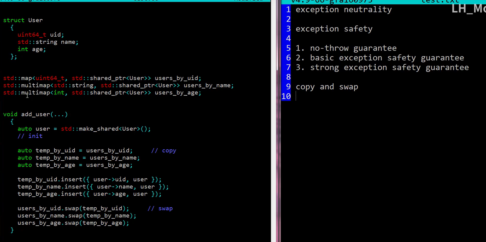

# lh_mouse专栏学习

# 参考

- b站专栏：https://space.bilibili.com/408093637/channel/seriesdetail
- 个人主页：https://github.lhmouse.com/ 
- github：https://github.com/lhmouse/

# 例子

## 变参模板实现的归并排序

- b站：https://www.bilibili.com/video/BV11E411T74B
- code

```c++
#include "common.h"
#include <utility>
#include <iterator>
#include <algorithm>
//c++14
// std::integer_sequence
template<int... valsT> struct iseq{};

template<int... valsT> void print(iseq<valsT...>)
{
    static constexpr int vals[] = {valsT...};
    std::copy(std::begin(vals), std::end(vals), ::std::ostream_iterator<int>(std::cout, " "));
    std::endl(std::cout);
}


// 1 divide
template<typename F, typename S> struct divide;

template<int...fT, int xT, int... sT> struct divide<iseq<fT...>, iseq<xT, sT...>>
    : std::conditional<(sizeof...(fT) < 1 + sizeof...(sT)),
                        divide<iseq<fT..., xT>, iseq<sT...>>,
                        std::pair<iseq<fT...>, iseq<xT, sT...>>
                      >::type
{};      

template<int... fT> struct divide<iseq<fT...>, iseq<>>
    : std::pair<iseq<fT...>, iseq<>>
{};    


// 2 merge
template<typename R, typename F, typename S> struct Merge;

template<int... rT> struct Merge<iseq<rT...>, iseq<>, iseq<>>
    : std::enable_if<1, iseq<rT...>>
{ };

template<int... rT, int xT, int... fT> struct Merge<iseq<rT...>, iseq<xT, fT...>, iseq<>>
    : std::enable_if<1, iseq<rT..., xT, fT...>>
{};

template<int... rT, int yT, int... sT> struct Merge<iseq<rT...>, iseq<>, iseq<yT, sT...>>
    : std::enable_if<1, iseq<rT..., yT, sT...>>
{};

template<int... rT, int xT, int... fT, int yT, int... sT> struct Merge<iseq<rT...>, iseq<xT, fT...>, iseq<yT, sT...>>
    : std::conditional<(xT < yT),
                            Merge<iseq<rT..., xT>, iseq<fT...>, iseq<yT, sT...> >,
                            Merge<iseq<rT..., yT>, iseq<xT, fT...>, iseq<sT...> >
                      >::type     
{};


// 3 sort

template<typename S> struct sort;

template<> struct sort<iseq<>>
    : std::enable_if<1, iseq<>>
{};


template<int xT> struct sort<iseq<xT>>
    : std::enable_if<1, iseq<xT>>
{};

template<int xT, int yT> struct sort<iseq<xT, yT>>
    : std::conditional<(xT < yT),
                        iseq<xT, yT>,
                        iseq<yT, xT>
                       >                    
{};

template<int... sT> struct sort<iseq<sT...>>
    : Merge<iseq<>, typename sort<typename  divide<iseq<>, iseq<sT...>>::first_type >::type, 
                    typename sort<typename  divide<iseq<>, iseq<sT...>>::second_type >::type
                    >
{
    //using D = divide<iseq<>, iseq<sT...>>;
    //using M = merge<iseq<>, sort<typename D::first_type>, sort<typename D::second_type>>;
    //using type = typename M::type;
};


int main()
{
    //print(iseq<1,6,8,3,9,7,2,5,4>());
    using M = Merge<iseq<>, iseq<1, 9, 5>, iseq<3, 8, 7>>;
    print(M::type());

    using D = divide<iseq<>, iseq<1,6,8,3,9,7,2,5,4>>;
    print(D::first_type());
    print(D::second_type());

    print(::sort<iseq<1,6,8,3,9,7,2,5,4>>::type());
    

}    
```

## 变参模板实现的快速排序

- 视频：https://www.bilibili.com/video/BV1ME411K7Di

```c++
#include "common.h"

// std::integer_sequence
template<int... valsT> struct iseq{};

template<int... valsT> void print(iseq<valsT...>)
{
    static constexpr int vals[] = {valsT...};
    std::copy(std::begin(vals), std::end(vals), ::std::ostream_iterator<int>(std::cout, " "));
    std::endl(std::cout);
}

template<typename L, typename R, int pT, typename S> struct partition;

template<int... lT, int... rT, int pT> struct partition<iseq<lT...>, iseq<rT...>, pT, iseq<>>
    : std::pair<iseq<lT...>, iseq<rT...>>    
{};


template<int... lT, int... rT, int pT, int xT, int... sT> struct partition<iseq<lT...>, iseq<rT...>, pT, iseq<xT,sT...>>
    : std::conditional<(xT < pT),
                        ::partition<iseq<lT..., xT>, iseq<rT...>, pT, iseq<sT...> >,
                        ::partition<iseq<lT...>, iseq<rT..., xT>, pT, iseq<sT...> > 
    >::type                    
{};


template<typename L, int pT, typename R> struct join;
template<int... lT, int pT, int... rT> struct join<iseq<lT...>, pT, iseq<rT...>>
    : std::enable_if<1, iseq<lT..., pT, rT...>>
{};  


template<typename S> struct quick_sort;

template<> struct quick_sort<iseq<>>
    : std::enable_if<1, iseq<>>
{};

template<int xT> struct quick_sort<iseq<xT>>
    : std::enable_if<1, iseq<xT>>
{};

template<int xT, int yT> struct quick_sort<iseq<xT,yT>>
    : std::conditional<(xT < yT),
                        iseq<xT, yT>,
                        iseq<yT, xT>
                       >                    
{};

template<int xT, int yT, int pT, int...sT> struct quick_sort<iseq<xT, yT, pT, sT...>>
    : join<typename quick_sort<typename partition<iseq<>, iseq<>, pT,  iseq<xT, yT, sT...>>::first_type>::type 
           ,pT 
           ,typename quick_sort<typename partition<iseq<>, iseq<>, pT,  iseq<xT, yT, sT...>>::second_type>::type >            
{};


int main()
{
    //print(iseq<1,6,8,3,9,7,2,5,4>());

    print(::quick_sort<iseq<1,6,8,3,9,7,2,5,4>>::type());
    
}    
```

## 分支消除

- 视频：https://www.bilibili.com/video/BV1L7411f7g3

```c++
#include "common.h"


#if 0

int vtod(int v)
{
    if(v < 10)
        return v + 48; // "数字转字符",'0' - '9'
    else
        return v + 55; // 16进制的字母， 'A' - 'F'       
}

#else

int vtod(int v)
{
    return v + 55 - (((v-10) >> 15) & 7) ;
}

#endif

#if 0
int xabs(int n)
{
    if(n < 0)
        return -n;

    return n;
}
#else
#include <climits>

int xabs(int n)
{
    int s = n >> (WORD_BIT -1);
    return (n^s) - s;
}
#endif

int main()
{
    for(int i = 0; i < 16; i++)
    {
        printf("%c ", vtod(i));
    }
    putchar('\n');

    printf("%d %d %d", xabs(+123), xabs(0), xabs(-123));

}
```

## 异常

- 视频：https://www.bilibili.com/video/BV13C4y1W78H

```c++
#include "common.h"
char * read_file(const char* path)
{
    FILE * fp = fopen(path, "r");
    if(!fp)
        return NULL;
    
    size_t cap = 1000;
    char * str = (char *)malloc(cap + 1);
    if(!str)
    {
        fclose(fp);
        return 0;
    }
    
    cap = fread(str, 1, cap , fp);
    if(!cap && ferror(fp))
    {
        free(str);
        fclose(fp);
        return 0;
    }

    str[cap] = 0;
    fclose(fp);
    return str;
}
std::unique_ptr<char[]> read_file_s(const char * path)
{
    std::ifstream ifs;
    ifs.exceptions(std::ios::failbit);
    ifs.open(path);

    size_t cap = 1000;
    std::unique_ptr<char[]> str(new char[cap + 1]);
    ifs.get(str.get(), cap + 1, 0);

    return str;
}


int main(void)
{
#if 0
    char * s = read_file("hello.txt");
    if(!s)
    {
        perror("read_file");
        return EXIT_FAILURE;
    }
    printf("data:\n%s", s);
    free(s);
#else
    try
    {
        auto s = read_file_s("hello.txt");
        printf("data:\n------\n%s", s.get());        
    }
    catch(std::exception & e)
    {
        printf("error:%s\n", e.what());
        return EXIT_FAILURE;
    }
#endif
    return EXIT_SUCCESS;
}
```

