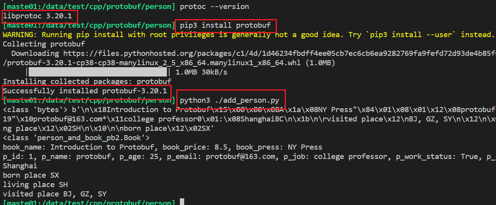

# protobuf的使用

## protobuf环境安装

- 编译安装的时间长

```bash
wget https://github.com/protocolbuffers/protobuf/releases/download/v3.20.1/protobuf-all-3.20.1.tar.gz
tar -zxvf protobuf-all-3.20.1.tar.gz
./configure --prefix=/usr/local
make
make check
make install
# 测试protobuf是否安装正常
protoc --version
```

## 基本用法

- github：https://github.com/protocolbuffers/protobuf/
- 官方链接：https://developers.google.com/protocol-buffers/docs/overview
- CSDN翻译文档：https://so.csdn.net/so/search?q=ProtoBuf&t=blog&u=chuifuhuo6864
- 官方文档：api参考：http://code.google.com/apis/protocolbuffers/docs/reference/overview.html
- 官方文档：报文格式编码：http://code.google.com/apis/protocolbuffers/docs/encoding.html
- 官方文档：CPP： https://developers.google.com/protocol-buffers/docs/cpptutorial 
- 官方文档proto3：https://developers.google.com/protocol-buffers/docs/proto3
- 简单参考这个：https://www.cnblogs.com/silvermagic/p/9087539.html
- 官方python文档： https://developers.google.com/protocol-buffers/docs/reference/python-generated 
- python入门：https://mp.weixin.qq.com/s/QbLq5gVKjaHyoaY2Vv5MRQ
- c++ linux入门：https://zhuanlan.zhihu.com/p/451390348
- Protobuf3语法详解：https://blog.csdn.net/qq_36373500/article/details/86551886

## case1 

- 路径：:/data/test/cpp/protobuf
- 参考：protobuf 序列化原理，运行时反射 https://www.bilibili.com/video/BV1Wv41117pT

### test.proto

```protobuf
syntax = "proto2";
package test;
message something
{
    optional int32 num = 1;
    repeated string strs = 2;
}
```

### 生成c++文件

```bash
 protoc  test.proto --cpp_out=./
```

### main.cpp

```cpp
// 一些公共头文件
#include "../header/common.h"
#include "test.pb.h"

int main()
{
    test::something msg;
    msg.set_num(42);
    msg.add_strs("hello");
    msg.add_strs("world");
    msg.PrintDebugString();
    
    
}
```

### 编译运行

- 注意需要将静态库copy过来，不然有可能找不到库
- 要pthead库
- 参考：https://www.cnblogs.com/LiuYanYGZ/p/14308342.html

```ba
cp /usr/local/lib/libprotobuf.a .
g++ *.cpp *.cc -g -lpthread -L./ -lprotobuf  -o test
./test

# 运行结果
num: 42
strs: "hello"
strs: "world"
```

## case 2：python：person

- 参考：https://mp.weixin.qq.com/s/QbLq5gVKjaHyoaY2Vv5MRQ

- 路径：/data/test/cpp/protobuf/person

- 要点

  ```bash
  # 要用python3 系列
  # 用用pip3 先安装protobuf，貌似下载编译安装后无法用
  # 建议先用pip3安装，确定版本后，再找对应的版本下载编译安装protoc
  pip3 install protobuf
  python3 ./add_person.py 
  ```

  vscode的terminal运行后的效果

  

## case3：cpp：addressbook

- 参考：https://zhuanlan.zhihu.com/p/425528252
- 路径：/data/test/cpp/protobuf/address

## case4：CPP：官方例子

- 视频：https://www.bilibili.com/video/BV1dT4y137DP
- 官方地址：https://developers.google.com/protocol-buffers/docs/cpptutorial
- CSDN翻译地址：https://blog.csdn.net/chuifuhuo6864/article/details/100891172
- 例子代码：在官方包的example目录下有
- 本地路径：/data/test/cpp/protobuf/offical

```bas
cp ../protobuf-3.20.1/examples/add*.cc  ../protobuf-3.20.1/examples/*.proto .
protoc *.proto --cpp_out=./
g++ add*.cc -g -L../ -lprotobuf -o add_person
g++ addressbook*.cc list_people.cc -g -L../ -lprotobuf -o list_people
```

### addressbook.proto

```proto
// See README.txt for information and build instructions.
//
// Note: START and END tags are used in comments to define sections used in
// tutorials.  They are not part of the syntax for Protocol Buffers.
//
// To get an in-depth walkthrough of this file and the related examples, see:
// https://developers.google.com/protocol-buffers/docs/tutorials

// [START declaration]
syntax = "proto3";
package tutorial;

import "google/protobuf/timestamp.proto";
// [END declaration]

// [START java_declaration]
option java_multiple_files = true;
option java_package = "com.example.tutorial.protos";
option java_outer_classname = "AddressBookProtos";
// [END java_declaration]

// [START csharp_declaration]
option csharp_namespace = "Google.Protobuf.Examples.AddressBook";
// [END csharp_declaration]

// [START go_declaration]
option go_package = "github.com/protocolbuffers/protobuf/examples/go/tutorialpb";
// [END go_declaration]

// [START messages]
message Person {
  string name = 1;
  int32 id = 2;  // Unique ID number for this person.
  string email = 3;

  enum PhoneType {
    MOBILE = 0;
    HOME = 1;
    WORK = 2;
  }

  message PhoneNumber {
    string number = 1;
    PhoneType type = 2;
  }

  repeated PhoneNumber phones = 4;

  google.protobuf.Timestamp last_updated = 5;
}

// Our address book file is just one of these.
message AddressBook {
  repeated Person people = 1;
}
// [END messages]
```

### add_person.cc

```cpp
// See README.txt for information and build instructions.

#include <ctime>
#include <fstream>
#include <google/protobuf/util/time_util.h>
#include <iostream>
#include <string>

#include "addressbook.pb.h"

using namespace std;

using google::protobuf::util::TimeUtil;

// This function fills in a Person message based on user input.
void PromptForAddress(tutorial::Person* person) {
  cout << "Enter person ID number: ";
  int id;
  cin >> id;
  person->set_id(id);
  cin.ignore(256, '\n');

  cout << "Enter name: ";
  getline(cin, *person->mutable_name());

  cout << "Enter email address (blank for none): ";
  string email;
  getline(cin, email);
  if (!email.empty()) {
    person->set_email(email);
  }

  while (true) {
    cout << "Enter a phone number (or leave blank to finish): ";
    string number;
    getline(cin, number);
    if (number.empty()) {
      break;
    }

    tutorial::Person::PhoneNumber* phone_number = person->add_phones();
    phone_number->set_number(number);

    cout << "Is this a mobile, home, or work phone? ";
    string type;
    getline(cin, type);
    if (type == "mobile") {
      phone_number->set_type(tutorial::Person::MOBILE);
    } else if (type == "home") {
      phone_number->set_type(tutorial::Person::HOME);
    } else if (type == "work") {
      phone_number->set_type(tutorial::Person::WORK);
    } else {
      cout << "Unknown phone type.  Using default." << endl;
    }
  }
  *person->mutable_last_updated() = TimeUtil::SecondsToTimestamp(time(NULL));
}

// Main function:  Reads the entire address book from a file,
//   adds one person based on user input, then writes it back out to the same
//   file.
int main(int argc, char* argv[]) {
  // Verify that the version of the library that we linked against is
  // compatible with the version of the headers we compiled against.
  GOOGLE_PROTOBUF_VERIFY_VERSION;

  if (argc != 2) {
    cerr << "Usage:  " << argv[0] << " ADDRESS_BOOK_FILE" << endl;
    return -1;
  }

  tutorial::AddressBook address_book;

  {
    // Read the existing address book.
    fstream input(argv[1], ios::in | ios::binary);
    if (!input) {
      cout << argv[1] << ": File not found.  Creating a new file." << endl;
    } else if (!address_book.ParseFromIstream(&input)) {
      cerr << "Failed to parse address book." << endl;
      return -1;
    }
  }

  // Add an address.
  PromptForAddress(address_book.add_people());

  {
    // Write the new address book back to disk.
    fstream output(argv[1], ios::out | ios::trunc | ios::binary);
    if (!address_book.SerializeToOstream(&output)) {
      cerr << "Failed to write address book." << endl;
      return -1;
    }
  }

  // Optional:  Delete all global objects allocated by libprotobuf.
  google::protobuf::ShutdownProtobufLibrary();

  return 0;
}

```

### list_people.cc

```cpp
// See README.txt for information and build instructions.

#include <fstream>
#include <google/protobuf/util/time_util.h>
#include <iostream>
#include <string>

#include "addressbook.pb.h"

using namespace std;

using google::protobuf::util::TimeUtil;

// Iterates though all people in the AddressBook and prints info about them.
void ListPeople(const tutorial::AddressBook& address_book) {
  for (int i = 0; i < address_book.people_size(); i++) {
    const tutorial::Person& person = address_book.people(i);

    cout << "Person ID: " << person.id() << endl;
    cout << "  Name: " << person.name() << endl;
    if (person.email() != "") {
      cout << "  E-mail address: " << person.email() << endl;
    }

    for (int j = 0; j < person.phones_size(); j++) {
      const tutorial::Person::PhoneNumber& phone_number = person.phones(j);

      switch (phone_number.type()) {
        case tutorial::Person::MOBILE:
          cout << "  Mobile phone #: ";
          break;
        case tutorial::Person::HOME:
          cout << "  Home phone #: ";
          break;
        case tutorial::Person::WORK:
          cout << "  Work phone #: ";
          break;
        default:
          cout << "  Unknown phone #: ";
          break;
      }
      cout << phone_number.number() << endl;
    }
    if (person.has_last_updated()) {
      cout << "  Updated: " << TimeUtil::ToString(person.last_updated()) << endl;
    }
  }
}

// Main function:  Reads the entire address book from a file and prints all
//   the information inside.
int main(int argc, char* argv[]) {
  // Verify that the version of the library that we linked against is
  // compatible with the version of the headers we compiled against.
  GOOGLE_PROTOBUF_VERIFY_VERSION;

  if (argc != 2) {
    cerr << "Usage:  " << argv[0] << " ADDRESS_BOOK_FILE" << endl;
    return -1;
  }

  tutorial::AddressBook address_book;

  {
    // Read the existing address book.
    fstream input(argv[1], ios::in | ios::binary);
    if (!address_book.ParseFromIstream(&input)) {
      cerr << "Failed to parse address book." << endl;
      return -1;
    }
  }

  ListPeople(address_book);

  // Optional:  Delete all global objects allocated by libprotobuf.
  google::protobuf::ShutdownProtobufLibrary();

  return 0;
}

```


