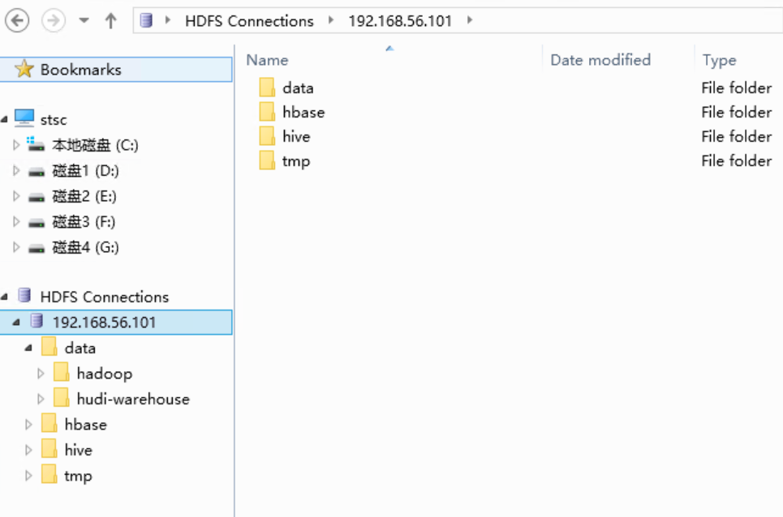

# 常用技术网站和工具

# 0 效率

## github

### github仓库限制

结论：单个文件100M（超过可以用工具），整个仓库100G，够用了

- github给每人分配了多大的存储空间：https://www.zhihu.com/question/29514576/answer/972520133
- 解决Github单个文件100M以下的限制 ：https://blog.csdn.net/xxxvvvop/article/details/83098669

## 26日

# 1 大数据

## Hadoop

### hdfs

- hdfs explorer：https://blog.csdn.net/Cypher_Studio/article/details/108605917，
  - 本地下载：[HDFS Explorer](/res/HDFS%20Explorer%20Installer.msi":ignore")

## Flink

### 教程

- flink教程：https://www.youtube.com/playlist?list=PLJUyBVA38kfeqYTB4ziEbIIUVeBQKV5rY

## 学习

### bilibili专栏视频

### 专栏作家

- 王知无：https://juejin.cn/user/3368559357991031
- 过往记忆大数据：https://www.iteblog.com/
- 某位大神的专栏：https://dirtysalt.github.io/html/，各种专业收藏
- 

### 教程

- 一个比较全的大数据入门学习网站：https://www.cnblogs.com/frankdeng/
- 大数据成神之路：https://github.com/authorcamus/God-Of-BigData https://gitee.com/caipb/God-Of-BigData

# 2 语言

## JAVA

### 工具

- 阿里java优化工具Arthas：https://arthas.aliyun.com/doc/

## C++

# 3 通用技术

## 测试工具

### RPC

- 【go-zero】gRpc debug调试工具 BloomRpc 与 Grpc UI 帮助微服务 rpc 开发便捷调试 https://blog.csdn.net/wanglei19891210/article/details/124624428
- postman调试rpc接口:https://blog.csdn.net/yzpbright/article/details/118597376

## 开发工具

### VScode

#### 快捷键

- https://blog.csdn.net/weixin_39787089/article/details/110472597

### google开发套件

-  [protobuf的使用](/language/util/protobuf.md)
- [benchmark](/language/util/google-benchmark.md)
- [gtest](/language/util/google-test.md)
- [gflag](/language/util/gflag.md)

## RPC

### thrift

- 官网：https://thrift.apache.org/
- 

## Linux

### Release Edition

- Fedora/RHEL/CentoOS/CentoOS Stream/的区别 https://mp.weixin.qq.com/s?__biz=MzU1NDA4NjU2MA==&mid=2247561093&idx=1&sn=ba67cba85577dc0798e4b4f62b7051d8

## 计算机基础知识

### 数据结构

- 数据结构在线演示 https://www.cs.usfca.edu/~galles/visualization/about.html

## 未分类

### 

# 资源

## 前端

- 前段知识图谱+b站免费资源：https://gitee.com/jishupang/web_atlas

## 镜像仓库

|     网站名     | 地址                                                         | 备注 |
| :------------: | ------------------------------------------------------------ | :--: |
|     华为云     | https://repo.huaweicloud.com/   - java jdk：https://repo.huaweicloud.com/java/jdk/  - kubernets：https://repo.huaweicloud.com/kubernetes/ |      |
|     阿里云     | https://developer.aliyun.com/mirror/                         |      |
|     腾讯云     | https://mirrors.cloud.tencent.com/                           |      |
| 北京外国语大学 | https://mirrors.bfsu.edu.cn/                                 |      |
|    清华大学    | https://mirrors.tuna.tsinghua.edu.cn/                        |      |

# 4 综合

## 专业网站

- Apache Confluence：https://cwiki.apache.org/confluence

  -

## 工具

- json在线解析：https://www.json.cn/
- 

