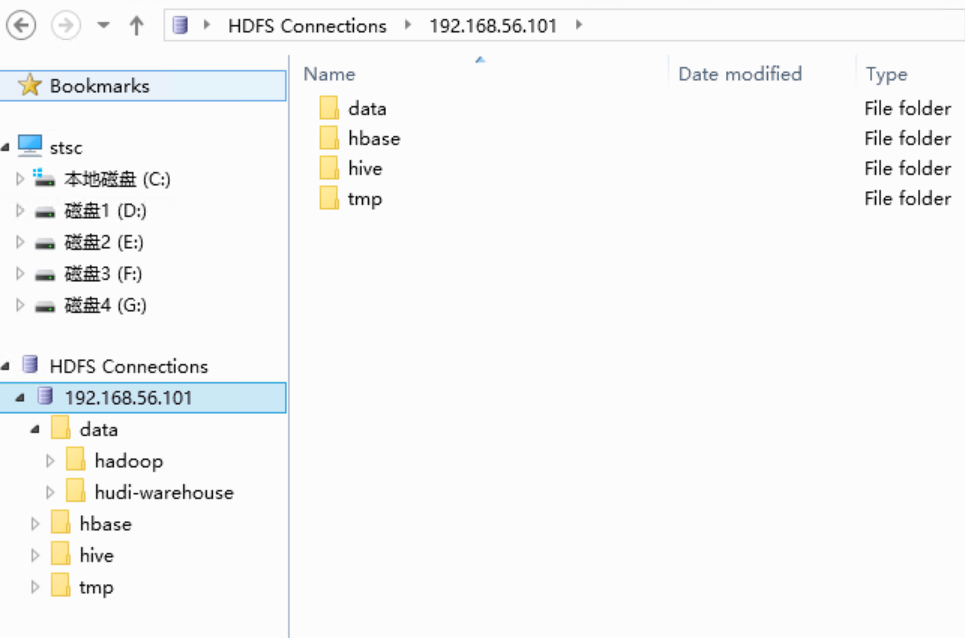

# 流水账

# 2022年6月

## 14日

### doris源代码阅读

- 第9讲：https://www.bilibili.com/video/BV15i4y1Z7AL/ 元数据管理
- 第8讲：https://www.bilibili.com/video/BV1Lr4y1Q7Ho/ 查询优化
- 第7讲：https://www.bilibili.com/video/BV1V44y1Y7Ro/ 函数

## 12日

### doris源代码阅读

- 总算整完了第五讲：https://www.bilibili.com/video/BV1B44y1i7RZ
- 第六讲：https://www.bilibili.com/video/BV13F411Y7Je

### 最佳生产力实践

总算搞定了算是最完美的生产力最佳的方案了，基本的方案如下

- 一套本地环境
  - 搞了一个HP的笔记本，价格便宜量又足，虽然内存（16g）和硬盘（512g）还是太少，jd的链接：https://item.jd.com/100039994558.html
    - 优点：屏好、大厂质量和支持、轻/薄、接口强悍（多、usb3.2，usb typec充电）、性能强悍（ddr4 3200，pci 4.0 ssd接口/没测试过目测还行，12代 i5 h系列、本来想选i7，但是其他都不能扩充，算了）、指纹
    - 缺点：不可扩充（基本够用）
    - 虚拟机问题：本来想多虚拟机，方便分布式环境测试，没有满意的笔记本选择，还是放在云上环境；本地来一个主要的开发环境，可以考虑来两个小的虚拟机（单机：2g、2core）
  - 搞定各种网络问题
    - 公司内网络权限
    - 公司内科学上网wifi
    - 家里信号不好问题：换了一个小米的wifi（价格便宜，量又足，在[这里](https://item.jd.com/100002688183.html)），2.4g和5g同一个信号秒解决问题，还解决了千兆网络的问题
    - github访问问题：用新的https的key/美服科学上网
- 两套开发测试环境
  - 虚拟机：
    - 网络：host only（主机可以访问虚拟机）、nat（虚拟机可以访问外网）
    - 镜像：
      - 两套环境相同，可以两套环境可以共用，不过启动的服务不同
      - master ：100g os image、200g code + docs image、optional disk image
  - 本地环境
    - windows 11 + 虚拟机（Virtual box） 1 master（8g，4core，常开） + 2 node（2g，2core，一般不用开）
    - 虚拟机
      - 镜像：从云上环境直接复制过来，不用在进行各种环境安装，直接可以用；去掉一些不需要的服务启动
      - 磁盘扩充：基本够用，不常用的建立一些usb硬盘的镜像，动态扩展
  - 云上环境
    - windows sever 2016 + 虚拟机（Virtual box）1 master（16g、8 core） + 4 node（8g、4 core）
    - 虚拟机：与本地环境的区别（安装了各种大数据服务、公共服务），配置高于本地环境（内存和core多）
  - 协同开发
    - 文档编写：本地（虚拟机，这样可以保持docs这个镜像和网上环境具有可替换性/都使用linux git进行操作，避免两套技术栈） -> github -> 云上环境，解决了各个环境不一致的问题和网络问题造成的写文档很郁闷的问题（慢、卡）
    - 代码
      - 浏览：本地虚拟机、samba：挺快的，方便，构建产物（proto）也可以一起看
      - 编译：本地虚拟机/远程虚拟机均可，虚拟机内尽量采用docker环境进行编译
      - 测试：本地测试单元测试/功能测试为主、分布式测试可以去云上虚拟机环境

## 4日

### rpc调试工具

一直想找找看看把rpc本地化的方案，如通过线程模型模拟rpc请求，这样本地调试、测试方便很多，如果没有还是通过单元测试/集群测试环境来弄吧

- 【go-zero】gRpc debug调试工具 BloomRpc 与 Grpc UI 帮助微服务 rpc 开发便捷调试 https://blog.csdn.net/wanglei19891210/article/details/124624428
- postman调试rpc接口:https://blog.csdn.net/yzpbright/article/details/118597376

### kylin on parquet

看了一下百度网盘里面的分享视频，主要是方案介绍和全局字典的内容，感觉全局字典这个可以

- 方案：分桶存储、id应该是桶id+内部id，感觉可以用两个varint表示
- 用了hdfs存储，副本一致性问题解决了，如果这个自己弄还比较麻烦

# 2022年5月

## 28日

### 虚拟机共享文件

- 最后找了各种问题，发现是centos要安装xwindows系统才能实现这个功能。。


## 27日

### github仓库限制

结论：单个文件100M（超过可以用工具），整个仓库100G，够用了

- github给每人分配了多大的存储空间：https://www.zhihu.com/question/29514576/answer/972520133
- 解决Github单个文件100M以下的限制 ：https://blog.csdn.net/xxxvvvop/article/details/83098669

## 26日

### 跳表

- [跳表skiplist](/general/theory/skiplist.md)


### doris源代码

- 把这个看完了，更新到笔记里面了：Apache Doris 源码阅读与解析系列直播——第2讲 Stream Load 导入任务的执行流程: https://www.bilibili.com/video/BV1bU4y1w76e

## 25日

### 了解apipost

- https://time.geekbang.org/dailylesson/detail/100110720?utm_term=hezuo0509&utm_source=geektime-app&utm_medium=meiriyike

### 了解RocksDB

- RocksDB内部数据组织方式及性能压测: https://www.bilibili.com/video/av92909960
- [rocksdb学习笔记](/bigdata/rocksdb/rocksdb.md)

### varint

- Varint https://blog.csdn.net/zgaoq/article/details/103182952
- varint压缩算法详解  https://blog.csdn.net/weixin_43708622/article/details/111397322

## 22日

### 办公环境

- 在不同环境条件（公司、家、南山家）下切换，一直在看如何统一成一套环境，不然上下文切换的代价太大了，在一个环境下的基本诉求

  - 基本诉求：看视频（B站）、写博客（MD）、源代码管理、开发/测试环境（1个主的虚拟环境、2个次的虚拟环境）
  - 机器配置要求：32G内存（虚拟机开发/测试环境：8+4+4）、20核以上cpu（虚拟机开发/测试环境：6+3+3）、存储（整体：512G+2T，虚拟机开发/测试环境：500G + 100G + 100G ，历史文档/代码：1T+），屏幕（500nit+，DPI > 98%）

- 想购入一台笔记本搞定问题，相较于目前方案

  - 优势：所有内容放笔记本上，不需要切换环境；可以双屏；

  - 劣势：笔记本比较难选，需要i7-12700h以上机型，内存和硬盘需要自己弄，投入较大；笔记本需要背着，有点辛苦；

  - 备选笔记本：

    - ROG幻16：https://item.jd.com/100018322085.html，需要加16G以上内存，2T加硬盘，估计12K+投入
    - 华硕无双：https://item.jd.com/100035259546.html，需要加16G以上内存，2T加硬盘，估计7K+投入
    - 华硕灵耀Pro16 ：https://item.jd.com/100015624453.html 10K，这款cpu是amd的，差点（ 5900HX，8C/16T ），其他不用加了，被12代i5秒了

  - 目前先用着吧，看情况，笔记本总要买一个的，不然太不方便了，公司笔记本有点差，而且各种管控太麻烦，参考资料：

    - 如何评价 ROG 星云原画屏？：https://www.zhihu.com/question/509929000
    - 还是oled屏吧，miniled的可视角太小了

      

- 现有方案
  - 优点：省钱、省力
  - 缺点
    - 文档更新四种方式：目前文档在master（centos 8）和github上都有保存，维护目前以方案3为主，辅以方案2
      - 方案1：拉github：更新不方便，版本同步麻烦，不能更新完了就可见，这个还是算了
      - 方案2：远程桌面登录到云服务器：窗口有点怪，也受限于网络环境、输入法输入有点慢
      - 方案3：sshfs到本地：有时候网络不好时很崩溃，其他时刻其实还好
      - 方案4：vscode直接ssh远程到云服务器更新（客户端版、web版本均可）：更新普通文件还行，没有typora好用，另外就是图片不方便
    - 视频观看
      - 这个方式最大的问题，只能在本地观看，用远程桌面看视频，你懂的
    - 源代码管理
      - 各个机器上都保存一份，尽量在本地看代码
      - 自己维护的代码：
        - vscode客户端远程到云服务器上修改编译，本地不保存
        - 不敏感的代码后面放git上一份，避免丢失

## 20日

### doris向量化引擎优化

- 视频：https://www.bilibili.com/video/BV1Q5411S7Nd

- 优化方向


- 优化方法：

  - 两种，一个注意代码的写法，编译器自动向量化（大多数、简单场景）；直接用simd指令集（少数、复杂场景）
  - 大的数据量的计算，要逐行看

  

  

- 

## 19日

### 日常

- Apache Doris 极速 1.0 版本特性解析与未来规划：https://www.bilibili.com/video/BV1V54y1Z7GY
  - 内存管理科学了不少


- StarRocks 社区& OceanBase 社区& CloudCanal 社区：如何构建简单高效的现代化数据栈 https://www.bilibili.com/video/BV1ju411r7UX

  - etl中，t的能力抽象出来，这个就是cloudcanal干的事情

  

- StarRocks 极客之夜：https://www.bilibili.com/video/BV1w34y1x76G


- 深入解析OceanBase数据库：https://www.bilibili.com/video/BV1DT4y1J7zw
  - 优化两阶段提交机制：协调者不写日志；二阶段多数派写日志成功即返回客户端成功，延时进行第二阶段提交；
  - 异地的机房要是少数派，不然无法享受本地多数派提交成功较少延时的特性；


## 18日

### phmap

- github：https://github.com/greg7mdp/parallel-hashmap
- 教程：https://cloud.tencent.com/developer/article/1839213
- starrocks源代码：be\src\exec\vectorized\aggregate\agg_hash_map.h

## 17日

### github

- github--pr 详细步骤 https://blog.csdn.net/qianfengkui/article/details/110820779
- github提交pr https://blog.csdn.net/gentleman_hua/article/details/123816150
- Github 使用经典问题：如何同步 fork 项目原仓库的更新 https://zhuanlan.zhihu.com/p/291845721
- 把网站相关的内容搬到github了，再也不用担心了：https://github.com/tommyyan2020/public
- 总结了一下：[git相关](/general/git.md)

## 16日

### tars了解

- TARS整体框架简介：https://www.bilibili.com/video/BV1MJ411E7Gb
  - 2020年初的教程，有点老，看看吧
- TARS部署：https://www.bilibili.com/video/BV1Wz4y1178G
- tars c++入门实践：https://www.bilibili.com/video/BV1ZK4y1m7UE


## 14日

### 电脑环境整理

- 把sshfs一套环境整回家里电脑了
- vs 项目管理插件和一些项目的同步（主要是github相关的）

### 日常

- linux 红黑树应用： https://www.bilibili.com/video/BV1Lb4y1n7nx?spm_id_from=333.999.0.0 
- 看了一下这个：https://blog.csdn.net/Jiangtagong/article/details/116201951


## 13日

### Markdown All in One

- 试用了一下，完全不咋地，还是typora好

### 图片无权限问题

sshfs带来的问题，vscode 的ssh没有问题，主要问题表现在：

- 用了一个544:1049089的用户创建文件，默认root组可以，其他组、其他用户无权限，跟linux默认的权限机制不符
- 对于文本文件无影响
- 对于图像文件，需要将目录权限增加可执行(x)，图片文件增加可读可执行


- 解决方法：crontab先搞个定时任务吧，后面研究一下sshfs

  ```ba
  * * * * * chmod -R a+rx /data/docs/public/
  ```

  

### redis学习

-  [redis安装](/bigdata/redis/install)
- 去github上下载了一把源码，后面结合源码一起看一下

- 

### starrocks最新分享

- StarRocks 技术内幕：实时更新与极速查询如何兼得 https://mp.weixin.qq.com/s/9Wm5piUx9xNeHD7WjYa1lA
- 一篇不错的hash算法的评测分享：HashTable性能测试(CK/phmap/ska)： https://dirtysalt.github.io/html/hashtable-perf-comparison.html#orge8d1c46

## 12日

### 常用数据结构学习

- b站：后端开发常见层式结构：时间轮、跳表、LSM-Tree|海量并发的定时任务组织：时间轮|高并发读写的有序结构组织：跳表|空间利用率以及写性能高的 https://www.bilibili.com/video/BV17U4y1S7hb


### cmake学习完成

- 文档整理：[cmake使用](/language/cpp/cmake)

## 11日

### 几个遗留问题

#### 多个key通过ssh访问不同的服务器

- 参考：http://rem486.top/server/env/ssh-password-free-login.html#%E8%AE%BE%E7%BD%AE%E5%A4%9A%E4%B8%AA-ssh-key
- 主要配置
  - 注意是private key，不是pub那个
  -  ServerAliveInterval 这个要加上，不然容易被防呆干掉连接

```yaml
Host alias                      # 关键词
    HostName hostname           # 主机地址
    Port port                   # 指定端口
    User root                   # 用户名
    IdentityFile ~/.ssh/xxx_rsa # 认证文件
    StrictHostKeyChecking no    # 关闭提示
    ServerAliveInterval 60
```


#### js cdn托管慢的问题

- 一些cdn托管的js慢的问题：已经完成了
- 还要一个基于node的35729端口的自动刷新的js，其实用不着，不知道怎么去掉，先不管了
- 更新了一下nginx的配置，貌似大文件缓存住了，一些静态文件也不需要走node了，感觉都可以不走node，只是md的缓存策略可以设置为不缓存或者很短，毕竟都不大

```nginx
        # 特定文件设置强缓存
        location ~* \.(css|js|png|jpg|jpeg|gif|gz|svg|mp4|ogg|ogv|webm|htc|xml|woff)$ {
             root /data/docs/public/;
             proxy_http_version 1.1;
             #proxy_set_header Upgrade $http_upgrade;
             #proxy_set_header Connection "Upgrade";
             proxy_set_header Host $host;
             #proxy_pass http://192.168.56.101:3000;
             access_log off;
             add_header    Cache-Control  max-age=360000; # 4天
        }    
```


#### sshfs超时问题

要防呆

- sshfs超时断开的问题：准备搞个python程序去刷，目测应该可以了

```python
import os
import time

def print_file_info(file_info):
    file_path = os.path.join("y:\\", file_info)
    print(file_path)

while(True):
    file_list = os.listdir("y:\\")
    f = open("y:\\keepalive.txt", "a")
    for file_info in file_list:
        print_file_info(file_info)
    f.write(time.ctime() + "\n")
    f.close()
    print(time.ctime())
    time.sleep(30)

```

- 将python加到系统的Path路径：

  

  

```powershell
# Start-Job -ScriptBlock {python C:\users\01393829\PycharmProjects\sshfs-keepalive\main.py}
python C:\users\01393829\PycharmProjects\sshfs-keepalive\main.py
```


## 10日

### python文件服务器

- 整理了一下以前的这个：[基于python的文件上传/下载服务](/language/python/fileserver)

### cmake学习

- 视频：https://www.bilibili.com/video/BV1fy4y1b7TC?p=16

### 调整sshd的防呆时间

- 参考：https://blog.csdn.net/ywj776199845/article/details/112325786
- 参数

```bash
vi /etc/ssh/sshd_config
# 设置成了10小时
# ClientAliveInterval 3600
# ClientAliveCountMax 10
systemctl restart sshd
systemctl status sshd 
```


### windows挂载网络盘（ssh）

- Windows 下使用 SSHFS 通过 SSH 协议挂载远程服务器目录：https://blog.xieqk.com/posts/505416489.html
- 桌面工具不太好用，估计是端口不是21的缘故


## 6日

- vi/vim使用鼠标
  - 不同的配置文件：~/.virc和 ~/.vimrc
  - vi不支持鼠标，vim可以但是好像也没有生效
  - 命令set mouse=a，亲测vim+xshell是可以的
  - [vi/vim中使用鼠标](/general/linux/vi-mouse)
- cpp11学习完成
- cpp14标准学习完成
  -  https://blog.csdn.net/weixin_42482896/category_10346300.html 

## 1日

### c++编译环境搭建

- [c++编译环境](/language/cpp/complie-env)：主要是完成了blade环境的搭建和测试

# 2022年4月

## 30日

### 查看默认g++的std版本

- 参考：https://blog.csdn.net/u010168781/article/details/105440100/
- 代码：/data/test/cpp/stdversion/test.sh
- 本机默认的是c++14

## 29日

### cpp11学习笔记

- [C++11学习笔记](/language/cpp/cpp11)
- 51要学习完

## 28日

### C语言 ## __VA_ARGS__ 宏 

- C/C++宏定义中可变参数 __VA_ARGS__ 的理解：https://blog.csdn.net/lijian2017/article/details/104836447
- ：https://www.cnblogs.com/alexshi/archive/2012/03/09/2388453.html

## 27日

### protobuf python尝试

- 例子：https://mp.weixin.qq.com/s/QbLq5gVKjaHyoaY2Vv5MRQ

### protobuf：cpp：addressbook

- 视频：https://www.bilibili.com/video/BV1dT4y137DP
- 参考：https://zhuanlan.zhihu.com/p/425528252
- 路径：/data/test/cpp/protobuf/address

### protobuff学习完成

输出文档：http://www.iotop.xyz/#/language/cpp/protobuf

## 26日

### c++反射

- 使用xmacro实现的编译器反射：[本地](/language/cpp/inner-reflect)

https://www.bilibili.com/video/BV16Z4y1T7ec

- protobuf实现的运行期反射

https://www.bilibili.com/video/BV1Wv41117pT


## 25日

### avro & protobuff &etc

- Avro和PB序列化技术： https://www.bilibili.com/video/BV1ry4y1e7Ex?spm_id_from=333.337.search-card.all.click
- CSV, JSON, AVRO,Parquet, and ORC：  https://www.jianshu.com/p/9009d652ed64
- avro 本身就是json，相较于json的优势
  - 带schema，数据更紧凑
  - 跨语言，各种常规语言支持
  - 带代码生成工具，生成对应的类名和序列化函数
- protobuf使用：

## 19日

### centos服务管理

- 参考：https://blog.csdn.net/Cloud_YC_Wei/article/details/112095766
- 如何配置一个服务：https://blog.csdn.net/yonghutwo/article/details/115160748    ，   主要存放在/etc/ ，/usr/lib，/lib三个目录下

## 18日

### spark-shell 加载文件

- 测试比较长的scala命令，可能一次测试不完，最好以文件的方式保存，spark-shell退出后会结束对应的任务
- 参考：https://wenku.baidu.com/view/75a85a9efe0a79563c1ec5da50e2524de518d0c0.html

### zk和kafka桌面工具

- offsetexplorer  2.2  https://www.kafkatool.com/download2/offsetexplorer_64bit.exe       
-  PrettyZoo  1.96  https://github.com/vran-dev/PrettyZoo/releases/download/v1.9.6/prettyZoo-win.msi


## 16日

- hdfs explorer：https://blog.csdn.net/Cypher_Studio/article/details/108605917，确实蛮好用的

  - 本地下载：[HDFS Explorer](/res/HDFS%20Explorer%20Installer.msi":ignore")

  

## 15日

- scala版本升级：由于spark不支持2.11版本的scala，升级到2.12.15版本

  - 卸载已有版本

  ```bash
  #找到最新装的scala版本并卸载
  rpm -qa|grep scala
  rpm -e scala-2.11.12-0
  ```

  - 升级安装最新版本

  ```bash
  wget https://downloads.lightbend.com/scala/2.12.15/scala-2.12.15.rpm
  rpm -ivh scala-2.12.15.rpm 
  ```

- hudi 使用

  - 注意官方推荐的hudi版本和spark版本的对应关系

    - 本机装的是spark3.1.2，需要hudi 0.10以上的版本

    ```ba
    // spark-shell for spark 3.1
    spark-shell \
      --packages org.apache.hudi:hudi-spark3.1.2-bundle_2.12:0.10.1,org.apache.spark:spark-avro_2.12:3.1.2 \
      --conf 'spark.serializer=org.apache.spark.serializer.KryoSerializer'
    ```

    

  

  

  - 

## 14日

- hdfs高可用：https://blog.csdn.net/qq_39481696/article/details/82499560
- c++ 访问HDFS：这个还可以，https://www.cnblogs.com/wangzhiyi/p/13619707.html
  - 基于JNI，需要java环境和各种jar包：官方版本，https://hadoop.apache.org/docs/r1.2.1/libhdfs.html
  - 纯C++实现：clickhouse上的，https://github.com/ClickHouse-Extras/libhdfs3

## 11日

- 完成： Join查询优化&HashJoin算子优化 | StarRocks Hacker Meetup第四期：https://www.bilibili.com/video/BV1bi4y1r7Td
- 重新开始hudi相关的学习

# 2022年3月

## 11日

昨天思路有点发散，今天继续hudi相关的内容


## 10日

### 效率

- 整理了一下相关的工具，特别是绘图相关的
- 搞了一堆七七八八的事情

### 知识面

- 京东上买了一堆书，希望有空能看看，:smile:
- 有个需要编程的游戏screeps，有空抽空研究一下
  - 中文教程：https://www.jianshu.com/p/5431cb7f42d3
  - 视频教程：https://www.bilibili.com/video/BV167411k7CT
- 一个日本恐怖电影，了解一下不同的文化的东西
  - 姑获鸟之夏：京极夏彦，https://v.youku.com/v_show/id_XMzMzNzIzMzE2.html

9日

#### notepad++插件NppFTP

- 插件已经从sourceforge迁移到了github，旧的地方只支持32位版本下载
- 教程：https://blog.csdn.net/qq_22317977/article/details/100038692
- 下载地址：https://github.com/ashkulz/NppFTP/releases/  最新版本地址：https://github.com/ashkulz/NppFTP/releases/download/v0.29.8/NppFTP-x64.zip

#### hudi学习

​	内容更新到笔记

#### scala安装

- 官网下载页面，选择需要安装的版本：https://www.scala-lang.org/download/all.html 
- 下载 https://downloads.lightbend.com/scala/2.11.12/scala-2.11.12.rpm
-  安装

```bash
rpm -ivh scala-2.11.12.rpm 
```


## 8日


#### StarRocks

- 列式存储中实时更新和查询性能如何兼得 | StarRocks Hacker Meetup 第二期 https://www.bilibili.com/video/BV1NU4y1f7HJ
- 更新笔记 

#### 效率

- [本地emoji简码](/res/emoji ": target='_blank' "),

## 7日

#### StarRocks 

- 向量化编程的精髓 | StarRocks Hacker Meetup 第一期： [DorisDB/Starrocks学习笔记](/bigdata/doris/doris-note)

#### HUDI

- [Hudi学习笔记](/bigdata/hudi/hudi-note)

# 2022年2月

## 23日

#### k8s环境恢复

etcd数据坏了，整个系统完蛋了，赶紧备份了一份数据在/var/lib/etcd下面，避免以后的无妄之灾

- kubeadm的配置

  ```yaml
  apiVersion: kubeadm.k8s.io/v1beta2
  bootstrapTokens:
  - groups:
    - system:bootstrappers:kubeadm:default-node-token
    token: abcdef.0123456789abcdef
    ttl: 24h0m0s
    usages:
    - signing
    - authentication
  kind: InitConfiguration
  localAPIEndpoint:
    advertiseAddress: 192.168.56.101
    bindPort: 6443
  nodeRegistration:
    criSocket: /var/run/dockershim.sock
    name: maste01.masterdomain
    taints:
    - effect: NoSchedule
      key: node-role.kubernetes.io/master
  ---
  apiServer:
    timeoutForControlPlane: 4m0s
  apiVersion: kubeadm.k8s.io/v1beta2
  certificatesDir: /etc/kubernetes/pki
  clusterName: kubernetes
  controllerManager: {}
  dns:
    type: CoreDNS
  etcd:
    local:
      dataDir: /var/lib/etcd
  imageRepository: registry.aliyuncs.com/google_containers
  kind: ClusterConfiguration
  kubernetesVersion: v1.20.5
  networking:
    dnsDomain: cluster.local
    podSubnet: "10.244.0.0/16"
    serviceSubnet: 10.96.0.0/12
  scheduler: {}
  
  ```

  - imageRepository：这个要改一下成阿里云镜像
  - kubernetesVersion：版本改成本机有的版本
  - podSubnet：flannel的网络，避免重新弄
  - advertiseAddress：改为本机地址

- 其他安装要点

  - 每个pod先要执行：kubeadm reset

  - 其他命令

    ```bash
    # 生成默认配置
    kubeadm config print init-defaults > kubeadm-config.yaml
    # 初始化命令
    kubeadm init --config=kubeadm-config.yaml | tee kubeadm-init.log
    # fannel插件安装
    
    #calico安装，按照网上说的换calico也没有成功
    https://projectcalico.docs.tigera.io/getting-started/kubernetes/quickstart
    ```

    - 整了一天的问题，竟然是calico插件装完了的残留没有删除掉，这个ks的kubeadm reset太恶心了：https://blog.csdn.net/mayifan0/article/details/11967456

    - 镜像拉取问题：http: server gave HTTP response to HTTPS client ：https://www.icode9.com/content-4-773893.html

    


## 22日

- Rsyslogd vs Systemd-journald https://www.jianshu.com/p/dc2ba253fa31
- master节点etcd未启动导致apiserver无法启动，原因未名，默认应该是通过docker镜像启动的：crc不一致，https://blog.csdn.net/weixin_43905458/article/details/105593877
- 基础容器pause： https://www.cnblogs.com/guigujun/p/10556508.html

## 21日

- 阿里云的centos8的yum源变化了：https://help.aliyun.com/document_detail/405635.html?spm=5176.12818093.help.dexternal.5adc16d05uG3c2
- 

## 19日

#### 几个问题

- typora乱码： 文件----选择编码重新打开，选择utf8 ---即可恢复正常了 ：https://bbs.csdn.net/topics/600406968
- typora页面宽度不够：https://www.cnblogs.com/chengkanghua/p/11084749.html

## 18日

- 安装完了阿里java调优工具：arthas，官网：https://arthas.aliyun.com/doc/

- ES安装，几个问题

  - 5以上版本，只支持非root用户，不支持-D启动了
  - 配置：config//elasticsearch.yml

  ```yaml
  cluster.name: tommy-es-cluster
  
  #  下面两个每个机器不一样
  node.name: es-node-1
  network.host: 192.168.56.103
  
  discovery.seed_hosts: ["192.168.56.103", "192.168.56.104", "192.168.56.105"]
  #这个要配置，不然第一次没法选主
  cluster.initial_master_nodes: ["es-node-1", "es-node-2"]
  
  #关掉这个玩意
  xpack.security.enabled: false
  ```

  

  - 系统选项

  ```bash
  #临时生效
  sysctl -w vm.max_map_count=262144
  ```

  ```yaml
  #永久生效
  # vim /etc/sysctl.conf
  vm.max_map_count=262144
  ```

  - 启动停止

  ```ba
  bin/elasticsearch -d
  
  ```

  

  

## 16日

- 隐私计算：顺便学习一下


## 10日

### redis

- redis sql： https://github.com/RedBeardLab/rediSQL
- 阿里云redis sql：https://help.aliyun.com/document_detail/99960.html
- 继续看redis相关的教程：https://www.bilibili.com/video/BV1aU4y1a7UZ?p=21&spm_id_from=pageDriver

# 2022年1月

## 25日

#### goland

- 激活： https://www.cnblogs.com/lxz123/p/15189227.html

leetcode

- vscode cpp调试 https://github.com/xavier-cai/vscode-leetcode-cpp-debug/blob/master/README_zh-CN.md
- vscode leetcode插件

## 18日

#### 容器技术

- docker+kubernetes（k8s）技术全解| 底层原理 https://www.bilibili.com/video/BV1Cr4y1k7Ds?p=4

#### 裸金属

- 什么是裸金属服务器 https://zhuanlan.zhihu.com/p/432062180
- 裸金属服务器（Bare Metal Server）到底是什么？是不是物理机？ https://oldtang.com/9205.html

## 14日

#### redis

- https://www.bilibili.com/video/BV1aU4y1a7UZ?p=12&spm_id_from=pageDriver
- 分布式锁比较-Redis,MySQL,Zookeeper https://www.cnblogs.com/bruceChan0018/p/15646245.html
- Zookeeper 分布式锁 - 图解 - 秒懂 https://blog.csdn.net/crazymakercircle/article/details/85956246
- Redisson简介 https://www.jianshu.com/p/8853b34f7c8b


## 12日

##### mysql

系统性的学习一下

- MYSQL底层原理教程 https://www.bilibili.com/video/BV1Zh411S7pU?p=32   https://www.bilibili.com/video/BV1kr4y1T7Zx?p=2&spm_id_from=pageDriver

## 11日

#### The Snowflake Elastic Data Warehouse（2016）

- 中文翻译：https://blog.csdn.net/wypblog/article/details/112856000
- 英文原版：https://dl.acm.org/doi/10.1145/2882903.2903741
- 视频版本：https://www.bilibili.com/video/BV1Zy4y1L7gW/?spm_id_from=autoNext

#### F1 Query: Declarative Querying at Scale

- 英文原版：http://www.vldb.org/pvldb/vol11/p1835-samwel.pdf
- 总结：https://developer.aliyun.com/article/742481

## 4日

#### 1 Flink x JAVA x Idea

##### 1.0  Flink X WordCount

- 错误

  参考：https://blog.csdn.net/qq_42511550/article/details/118738283

  比较详细的在这里：https://zhuanlan.zhihu.com/p/344540564，目前没空去研究

  目前的解决方法在1.12版本后标记为弃用状态


##### 1.1 JAVA & IDEA

- idea远程同步


- ssh 操作


- 打 jar包

  - idea：https://www.cnblogs.com/blog5277/p/5920560.html

      

  - linux

    ```bash
    mvn [clean] package
    ```

  
  
  
  
  
  
  
  

#### 2 Flink x WordCount Scala版本

##### 2.1 基本情况

  换个环境和例子试一下wordcount

  - 例子：https://blog.csdn.net/zhangxm_qz/article/details/108124130
  - 环境：公司内开发环境
  - idea使用scala开发：https://blog.csdn.net/weixin_40096730/article/details/89921176

##### 2.2 入坑

- scala新建类时，要选择object、而非class，否则无法run

  具体见这个：https://blog.csdn.net/w5688414/article/details/78172358

  

- 办公环境无法连公司内网开发机上的netcat
- var自动匹配时没有类型：https://blog.csdn.net/dizaoshen1316/article/details/101183624

##### 2.3 源代码

```scala
package sf

import org.apache.flink.streaming.api.scala.StreamExecutionEnvironment

object WordCount {
  def main(args: Array[String]):Unit = {
    val streamEnv: StreamExecutionEnvironment =
      StreamExecutionEnvironment.getExecutionEnvironment
    //导入隐式转换，建议写在这里，可以防止IDEA代码提示出错的问题
    import org.apache.flink.streaming.api.scala._
    //读取数据
    val stream: DataStream[String] = streamEnv.socketTextStream("localhost",9000)
    //转换计算
    val result: DataStream[(String, Int)] = stream.flatMap(_.split(","))
      .map((_, 1))
      .keyBy(0)
      .sum(1)
    //打印结果到控制台
    result.print()
    //启动流式处理，如果没有该行代码上面的程序不会运行
    streamEnv.execute("wordcount")

  }
}

```


#### 3 其他

##### 3.1 Ambari服务器的教程

https://www.bilibili.com/video/BV1ui4y177HF?from=search&seid=2360166166268746799&spm_id_from=333.337.0.0

https://m.baidu.com/video/page?pd=video_page&nid=9502699290524133859&sign=7665597968277625907&word=ambari&oword=ambari&atn=index&frsrcid=5377&ext=%7B%22jsy%22%3A1%7D&top=%7B%22sfhs%22%3A1%2C%22_hold%22%3A2%7D&sl=4&trace=10271593488592254543&isBdboxShare=1

##### 3.2 时间同步（ntp & chrony）

centos 8开始不支持ntp，需要用chrony了，顺便看了一下

- https://blog.csdn.net/weixin_42758707/article/details/94738761

##### 3.3 内存管理：Transparent Hugepages

按照下面这个文章看了一下，默认各种系统都是关闭的，如果要打开注意各种坑，

另外慎重改grub.cfg会造成操作系统完蛋，centos7开始配置路径已经由  /etc/grub.conf ==》 /boot/grub2/grub.cfg  

- Transparent Hugepages https://developer.aliyun.com/article/34755

##### 3.4 ncat 替代nc

公司开发机上的centos7环境没有nc的源，用ncat替代nc


# 2021年12月

## 31日

#### 1 效率提升

​	为了更高提高学习、工作的效果，强化以重点目标的持续进展，调整“进行中”模块为任务进展，具体变化为

- 取消表现形式不好的表格方式，第一个模块为当前进行的任务不再分模块，只分优先级，增加完成的deadline、追求任务的达成率；
- 后面分模块进行整体进度跟进，强化模块性的完成情况，及完成模块的任务关联的任务、相关调研、知识储备等

2 Flink x JAVA

- word count实现

  - 找不到对应的类，在网上找到对应的处理：https://blog.csdn.net/walykyy/article/details/105910155

    

  

- 总结：[Maven配置中Dependency域的scope选项](/general/language/maven_dependency_scope.md)

- 总结：[Java程序执行&Flink程序执行](/bigdata/flink/flink_run)

  
  
  

3 其他

- 莫名奇妙发现natcat不见了，竟然被这个东西黑了；今天被微软连续恶心了三遍，除了这个没什么卵用的杀毒软件以外、还有莫名奇妙删不掉的edge、还有一直关闭了还在偷偷更新的系统；


## 30日

#### 1 flink：wordcount的例子

- 参考例子：https://www.cnblogs.com/ALittleMoreLove/archive/2018/08/09/9449992.html

```java
import org.apache.flink.api.common.functions.FlatMapFunction;
import org.apache.flink.api.java.utils.ParameterTool;
import org.apache.flink.streaming.api.datastream.DataStream;
import org.apache.flink.streaming.api.datastream.DataStreamSource;
import org.apache.flink.streaming.api.environment.StreamExecutionEnvironment;
import org.apache.flink.streaming.api.windowing.time.Time;
import org.apache.flink.util.Collector;


public class WordCount {

    public static void main(String[] args) throws Exception {
        //定义socket的端口号
        int port;
        try{
            ParameterTool parameterTool = ParameterTool.fromArgs(args);
            port = parameterTool.getInt("port");
        }catch (Exception e){
            System.err.println("没有指定port参数，使用默认值9000");
            port = 9000;
        }

        //获取运行环境
        StreamExecutionEnvironment env = StreamExecutionEnvironment.getExecutionEnvironment();

        //连接socket获取输入的数据
        DataStreamSource<String> text = env.socketTextStream("10.192.12.106", port, "\n");

        //计算数据
        DataStream<WordWithCount> windowCount = text.flatMap(new FlatMapFunction<String, WordWithCount>() {
            public void flatMap(String value, Collector<WordWithCount> out) throws Exception {
                String[] splits = value.split("\\s");
                for (String word:splits) {
                    out.collect(new WordWithCount(word,1L));
                }
            }
        })//打平操作，把每行的单词转为<word,count>类型的数据
                .keyBy("word")//针对相同的word数据进行分组
                .timeWindow(Time.seconds(2),Time.seconds(1))//指定计算数据的窗口大小和滑动窗口大小
                .sum("count");
               
        //把数据打印到控制台
        windowCount.print()
                .setParallelism(1);//使用一个并行度
        //注意：因为flink是懒加载的，所以必须调用execute方法，上面的代码才会执行
        env.execute("streaming word count");

    }

    /**
     * 主要为了存储单词以及单词出现的次数
     */
    public static class WordWithCount{
        public String word;
        public long count;
        public WordWithCount(){}
        public WordWithCount(String word, long count) {
            this.word = word;
            this.count = count;
        }

        @Override
        public String toString() {
            return "WordWithCount{" +
                    "word='" + word + '\'' +
                    ", count=" + count +
                    '}';
        }
    }


}
```


## 29日

#### 1 docsify windows环境

​	今天忙活了一天，折腾windows下的docsify用node启动，失败，原因：

- node在windows 下是通过cmd启动的，无法像linux一样挂后台，有个cmd的框在那里，无法接受，尝试了start命令、脚本方式、vbs方式
- 无法用winsw作为一个服务启动

#### 2 文档总结

-  [markdown的一些心得](/general/markdown-note)
-  [windows下搭建web环境](/general/windows-env-install)

其他一些事项

## 28日

#### 1 java环境搭建

- 下载了最新的2021.3版本的idea，并通过javaagent方式破解，方法在这里：https://www.yuque.com/docs/share/88ecae8e-0e31-4ee7-b0d7-c3ef6bec82a6

  ，可以激活idea、pycharm、webstorm，golang不行

- 一开始不能进行flink 的archtype导入，需要 Invalidate Caches处理一下

  

- flink的例子需要指定package，这里弄

  

- 折腾半天flink相关代码无法关联的问题，需要重新弄仓库，先弄了一个阿里云的，后面再慢慢改吧，另外默认windows不可以建立点开头的目录，如“.m2”，需要在尾部多加一个点，如“.m2.”

```xml
<?xml version="1.0" encoding="UTF-8"?>
<settings xsi:schemaLocation="http://maven.apache.org/SETTINGS/1.1.0 http://maven.apache.org/xsd/settings-1.1.0.xsd" xmlns="http://maven.apache.org/SETTINGS/1.1.0"
    xmlns:xsi="http://www.w3.org/2001/XMLSchema-instance">
  <!-- 
    <localRepository>D:\repo</localRepository>
  -->
  <mirrors>
    <mirror>
      <mirrorOf>*</mirrorOf>
      <name>aliyunmaven</name>
      <url>https://maven.aliyun.com/repository/public</url>
      <id>aliyunmaven</id>
    </mirror>
  </mirrors>
  <profiles>
    <profile>
      <repositories>
        <repository>
          <snapshots>
            <enabled>false</enabled>
          </snapshots>
          <id>central</id>
          <name>maven</name>
          <url>https://maven.aliyun.com/repository/public</url>
        </repository>
        <repository>
          <snapshots />
          <id>snapshots</id>
          <name>maven</name>
          <url>https://maven.aliyun.com/repository/public</url>
        </repository>
      </repositories>
      <pluginRepositories>
        <pluginRepository>
          <snapshots>
            <enabled>false</enabled>
          </snapshots>
          <id>central</id>
          <name>maven</name>
          <url>https://maven.aliyun.com/repository/public</url>
        </pluginRepository>
        <pluginRepository>
          <snapshots />
          <id>snapshots</id>
          <name>maven</name>
          <url>https://maven.aliyun.com/repository/public</url>
        </pluginRepository>
      </pluginRepositories>
      <id>artifactory</id>
    </profile>
  </profiles>
  <activeProfiles>
    <activeProfile>artifactory</activeProfile>
  </activeProfiles>
</settings>
```

2 用fllebrowser搭建文档共享环境 

挺好用的一个工具，可以当百度云使用

具体见：http://iotop.xyz/#/general/windows-env-install?id=_5-%e5%ae%89%e8%a3%85filebrowser


# 2021年11月

## 10日

#### thrift

总结一下，java版本用这个模型TThreadedSelectorServer，linux下如果是java版本需要开一下epoll

doris 用的非阻塞(TNonblockingServer)/多线程(TThreadedServer)/线程池(TThreadPoolServer))三选一

- 主流序列化协议优缺点 https://lux-sun.blog.csdn.net/article/details/117263212
- Apache Thrift系列(一)：Thrift基本及IDL语法 https://www.cnblogs.com/-wenli/p/15088124.html
- thrift简单示例 (基于C++) https://www.cnblogs.com/albizzia/p/10884320.html https://thrift.apache.org/tutorial/cpp.html
- Thrift之TServer服务模型 https://www.jianshu.com/p/6844d69fea15
- Apache Thrift系列详解(二) - 网络服务模型：https://juejin.cn/post/6844903622384287751#heading-28
- JAVA使用EPoll来进行NIO处理的方法 https://www.cnblogs.com/AloneSword/p/3209553.html
- c++版本的thrit好像用的这个，https://www.cnblogs.com/taoxinrui/p/5879876.html

#### 其他

- 认真分析mmap：是什么 为什么 怎么用 https://www.cnblogs.com/huxiao-tee/p/4660352.html
- 浅析/dev/shm https://www.cnblogs.com/haoxiaoyu/p/c7f364de3598978b5ab293e8fb0e3cca.html
- linux下的/dev/shm/ 以及与swap目录的区别 https://www.cnblogs.com/tinywan/p/10550356.html
-


#  [2020年8月以前](work_old)