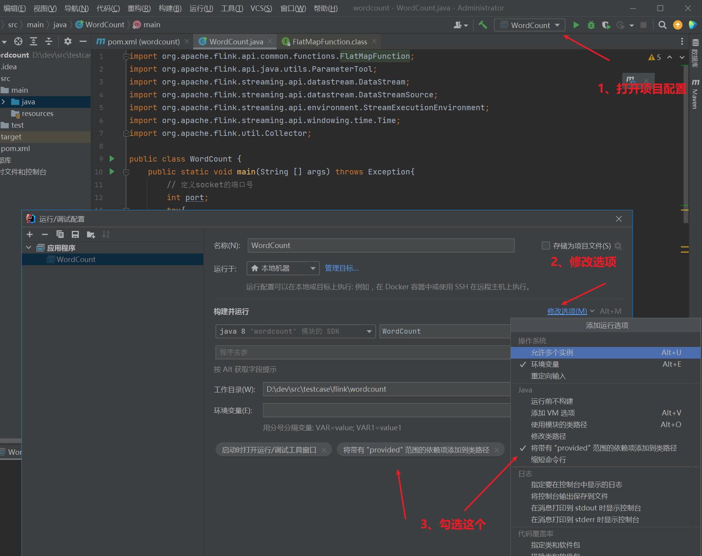
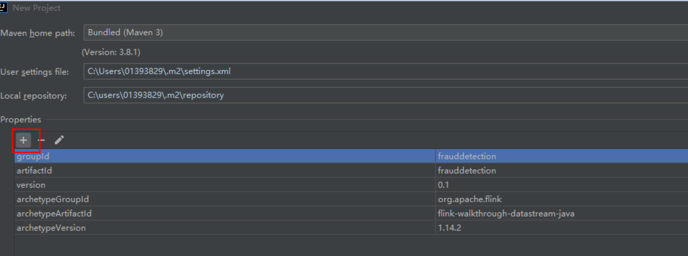

# 流水账 - 2021

# 2021年12月

## 31日

#### 1 效率提升

	为了更高提高学习、工作的效果，强化以重点目标的持续进展，调整“进行中”模块为任务进展，具体变化为

- 取消表现形式不好的表格方式，第一个模块为当前进行的任务不再分模块，只分优先级，增加完成的deadline、追求任务的达成率；
- 后面分模块进行整体进度跟进，强化模块性的完成情况，及完成模块的任务关联的任务、相关调研、知识储备等

2 Flink x JAVA

- word count实现

  - 找不到对应的类，在网上找到对应的处理：https://blog.csdn.net/walykyy/article/details/105910155

    

  

- 总结：[Maven配置中Dependency域的scope选项](/general/language/maven_dependency_scope.md)

- 总结：[Java程序执行&Flink程序执行](/bigdata/flink/flink_run)

  
  
  

3 其他

- 莫名奇妙发现natcat不见了，竟然被这个东西黑了；今天被微软连续恶心了三遍，除了这个没什么卵用的杀毒软件以外、还有莫名奇妙删不掉的edge、还有一直关闭了还在偷偷更新的系统；


## 30日

#### 1 flink：wordcount的例子

- 参考例子：https://www.cnblogs.com/ALittleMoreLove/archive/2018/08/09/9449992.html

```java
import org.apache.flink.api.common.functions.FlatMapFunction;
import org.apache.flink.api.java.utils.ParameterTool;
import org.apache.flink.streaming.api.datastream.DataStream;
import org.apache.flink.streaming.api.datastream.DataStreamSource;
import org.apache.flink.streaming.api.environment.StreamExecutionEnvironment;
import org.apache.flink.streaming.api.windowing.time.Time;
import org.apache.flink.util.Collector;


public class WordCount {

    public static void main(String[] args) throws Exception {
        //定义socket的端口号
        int port;
        try{
            ParameterTool parameterTool = ParameterTool.fromArgs(args);
            port = parameterTool.getInt("port");
        }catch (Exception e){
            System.err.println("没有指定port参数，使用默认值9000");
            port = 9000;
        }

        //获取运行环境
        StreamExecutionEnvironment env = StreamExecutionEnvironment.getExecutionEnvironment();

        //连接socket获取输入的数据
        DataStreamSource<String> text = env.socketTextStream("10.192.12.106", port, "\n");

        //计算数据
        DataStream<WordWithCount> windowCount = text.flatMap(new FlatMapFunction<String, WordWithCount>() {
            public void flatMap(String value, Collector<WordWithCount> out) throws Exception {
                String[] splits = value.split("\\s");
                for (String word:splits) {
                    out.collect(new WordWithCount(word,1L));
                }
            }
        })//打平操作，把每行的单词转为<word,count>类型的数据
                .keyBy("word")//针对相同的word数据进行分组
                .timeWindow(Time.seconds(2),Time.seconds(1))//指定计算数据的窗口大小和滑动窗口大小
                .sum("count");
               
        //把数据打印到控制台
        windowCount.print()
                .setParallelism(1);//使用一个并行度
        //注意：因为flink是懒加载的，所以必须调用execute方法，上面的代码才会执行
        env.execute("streaming word count");

    }

    /**
     * 主要为了存储单词以及单词出现的次数
     */
    public static class WordWithCount{
        public String word;
        public long count;
        public WordWithCount(){}
        public WordWithCount(String word, long count) {
            this.word = word;
            this.count = count;
        }

        @Override
        public String toString() {
            return "WordWithCount{" +
                    "word='" + word + '\'' +
                    ", count=" + count +
                    '}';
        }
    }


}
```


## 29日

#### 1 docsify windows环境

	今天忙活了一天，折腾windows下的docsify用node启动，失败，原因：

- node在windows 下是通过cmd启动的，无法像linux一样挂后台，有个cmd的框在那里，无法接受，尝试了start命令、脚本方式、vbs方式
- 无法用winsw作为一个服务启动

#### 2 文档总结

-  [markdown的一些心得](/general/markdown-note)
-  [windows下搭建web环境](/general/windows-env-install)

其他一些事项

## 28日

#### 1 java环境搭建

- 下载了最新的2021.3版本的idea，并通过javaagent方式破解，方法在这里：https://www.yuque.com/docs/share/88ecae8e-0e31-4ee7-b0d7-c3ef6bec82a6

  ，可以激活idea、pycharm、webstorm，golang不行

- 一开始不能进行flink 的archtype导入，需要 Invalidate Caches处理一下

  

- flink的例子需要指定package，这里弄

  

- 折腾半天flink相关代码无法关联的问题，需要重新弄仓库，先弄了一个阿里云的，后面再慢慢改吧，另外默认windows不可以建立点开头的目录，如“.m2”，需要在尾部多加一个点，如“.m2.”

```xml
<?xml version="1.0" encoding="UTF-8"?>
<settings xsi:schemaLocation="http://maven.apache.org/SETTINGS/1.1.0 http://maven.apache.org/xsd/settings-1.1.0.xsd" xmlns="http://maven.apache.org/SETTINGS/1.1.0"
    xmlns:xsi="http://www.w3.org/2001/XMLSchema-instance">
  <!-- 
    <localRepository>D:\repo</localRepository>
  -->
  <mirrors>
    <mirror>
      <mirrorOf>*</mirrorOf>
      <name>aliyunmaven</name>
      <url>https://maven.aliyun.com/repository/public</url>
      <id>aliyunmaven</id>
    </mirror>
  </mirrors>
  <profiles>
    <profile>
      <repositories>
        <repository>
          <snapshots>
            <enabled>false</enabled>
          </snapshots>
          <id>central</id>
          <name>maven</name>
          <url>https://maven.aliyun.com/repository/public</url>
        </repository>
        <repository>
          <snapshots />
          <id>snapshots</id>
          <name>maven</name>
          <url>https://maven.aliyun.com/repository/public</url>
        </repository>
      </repositories>
      <pluginRepositories>
        <pluginRepository>
          <snapshots>
            <enabled>false</enabled>
          </snapshots>
          <id>central</id>
          <name>maven</name>
          <url>https://maven.aliyun.com/repository/public</url>
        </pluginRepository>
        <pluginRepository>
          <snapshots />
          <id>snapshots</id>
          <name>maven</name>
          <url>https://maven.aliyun.com/repository/public</url>
        </pluginRepository>
      </pluginRepositories>
      <id>artifactory</id>
    </profile>
  </profiles>
  <activeProfiles>
    <activeProfile>artifactory</activeProfile>
  </activeProfiles>
</settings>
```

2 用fllebrowser搭建文档共享环境 

挺好用的一个工具，可以当百度云使用

具体见：http://iotop.xyz/#/general/windows-env-install?id=_5-%e5%ae%89%e8%a3%85filebrowser


# 2021年11月

## 10日

### thrift

总结一下，java版本用这个模型TThreadedSelectorServer，linux下如果是java版本需要开一下epoll

doris 用的非阻塞(TNonblockingServer)/多线程(TThreadedServer)/线程池(TThreadPoolServer))三选一

- 主流序列化协议优缺点 https://lux-sun.blog.csdn.net/article/details/117263212
- Apache Thrift系列(一)：Thrift基本及IDL语法 https://www.cnblogs.com/-wenli/p/15088124.html
- thrift简单示例 (基于C++) https://www.cnblogs.com/albizzia/p/10884320.html https://thrift.apache.org/tutorial/cpp.html
- Thrift之TServer服务模型 https://www.jianshu.com/p/6844d69fea15
- Apache Thrift系列详解(二) - 网络服务模型：https://juejin.cn/post/6844903622384287751#heading-28
- JAVA使用EPoll来进行NIO处理的方法 https://www.cnblogs.com/AloneSword/p/3209553.html
- c++版本的thrit好像用的这个，https://www.cnblogs.com/taoxinrui/p/5879876.html

### 其他

- 认真分析mmap：是什么 为什么 怎么用 https://www.cnblogs.com/huxiao-tee/p/4660352.html
- 浅析/dev/shm https://www.cnblogs.com/haoxiaoyu/p/c7f364de3598978b5ab293e8fb0e3cca.html
- linux下的/dev/shm/ 以及与swap目录的区别 https://www.cnblogs.com/tinywan/p/10550356.html

# 2021年8月

## 12日

### MR

- Hive SQL的编译过程 https://tech.meituan.com/2014/02/12/hive-sql-to-mapreduce.html
- hadoop之mapreduce详解（基础篇） https://www.cnblogs.com/zsql/p/11600136.html
- hadoop之mapreduce详解（进阶篇） https://www.cnblogs.com/zsql/p/11608995.html

## 11日

- hive2.0的LLAP特性及DPC-H数据性能测试测试 https://blog.csdn.net/zilianxiaozhu/article/details/80320759

#### HIVE

- 重新搞了一下

## 10日

### Hive

- Hive架构与源码分析（整理版） https://www.cnblogs.com/swordfall/p/13426569.html
- 简单看了一下apache wiki：https://cwiki.apache.org/confluence/
- 准备统一看一下这个博客里面的内容：https://www.cnblogs.com/frankdeng/

### 日常

- 试了一下docsify代码高亮的，不带min的，感觉效果差不多
- docsify几个画图插件

## 9日

### hive

- 下载了相关的源代码，https://repo.huaweicloud.com/apache/hive/hive-2.3.9/apache-hive-2.3.9-src.tar.gz
- 先从文章开始吧
  - hive原理与源码分析-hive源码架构与理论（一） https://blog.csdn.net/wzq6578702/article/details/71250081
  - hive原理与源码分析-语法分析器和语义分析器（二） https://blog.csdn.net/wzq6578702/article/details/71331123
  - Hive 工作流程源码分析 https://blog.csdn.net/don_chiang709/article/details/82587345
  - hive-sql执行流程分析: http://ixiaosi.art/2019/01/28/hive/hive-sql%E6%89%A7%E8%A1%8C%E6%B5%81%E7%A8%8B%E5%88%86%E6%9E%90/

### 日常

- MD文档流程图
- 认证机制学习
  - 一文搞定Kerberos https://zhuanlan.zhihu.com/p/266491528
  - 开源认证组件Kerberos和CAS简介 https://blog.csdn.net/justlpf/article/details/106637070

## 5日

### 日常

- 记录流程图 Graphviz
  - 十分钟学会graphviz画图 https://www.jianshu.com/p/6d9bbbbf38b1
  - Linux Centos7安装配置画图工具Graphviz https://blog.51cto.com/doublelinux/2092107

# 2021年7月

## 29日

### 日常

- expect安装
  - 教程：https://blog.csdn.net/qq_41944882/article/details/105956317

## 28日

### presto

```
- jvm.config增加一条
```

```
-Djdk.attach.allowAttachSelf=true
```

## 27日

### presto

- trino安装：jvm xmx内存配置问题，注意跟query最大内存联合配置
- 构建tpcds数据源：

  - github：https://github.com/hortonworks/hive-testbench
  - 参考文章：https://www.jianshu.com/p/173de219379e
  - 注意项：除了要装gcc/maven外，hive的路径要配置在PATH里面

  1）settings/load-flat.sql，settings/load-partitioned.sql 注释掉这一行，hive依然不支持
- -- set hive.optimize.sort.dynamic.partition.threshold=0;

  2）修改./tpcds-setup.sh

  ```
  #HIVE="beeline -n hive -u 'jdbc:hive2://localhost:2181/;serviceDiscoveryMode=zooKeeper;zooKeeperNamespace=hiveserver2?tez.queue.name=default' "
  HIVE="hive"
  ```

```
TPC-DS text data generation complete.
Loading text data into external tables.
beeline> create database if not exists ${DB};
make: *** [load_orc_2.mk:3：date_dim] 错误 2
Loading constraints
beeline> -- set hivevar:DB=tpcds_bin_partitioned_orc_10000
beeline> 
beeline> alter table customer_address add constraint ${DB}_pk_ca primary key (ca_address_sk) disable novalidate rely;
Data loaded into database tpcds_bin_partitioned_orc_2.
```

- hdfs无权限访问，core-site.xml增加下面的配置

```
<!-- 当前用户全设置成root -->
<property>
   <name>hadoop.http.staticuser.user</name>
   <value>root</value>
</property>
```

## 26日

### presto

- mysql catalog增加配置项

  lower_case_table_names=1不能要

  不然hive都跑不起来
- No nodes available to run query

  保持coordinator和worker节点的catalog下文件是同步的
- mysql找不到表（大写的表）

  mysql catalog增加一项，主要是针对mysql、mangodb这一类大小写敏感表名的表述

  ```
  case-insensitive-name-matching=true
  ```

### 日常

- [Nginx各种常规用法](/general/linux/nginx)

## 25日

### kibana相关资料

- Kibana源码开发运行 https://blog.csdn.net/xpm_xq/article/details/86002709
- openshift kibana源码修改 https://blog.csdn.net/qqnbsp/article/details/90670152
- [kibana源码]增加菜单项 https://blog.csdn.net/ty_0930/article/details/71783514
- Kibana介绍、安装和使用 https://blog.csdn.net/qq_18769269/article/details/80843810

## 22日

### presto安装/测试

- 定位mysql表不存在的问题
- 定位worker节点不存在问题

## 21日

### presto安装/测试

- [Presto/Trino集群安装](/bigdata/presto/install)

## 20日

### 日常

- 看hudi、iceberg、hudu、delta lake的比较，有点感悟：分片/分桶数不宜太小，会造成
  - 文件太小/磁盘碎片化，整体磁盘性能下降
  - meta 表信息成倍增加，海量元数据、维护成本增加、稳定性降低
  - 并发读写性能下降

## 19日

### 日常

- windows远程桌面可以用了，需要在windows里面加一个【凭据】，另外感觉有可能是dns解析放开了

## 14日

### 日常

- 了解了一下mvn打包的一些机制，后面有空仔细研究一下，

## 13日

### Flink

- [源代码解读：Flink datastream添加数据源的例子：transaction模块](/bigdata/flink/sourcecode/datastream/addsource_transaction)
- 完成了这个例子；[datastream api实现欺诈检测](https://ci.apache.org/projects/flink/flink-docs-release-1.13/zh/docs/try-flink/datastream/)
- 两种方式提交任务jar包：web页面/命令行：flink run -d  target/frauddetection-0.1.jar
- 开始例子：[基于 Table API 实现实时报表](https://ci.apache.org/projects/flink/flink-docs-release-1.13/zh/docs/try-flink/table_api/)
  - “基于Table API 实现实时报表”官网示例，完整实现：https://blog.csdn.net/taotao_guiwang/article/details/114025057
  - 中文版：https://www.jianshu.com/p/1f65a562c5cc
  - github源代码：https://github.com/apache/flink-playgrounds

## 12日

### Flink Case

- 问题1：`如何根据Transaction::getAccountId做keyBy：walkthrough.common.entity`里面定义的一个Transaction类，一个数据格式的类，估计是专门用于demo的
- alerts的作用：

## 9日

### 日常

- vscode的Java插件不再支持java1.8，这里的方案需要重新评估一下，目前先暂时规避，vscode 会扫描这个目录下（/usr/lib/jvm）查看java版本的安装情况。目前将java11软连接到这个目录下，避免vscode 打开java下项目时弹出需要java11的错误提示。

### Flink case

### 日常

- 域名备案成功了，把几个常用的域名配上了
- 解决了docs网站【文件下载】访问按域名/按IP不同的问题，目前通过nginx 配置解决，主要是在按照ip访问时加了【路径到磁盘路径】的映射关系

## 8日

### Flink case

- 今天开始官方的这个例子：[datastream api实现欺诈检测](https://ci.apache.org/projects/flink/flink-docs-release-1.13/zh/docs/try-flink/datastream/)

### 日常

- 总结了一下这个：[maven使用大全](/general/language/maven)

## 7日

### Flink case

- 先把官方文档快速浏览一遍，了解一下基本概念和相关的模块，后面定位问题时知道去哪里找
- flink 集群异常
  - 启动时间对不上，6日晚上0:20左右
  - sql任务停掉了，原因未知，重新启动一下，继续观察，todo
- 坑1：不同sql时间提交的表meta信息不公共，造成一个表要去多个sql文件维护，不方便
- 编写总结[基于FlinkSQL的实时数仓实践](/bigdata/flink/case-flinksql-dw)

### 日常

- web codesever加了一下华为云/腾讯云的代理
- 还是重新装一下翻墙的吧，总算整完了，可以用非web版本的vscode了
  - 命令：wget -N --no-check-certificate https://raw.githubusercontent.com/ToyoDAdoubi/doubi/master/ssr.sh && chmod +x ssr.sh && bash ssr.sh
  - 参考：http://liedaoshou.com/face-book/561.html
- padnet方案
  - 功能：直接另外开一个热点，不需要关闭当前wifi，公用当前wifi而不是【移动数据】
  - 下载：http://pdanet.co/install/
  - 限制，需要同时在手机和windiows下载软件，windows下通过软件连接wifi
  - 通过这个方式可以搞定网站访问的问题，但是还是解决不了【远程桌面】和【ssh】的限制
  - 参考：https://blog.csdn.net/qq_44880708/article/details/105595614

## 6日

### flink 例子

继续踩坑

- 坑1 重复提交


- 坑2 字段类型不匹配

```sql
  cast(oi.create_time as varchar),
  cast(oi.operate_time as varchar)
```

## 5日

### 日常

折腾了几天家务，总是可以开工了

### flink源代码走读：配置模块

- 配置项套路：ConfigOption -> JsonOptions -> CanalJsonOptions ：非继承关系，而是复用关系
- ConfigOption的职责
  - 基本数据类型的实现
  - 数据类型的抽象：配置项名、配置项类型、默认值、描述；
  - 一些模板类的实现，使得使用更加简单
- 配置模块套路：从FormatFactory继承过来，如CanalJsonFormatFactory from DeserializationFormatFactory, SerializationFormatFactory
  - optionalOptions：重载这个函数将ConfigOption里面的配置项添加到当前FormatFactory
  - IDENTIFIER：用户通过这个前缀来访问配置项，如canal-json的，我们后面用的的配置项为：canal-json.ignore-parse-errors

### flink 例子

- 坑1：启动/停止问题
  未正常停止，需要多次执行stop-cluster.sh


- sql-client确实基本是个玩具，错误信息未能正常返回，查看问题路径：

  - sql-client.sh执行结果显示：基本没用
  - TaskManager日志：web/机器上，主要定位任务是否正确提交到taskmanager及其是否在依赖的jar包上有问题
  - JobManager日志：web/机器上，主要定位job任务执行情况，依赖的jar包是否有问题，任务是否正常启动
  - JOBS详情：web/机器上，任务已经创建成功时，
- 坑2：jar包依赖问题

  所有jar包必须在TaskManager/JobManager的lib目录下，增加新的jar包需要重启服务
- 坑3：canal 不支持 erase方法，代码也看过了,需要在with子句里面加一下这个配置项：canal-json.ignore-parse-errors

```sql
CREATE TABLE `ods_base_province` (
  `id` INT,
  `name` STRING,
  `region_id` INT ,
  `area_code`STRING
) WITH(
'connector' = 'kafka',
 'topic' = 'mydw_base_province',
 'canal-json.ignore-parse-errors' = 'true',
 'properties.bootstrap.servers' = '192.168.56.103:9092,192.168.56.104:9092,192.168.56.105:9092',
 'properties.group.id' = 'testGroup',
 'format' = 'canal-json' ,
 'scan.startup.mode' = 'earliest-offset' 
) ; 
```

- 坑4：官方不支持changelog-json，需要去github自己下载一个:https://github.com/ververica/flink-cdc-connectors/wiki/Changelog-JSON-Format#maven-dependency
  整个阿里巴巴的版本仓库在这里，可以去下面找对应的版本，https://repo1.maven.org/maven2/com/alibaba/ververica/
  下载一个最新的版本，1.1.0已经验证过不能在flink1.13版本上使用

```bash
wget https://repo1.maven.org/maven2/com/alibaba/ververica/flink-format-changelog-json/1.4.0/flink-format-changelog-json-1.4.0.jar
```

- 另外，kafka分组不要删除，flink重启以后以前的任务不在了，需要重新下发

```sql
  'properties.group.id' = 'testGroup'
```

- 导入商品维表并测试全流程
  除了sku_info(10个导入成功5条)外，其他都正常，应该是长度问题

```sql
insert  into `sku_info`(`id`,`spu_id`,`price`,`sku_name`,`sku_desc`,`weight`,`tm_id`,`category3_id`,`sku_default_img`,`create_time`) values 
(11,1,555,'name1','desc1',0.33,2,61,'http://AOvKmfRQEBRJJllwCwCuptVAOtBBcIjWeJRsmhbJ','2019-02-14 21:25:54'),
(12,1,444,'name2','desc2',0.44,3,23,'http://AOvKmfRQEBRJJllwCwCuptVAOtBBcIjWeJRsmhbJ','2019-02-14 21:25:54');
```

## 2日

### 读书：Kafka入门和实践

- 电子书：http://182.87.223.144:4500/read/14/pdf

## 1日

### 继续Flink SQL

- 公共的连接信息（catalog）提取出来放在init.sql ，放弃，后面看看怎么统一弄这个，
  - 1.13开始，sql-client.sh支持-i参数，可以用sql来create catalog， https://ci.apache.org/projects/flink/flink-docs-release-1.13/zh/docs/dev/table/sqlclient/#initialize-session-using-sql-files，跟预期的【集中存放环境相关的信息】不一致，不折腾了
- 倒腾完了维表数据的导入，如果出现依赖的jar包缺失，job manager需要重启

# 2021年6月

## 30日

### 常规

- 这两天搞定了canal采集binlog的问题，已经总结
- 公安备案：重新提交了域名证书，申诉了一把这个网站，留言编号：20210630c4930c55, 查询码：4ecafc12
- 学习：看了一下kafka和基于zk的分布式锁

### 继续Flink SQL

- 创建数据库

  ```sql
  create database mydw;
  ```
- admin web上配置每个表对应的instance，主要是配置对这个表的正则表达式

  ```properties
  # table regex
  canal.instance.filter.regex=mydw\\..*
  canal.mq.topic=mysql_default_topic
  canal.mq.dynamicTopic=.*\\..*
  ```
- 命令行导入数据

  mysql -D mydw < /data/docs/public/file/bigdata/flink/realtime-dw-demo.sql
  #查看binlog
  mysqlbinlog --start-datetime='2021-06-30 20:30:00' --stop-datetime='2021-06-30 21:30:40' -vv /var/lib/mysql/mysql-bin.000003 -d flink_web>/root/1.log

  ```
  kafka-consumer mydw.base_category1
  ###
  cat /usr/local/bin/kafka-consumer 
  #!/bin/bash
  kafka-console-consumer.sh --bootstrap-server 192.168.56.103:9092,192.168.56.104:9092,192.168.56.105:9092 --topic $1 --from-beginning

  ```
- 参考文章

  - Canal dynamicTopic问题续 ：https://blog.csdn.net/ashic/article/details/104722999/
  - Canal dynamicTopic问题：https://blog.csdn.net/ashic/article/details/104722975

## 27日

### Flink

开始例子的实验：https://mp.weixin.qq.com/s/dJUHsP1VrO0AxzQfezwFVw


- 初始化mysql：[测试SQL](/docs/file/bigdata/flink/realtime-dw-demo.sql)
- mysql binlog -> canal -> kafka : 参考文章
  - 基于Canal与Flink实现数据实时增量同步(一)：https://mp.weixin.qq.com/s?__biz=MzU2ODQ3NjYyMA==&mid=2247483676&idx=1&sn=c2dafd2dc5cf092d3d74993bb51be45c&scene=21#wechat_redirect
  - Binlog Change MariaDB：https://www.wenjiangs.com/doc/binlog-change-mariadb
  - 基于canal实现mysql(mariadb)与redis的主从同步：https://blog.csdn.net/weixin_40606441/article/details/79840205

### 日常

- vscode本地版安装了一个插件：https://marketplace.visualstudio.com/items?itemName=cweijan.vscode-mysql-client2 ，挺好用的，支持MySQL/MariaDB, Microsoft SQL Server, PostgreSQL, SQLite, MongoDB, Redis, and ElasticSearch.
- 本地和远程安装了一个html preview的插件，远程效果挺好的，本地动态页面的预览无效：https://marketplace.visualstudio.com/items?itemName=tht13.html-preview-vscode
- 总结了一下：[微信图片禁止外链的解决方案](/general/other/wechat_include_pic)
- 想了一下自建网站的思路，[书栈网](https://www.bookstack.cn/)已开源，[文江个人博客](https://www.wenjiangs.com/)看似是wordpress和书栈的结合，以后有功夫、有内容、坚持下来了再折腾吧
  - wordpress登录插件：[Wechat Social login 微信QQ钉钉登录插件](https://wordpress.org/plugins/wechat-social-login/)

## 24日

### 日常

- 继续gitbook倒腾，失败，主要是验证信息，网络环境好一点再倒腾
- gitbook serve --lrport 35730 --port 4000 ，不能指定IP，还要用nginx倒腾一遍，- 不需要build就可以用，就是时间有点长
- 需要找时间看看docsify + github + pdf的方案

## 23日

### gitbook安装

- windows下的编辑器官方版本不方便，这里有一个：https://pan.baidu.com/s/1LEf2b9QwIRNgsoXJVBV90g 提取码：vtpv ，参考网站：https://www.jianshu.com/p/0388d8bb49a7 ,windows版本需要账号体系（gitbook或者github），略麻烦
- linux安装参考：https://www.jianshu.com/p/f8a2ac8180ae

```bash
 git clone https://github.com/feiskyer/kubernetes-handbook.git  
```

- 转pdf
  - 需要安装calibre，问题很多，主要是找不到lib库路径,方法：https://blog.csdn.net/qq_19004627/article/details/79090052，弄完了要记得ldconfig命令;另外此库包含与系统库冲突的库，需要最小安装或者覆盖系统库过来
  - 网络问题：主机开了一个代理，
  - Error: unable to get local issuer certificate:暂时未找到原因，应该是git权限或者gitbook的权限，网络条件太差，不试了

## 22日

- 整理文档
- 调研了在线方案方案，不合适，还是直接用vscode，不便之处就是ppt不能在线预览

## 21日

### 日常

- 备份：解决master无法备份的问题（xcopy /a选型改成/e, 备份目录及子目录）；增加百度云备份/data/docs目录

### Flink

- 整理flink资料到flink频道
- Flink SQL的验证
-

## 20日

### 电子书整理下载

- DDIA（Designing Data-Intensive Applications）
- labuladong的算法小抄官方完整版
- Redis设计与实现
- 利用Python进行数据分析
- 深入理解Java虚拟机：JVM高级特性与最佳实践（第3版）

## 19日

### 服务器重启恢复

- 关闭IIS ：改成了wws，需要在服务里面停掉，并禁止开机启动
- master 节点80端口无法绑定外网，其他端口正常：看日志发现是镜像加载出现的未知问题，感觉是virtulbox有bug，换在node01上配置nginx，暴露80端口/其他端口，不能停掉master上nginx（不然好多virtualboxe暴露的接口需要重新配置），后面等升级版本验证一下，不知道去哪里反馈问题
- 编写了一些脚本，启动大数据相关服务方便一点，放在了/usr/bd/script下面，软连接到了~/bd-script

### 服务器备份方案

- 目标：服务器需要定期压缩完了跨盘存储（5个镜像目录，其中包含一个文档目录），折腾了半天各种方案（软件、window备份、tar等），最终还是简单一点，用计划任务运行xcopy

  ```bash
  #备份master , c -> d
  xcopy "c:\vm" "d:\backup\vm\" /a /Y
  #备份node01 ,d -> e
  xcopy "d:\vm" "e:\backup\vm\" /a /Y
  #备份node02 ,e -> f
  xcopy "e:\vm" "f:\backup\vm\" /a /Y
  #备份node03 ,f -> e
  xcopy "f:\vm" "e:\backup\vm\" /a /Y
  #备份node04：复制g->f
  xcopy "G:\vm" "F:\backup\vm\" /a /Y

  ```


- 后面在定期从服务器拉回本地

### 在线图书库-Calibre-Web安装

- 安装教程[Calibre-Web安装](/general/other/calibre)
